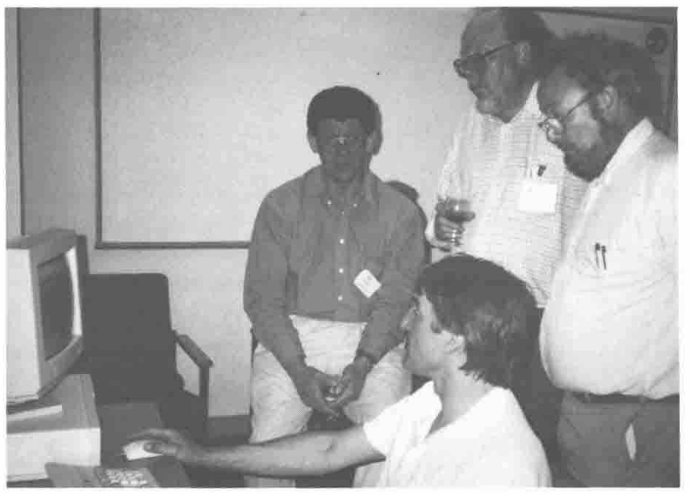

*reviewed by Jon Sandles*
{ .byline }

After being welcomed to Swansea by Alan Sykes, Adrian took to the stage decked in a wolf T-shirt (more of which later) and introduced himself. He gave a brief history of his work with and without Nestlé (and Rowntree Mackintosh before). He acknowledged and thanked Nestlé for supporting him in the past and the present. He talked about writing APL in a Windows environment and said that a running theme of the conference would be ‘Causeway’ — a project he and Duncan Pearson had undertaken to make Windows programming in APL simpler and more portable.

Adrian then asked everyone to introduce themselves — this technique (with a reasonably small conference anyhow) I would recommend to conference organisers in the future. Its effect was that everyone was more relaxed and more at ease, and you immediately knew who everyone was. You had a starting point for conversations and you also could approach some of the speakers before their talks. Adrian asked for name, what you did and what you aimed to get out of the conference. Here is an extract of who was there and what was said (other delegates that I missed/weren’t there appear at the bottom of the list!):

| Delegate | Job | Interests at conference |
|---|---|---|
| Jaakko Laakso | Statistics Finland | Gui programming/Causeway |
| Dr Kimmo Kekalainen | Finnish Dyalog APL user | Experienced in Adrian’s rain/here for Causeway |
| Marc Griffiths | Editor Toronto APL News | Causeway |
| Diane Whitehouse | Co-editor Toronto News | Social IT correspondent! |
| Gitte Christensen | Danish SIGAPL | Inspiration and Gui/Causeway |
| Nicholas Small | Nat West | Windows/Causeway |
| Dave Parker | Electricity board | Stats/forecasting |
| Dave Phillips | Cocking and Drury | Looking for answers…..? |
| Moshe Sneidovich | Mathematics, Melbourne | Wants to teach us! |
| Chris Hogan | HMW | Need Gui/Causeway for banks |
| John Scholes | Dyalog APL | Here to tell us about Dyalog version 7 |
| Phil Last | HMW | Gui/Causeway for APL\*PLUS - Windows port |
| Jim Ryan | Mobil R&D | Gui/Causeway for APL users. |
| Ross Ranson | Self employed | Gui/Causeway |
| Morten Kromberg | Insight systems | Gui/Causeway & to tell us about Client Server |
| Duncan Pearson | Compass R&D | Finishing APL\*PLUS III version of Causeway |
| Dr Harri Heinonen | Finnish Forest Service | Gui/Causeway |
| R Naumanen | Chair FINAPL | Gui/Causeway |
| Gordon Ramer | Ezer & Associates | Gui/Causeway |
| Ray Cannon | Commercial Union | Gui/Causeway & to tell us about Stonehenge |
| David Wiley | Karsten Manufacturing (PING Golf Clubs) | Gui/Causeway |
| A Samylovskiy | Institute of Technology, Moscow | Gui/Causeway |
| Alan Hawkes | EBMS, Swansea | Here to see BISSEL, not Gui! |
| Mark Caslin | Valuta Economics | Stats/Currency modelling |
| Paul Smith | Self employed | OR techniques |
| Tony O’Hagan | Statistician | APL & Aplers are fun! |
| Ellis Morgan | Self employed | Planning/forecasting regression diagnostics |
| Bob Brown | Vermont, USA | Gui/Causeway |
| Todd Brown | Vermont, USA | SQL,APL/Causeway |
| George MacLeod | Self employed | Business graphics / Rain / Causeway |
| Gareth Brentnall | Mercia Software (Logol) | Gui/Causeway |
| Alan Mayer | EBMS, Swansea | Gui/Causeway |
| Anthony Camacho | Editor Vector! | Gui/Causeway |
| Sylvia Camacho | Secretary BAPLA | Gui/Causeway to support her husband’s lifestyle! |
| Andy Pole | Blackhawk LP | Forecasting, Gui/Causeway, Sell his book! |
| Jon Sandles | Nestlé UK | Gui/Causeway, statistics |
| Michael Baas | ADAPTA | C++ Windows to Gui/Causeway |

(Apologies for any omissions, mis-spellings, mis-quotes etc. — it was hard to keep up with everyone!)

Adrian (after cunningly killing 30 minutes by getting us to do all the work) began the workshop proper. He stressed the importance of the logical design of Causeway and told us the architecture will be formally fixed as from Friday (once we’ve fed back requests and bugs!).

Adrian was asked whether Causeway has enveloped the OO methodology. Adrian stressed that Duncan and himself had stayed well clear of producing a VB clone, Duncan acknowledged the influence of Ian Clark’s *APLOMB*. Later on Adrian admitted that there were aspects of Causeway that were not unlike OLE2, the new Windows standard for application developers. (Is it not inevitable that if a tool is a good Windows programming tool then it will fall under the OO banner?)

Adrian reminded us that APL is a rapid prototyping tool and that this holds even truer in the Windows environment — if you have a full functional specification you might as well use C++, if not then prototype in APL. (Of course we never bother to rewrite in C++ once it’s finished!) Causeway allows you to easily develop a Windows interface and lets you concentrate on the APL code beneath.

The Windows programming style is encompassed within the *‘Microsoft Application Design Guide’* (read it and then read it again). Once you have realised the complexity in writing real Windows systems (what if no mouse? — tabbing — fonts — styles — Alt+keys etc.) you will realise there is a lot of work in putting together good Windows software. Causeway is meant to do a lot of this nitty-gritty automatically — leaving you to write the APL code (put away your SDK now).

Adrian told us how some objects automatically know how to behave in a Windows way using Causeway. A **Close** button will automatically know how to close a form, a PostScript object will already know how to draw a graph. Very little code is needed to enable basic Windows features.

Adrian introduced us to his new *APLthin* font with which he would like to take over the world. Along with Causeway this should help remove a lot of the incompatibility between Dyalog/Manugistics and other Windows APLs. He reassured the Finns in the audience that the Scandinavian characters were present and correct in their ANSI positions.

Message: If you have a standard front-end — have a standard font.

Adrian capped off a stirring performance with the classic Microsoft brains joke. (I can’t reproduce it here — Bill has better lawyers than I have.)

You always walk from one of Adrian’s talks knowing he’s just sold you something and made you quite excited — but you haven’t got the foggiest what.

Tony O’Hagan demonstrating to Alan Sykes, George MacLeod, Alan Hawkes
{ .caption }
