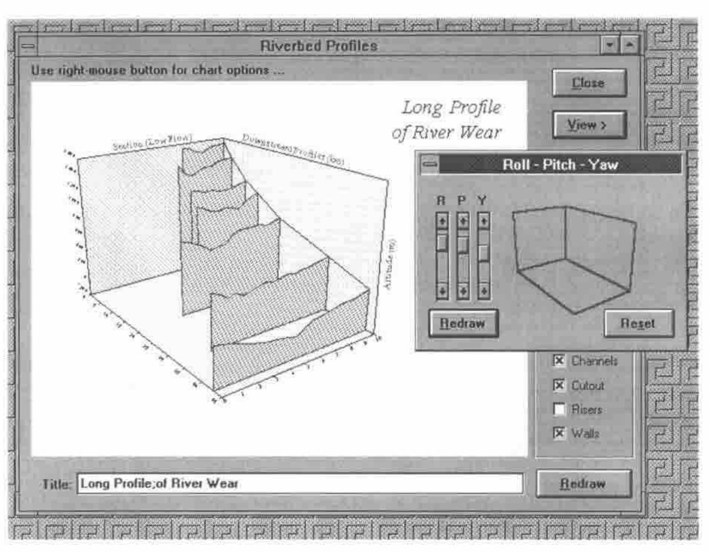
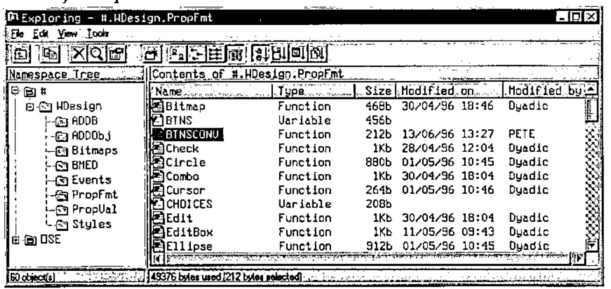
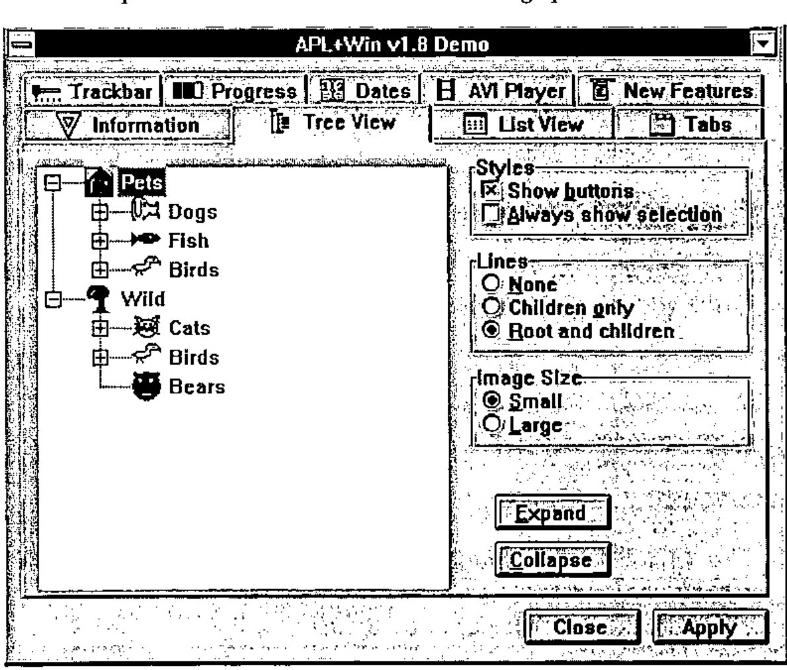

*reviewed by Jon Sandles*
{ .byline }

The vendor forum was made up of four presentations – by MicroAPL, Causeway, Dyadic and The Bloomsbury Software Company. The venue was the Royal Statistical Society which proved to be quite adequate – although the hike downstairs to get tea and back up again probably took ten minutes longer than expected and caused us to overrun somewhat. Fortunately we did not get thrown out and the last speakers had adequate time (in the end!).

## MicroAPL – David Eastwood

David began by telling us that most of the last year had been spent on non-APL projects and hence there had not been much time for APL product development. To put this into context he gave us an overview of the services and products MicroAPL are now providing. He also apologised for the lack of any ‘live’ presentation material – all the MicroAPL portable kit had been taken to a show they were currently doing in the USA!

- **APL Products.** This is APL68000 Level II for the Apple Mac (PowerMac and 680x0 Mac) and IBMRS6000 (it has also has been available in the past for other now defunct computers, e.g. Amiga). It is based on APL68000, is APL2 compatible, and uses an APL\*PLUS III compatible `⎕WI` object definition interface. It has a packager to glue the finished application together (and hide the fact that it’s written in APL!) and has APL\*PLUS compatible native file handling using the `⎕N` family of functions. David is aware of 7–8 strong commercially available packages that have been written in the language including Biological and Astronomical programs. Its use is concentrated in the States, France and Italy. Although there has been little time for new developments the next release will be incorporating Apple’s new Copeland Operating System.
- **Translation and Emulation Services.** This is where a lot of MicroAPL’s resources have been going. It is also interesting in that all the work evolved from code that they wrote for their own use internally! In 1990 MicroAPL had the best selling APL implementation on the Mac – this was written entirely in 680x0 assembler – over 65,000 lines of seemingly unportable code. This became an issue when the 680x0 chip was effectively made redundant with the emergence of RISC IBM chips in the Mac. Thus, MicroAPL wrote their own translator that takes 680x0 assembler and converts it to RISC assembler. This means they only need one copy of the source code which has obvious advantages – same bug fixes, simplified support etc. Fortunately the rest of the world was wanting to do the same thing and hence three products evolved:
    - **PortASM** – converts Mac to PowerMac – WordPerfect is their biggest customer
    - **PortASM/68K** – Mac to PowerPC – Phillips is a big customer
    - **PortASM/86** – Intel assembler to PowerPC – Motorola is a big customer

  This experience in the assembler translation field also led MicroAPL to produce a number of similar 680x0 emulators which allow 680x0 software to run unchanged on a non-native platform like the PowerPC.
- **Consultancy.** Mac – C++. PC – Powerbuilder, C, C++ and Oracle. To demonstrate the kind of work they have done recently in this field David showed us slides of a system they have recently written for Reuters to access Reuters’ news sources and pictures. This allows you to search for news by topic and then by content. Amazingly a search on APL had led to a hit on the publicity for the very event we were sitting in – presumably via the BCS publicity in Computing magazine. This project had taken 30% of their resources.

## Causeway – Adrian Smith

Adrian introduced himself and Causeway. They are a two-man team of himself and Duncan Pearson. Much like MicroAPL the products that Causeway have made/are about to make available are things that they have found useful to themselves in their day-to-day consultancy work. The bulk of this work has been for SAP – who produce business management software for large companies.

Adrian started by putting up the following slide from the *Rain* graphics package that Causeway are now selling. For some time Adrian has stayed well clear of the modern vogue for fancy 3-d graphics which tend to distort rather than enhance the image you are trying to portray. But the above 3-d image is easily interpreted by the brain especially when the user can tilt its orientation using the cursor keys. Adrian didn’t demo this live – apparently it’s rather slow at the moment!



The majority of Adrian’s talk was then focused on the *Newleaf* package – which is still in Beta test – but will be ready at APL96 and ported to APL+Win (not hard to do – just tedious). Newleaf makes it easy to do complex reports. You can have multiple columns – embedded graphs, embedded tables (these themselves can be highly complex – including hierarchical headers).

The underlying technology used is PostScript – and this itself has advantages – the output from Newleaf can easily be converted to PDF (via Acrobat Distiller) and hence viewed on the internet using Netscape 3 (via Adobe Acrobat). Although this is only one of many ways of viewing WYSIWYG documents on the net, because of its association with Netscape it’s likely to become popular. It does mean that standard documents appear identical on-screen within the application as they appear on the printer, as they also appear when published on the internet.

Adrian then took us through a live demo of the use of the package – stating he had been toying with the code on the train on the way down so crashes were likely! In the end the only errors were his own typing!

There are effectively two stages to producing a report. The first is to create a page layout and define the different areas of the page – called frames – that the report needs to use. This is done using a graphical designer which allows you to drag frames about and give them different properties – like overflow, wrap etc. – which defines how the text will behave when it gets written into that frame. Once you’ve defined a page layout and all its frames you can move on to the second stage which is to actually create the report.

Assuming our page definition is held in a variable called *baa*. Also the Newleaf functions are in a Dyalog namespace called *leaf*.

```apl
leaf.Use baa                    ⍝ Kicks off the report with baa
leaf.Place 'here is my address' ⍝ writes to the first frame
PG←leaf.Close                   ⍝ Creates the postscript vector
leaf.View PG                    ⍝ Puts the report on screen
```

Of course many more things are possible. Here is an overview of some of the other things Newleaf supports.

```apl
leaf.NewFrame ''          ⍝ Jumps to the next frame on the page

'Subhead' leaf.Place 'I am a subheading'   ⍝ Creates a
                          ⍝ subheading in the current frame
```

The left argument is an example of a style. These themselves are user definable and are held in a variable *leaf.∆styletab*. You can perform inline formatting of text (e.g. bold, italic, subscripts etc.); this is done using HTML-style tags – for example:

```apl
'Hello you <b>funny</b> guy'
```

Tables are just as easy to create – notice the use of namespaces to split off table specific code.

```apl
leaf.table.Spread 3 4⍴⍳12   ⍝ Sticks a table in the current
                            ⍝ frame
```

Graphs are simple to include as well. The *Rain* package uses the same underlying PostScript technology as Newleaf. Hence if we create a PostScript graph from Rain we can then just display it in the current frame.

Rain is in the namespace *ch*

```apl
ch.New 200 144
ch.Set 'style' 'lboxed'
ch.Set 'Head' 'Here is a chart header'
ch.Bar +\?5 3⍴100
graph←ch.Close
```

and switching back to the Newleaf namespace:

```apl
leaf.IncludeLeft graph ⍝ Size as is, keep it on the left -
                       ⍝ write any text down the right hand side

leaf.Flow textvec      ⍝ Write text in the space remaining
PG←ch.Close            ⍝ Create the postscript vector
```

Adrian also demonstrated outputting the PostScript to PDF format as discussed above and also showed a direct conversion to HTML – although this isn’t WYSIWYG it will view on any internet browser.

```apl
leaf.ToPDF PG
leaf.ToHTML PG
```

## ISI – Eric Iverson

Adrian then introduced Eric Iverson who was on the last leg of his UK trip and just wanted to say a few words about J! Eric listed four sources where you can find out about J if you want to know more:

1. *Vector* magazine
2. *Byte* magazine (Sept 95)
3. On the website *jsoftware.com*.
4. The J conference in Toronto in June.

He then stated that one of the most exciting things about J release 3 is the ability to use it purely as a calculation engine. You can write your Windows front end in any other tool (VB, Delphi etc.) and call J from that as an OLE object.

## Dyadic Systems – Peter Donnelly

Peter Donnelly of Dyadic systems came to demonstrate the new features within Dyalog 8. When he agreed to do this talk he had not quite realised that it was on the same date as the actual release date of Dyalog 8. Hence, he was feeling a bit tired! Peter explained that he had been up all night adding the finishing touches to the Dyalog 8 release. The last 2% always turns into the last 80%.

New features in Dyalog 8 include a native file system, control structures (identical to PLUS III), monadic use of `⎕WC`, improvements to the grid, changing printer orientation and of course OLE support. Also there is a major addition to the Dyadic namespace implementation via the system variable `⎕PATH` and the system function `⎕EXPORT`. Also, as a rule, you can draw a graphical object on ANY other object.

### Namespace extensions

`⎕PATH` is a system global that allows you to set up a search path down which the interpreter will look for functions when executing a line of code. (I’m not sure whether it looks for variables as well – I suspect not?) To help manage this and presumably to prevent name-clashes the only functions that are picked off the path are those that have been explicitly exported via `⎕EXPORT`. `⎕EXPORT` in its monadic form allows you to query whether a function has been made visible to the path or not. The dyadic form sets and unsets the visibility of the object.

### Improvements to the grid

These changes were shown via the tutorial workspace *WTUTOR* that comes free with DyalogAPL. The format of the grid can now be controlled by passing in a hierarchy (like with **msoutlin.vbx**) which allows you to represent multi-dimensional data in a two-dimensional grid. The formatting of the cells has been extended to allow the use of `⎕FMT`. Graphics are also allowed to be children of the grid – and rather conveniently you can use the cell co-ordinates to draw them. Thus, it becomes very easy to circle/highlight certain figures on the cell. (OK, it also becomes really easy to write your own minesweeper, but that’s not what you should be thinking...)

### New Windows95 graphical objects

Peter showed us four new Windows95 objects, all of which have been implemented – these have been reviewed in *Vector* before so I won’t go into any detail – but they are Imagelist, TreeView, Spinner and RichEdit.

### OLE

Peter explained that OLE can be approached from many angles and the way you implement OLE can also be done in many different ways. Dyadic have implemented just one area of OLE which is the ability to call and use OLE controls. You can buy thousands of different types of OLE controls which do everything from temperature controls to complex spreadsheets. These get installed into the Windows95 registry and once installed are available to any application to use. The expression `'.' ⎕WG 'OLEControls'` gets all the names of the OLE controls and the details into DyalogAPL. These objects can then be used just like standard Dyalog objects. If you don’t have a manual for them this shouldn’t be a problem as Dyadic have implemented an OLE browser which queries the events and properties that each object supports and allows you to search through them. Dyadic have not implemented the king of OLE technology that is now available in J which allows you to call J from other applications. This is the other end of the OLE spectrum.

### APL object explorer



For me this was the highlight of the new features. Peter commented that since this had been implemented it was the first thing he brought up to view the contents of the workspace. In essence this allows you to browse your namespaces using a Windows95 Explorer interface. More interestingly, functions have a full set of properties – timestamps of last change, who changed it, size etc. Just like in Explorer there is a full ‘find’ facility where you could search for functions changed since a certain date by a certain person etc. You can also do search and replace. (A question asked at the end confirmed that these facilities are not yet available from within the function editor.)

## The Bloomsbury Software Company – Peter Day & Dave Phillips

Faced with just ten minutes left in the meeting Peter Day rushed us through the history of the people behind last year’s takeover of the APL\*PLUS pc products from Manugistics by FRS and the formation of a new company, APL2000, headed by Eric Baelen. FRS’s main products had been in APL\*PLUS II but they did not feel they were getting the right level of support and development from Manugistics who seemed to have mothballed their development team. They had options – recode in C++, port to DyalogAPL – but these would lose them too much time – which they had none of in a competitive market. Thus, they bought the pc-APL products they required from Manugistics.

APL2000 are currently working on releases of the APL\*PLUS products on both Windows platforms – as well as bringing the DOS level release up to speed with control structures and making improvements to the UNIX release.

Bloomsbury Software themselves are heavily involved with Smalltalk and are ‘best team partners’ with IBM for their *VisualAge* products.



Dave Phillips then took us through a demo using the alpha version of APL+Win. He took us through a demo of all the new objects (which matched the set that Dyadic had just previewed). He showed an AVI control which supported drag and drop – i.e. drop an AVI file on it from file manager and it plays it back.

Amazingly some of the apparently Windows95-specific objects have also been made available under Windows 3.1. For example, the tree view and list view objects. I’m not sure how they’ve done this – but it could be quite a selling point for those people who are faced with supporting products under both operating systems, but need to take advantage of some of the new Windows95 features so that they don’t lose out to the competition.

Some things have been much improved over the previous version, e.g. speed of the match operator. Some basic GUI features have also been much improved – e.g. Status bars.

OCX support will be provided – but not until version 2.1.

Another addition is the ability to query at any point in time which fields on the form had been modified. This means you can remove all the tedious (and potentially slow) callback code and just deal with changed fields when you feel good and ready. You also only need to run code for fields that have changed.

In the question and answer session an interesting debate occurred after Dave was asked whether the WED workspace was being improved. The user’s problem was that it always crashed – particularly when a number of objects were involved. This seemed to make it unusable. Dave answered that the problems were related to the Win32s memory management (and hence the problem should go away under Windows95?) and not strictly a problem with the product. He also said that a product such as Causeway could be used to do this task. Causeway is a specific product designed to be used in place of WED. Another person added that this would only be possible if Causeway could produce a decent grid for PLUS III. Causeway answered that they could if they had the time. This debate was revealing to non-PLUS III users; if Win32s memory management is so unreliable, why build the whole interpreter on top of it? If WED crashed all the time then why ship the product? If Causeway is a better Windows designer then why not ship it with the product – after all Causeway is shareware. All these things need to be answered by the new owners of the PLUS III development team. Let’s hope we see some results soon.

All in all the event was very successful. It was good to have another meeting in London after a prolonged break. Let’s hope there are more to follow soon!
