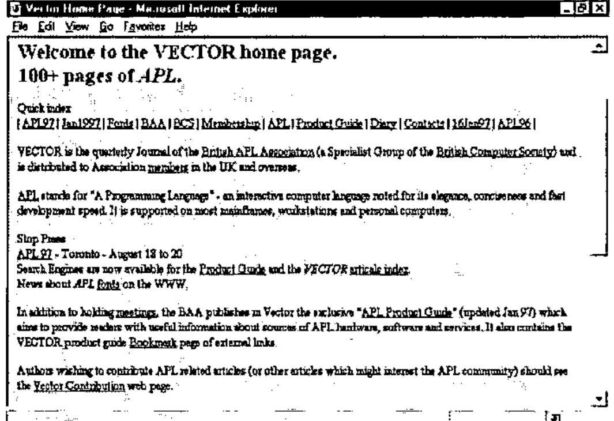
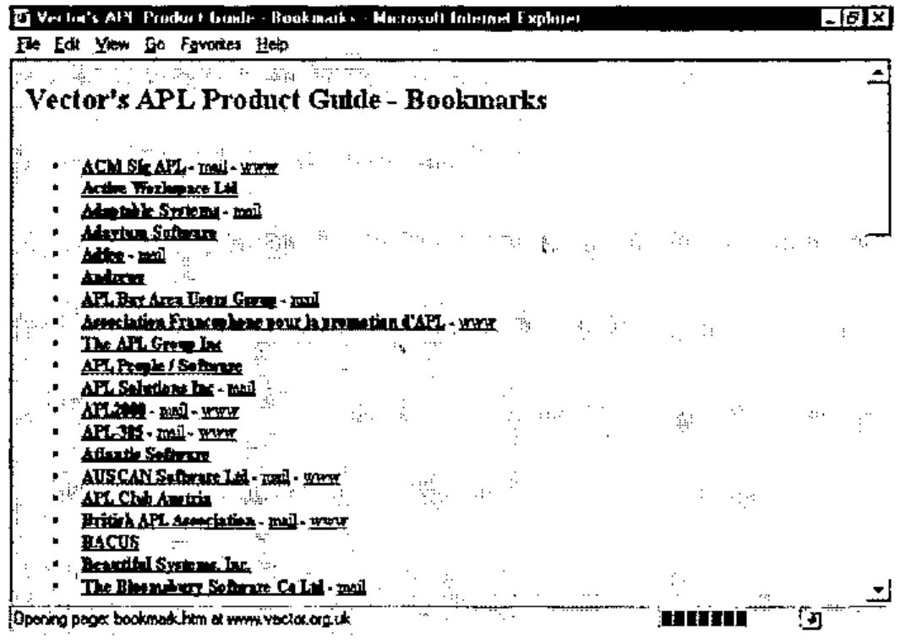
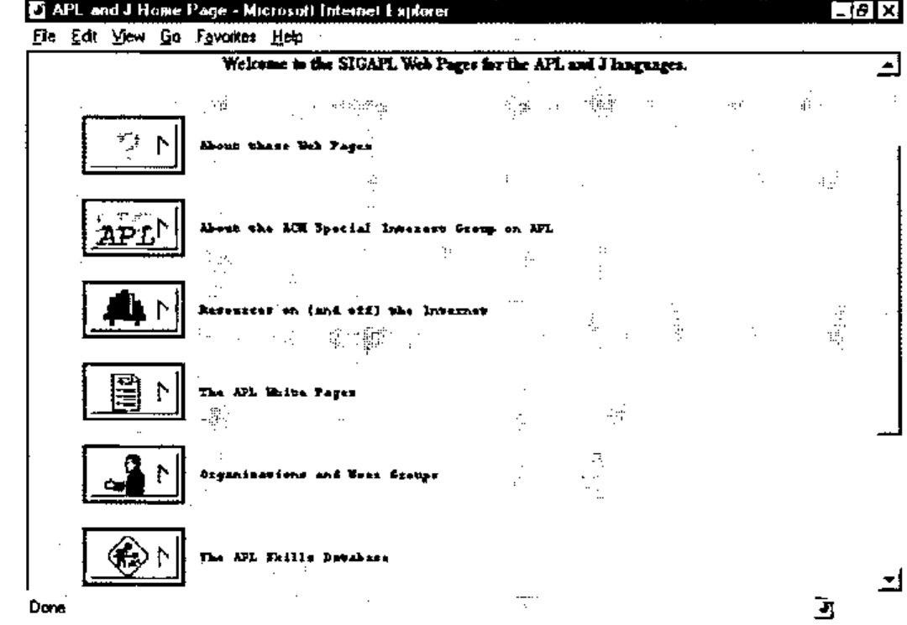
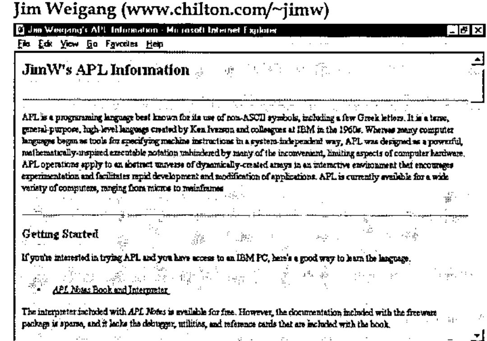
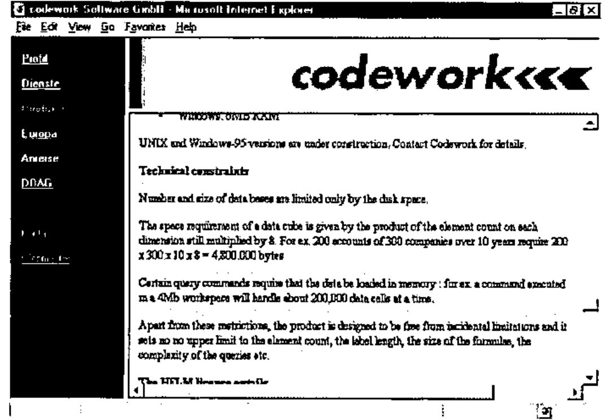
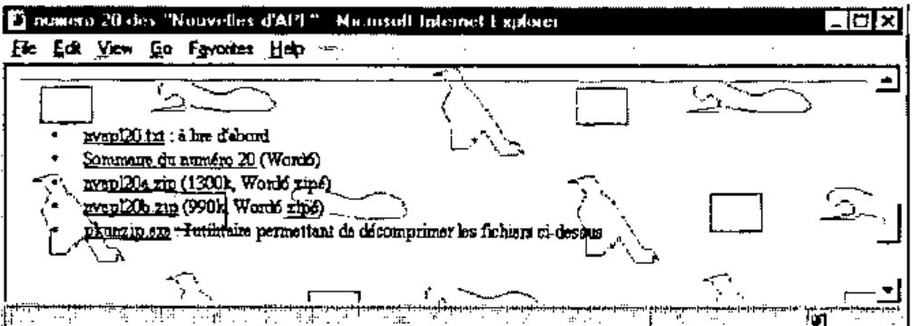
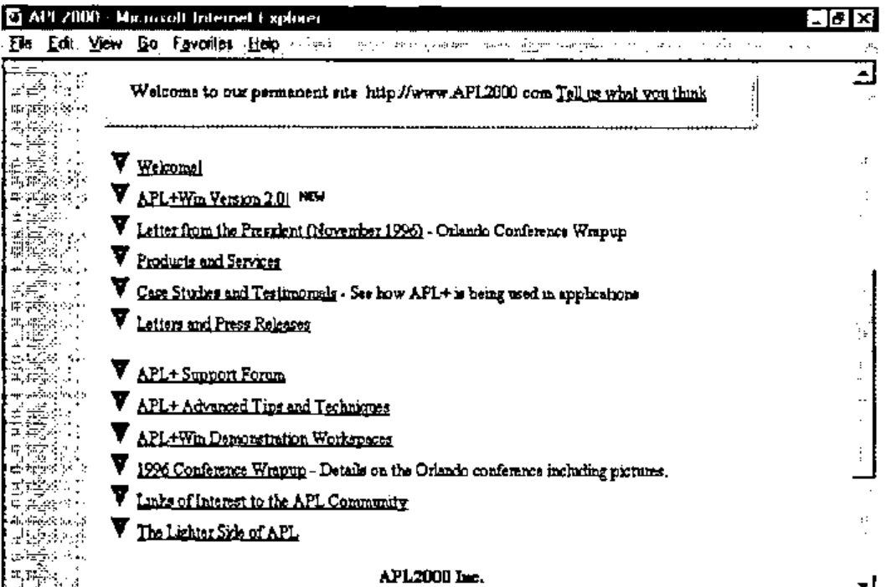

*surveyed by Jon Sandles*
{ .byline }

These days everybody has access to the Internet somehow or other - either at work or at home - and if you do not have that, you can pop down to your local Internet café and have a quick look there. But as APLers is there anything actually useful out there? The most obscure topics can all be found on the Internet, and APL and J are no exception. But just like everything else on the Internet there are few quality controls and no guarantee that what you see is true.

In this article I will be discussing a number of Internet resources and may even pass some comment as to the quality of the resource, but, and this is the crux of the Internet, you have to remember I am only commenting on right now, and by the time you read this article a number of the resources will have been modified, updated, improved or even deleted. Also a number of new ones may have appeared (although the rate of change for APL/J related resources is probably quite slow when compared to the Internet as a whole!). This is the magic of the Internet. The only true way to know what is good and bad is to go and check it out for yourself on a regular basis. This is where Vector comes in.

At the end of the product guide you will find a list of current APL Internet resources. This should be kept up to date and any new resources will be added. We will also try and indicate whether a resource has been changed significantly in the past three months in such a way that makes it a must for a revisit. To a certain extent we will be relying on you to keep us up to date with these changes.

So what APL is actually on the Internet?

- e-mail. The ability to communicate with APLers all over the world is one of the most important features of the Internet (for APLers anyhow - probably one of the least relevant for everyone else!). There are also a number of APL resources that involve the use of e-mail as their distribution medium.
- World Wide Web access. There is plenty of APL on the WWW. This is what I will look at in the most detail.
- FTP. This provides access to huge libraries of files for downloading onto your PC. There are a few specific file libraries dedicated to APL.
- USENET/news. There is a dedicated USENET news group for APL called comp.lang.apl.
- Added value areas of some providers. Compuserve provides a portable programming forum for languages that can easily be moved across different platforms and APL is often discussed here. Compuserve also provides an APL2 forum.

## Getting Started - Internet Providers and Cost

The basic requirements for communicating with the Internet are a computer with a modem and a phone link. A modem will probably give you either 28,800 bps or 14,400 bps access. Both of these speeds are acceptable - although if you are going to be doing a lot of work on the Internet then go for the fastest modem possible. An even faster option is ISDN access although this is still prohibitively expensive for most people to make it worth while. Once you have got the kit at your end you can’t just ‘dial the Internet’ - you need to get an account with an Internet provider - who in return for taking money out of your bank account on a monthly basis will give you a phone number you can ring and an account and password that will give you access to the Internet. They will also give you lots of software to do all the exciting things that you want to do. Internet providers are all much of a muchness in terms of how much they charge per month for their service. There are several other factors that are normally much more important in deciding which provider to choose.

- The phone numbers they provide for their service need to be as cheap i.e. as local as possible. The majority of charges incurred in using the Internet will be via the phone - not to the Internet providers themselves. The telecommunications industry is the real winner in the Internet boom. Some providers will only cover certain areas - and if you are going to need to access the Internet from outside those areas you will incur heavy phone charges making long distance calls to access your e-mail. The major providers Compuserve and AOL provide access numbers in most of the major countries at local rate. This is a major advantage if your work involves longish spells of travel abroad.
- The length of time you can access the Internet before additional charges are incurred. Most providers will allow an amount of time on the Internet for free and then charge by the hour for additional usage in any month. If you are going to use the Internet a lot then you will probably want a flat rate that gives you unlimited access per month. If you are only going to use it ‘every now and again’ then as a guide 5 hours should be enough to get you going.
- Added Value. How many e-mail accounts will you get - normally one, but sometimes they offer more which might come in handy for the wife and kids! e-mail address format - what will your e-mail address format look like? For years Compuserve users have had to put up with unwieldy numeric addresses [example left out]. This is impossible to remember both for you and your friends. An address built from your name [example left out] makes a lot more sense. (Compuserve have recently introduced this non-numeric style of addressing - thank goodness!)
- Web page space - some providers will give you an amount of space on their servers for designing Web pages. This is useful to get you started in HTML (the language used to write Web pages), but if you want to seriously use the Web for commercial purposes check the following: how much space you get; how much does it cost to get more space; can you use CGI programs? Can you use your own registered domain name (this is a bit like the mail addresses - http://ourworld.compuserve.com/homepages/jon_sandles is not quite as memorable as http://www.sandles.com (to find out more about registering domains check out http://www.isi.edu/div7/iana/).
- In addition to this some providers (as a result of their non Internet based past) provide their own set of online services/forums and chat areas - Compuserve, AOL and the Microsoft Network stand out in this respect. I can only comment on Compuserve, whose forums are by far the fastest way to find out technical information or get shareware programs. Compuserve are able to organize their forums into areas and groups making navigation easy. There is also a global file find facility. Also if Compuserve crashes during a file download, you can restart it from the point where it got to. You do not have to start again. But, Compuserve’s forums are beginning to get a bit left behind as many corporations find it too hard to maintain both an Internet and Forum presence. The Internet presence is bound to win out in the end.

Most Internet providers appear to be quite helpful and there do not seem to be quite the same number of pitfalls associated with choosing an Internet provider as there are say with purchasing a mobile phone. Once you have decided all this and got yourself connected you will want to start exploring the Internet for real.

## e-mail

Most people have seen or used e-mail so I will not dwell for too long on this topic. The first thing you will want to do is talk to some APLers via e-mail (of course). How do you find out their e-mail address if you have not already got it ? There is no organized telephone directory although SIGAPL have an APL ‘white pages’ which is nearly as good (available off the SIGAPL Web pages). If they are not in there, then try mailing someone who is who might know them - they will be only too pleased to pass the information on. You can also subscribe to mailing lists via e-mail which automatically send e-mails to a group of interested people whenever anything is posted to them. An example of this is Tony Chan’s DyalogAPL mail server.

If you wish to subscribe, send

> *To: [address left out]* 
> *Subject: DyalogAPL*

and

> *Subscribe YourFirstName YourLastName*

in the main body of the mail. This can be a nice way of getting a problem solved - although I have to say that this particular mail-server seems to be somewhat under-utilized! In fact all the resources (WWW, FTP etc.) are accessible via e-mail. (This technique of getting other Internet resources via e-mail was developed for people in developing countries where they only had e-mail gateways on the Internet. Hence, you are discouraged from overloading these resources if you are in a country that has a gateway to the resource you are looking for.)

## Browsing the Web

To get on the Web (WWW) you will need a Web Browser. Fortunately these are easy to get hold of as virtually every magazine carries a copy of the two major browsers on the market. There is little to choose between Netscape 3.0 and Microsoft IE3. If you are using Windows 95 and regularly purchase Microsoft software you probably have already had IE3 installed on the back of some other product.

When you first use your Web Browser you will almost certainly attempt what is known as the ‘random surf’. You will go to your Internet provider’s home page, because that is the only Web address you know and you will try clicking on various ‘links’ which take you to other pages. You will find loads of information. You will read loads of information. None of it will make much sense. After about half an hour your head will hurt. Your wife and kids will be screaming to use the phone. You will go to bed and wonder what all the fuss was about. Welcome to the WWW. Fortunately there is a better and quicker way of finding information.

## Web Search Engines

Web Search engines provide a means of searching the Web for pages that contain certain keywords. You can even combine keywords using simple Boolean logic to narrow the search further. Some search engines even provide ratings for the quality of information within a page, whereas others simply provide the most recently changed ones first - indeed there is no guarantee that what you get back
will still be present on the Web and you will get the infamous ‘404 File Not Found’ error message. (This is known as a ‘dead link’. Basically the Web page you tried to find existed at some point in the past and the search engine duly catalogued it. It has since been deleted - but because search engines are very bad at finding out when links have been deleted they are still reported as being in existence.)

I’m not going to tell you which Search engines are best or which to use, as like everything else on the Web they are changing all the time. Check out the latest reviews in specialist Internet magazines or PC magazines [1]. A good place to start is **Alta Vista [www.altavista.com]** or **Infoseek Ultra [ultra.infoseek.com]** - both of which seem to have the largest databases of Web Sites.

It should be noted that search engines are not exhaustive in their searches. They will frequently have not heard about new pages and some find pages that others do not. If you do not find what you are looking for then go to a page that is similar or as close as possible and look for links from that. Most definitive pages on a particular topic will link up to other similar pages. (If they did not they would not be definitive!)

Remember to add any pages that you are likely to want revisit to your bookmark list in your browser. This will save you having to find the page all over again.

Using search engines is a secret art and each one has its own features and quirks. Make sure you check out the advanced options and read through the help as this could reduce your on-line time exponentially.

## The Minder Robot

Once you have found a bunch of Web Pages that you like you will want to revisit them whenever they have new information on them. Some Web Pages change all the time. Some do not change for years and years. You do not want to have to keep checking "just in case" they have changed. The minder robot is a useful tool that allows you to tag pages that you like, and it will notify you via e-mail when they have changed or been updated in any way. You can try this out on many of the Vector Pages which have a special minder robot section. (At the moment it checks them about once a week.) This is a free resource (nothing to do with the BAA/Vector) and can be used on any Web pages.

## APL Pages on the WWW

Search engines seem to be particularly bad at finding APL resources. I tried both the major engines mentioned above and got a real mixture of pages back. Few of them had anything to do with APL. Hence the recommended starting point for any APL related search would (at the moment) be a visit to any of the following three sites.

### Vector (www.vector.org.uk)

The Vector pages are well laid out with a quick index at the top of most pages which should provide easy navigation. The best list of APL links is found by going to the Bookmark page ….

Here you can see a number of organizations and groups who have registered either e-mail or Web addresses and these are then posted as links.

### SIGAPL (www.acm.org/sigapl)

The SIGAPL pages have an interesting graphical twist to them, but they load quite fast and have good links to other pages. The APL white pages is a list of e-mail addresses (much like the Vector bookmark page) and the Resources page leads to lots of other links.

The skills database is a good place to go if you are looking for jobs, or indeed if you have jobs to offer.

### Jim Weigang (www.chilton.com/~jimw)

Jim’s pages are widely regarded as being the definitive APL ‘home’ pages, partly because of the length of time they have been around, but mainly because they have a nice informal, but informative layout.

## APL Characters on the WWW

Much has been said on this topic, but little agreement is ever made. To see an overview of approaches all the above three Web sites carry advice on how to tackle the problem. Ray Cannon’s article in this Vector reports on recent advances in the HTML specification (FONT FACE =) and suggests ways we can use them to our advantage (see page 14).

## Some Random APL Sites Reviewed

There are at least 20 areas of web pages which are directly focused on different aspects of APL. Of these about 40% are commercial organizations that currently use APL as a problem solving/ programming tool. The next 40% are APL vendors and consultants who are selling APL products. The remaining 20% are APL groups like SIGAPL and the Vector pages. I will thus focus on a random sample of pages in these proportions.

### Codework (www.codework.de/cwk_en.html)

The Codework pages are a good example of a company that is using APL in one of its products. I do not think APL is ever mentioned in any of these pages. They are well laid out and available in three different languages.

You have to dig quite deep in the pages to discover that it is HELM, their OLAP product that is APL based. To an APLer the signs should be obvious ….

### Association Francophone pour la Promotion d’APL (www.ensmp.fr/~scherer/langlet/)

This page acts as an overview of the latest contents of Les Nouvelles d’APL - the French APL Association’s tri-monthly journal. The pages are in French (as is the magazine) and you can download the whole thing in Word 6 format if you want. This is a genuinely useful free resource with some very good articles often aimed at the professional developer (you might need a translator of course!)

### APL2000 (www.APL2000.com)

Here is the index page of the APL2000 Web presence. Notice the ticker line which rolls past at the bottom.

As you can see this provides an excellent overview of the APL2000 company and product portfolio. They also provide an interesting links page.

### Mackay Kinloch Ltd. (http://ourworld.compuserve.com/homepages/Alastair_Kinloch/)

Mackay Kinloch provide computer software services, including APL systems analysis, design, programming and maintenance.

These pages are concise and simple and are a good place to visit if you want to know what to aim for when knocking your first Web pages together. But, there is little dynamic content, and the last changed flag on the main page (February 96) indicates that it won’t be worth visiting again for a while.

### Strand Software Inc. (www.jsoftware.com)

These are basically the home pages of the J language. J, as you probably know by now, has been blessed with the ASCII character set and hence fits into the Web paradigm very well. J code can just be presented on screen with no playing about with browser settings and no funny transliteration schemes. They also have an excellent site map for easy navigation.

## Off-line Browsing

If you are going to be doing some intensive Internet research over a reasonable period of time you may want to invest in an off-line browsing tool. These allow you to build collections of web pages off-line and whenever you log on you can tell them to check out certain pages to see if they have changed. You can then decide (off-line) which of these pages you want it to retrieve to be viewed at your
leisure (off-line). Hence most of the browsing/decision making is done when you are not wasting money on the phone. These tools will only make much difference if you are needing to browse quite extensive sets of pages - and it is also important to know when the information is updated.

One of the best off-line browsing tools currently on the market is Quarter-deck WebCompass [www.qdeck.com]. You can maintain active areas of interest and build a schedule of updates, of when to check for updated information.

## Usenet News Groups

Your internet service provider will give you access to a Usenet news feed. It is possible that they will remove certain groups for your own protection. It is very unlikely that they will prevent you from accessing comp.lang.apl. It is possible that the frequency with which your news groups get updated, and hence the timeliness of the information, is unreliable. You might want to try another news feed; there are a few public ones about. Try news.sprynet.com as a useful alternative. You might want to run two newsfeeds side by side for a while to see which one works the best. If you are a professional programmer I would advise perusing all the comp.lang.\* news groups every now and again as it can be very illuminating to see what discussions are going on within each language’s area. Some corporations provide their own public news servers. An excellent and useful example of this is the news server at msnews.microsoft.com.

It is often commented on that comp.lang.apl contains too many discussions on J. In reality, comp.lang.apl is an open and non-moderated resource so it contains whatever we want it to. If there is not enough APL then that is because there are not enough APLers contributing to it - not because there are too many J programmers contributing too it - comp.lang.apl can hardly be said to be a high volume/over busy news group (try looking at comp.lang.c++).

## FTP

FTP gives you an interface to libraries of files that you can download from the internet. No fancy graphics here, just a list of directories and files, and if you click on a file it will end up on your hard disk about three hours later. Great stuff!

These libraries are mostly maintained by universities and there is often very little to tell you what a file contains or what it does. Always look out for a readme file either in the base directory (in which case it will describe the contents of all the files in the whole library) or in the directory where you are looking.

The current IBM APL2 beta program has been delivering the new software for testing via ftp. You simply receive an e-mail with the new file names and with a supplied account and password, then you log on and download them from an IBM ftp server.

## Downloading Files from the Internet

One final caution before you all go Internet crazy. Most of the quality information available on the Internet appears with equal timeliness within the computer press or via journals like Vector. The software you can download that is ‘free’ is mostly shareware so you should be paying for it anyhow. Once you register shareware you will start receiving disks through the post just like normal. It is normally a lot quicker to go and buy the latest computer magazine with a free CD ROM on the front and get the latest free shareware off that, than to waste half a day attempting to download it off the Internet. Downloads are expensive - they are slow - they tie up your time, they tie up a phone line and they frequently crash at the last minute. Remember to check for viruses, and try to remember not to use downloaded data files that may contain embedded macros (Word/Excel documents).

## Summary

If you are an APL professional and you do not have access to the Internet make sure you get it. There are too many useful resources like Uniware’s APL+Win training program that are only available via the Internet.

If you are an APL manager then make sure your staff have access to the Internet, but also make sure you install a firewall that is capable of controlling and monitoring Internet access.

If you are going to put files on the Internet, make sure they are virus checked by an up to date virus checker.

## References

[1] *Catching Sites*, PC MAGAZINE, February 1997, Page 109.

[2] *Know your net*, Digital Corporation. ED-H010B-95
