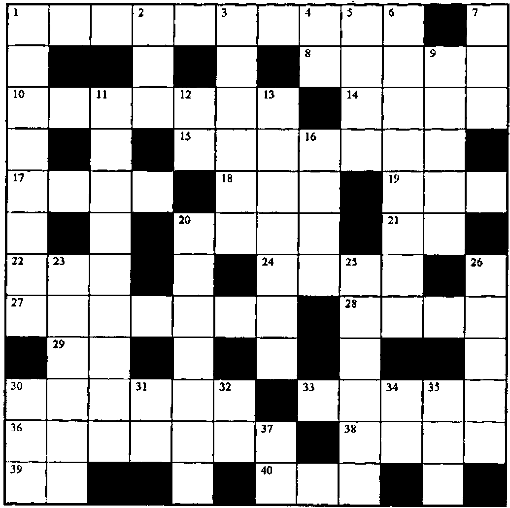

*introduced by Jon Sandles*
{ .byline }

The ZARK APL Tutor is a computer-based tutorial for learning APL for the PC. If you bought the tutorial package you would also receive free subscription to the ZARK APL newsletter for one year. This quarterly newsletter provided additional tutorial exercises and an excellent series of APL crosswords.

*Vector* has been granted permission to reproduce extracts from the ZARK APL newsletter and we have decided to run a series of re-prints in every issue. We currently have issues from 1989 to 1994 and we will reprint crosswords and exercises that are still relevant. We welcome letters with new solutions and comments to the problems presented (maybe in J?) and we will publish the solutions that ZARK published in subsequent issues.

The training package was an interactive tutorial, teaching you about all aspects of APL programming. One of the advantages of APL being interpreted is that it is effectively already an interactive environment for learning the language. ZARK took this a stage further by providing a number of tutorials explaining different parts of the language and then prompting for the trainees’ attempts at solving a number of simple problems. Often when the APL approach to a problem is non-intuitive ZARK would explain the APL solution by simulating the arguments that the APL creators would have had when designing the language. This is both enlightening and amusing (and more than likely involves a large slice of artistic licence).

Although the tutor was based around the APL\*PLUS II interpreter it provided a good grounding for any APL dialect. When I worked at Nestlé, the tutor was used for training both mainframe and PC programmers and seemed to be reasonably well liked (I happened to just miss out — I was the last graduate to be trained by the more traditional "sit down and read Gilman and Rose" method). The newsletter was equally as popular, its arrival being greeted by something resembling enthusiasm (a reaction the arrival of *Vector* rarely received).

In this first reprint we present the Crossword from issue 1989:4

## Across

1. The indices of the elements in the vector *R* containing integers between 1 and 9.
8. *MV* is a matrix of monthly totals. Annualize them.
10. The number of dimensions in *TABLE*.
14. Identify the elements of the matrix *N* not found in the list *L*.
15. Identify the elements of the integer matrix *ME* that match the elements of the corresponding matrix *M*, after scaling (dividing) *M* by the scalar *N* and truncating fractions.
17. The available programs.
18. It’s simpler than `2×A`, and gives the same value.
19. Identify the elements of *D* that are smaller than the corresponding elements of *K*.
20. Return all or none of the columns of *M*, depending on whether *BR* is 1 or 0.
21. The pointless inverse of the pointless expression `-0`.
22. The rankings of the elements of the vector *V*, 1 for largest, 2 for next largest, and so on.
24. `(⍎'⍎''''''BT'''',⍕⍴''''BT''''''''),'~'`
27. The end-of-year balances of an investment amount *A*, given the annual interest rates in the vector *I*.
28. The area of a circle having radius *R*.
29. `,2 1⍴2 1⊖2 1⍉'TUVW',[.21]'1234'`
30. `¯2 ¯7 ¯12 ... ¯37 ¯42.`
33. Round each number in the matrix *N* to the nearest integer.
36. Draw one card from a deck of playing cards and then put it back. Do this 100 times.
38. `,⍉(25,⍴V)⍴V`
39. `-/32 1 2 3`
40. Five fives

## Down

1. Are the elements of the vector *A* in ascending order?
2. *A* is a non-negative scalar. Return 1 if *A* is positive, or an empty vector if *A* is zero.
3. Throw it all away!
4. The indices of the rows of a matrix with *M* rows.
5. The number of elements of the vector *V* not in the matrix *M*.
6. *R* is a Boolean matrix that flags the non-zero elements of *D*. Return the quotient *N*÷*D*, returning 0 whenever *D* is 0.
7. `1 1⍉3 4 ⍴'MY  32NDBOLT'`
9. Are any of the elements of the matrix *N* negative?
11. Multiply each element of *V* by 250, replicate them *N* times each and add the scalar *T* to the result.
12. A logical name for a logical array of rank 2.
13. Are there exactly *E* 1s in the logical vector *BIT*?
16. The value to be subtracted from the scalar *AMT* to leave just its fractional portion.
20. If `BV1←V<100`, what expression can you insert between the brackets in `V[]←0` to zero out the elements of V less than 100?
23. The indices that will re-order the vector *V*, moving the values above 10 to the front of the vector and the values below 10 to the end.
25. The cosine of 45 degrees.
26. All but the last two elements of the vector *NV*.
30. Re-order `⍳3` randomly.
31. The sign of zero.
32. `(5×2*3)++/⍳10`
34. `5×12-9*6≠6`
35. The total for each row of the matrix *M*.
37. `+/3 4*2`
