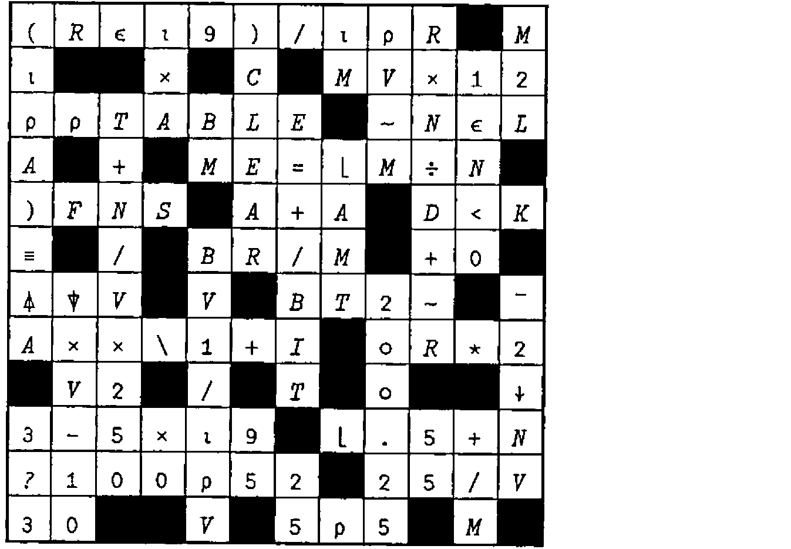
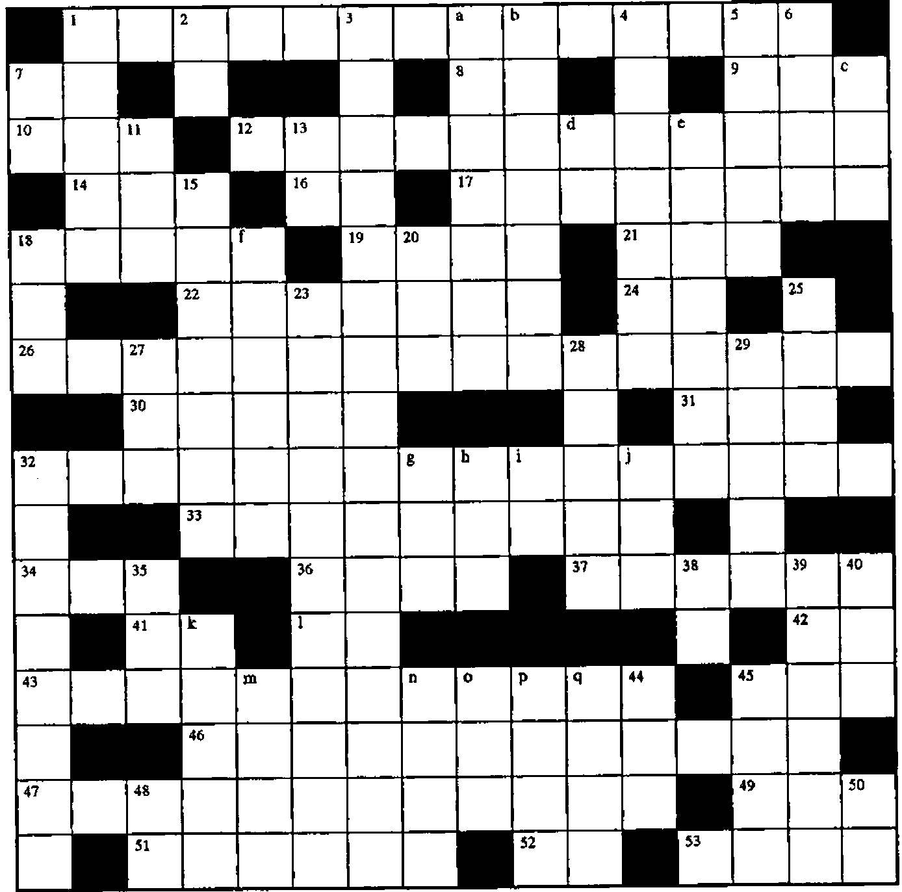

*introduced by Jon Sandles*
{ .byline }

## Introduction

Last issue we reprinted one of the crosswords from the Zark APL Tutor news. This issue we include the solution and the first of a series of articles which I hope will be of use and interest to APLers old and new. Also reprinted is a second crossword. We encourage you all to send in solutions to both the Crosswords and the "Limbering UP" exercise. Your solutions can then be compared to those of 8 years ago.

We received a solution to last issue’s crossword from Jonathan Barman who submitted it as a DyalogAPL workspace that also provided a Gui interface for designing crossword layouts. Future crosswords may be typeset using this workspace! We will also make it available on the *Vector* WWW pages so that you can solve the crosswords without soiling your beloved Vectors.

## Solution to Crossword from Vector 14.3



## Crossword



### Across

1. Do all the rows of the character matrix *CM* contain at least one vowel (AEIOU)?
7. Smallest
8. `3*4`
9. The length of an empty character vector
10. The elements of *M*, scaled by the factor *Z*
12. The coefficients of `Y=A+Bt` (where `t=1,2,3,...`) given a vector *Y*
14. The rank of 1
16. Convert the matrix *D* to a vector while looking through a mirror
17. The element of *C* corresponding to the largest element of *N*
18. The length of *V*, ignoring the first *MT* elements
19. The shape of `3 1 2⍉A`
21. The accumulated value of annual investments *U* (e.g. `100 250 50`) after the last deposit, at accumulation rate (`1+interest`) *I* (e.g. `1.07`)
22. Given two same-length vectors *C* and *P*, the elements of *C* corresponding to the *P* largest elements of *N*
24. `!V` in conventional maths notation
26. The corner elements of the matrix *N* (sound familiar?)
30. The absolute value of the result of adding *N* to the elements of *AM*
31. The first *I* elements of *V*, repeating values if not enough
32. Identify the rows of the matrix *C* that contain a single distinct character
33. The number of digits in each element of the non-negative integer vector *N*
34. Truncate the vector *V* to length *N*
36. Stick a column of `99`s on the end of the matrix *M*
37. Convert the numeric matrix *BAL* into a formatted character matrix using the two-element control vector *V2* (e.g. `10 2`)
41. Largest, backwards
42. All
43. Does the character vector *J* contain the same number of take (`↑`) and drop (`↓`) symbols?
45. Those values in the vector *I* not found in *J*
46. Perform the inverse of `I←B/⍳N`, using `⋄` to separate expressions
47. Perform the inverse of `M←+\N`, where *N* is a matrix
49. The indices of the elements of the vector *V*
51. The locations within the vector *T* at which the characters `'M'` and `']'` first occur
52. The matrix *M* transposed
53. What programs are available?

l. `'[1]'[2 1]` in origin 0

### Down

1. Is the array *M* nonempty?
2. Any
3. The corner elements of the matrix *M*
4. The incestuous expression whose result is compared to `⍳⍴IV1` to return the distinct values of the vector *IV1*
5. The indices of the `1` bits in the vector *U*, written right-to-left
6. The first element of the matrix *N*, as a scalar
7. Ignore the decimals in the values of *M*
11. The first *Z* elements of the matrix *T*
13. The reciprocal of the scalar *D*, the hard way
15. Shift the elements of the vector *C* left one place, filling with *N* if *N* is `1`, else `0`
18. The number of digits in the positive integer scalar *N*
20. The "ascending" grade vector `6 1 5 3 7 4 2` for `N←12 15 14 15 13 12 15`
23. Use the integer portion of the scalar *M* as an index into the vector *A*, building a vector of that length, containing *N* copies of *M*, then `0`s. Pad or truncate the result to length *P*
25. A random number between `1` and `NV1[1]`; another between `1` and `NV1[2]`; and so on to `NV1[⍴NV1]`
27. The decimal portions of the elements of *C*
28. Round UP the values in *V* and reshape them to a vector with as many elements as the matrix whose shape is *S*
29. Row, row, row your boat
32. Are all the elements of the vector *NV* integers
35. Sum the elements of the vector *V* while standing on your head
38. Convert the numeric vector *N* into a character vector that looks the same
39. Is the Boolean scalar *A* true and the first element of the Boolean matrix *N* false?
40. Replicate each column of the matrix *J*, *L* times
44. ___ Brown, the chief architect of APL2
45. Set *I* to be the whole numbers from `1` to *F*
48. What an array with no elements is called (argh!)
50. __ APL, IBM’s precursor to APL2

```apl
a. '''',6⍴3⌽'MAT8[C⍴N;]'
b. 'A[1]'[-\-¯1 2 0 ¯1 1 3 1]
c. 1 1⍉3 3⍴'''X''(Y)[Z]'
d. 'M+.×N'[⍴'CAT'∘.='TAILS']
e. 'V[3]-3⌈10⊥!3×(3↓I)-3'~'013-×(]V
f. (×4|⍳8)/'V[1]+C+5'
g. ⌽3↑(⍕10×3*2),'($)'
h. ¯1⌽'⍟',⍕+/⍳13
i. 1↓'1+N'
j. 'C123'[1 2 3]
k. '⌈/B-⍳5'[⍳5]
m. '←(''')→'[¯1⌽⍳4]
n. ('STREET'≠'E')/'''0)(0''
o. (1∘.+¯4)↑'↑○○○↑'
p. ⌽⊖⍉'.BO⍉'
q. 'V=V[1],M'~']1V'
```

## Utility Corner: Converting from Characters to Numbers

(The purpose of this column is to make you more productive by introducing you to utility functions. Think of utility functions as APL functions that have names instead of symbols. By expanding your function vocabulary, you’ll be able to write APL code that’s more concise, more efficient, and more readable.)

The system function `⎕FI` (fix input or format inverse) and `⎕VI` (verify input, or validate input) are extremely useful when writing user-friendly interactive functions. When used with `⍞` input, they provide a simple and effective team for accepting numeric input. For example:

```apl
[1]  ASK:'Enter quarterly sales figures'
[2]   RESPONSE←⍞
[3]   →(∧/⎕VI RESPONSE)/OK
[4]   'Non-numeric entry. Please re-enter.'
[5]   →ASK
[6]  OK:NUMBERS←⎕FI RESPONSE
```

The `⎕VI` function returns a bit vector with one element per group of nonblank characters in its argument. A 1 is returned for each group that can be converted to a number (*e.g.* `27.5` or `¯3.6` or `3.1E6`); a 0 is returned for each nonconvertible group (*e.g.* `2.3.4` or `¯2¯` or `CAT`).

The `⎕FI` function does the conversion, returning a numeric vector with one element per group of nonblank characters in its argument. Nonconvertible groups are returned as 0.

Here’s an illustration:

```apl
      ⎕VI '26 43K ¯2.0 0 1E6 END -5'
1 0 1 1 1 0 0
      ⎕FI '26 43K ¯2.0 0 1E6 END -5'
26 0 26 0 ¯2 0 1000000 0 0
```

Without `⎕VI` and `⎕FI`, the simple-sounding task of converting a character vector to a numeric vector is difficult. The direct application of execute (`⍎`) may cause an error if the vector is ill-formed:

```apl
      ⍎'26 43K ¯2.0 0 1E6 END -5'
VALUE ERROR
⍎      26 43 K ¯2 0 1000000 END-5
                                ^
```

Fortunately, `⎕VI` and `⎕FI` prevent this possibility. Unfortunately, not all implementations of APL support `⎕VI` and `⎕FI`. For example, APL\*PLUS and Sharp APL do support them, but VSAPL and APL2 do not.

Let’s write a utility function named `∆VI` to mimic the behaviour of `⎕VI` for those APL implementations that don’t have `⎕VI` and `⎕FI`. Since `⎕VI` and `⎕FI` perform similar work, we won’t bother to write a separate function named `∆FI`. Rather, our `∆VI` will return the global variable `∆FI`. Here’s an example of how you could use this utility function:

```apl
[1]  ASK:'Enter quarterly sales figures'
[2]   RESPONSE←⍞
[3]   →(∧/∆VI RESPONSE)/OK
[4]   'Non-numeric entry. Please re-enter.'
[5]   →ASK
[6]  OK:NUMBERS←∆FI
```

Notice the similarity to the first illustration in this article.

Here’s the utility function. Scientific/exponential notation (*e.g.* `3E5`) has been ignored for simplicity.

```apl
    ∇ BV←∆VI CV;BL;CUM;EI;I;LN;N;NB;ND;NN;NP;SI;⎕IO
[1]   ⍝ Does:  BV←⎕VI CV
[2]   ⍝  and: ∆FI←⎕FI CV
[3]   ⍝ returning ∆FI globally
[4]    ⎕IO←1 ⍝ Origin 1
[5]    CV←CV,' ' ⍝ Trailing blank simplifies logic
[6]    NB←~BL←CV=' ' ⍝ Nonblank, blank
[7]    SI←(NB∧¯1⌽BL)/⍳⍴NB ⍝ Start inds
[8]    EI←(NB∧1⌽BL)/⍳⍴NB ⍝ End inds
[9]    N←⍴LN←1+EI-SI ⍝ No. of grps; lengths of grps
[10]   CUM←+\BV←CV='¯' ⍝ Cum no. of neg signs
[11]   NN←CUM[EI]-N⍴0,CUM[EI] ⍝ No. negs per grp
[12]   BV←NN=BV[SI] ⍝ One neg okay only if start chr
[13]   CUM←+\CV='.' ⍝ Cum no. of periods
[14]   NP←CUM[EI]-N⍴0,CUM[EI] ⍝ No. periods per grp
[15]   BV←BV∧NP≤1 ⍝ Max one period allowed
[16]   CUM←+\CV∊'0123456789' ⍝ Cum no. of digits
[17]   ND←CUM[EI]-N⍴0,CUM[EI] ⍝ No. digits per grp
[18]  ⍝ Min one digit; nothing but negs,pers,digits:
[19]   BV←BV∧(×ND)∧LN=NN+NP+ND
[20]  ⍝ Consider only convertible grps
[21]   N←⍴SI←BV/SI
[22]   LN←1+BV/LN ⍝ 1+ for trailing blank
[23]  ⍝ I←(⍳LN[1]),(⍳LN[2]),(⍳LN[3])...
[24]   I←LN/N⍴0,+\LN
[25]   I←(⍳⍴I)-I
[26]   ∆FI←BV\⍎CV[I+LN/SI-1] ⍝ Cvt to num via ⍎
    ∇
```

To help you follow the logic, we’ve traced the values of the variables in the `∆VI` function when it’s run with the test argument we used above:

```text
[6]   CV: 26 43K ¯2.0 0 1E6 END -5
[7]   BL: 0010001000010100010001001
      NB: 1101110111101011101110110
[8]   SI: 1  4    8    13 15 19  23
      EI:2     6     11 13 17   21 24
[10]  LN:2   3    4     1 3    3  2
       N: 7
[11]  BV: 0000000100000000000000000
     CUM: 0000000111111111111111111
[12]  NN: 0  0    1     0 0    0   0
[13]  BV: 1  1    1     1 1    1   1
[14] CUM: 0000000001111111111111111
[15]  NP: 0  0    1     0 0    0   0
[16]  BV: 1  1    1     1 1    1   1
[17] CUM: 1223444455667788999999 10 10
[18]  ND: 2  2    2     1 2    0   1
[20]  BV: 1  0    1     1 0    0   0
[22]  SI: 1       8     13
       N: 3
[23]  LN: 3       5     2
[25]   I: 0 0 0   3 3 3 3 3    8 8
[26]   I: 1 2 3   1 2 3 4 5    1 2
[27] ∆FI: 26  0   ¯2    0 0    0   0
```

By making heavy use of scan and shift techniques, this function can evaluate a character vector of any length without looping.

## Limbering UP: Converting Character Matrices to Numbers

(The purpose of this column is to work some flab off your APL midsection. Like muscles, your APL skills can atrophy if not exercised with adequate frequency and variety. This column presents a task for you to perform. Set aside a few minutes from your busy schedule and work the task. Mail in your solution and stay tuned for the results.)

You can use the system functions `⎕FI` (fix input) and `⎕VI` (verify input) to convert a character vector into the numeric vector represented by the characters. For example:

```apl
      ⎕FI '37 26.5 ¯24 7R 142'
37 26.5 ¯24 0 142
      ⎕VI '37 26.5 ¯24 7R 142'
1 1 1 0 1
```

(See the `∆VI` utility function presented in the Utility Corner column if your version of APL does not support `⎕FI` and `⎕VI`.)

The `⎕FI` and `⎕VI` functions work only on character vectors, not on character matrices. As full-screen APL applications become more common, we’re often encountering numeric information in the form of a character matrix, not a vector. For example, we might read the contents of six numeric fields from the screen as a six-row character matrix. We need to convert it to a six-element numeric vector.

Your task is to write a function named `∆VM` (`⎕VI` on Matrix) that verifies that each row of its character matrix argument can be converted to a single number. Its result is a vector with one element per row of the matrix: a `1` means that row can be converted; a `0` means it can’t; a `¯1` means the row is all-blank.

In addition to this explicit result, the `∆VM` function returns the global variable `∆FM` (`⎕FI` on Matrix), which is a numeric vector of the converted numbers, one per row of the character matrix argument. For rows that cannot be converted to a single number, the result is `0`. For example:

```apl
      CMAT
36.5
  10

STOP
¯28
3 4 5
      ⍴CMAT
6 5
      ∆VM CMAT
1 1 ¯1 0 1 0
      ∆FM CMAT
36.5 10 0 0 ¯28 0
```

The `∆VM` function should be as efficient as possible and as small as possible. 200 points will be awarded for the fastest function; 100 points for the smallest. Functions that are not the fastest or the smallest will be awarded points on a pro-rata basis. For example, if your function is 4 times slower than the fastest, you will received 50 points (200 ÷ 4). The highest score possible is 30, but only if the same function is both fastest and smallest.
