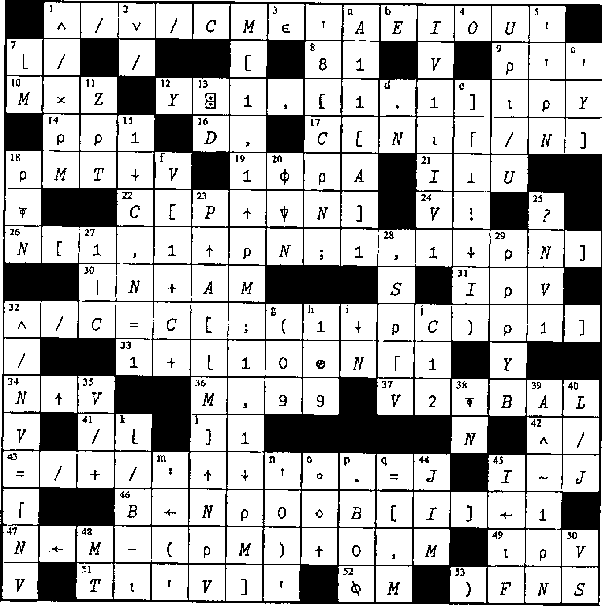
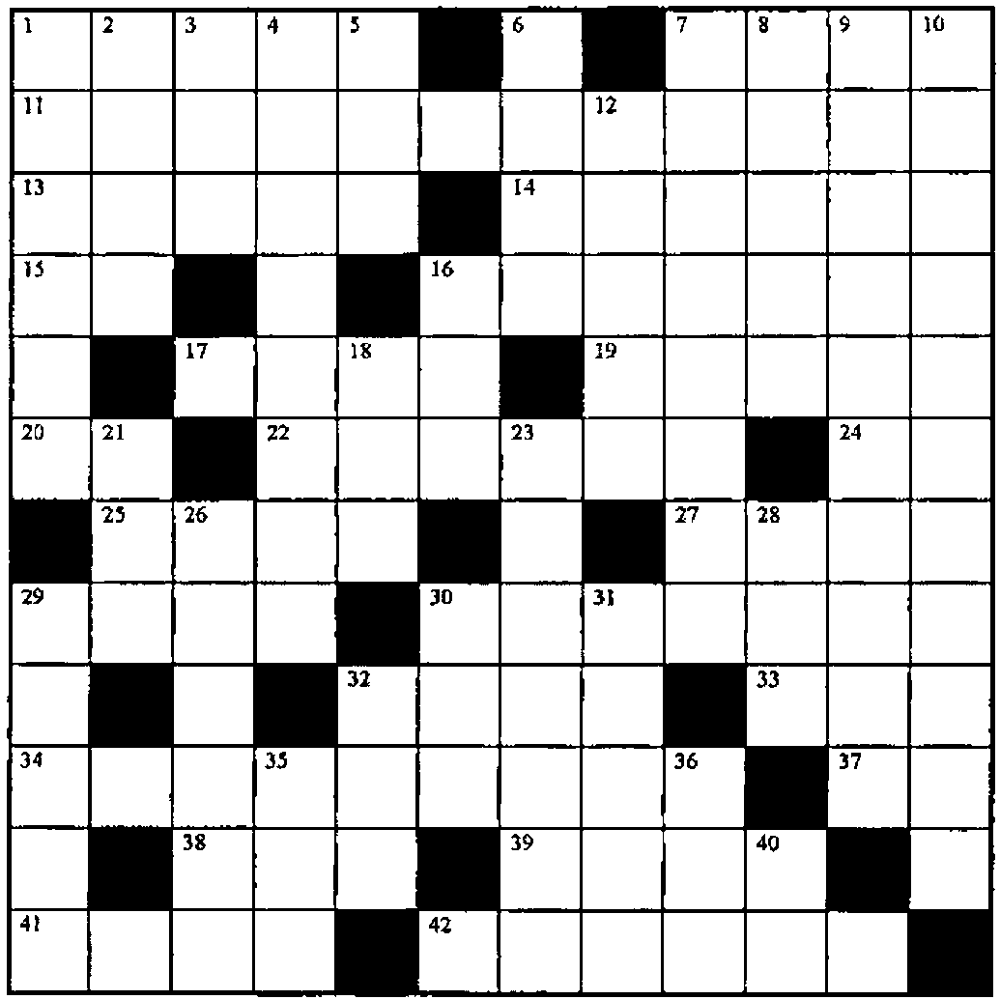

*introduced by Jon Sandles*
{ .byline }

This section continues our series of extracts from the Zark APL tutor news. Sadly, I can report that we received no solutions to last issue’s crossword nor the limbering up exercise. It is food for thought that Zark had no shortage of entries to the same exercise eight years ago.

## Utility Corner: Converting Character Matrices to Numbers

(The purpose of this column is to make you more productive by introducing you to utility functions. Think of utility functions as APL functions that have names instead of symbols. By expanding your function vocabulary, you’ll be able to write APL code that’s more concise, more efficient, and more readable.)

In the last issue’s LIMBERING UP column, we asked you to write a utility function named `∆VM` (`⎕VI` on a Matrix). In this column, we’ll show the winning solution and explain its logic.

The `∆VM` function verifies that each row of its character matrix argument can be converted to a single number. Its result is a vector with one element per row of the matrix; a `1` means the row can be converted; a `0` means it can’t; a `¯1` means the row is all-blank.

In addition to this explicit result, the `∆VM` function returns the global variable `∆FM` (`⎕FI` on a Matrix), which is a numeric vector of the converted numbers, one number per row of the character matrix argument. For rows that cannot be converted to a single number, the result is `0`.

For example:

```apl
CMAT

36.5
  10

STOP
¯28
3 4 5
      ⍴CMAT
6 5
      ∆VM CMAT
1 1 ¯1 0 1 0
      ∆FM
36.5 10 0 0 ¯28 0
```

The `∆VM` function can be handy when reading several fields at once from the screen in a full-screen input application. Here’s an illustration of `∆VM` in an APL\*PLUS/PC application:

```apl
[7]  ⍝ Read 15 fields (10 columns) from screen:
[8]   FLDS←0 0 15 10 ⎕WGET 1
[9]  ⍝ Branch for err msg unless all
[10] ⍝ convertible of blank:
[11]  →(∧/|V←∆VM FLDS)↓ERRMSG ⍝ Global: ∆FM
[12] ⍝ Insert default values where blank
[13] ⍝  (DEFAULTS is a 15 element vector of the
[14] ⍝   default values for the 15 fields):
[15]  BLANK←(V=¯1)/⍳⍴V
[16]  ∆FM[BLANK]←DEFAULTS[BLANK]
[17] ⍝ File the values:
[18]  ∆FM ⎕FREPLACE 999 5
```

So how do we write `∆VM`? Let’s work it out one step at a time.

First, we know that `⎕VI` and `⎕FI` work on vectors, not matrices. We’ll need to ravel the matrix before applying either function (suppose the character matrix argument is called *M*):

```apl
      VI←⎕VI ,M
```

However, we can’t JUST ravel the matrix. Any digit characters in the last column will become adjacent to digit characters in the first column of the next row. For example:

```text
                   ┌───┐
┌────────────┐     │¯36│
│¯3625 16810 │ ← , │25 │
└────────────┘     │168│
                   │10 │
                   └───┘
```

To avoid this problem, we can catenate a column of blanks before ravelling the matrix:

```text
                      ┌───┐
┌───────────────┐     │¯36│
│¯36 25  168 10 │ ← , │25 │
└───────────────┘     │168│
                      │10 │
                      └───┘
```

When catenating to a matrix, the array catenated can be a matrix, a vector or a scalar:

```apl
M←M,[2]((1↑⍴M),1)⍴' '      ⍝ 1 col mat of blanks

M←M,[2](1↑⍴M)⍴' '          ⍝ vector of blanks

M←M,[2]' '                 ⍝ scalar blank
```

The last expression is simplest so we’ll go with that. Further, since column-wise (vs. row-wise) catenation is the default, we can omit the axis operator `[2]`:

```apl
M←M,' '
```

Now let’s address the possibility of all-blank rows. We squeeze out the all-blank rows before ravelling and applying `⎕VI` or `⎕FI`:

```apl
GOOD←∨/M≠' '        or        GOOD←M∨.≠' '

VI←⎕VI ,GOOD⌿M
```

While we’re at it, let’s squeeze out any nasty rows that have more than one number or, more formally, those rows with more than one group of contiguous nonblanks. But how do we determine these rows?

By using a shifting technique, we can identify and then count the nonblank characters that are followed by a blank. Since each group of contiguous nonblanks ends in such a character, we will be counting the number of groups per row. For example:

```text
   ┌─────┐
   │  36 │
M← │2 25 │
   │     │
   │68 4 │
   └─────┘
```

```text
                        (M≠' ')     ∧   (1⌽M=' ')
    ┌─┐      ┌─────────┐   ┌─────────┐   ┌─────────┐
    │1│      │0 0 1 0 0│   │0 1 1 0 0│   │0 0 1 1 1│
NUM │2│ ← +/ │1 0 0 1 0│ ← │1 0 1 1 0│ ∧ │1 0 0 1 0│
    │0│      │0 0 0 0 0│   │0 0 0 0 0│   │1 1 1 1 1│
    │2│      │0 1 0 1 0│   │1 1 0 1 0│   │0 1 0 1 0│
    └─┘      └─────────┘   └─────────┘   └─────────┘
```

By assigning the result of `M≠' '` to a variable we can perform just one relational function (`≠`) instead of two (`≠` and `=`):

```apl
NB←M≠' '
NUM←+/NB∧~1⌽NB
```

The symbols `∧~` ("and not") can be replaced by the symbol `>` since `A>B` is the same as `A∧~B` for Boolean arrays *A* and *B*. (When you see the `>` function used on Boolean arrays, read it as "and not." Likewise, read the `≥` function as "or not," since `A≥B` is the same as `A∨~B` for Boolean arrays.)

```apl
NB←M≠' '
NUM←+/NB>1⌽NB
```

These statements are terse and efficient and seem hard to improve. However, Don Erickson’s solution showed us that he stays abreast of enhancements in APL. He used the find (`⍷`) function:

```apl
NB←M≠' '
NUM←+/1 0⍷NB
```

(The `⍷` function returns a Boolean array having the same shape as its right argument. Each `1` in the result flags the starting location within the right argument where the left argument is found.)

In fact, since *NB* is used only once, we can eliminate its assignment:

```apl
NUM←+/1 0⍷M≠' '
```

So, consider just the rows of *M* having one group of contiguous nonblanks:

```apl
GOOD←NUM=1
M←GOOD⌿M
```

The result of the `∆VM` function contains `¯1`s for all-blank rows (where `NUM=0`), `0`s for rows with more than one group (where `NUM=¯1`), and `0`s and `1`s for rows with one group, depending on the result of `⎕VI`:

```apl
VI←-NUM=0
VI←VI+GOOD\⊃⎕VI ,M
```

The global result, `∆FM`, contains `0`s for rows without exactly one group (where `NUM≠1`) and the result of `⎕FI` for rows with one group:

```apl
∆FM←GOOD\⎕FI ,M
```

After doing a bit more streamlining, we arrive at the winning solution:

```apl
    ∇ R←∆VM M
[1]  ⍝ Performs ⎕VI on M, its char mat right
[2]  ⍝ argument. Returns one elt per row of M;
[3]  ⍝ 1 if a single valid number in that row;
[4]  ⍝ ¯1 if all-blank; 0 otherwise. Returns
[5]  ⍝ numeric vector ∆FM (⎕FI on M) globally,
[6]  ⍝ which has one number per row of M, 0 for
[7]  ⍝ rows that can't be converted to a single
[8]  ⍝ number.
[9]  ⍝
[10]  M←M,' ' ⍝ Make sure last col is blank
[11] ⍝ How many groups of contiguous nonblanks:
[12]  R←+/1 0⍷M≠' '
[13]  ∆FM←R=1 ⍝ Which rows have just one group?
[14]  M←,∆FM⌿M ⍝ Keep these rows; ravel for ⎕VI
[15] ⍝ Result is ¯1 for all-blank rows and 1s
[16] ⍝ where convertible:
[17]  R←(-R=0)+∆FM\⎕VI M
[18]  ∆FM←∆FM\⎕FI M ⍝ Replace 1s by converted no.s
    ∇
```

This function is not only the fastest of those submitted, it’s the smallest. According to the rules of the contest, it scores 300 points. Here are the authors’ names and scores for the five best solutions:

| | |
|--:|---|
| 279 | Henry Brudzewsky |
| 258 | Jim Weigang |
| 209 | John Gaboury |
| 198 | Greg Mateja |
| 182 | Don Erickson |

Many thanks! The final solution was constructed by stealing the best from each submission.

Two similar submissions, from Eric Baelen and Gary Logan, deserve special mention. Eric says he based his solution on a technique used in an article written by Gerald Bamberger in the ACM publication *APL Quote Quad*. The technique is to convert each row into a single number based on the pattern of digits, decimal points, negative signs and spaces. For example, the characters `'  ¯6381.25   '` are translated to `'03111121100'` (0 for blanks, 3 for negative signs, 1 for digits, 2 for periods) and to `'031210'` (by deleting repeating 1s and 0s) and then to the number `31210`.

Using such a translation scheme, there is a limited set of valid resulting numbers. If not in this set, the corresponding row is invalid.

Here is a complete function using the technique. See if you can follow the logic:

```apl
    ∇ R←∆VM2 M;P
[1]  ⍝ Performs ⎕VI on M, its char mat right
[2]  ⍝ argument. Returns one elt per row of M;
[3]  ⍝ 1 if a single valid number in that row;
[4]  ⍝ ¯1 if all-blank; 0 otherwise. Returns
[5]  ⍝ numeric vector ∆FM (⎕FI on M) globally,
[6]  ⍝ which has one number per row of M, 0 for
[7]  ⍝ rows that can't be converted to a single
[8]  ⍝ number.
[9]  ⍝
[10] ⍝ Convert each row to a numeric pattern P
[11] ⍝ (blank≠0 eliminates leading blanks later):
[12]  P←'11111111112304'['0123456789.¯ '⍳M]
[13]  P←,P,' ' ⍝ Work with patterns as a vector
[14] ⍝ Eliminate redundant digits and blanks:
[15]  P←((P≠1⌽P)≥P∊'01')/P
[16]  P←2⊃⎕VFI P ⍝ Convert patterns to numbers
[17] ⍝ Valid no.s may have 0 (blank) at end;
[18]  R←P∊321 21 1 31 12 121 312 3121∘.×1 10
[19]  ∆FM←R\⎕FI,' ',R⌿M
[20]  R←R-P=0 ⍝ Result is ¯1 for all-blank rows
    ∇
```

*Reprinted with kind permission from Zark APL Tutor News, a quarterly publication of Zark Incorporated, 23 Ketchbrook Lane, Ellington, CT06029, USA*

## Solution to Crossword from Vector 14.4



## Crossword



### Across

1. The shape of a square matrix with as many rows as the array *A* has elements
7. Given the two-column matrix *NR* and `S←×R[;1]`, reverse the elements in all rows except those beginning with `0`
11. Add the vector *VEE* to each column of matrix *B*
13. Do any of the `1`s in the bit vector *X* correspond to 1s in the same-length bit vector *Y*?
14. Replace the `1`s in the bit vector *SEL* by the number *P*, negated
15. Toggle the `1`s in *M* to `0`s, and the `0`s to `1`s
16. Jump to the line labelled *KA* if the vector *V*, whose shape is *L*, is not empty
17. Flag the elements of *V* that are not multiples of *M*
19. Put a ceiling of *DNI* on each number in *V*
20. A common variable name for a Boolean vector
22. If a suspended function can’t be resumed, \_\_\_\_\_\_
24. `1↓⌽1⌽'ACE'`
25. Select the rows of *M* flagged by the bit vector *B* and reverse the order of rows
27. The reciprocal of the biggest number in the vector *A*
29. `(~M)∧(~N)`
30. The index vector that reorders *VEC* into three subsets: the values less than *T*, equal to *T*, greater than *T*
32. The index vector that reorders *NS*, a character matrix of names, into alphabetic order, where `A←'ABCD...XYZ'`
33. Printer setting: 12 pitch = 12 \_\_\_
34. Flag the last element in each run of like values for the sorted vector *VR*, which contains no `0`s
37. Those who can’t \_\_, teach. Those who can’t teach, teach APL
38. Flag the elements of the matrix *M* that can be found in the list *L*
39. For any bit vector *P*: `+/P`
41. If `NV←(⌽×\⌽1↓Z,1)+.×NM`, then `NM←`\_\_\_\_\_.
42. The error message that reflects shortsighted design

### Down

1. That is the question
2. The number of rows in the numeric matrix *M*
3. Another way to do: `⌽⍴X`
4. The list of numbers in the matrix *N* from rows that are all-negative (where `M←N<0`)
5. Shift the elements of the vector *Y* to the left *A* positions
6. Return `1` if `B>K`, `0` if `B=K`, `¯1` if `B<K`
7. *S* copies of the value *T* rounded down to the nearest multiple of *E*
8. Another expression for `VL⍳⌽D`
9. Given the boolean vector *NE*, perform `-×NE×PD` without multiplying
10. Compression of a specific application of this general function
12. What to type when your dog’s legs get tangled in the power cord of your computer
16. Resume execution at the line labelled *VE*
18. Eliminate the signs from the numbers in *RM*
21. Shift the values in `M[;I]` up `V[I]` places, for all *I*
23. Multiply the vector *S* times each row of the matrix *SR*, whose shape is *NR*
26. Flag the rows of *B* that differ from the vector *MN*
28. Round up the numbers in *CC* to the nearest integer
29. Flag the numbers in *NV* that are not in the list *Z*
30. Rank the vector of golf scores *V* (1 for lowest, 2 for next,…)
31. Add a column to the left of the matrix *PF*, containing the number *VS* in every row
32. All but the first *A* elements of the vector *L*
35. `∨/,V`
36. For any matrix *U*: `((1↑⍴U),0)⍴0`
40. What APL has in common with PL/1
