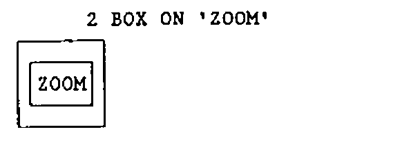
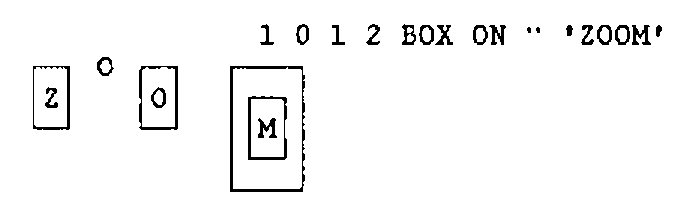
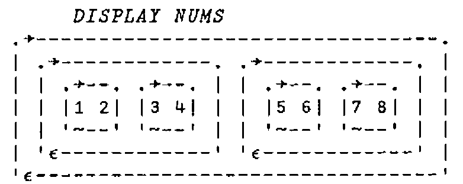
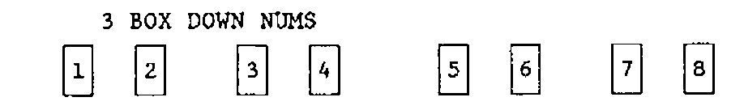
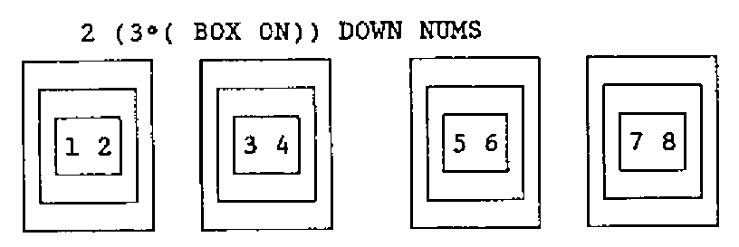
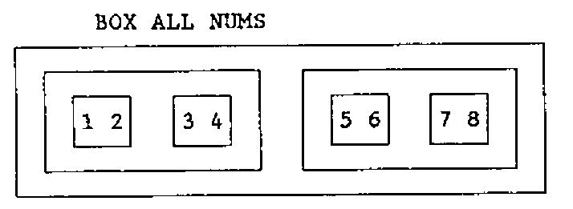
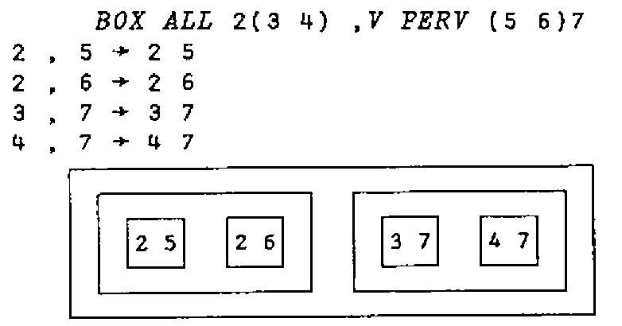

*by John Scholes - Dyadic Systems*
{ .byline }

The following text is a ‘hard copy’ of one of the sessions which took place at the British APL Association workshop on ‘User Defined Operators’. The functions and operators shown here are certainly not all original, and many are perhaps more interesting than useful. However some of them may provide food for thought.

First, an operator which is useful when writing function expressions such as `+.×` or `+.×/` as it shows you what’s going on during the evaluation.

```apl
      ∇ Z←A(FN V)B ⍝ verbosely
[1]     A (⎕OR'FN') B '→' (Z←A FN B)
      ∇
```

`⎕OR` is a function in Dyalog APL in the `⎕CR`, `⎕VR`, … mould which gives a sketch of the named function.

```apl
      2 +V 3
2  +  3  →  5
5

      +V/⍳4
3  +  4 → 7
2  +  7 → 9
1  +  9 → 10
10

      3 4 (+V).(×V) 10 20
4  ×  20 → 80
3  ×  10 → 30
30  +  80 → 110
110
```

if your APL doesn’t have `⎕OR`, you can still get a good idea of the execution of the function by replacing the first line with:

```apl
[1] A '∘' B '→' (Z←A FN B)
```

in which case you would see:

```apl
      2 +V 3
2  ∘  3 → 5
5
```

you may also like to make the `V` operator ambivalent so you can trace the execution of monadic functions.

In the examples which follow, we will use the primitive ‘compose’ operator ‘∘’. Compose can be used to glue an argument to a dyadic function to produce a new monadic function. For example:

`*∘0.5` is the monadic square root function;<br>
`1∘○` is the trig function ‘sin’.

```apl
      (*∘0.5) 9
3
```

`ON` is an operator which applies its (function) operand repeatedly to the argument.

```apl
      ∇ Z←REP(FN ON)Z
[1]     →REP↓0
[2]     Z←FN Z
[3]     REP←REP-1
[4]     →1
      ∇
```

… so the following function (verbosely) doubles its argument 4 times:

```apl
      4 ×V∘2 ON 1
1 × 2 → 2
2 × 2 → 4
4 × 2 → 8
8 × 2 → 16
16
```

… or using a function which draws a little box around its argument:





Note that `ON` with a boolean left argument gives us conditional function application, a sort of ‘if’ construct. For example, the following expression draws a box around the matrix only if it is non-null:

```apl
(0 0≠⍴MAT) BOX ON MAT
```

Likewise, the `ELSE` operator conditionally applies either its left or right function operand:

```apl
      ∇ Z←BOOL(TRUE ELSE FALSE)Z
[1]     →BOOL/T
[2]     Z←FALSE Z
[3]     →0
[4]    T:Z←TRUE Z
      ∇
```

… the following trivial example shows its use:

```apl
      1 - ELSE ÷ 4
¯4
      0 - ELSE ÷ 4
0.25
```

Now we have `ELSE`, we can use it to define `DOWN` which applies its function with `D` each’s or `D` levels down from the top of the nested array:

```apl
      ∇ Z←D(FN DOWN)Z
[1]     Z←(0=D) FN ELSE((D-1)∘(FN DOWN¨)) Z
      ∇
```

which says: If `D` is zero, apply `FN` directly (with zero each’s) to `Z`, otherwise apply it at depth `D-1` to each subarray. Note that the string

```apl
FN ELSE ((D-1)∘(FN DOWN¨))
```

… forms a single derived function in exactly the same way that `+.×` forms the derived function for inner product.

So, if `NUMS` is a Vector-of-Vectors-of-Vectors of numbers.



then ..

```apl
      1 ⌽DOWN NUMS
3 4  1 2    7 8  5 6

      2 +/DOWN NUMS
3 7  11 15
```



Now, combining `DOWN` with `ON` you can say:

Go down 2 levels and there draw 3 little boxes:



Interestingly, this gives the same result as if you said:

```apl
      3 (2∘(BOX DOWN)) ON NUMS
```

… or: 3 times in a row, go down 2 levels and there draw a box.

Just as the `ELSE` operator provides a counterpart to procedural languages’ if .. then .. else construct, the following rather opaque `OF` operator gives us an equivalent to the CASE statement.

```apl
    ∇ Z←{D}(N OF FN)Z        ⍝ Z←N OF FN1 OF FN2 OF FN3 ... Z.
[1] →(3=⎕NC'N')↓2 ⋄ N Z←(⎕EX'N')N Z ⍝ LEFT DN TREE WHILE N IS FN.
[2] →(⎕IO=N)↓3 ⋄ Z←FN Z      ⍝ APPLY FN IF N'TH FROM LEFT OF TREE.
[3] →(⎕NC'D')↓0 ⋄ Z←(N-1)Z   ⍝ PREFIX POSN FROM LEFT IF NOT TOP.
    ∇
```

so we can write …

```apl
      2 OF + OF ÷ OF - 4
0.25
```

… apply the 2nd function (÷) to the argument. Similarly:

```apl
      3 OF + OF ÷ OF - 4
¯4
```

an out of range case just returns the argument unchanged.

```apl
      88 OF + OF ÷ OF - 4
4
```

we can use `OF` to write `LEAVES` which applies its function operand to subarrays of depth `D`. It’s a sort of opposite to the `DOWN` operator.

```apl
      ∇ Z←(D LEAVES FN)Z     ⍝ APPLY FN TO LEAVES OF DEPTH D.
[1]     Z←(⎕IO+1+×D-|≡Z) OF (D LEAVES FN¨) OF FN Z
      ∇
```

This says return:

> In the case ( `D` is less than the depth of `Z` ),<br>
> … the application of `D LEAVES FN` to each subarray of `Z`.<br>
> In the case ( `D` is equal to the depth of `Z` )<br>
> … the application of `FN` to `Z`<br>
> In the default case ( `D` is greater than the depth of `Z`)<br>
> … just `Z`.

```apl
      0 LEAVES (+/) NUMS
1 2  3 4    5 6  7 8

      1 LEAVES (+/)NUMS
3 7  11 15

      2 LEAVES (+/) NUMS
4 6    12 14
```

To complement `DOWN` and `LEAVES`, we have `ALL`:

```apl
      ∇ Z←(FN ALL)Z
[1]     Z←FN (1<|≡Z) FN ALL¨ ON Z
      ∇
```

which applies its operand to all levels of the array from a simple (depth 1) array upwards.



```apl
      +/ ALL NUMS
36

      ⌽ ALL NUMS
 8 7  6 5    4 3  2 1
```

Finally, we can write an operator to do the ‘pervasion’ which we normally associate with the scalar primitive functions.

```apl
      ∇ Z←A(FN PERV)B    ⍝ Pervasively.
[1]     Z←(1=≡A B) (FN∘B) ELSE (FN PERV¨∘B) A
      ∇
```

… if `A` and `B` are both depth 0, apply `FN` between them, otherwise, apply it pervasively between each subarray …



---

*Editor’s Note: this text came as a nested vector in a Dyalog APL workspace. I believe I have dug it out correctly, but I gave up on the little boxy bits, which have been cut out from John’s original and stuck in!*
