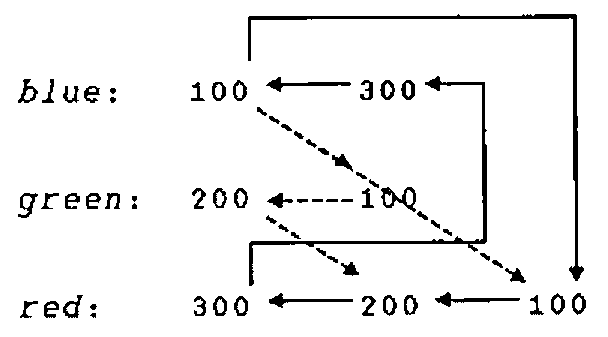

*by John Scholes*
{ .byline }

## Introduction

A *thread* is a strand of execution in the APL workspace. Prior to version 8.2, Dyalog APL supported only a single thread. Version 8.2 introduces multiple threads running in parallel.

A thread is created by calling a function *asynchronously*, using the new primitive operator ‘spawn’: `&`.

With a traditional APL *synchronous* function call, execution of the calling environment is paused, *pendent* on the return of the called function. With an *asynchronous* call, both calling environment and called function proceed to execute concurrently.

An asynchronous function call is said to start a new *thread* of execution. Each thread has a unique *thread number*, with which, for example, its presence can be monitored or its execution terminated.

Any thread can spawn any number of sub-threads, subject only to workspace availability. This implies a hierarchy in which a thread is said to be a *child thread* of its *parent thread*. The *base thread* at the root of this hierarchy has thread number 0.

With multi-threading, APL’s stack or state indicator can be viewed as a branching tree in which the path from the base to each leaf is a thread.

When a parent thread terminates, any of its children which are still running, become the children of (are ‘adopted’ by) the parent’s parent.

Thread numbers are allocated sequentially from 0 to 2147483647. At this point, the sequence ‘wraps around’ and numbers are allocated from 0 again avoiding any still in use. The sequence is re-initialised when the active workspace is cleared or a new workspace loaded. A workspace may not be saved with threads other than the base thread: 0, running.

Threads introduce new language elements:

- Primitive operator: *spawn*: `&`.
- System functions: `⎕TID`, `⎕TNUMS`, `⎕TKILL`, `⎕TSYNC`.
- An extension to the GUI Event syntax to allow asynchronous call-backs.
- Control structure: `:Hold`.
- System command: `)HOLDS`.

**Note that features marked ‘!’ were not implemented in the version used in Rome for the APL98 workshops. There have also been some minor syntax changes since these notes were issued - see the help file which accompanies the recent Dyalog beta release.**

## Thread switching

Programming with threads requires care.

The interpreter may switch between running threads at the following points:

- Between any two lines of a defined (or dynamic) function or operator.
- While waiting for a `⎕DL` to complete. !
- While waiting for a `⎕FHOLD` to complete. !
- While awaiting input from:
    - `⎕DQ`
    - `⎕SR` !
    - `⎕ED` !
    - The session prompt or `⎕:` or `⍞`.
- While awaiting the completion of an external operation:
    - A call on an external (AP) function. !
    - A call on a `⎕NA` (DLL) function. !
    - A call on an OLE function. !

At any of these points, the interpreter might execute code in other threads. If such threads change the global environment; for example by changing the value of, or expunging a name; then the changes will appear to have happened while the thread in question passes through the switch point. It is the task of the application programmer to organise and contain such behaviour!

You can prevent threads from interacting in critical sections of code by using the `:Hold` control structure.

## Name Scope

APL’s name scope rules apply whether a function call is synchronous or asynchronous. For example when a defined function is called, names in the calling environment are visible, unless explicitly shadowed in the function header.

Just as with a synchronous call, a function called asynchronously has its own local environment, but can communicate with its parent and ‘sibling’ functions via local names in the parent.

This point is important. It means that siblings can run in parallel without danger of local name clashes. For example, a GUI application can accommodate multiple concurrent instances of its call-back functions.

However, with an asynchronous call, as the calling function continues to execute, both child *and parent functions* may modify values in the calling environment. Both functions see such changes immediately they occur.

If a parent function terminates while any of its children are still running, those children will thenceforward ‘see’ local names in the environment that called the parent function. In cases where a child function relies on its parent’s environment (the setting of a local value of `⎕IO` for example), this would be undesirable, and the parent function would normally execute a `⎕TSYNC` in order to wait for its children to complete before itself exiting.

If, on the other hand, after launching an asynchronous child, the parent function calls a *new* function (either synchronously or asynchronously), names in the new function are beyond the purview of the original child. In other words, a function can only ever see its calling stack decrease in size - never increase. This is in order that the parent may call new defined functions without affecting the environment of its asynchronous children.

## Debugging

If a thread sustains an untrapped error, its execution is *suspended* in the normal way. At the same time, all other thread activity in the workspace is *paused* until the suspension is cleared or restarted. A consequence of this is that, at any one time, only a single thread can be suspended.

The session is attached to the suspended thread, so that you can:

- Examine and modify local variables.
- Trace and edit functions.
- Clear suspensions.
- Restart execution.

When the last suspension in a thread is cleared or restarted, the session is re-attached to the base thread, and any paused threads are resumed. From the session in a suspended thread, you can spawn a new thread, but its execution is immediately paused until the parent’s suspension is removed.

The error message from a thread other than the base is prefixed with its thread number:

```apl
260:DOMAIN ERROR
Div[2] rslt←num÷div
       ^
```

State indicator displays: `)SI` and `)SINL` have been extended to show threads’ tree-like calling structure.

```apl
      )SI
·   Calc[1]
&5
·   ·   DivSub[1]
·   &7
·   ·   DivSub[1]
·   &6
·   Div[2]*
&4
Sub[3]
Main[4]
```

Here, *Main* has called *Sub*, which has spawned threads `4` and `5` with functions: *Div* and *Calc*. *Div*, after spawning *DivSub* in each of threads `6` and `7`, has been suspended at line [2].

Removing stack frames using ‘Quit’ from the tracer or ‘→’ from the session affects only the current thread. When the final stack frame in a thread (other than the base thread) is removed, the thread is expunged. `)RESET` removes all but the base thread.

### GUI Considerations

To launch a call-back function asynchronously, you can append the character: `'&'` to its name in the *Event* specification:

```apl
⎕WS'Event' 'Select' 'Press&'
```

## Spawn Thread: `{R}←{X}f&Y`

`&` is a monadic operator with an ambivalent derived function. `&` spawns a new thread in which *f* is applied to its argument *Y* (monadic case) or between its arguments *X* and *Y* (dyadic case). The shy result of this application is the number of the newly created thread.

When function *f* terminates, its result (if any), the **thread result**, is returned. If the thread number is the subject of an active `⎕TSYNC`, the thread result appears as the result of `⎕TSYNC`. If no `⎕TSYNC` is in effect, the thread result is displayed in the session in the normal fashion.

Note that `&` can be used in conjunction with the **each** operator: `¨` to launch many threads in parallel.

### Examples:

```apl
      ÷&4               ⍝ Reciprocal in background
0.25
      ⎕←÷&4             ⍝ Show thread number
1
0.25
      FOO&88            ⍝ Spawn monadic function.

      2 FOO&3           ⍝       dyadic

      {NIL}&0           ⍝       niladic
      ⍎&'NIL'           ⍝         ..

      X.GOO&99          ⍝ thread in remote space.

      ⍎&'⎕dl 2'         ⍝ Execute async expression.

      'NS'⍎&'FOO'       ⍝ .. remote  ..  ..  ..

      PRT&¨↓⎕nl 9       ⍝ PRT spaces in parallel.
```

## Current Thread Number: `R←⎕TID`

*R* is a simple integer scalar: the number of the current thread.

### Examples:

```apl
      ⎕TID              ⍝ Base thread number
0
      ⍎&'⎕TID'          ⍝ Thread number of async. ⍎.
1
```

## Child Thread Numbers: `R←⎕TNUMS Y`

*Y* must be a simple array of integers representing thread numbers. *R* is a vector of the child threads of *Y*.

### Examples:

```apl
      ⎕TNUMS 0
2 3
      ⎕TNUMS 2 3
4 5 6 7 8 9
```

## Kill Threads: `{R}←{X}⎕TKILL Y`

*Y* must be a simple array of integers representing thread numbers to be terminated. *X* is a boolean single, defaulting to 1, which indicates that all descendant threads should also be terminated. The shy result: *R* is a vector of the numbers of all threads that have been terminated.

The base thread: 0 is always excluded from the cull.

### Examples:

```apl
⎕TKILL 0                ⍝ Kill background threads.

⎕TKILL ⎕TID             ⍝ Kill self and descendants.

0 ⎕TKILL ⎕TID           ⍝ Kill self only.

⎕TKILL ⎕TNUMS ⎕TID      ⍝ Kill descendants.
```

## Wait for threads to terminate: `{R}←⎕TSYNC Y`

*Y* must be a simple array of thread numbers.

If *Y* is a simple scalar, *R* is an array; the result (if any) of the thread.

If *Y* is a simple non-scalar, *R* has the same shape as *Y*, and result is an array of enclosed thread results.

The interpreter detects a potential deadlock if a number of threads wait for each other in a cyclic dependency. In this case, the thread that attempts to cause the deadlock issues error number 1008: DEADLOCK.

### Examples:

```apl
      dup←{⍵ ⍵}                 ⍝ Duplicate

      ⎕←dup&88                  ⍝ Show thread number
11
88 88

      ⎕←⎕TSYNC dup&88           ⍝ Wait for result
88 88

      ⎕TSYNC,dup&88
 88 88

      ⎕TSYNC dup&1 2 3
 1 2 3  1 2 3

      ⎕TSYNC dup&¨1 2 3
 1 1  2 2  3 3

      ⎕TSYNC ⎕TID               ⍝ Wait for self
DEADLOCK
      ⎕TSYNC ⎕TID
      ^
      ⎕EN
1008
```

## Hold: `:Hold Y`

`:Hold` provides a mechanism to control thread entry into a critical section of code. *Y* must be a simple character vector or scalar, or a vector of character vectors. *Y* represents a set of ‘tokens’, all of which must be acquired before the thread can continue into the control structure. `:Hold` is analogous to the component file system `⎕FHOLD`.

Within the whole active workspace, a token with a particular value may be held only once. If the hold succeeds, the current thread *acquires* the tokens and execution continues with the first phrase in the control structure. On exit from the structure, the tokens are released for use by other threads. If the hold fails, because one or more of the tokens is already in use:

1. If there is no `:Else` clause in the control structure, execution of the thread is blocked until the requested tokens become available.
2. Otherwise, acquisition of the tokens is abandoned and execution resumed immediately at the first phrase in the `:Else` clause.

*Y* can be either a single token:

```apl
'a'
'Red'
'#.Util'
''
'Program Files'
```

… Or a number of tokens:

```apl
'red' 'green' 'blue'
'doe' 'a' 'deer'
,¨'abc'
↓⎕nl 9
```

Pre-processing removes trailing blanks from each token before comparison, so that, for example, the following two statements are equivalent:

```apl
:Hold 'Red' 'Green'

:Hold ↓2 5⍴'Red  Green'
```

Unlike `⎕FHOLD`, a thread does not release all existing tokens before attempting to acquire new ones. This enables the nesting of holds, which can be useful when multiple threads are concurrently updating parts of a complex data structure.

In the following example, a thread updates a critical structure in a child namespace, and then updates a structure in its parent space. The holds will allow all ‘sibling’ namespaces to update concurrently, but will constrain updates to the parent structure to be executed one at a time.

```apl
:Hold ⎕cs''             ⍝ Hold child space
    ...                 ⍝ Update child space
    :Hold ##.⎕cs''      ⍝ Hold parent space
        ...             ⍝ Update Parent space
    :EndHold
    ...
:EndHold
```

However, with the nesting of holds comes the possibility of a ‘deadlock’. For example, consider the two threads:

```apl
⍝ Thread 1              ⍝ Thread 2
:Hold 'red'             :Hold 'green'
    ...                     ...
    :Hold 'green'           :Hold 'red'
        ...                     ...
    :EndHold                :EndHold
:EndHold                :EndHold
```

In this case if both threads succeed in acquiring their first hold, they will both block waiting for the other to release its token. Fortunately, the interpreter detects such cases and issues an error (1008) DEADLOCK. You can avoid deadlock by ensuring that threads always attempt to acquire tokens in the same chronological order, and that threads never attempt to acquire tokens that they already own.

Note that token acquisition for any particular `:Hold` is atomic, that is, either *all* of the tokens or *none* of them are acquired. The following example *cannot* deadlock:

```apl
⍝ Thread 1              ⍝ Thread 2
:Hold 'red'
    ...                 :Hold 'green' 'red'
    :Hold 'green'           ...
        ...             :EndHold
    :EndHold
:EndHold
```

### Examples:

`:Hold` could be used, for example, during the update of a complex data structure that might take several lines of code. In this case, an appropriate value for the token would be the name of the data structure variable itself, although this is just a programming convention: the interpreter does not associate the token value with the data variable.

```apl
:Hold'Struct'
    ...                 ⍝ Update Struct
    Struct ← ...
:EndHold
```

The next example guarantees exclusive use of the current namespace:

```apl
:Hold ⎕CS''             ⍝ Hold current space
    ...
:EndHold
```

The following example shows code that holds two positions in a vector while the contents are exchanged.

```apl
:Hold ⍕¨to fm
    :If >/vec[fm to]
        vec[fm to]←vec[to fm]
    :End
:End
```

Between obtaining the next available file tie number and using it:

```apl
:Hold '⎕FNUMS'
    tie←1+⌈/0,⎕FNUMS
    fname ⎕FSTIE tie
:End
```

The above hold is not necessary if the code is combined into a single line:

```apl
fname ⎕FSTIE tie←1+⌈/0,⎕FNUMS
```

or,

```apl
tie←fname ⎕FSTIE 0
```

Note that `:Hold`, like its component file system counterpart: `⎕FHOLD`, is a device to enable *co-operating* threads to synchronise their operation.

`:Hold` does not *prevent* threads from updating the same data structures concurrently, it prevents threads only from `:Hold`-ing the same tokens.

## Display held tokens: `)HOLDS`

System command `)HOLDS` displays a list of tokens which have been acquired or requested by the `:Hold` control structure. Each line of the display is of the form:

```text
token:  acq  req  req ...
```

Where *acq* is the number of *the* thread that has acquired the token, and *req* is the number of *a* thread which is requesting it. For a token to appear in the display, a thread (and only one thread) must have acquired it, whereas any number of threads can be requesting it.

### Example:

Thread `300`’s attempt to acquire token `'blue'` results in a deadlock:

```apl
300:DEADLOCK
Sema4[1] :Hold 'blue'
         ^

      )HOLDS
blue:   100
green:  200     100
red:    300     200     100
```

> *Blue* has been acquired by thread `100`.<br>
> *Green* has been acquired by `200` and requested by `100`.<br>
> *Red* has been acquired by `300` and requested by `200` and `100`.

The following cycle of dependencies has caused the deadlock:

```text
Thread 300 attempts to acquire blue,      300 → blue
    which is owned by 100,                 ↑       ↓
    which is waiting for red,             red  ←  100
    which is owned by 300.
```

A useful technique for debugging complex deadlocks is to take the output from `)HOLDS`; and add the hold that caused the error as if the deadlock had not been detected, in this case, *blue* requested by thread `300`:

```apl
blue:   100     300
green:  200     100
red:    300     200     100
```

Next, draw arrows:

- From each thread number in a request (second and subsequent) column, to the thread number on its left.
- From each thread number in the first (acquired) column, to each of its counterparts in any of the request columns.

The deadlock results from a cycle in this ‘graph’.


