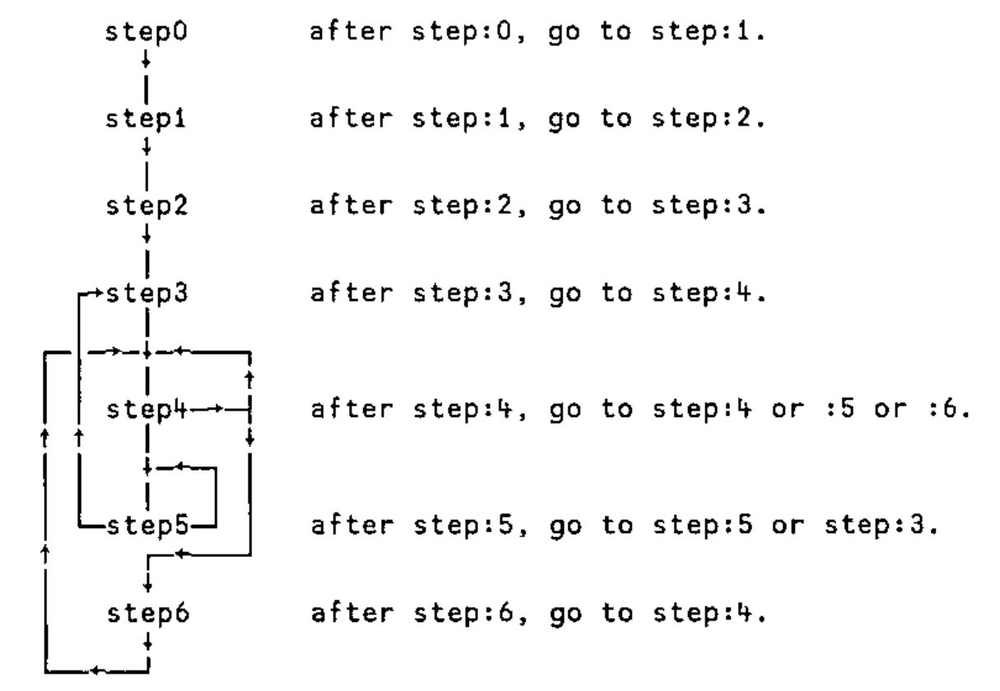

*an extended example of dfns from John Scholes*
{ .byline }

```apl
bmat ← #.assign costs          ⍝ Hungarian method cost assignment.
```

`assign` is a classical algorithm implemented in the d:style. H.W.Kuhn published a pencil and paper version in 1955, which was followed by J.R.Munkres’ executable version in 1957. The algorithm is sometimes referred to as the "Hungarian method".

```apl
assign←{⎕ML←0                             ⍝ Hungarian method cost assignment.

    step0←{step1(⌽⌈\⌽⍴⍵)↑⍵}               ⍝ 0: at least as many rows as cols.

    step1←{step2↑(↓⍵)-⌊/⍵}                ⍝ 1: reduce rows by minimum value.

    step2←{                               ⍝ 2: mark independent zeros.
      stars←{                             ⍝ independent zeros.
        ~1∊⍵:⍺                            ⍝ no more zeros: done.
        next←<\<⍀⍵                        ⍝ more independent zeros.
        mask←(rows next)∨cols next        ⍝ mask of dependent rows & cols.
        (⍺∨next)∇ ⍵∧~mask                 ⍝ ⍺-accumulated star matrix.
      }                                   ⍝
      zeros←{⍵+0 stars ⍵}⍵=0              ⍝ 1=>zero, 2=>independent zero.
      step3 ⍵ zeros                       ⍝ next step: 3.
    }

    step3←{costs zeros←⍵                  ⍝ 3: cover cols with starred zeros.
      stars←zeros=2                       ⍝ starred zeros.
      covers←2×cols stars                 ⍝ covered cols.
      ~0∊covers:stars                     ⍝ all cols covered: solution.
      step4 costs zeros covers            ⍝ next step: 4.
    }

    step4←{costs zeros covers←⍵           ⍝ 4: adjust covering lines.
      mask←covers=0                       ⍝ mask of uncovered elements.
      open←1=mask×zeros                   ⍝ uncovered zeros.
      ~1∊open:(⌊/(,mask)/,costs)step6 ⍵   ⍝ no uncovered zeros, next step :6.
      prime←first open                    ⍝ choose first uncovered zero.
      prow←rows prime                     ⍝ row containing prime.
      star←2=zeros×prow                   ⍝ star in row containing prime.
      ~1∊star:prime step5{                ⍝ no star in row, next step :5,
        costs ⍵ prime                     ⍝ adjusted zeros matrix,
      }zeros+2×prime                      ⍝ new primed zero (3).
      cnext←covers+prow-2×cols star       ⍝ adjusted covers.
      znext←zeros⌈3×prime                 ⍝ primed zero.
      ∇ costs znext cnext                 ⍝ adjusted zeros and covers
    }

    step5←{costs zeros prime←⍵            ⍝ 5: exchange starred zeros.
      star←(cols prime)∧zeros=2           ⍝ next star.
      ~1∊star:step3 ⍺{                    ⍝ no stars: next step :3.
        {costs ⍵}{⍵-2×⍵=3}⍵-⍺∧⍵>1         ⍝ unstarred stars; starred primes.
      }zeros                              ⍝ adjusted zero markers.
      pnext←(rows star)∧zeros=3           ⍝ next prime.
      (⍺∨pnext∨star)∇ costs zeros pnext   ⍝ ⍺-accumulated prime-star- path.
    }

    step6←{costs zeros covers←⍵           ⍝ 6: adjust cost matrix.
      cnext←costs+⍺ׯ1 1+.×0 3∘.=covers   ⍝ add and subtract minimum value.
      znext←zeros+(×costs)-×cnext         ⍝ amended zeros marker.
      step4 cnext znext covers            ⍝ next step: 4.
    }

    rows←{(⍴⍵)⍴(⊃⌽⍴⍵)/∨/⍵}                 ⍝ row propagation.
    cols←{(⍴⍵)⍴∨⌿⍵}                       ⍝ column propagation.
    first←{(⍴⍵)⍴<\,⍵}                     ⍝ first 1 in bool matrix.

    (⍴⍵)↑step0 ⍵                          ⍝ start with step 0.
}
```

> *The dfns workspace, which contains assign, is available as a free download from www.dyalog.com/download/dsamples.zip (you need Dyalog V9.0 or better to load it)*

The method indicates an optimal assignment of a set of resources to a set of requirements, given a "cost" of each potential match. Examples might be the allocation of workers to tasks; the supply of goods by factories to warehouses; or the matching of brides with grooms. The function takes a cost matrix as argument and returns a boolean assignment matrix result.

The following table shows an optimal assignment of factories F, G, H to warehouses W, X, Y, given that the cost of transportation from F to W is 72 units, F to X is 99 units, …, G to W is 23 units, … and so on.

```text
    W    X    Y
F [72]  99   88      Minimum-cost assignment marked [.]:
G  23   30  [35]     Factory F supplies warehouse W,
H  51  [59]  84         ..   G    ..       ..     Y,
                        ..   H    ..       ..     X.
```

Notice that if the problem requires maximizing a benefit, rather than minimizing a cost, then a negative cost matrix is used. See below for an example.

## Technical Notes:

Munkres’ algorithm may be described in words as follows:

**Step 0:** Ensure the costs matrix has at least as many rows as columns, by appending extra 0-item rows if necessary. Go to Step 1.

**Step 1:** Subtract the smallest item in each row from the row. Go to Step 2.

**Step 2:** Select a set of "independent" zeros in the matrix and mark them with a star (\*). To do this, star leading zeros in each row and column, ignoring rows and columns already containing stars; repeat this process until apart from ignored rows and columns, no more zeros remain. Go to Step 3.

**Step 3:** Draw a line through (cover) each column containing a starred zero. If all columns are covered, the starred zeros represent an optimal assignment. In this case, return a boolean matrix with the positions of the stars, as result. Other- wise, go to Step 4.

**Step 4:** Find an uncovered zero. If there is none, go to Step 6 passing the smallest uncovered value as a parameter. Otherwise, mark the zero with a prime (′) and call it P0. If there is a starred zero (S1) in the row containing P0, cover this row and uncover the column containing S1, then repeat Step 4. Otherwise, (if there is no starred zero in P0’s row) go to Step 5.

**Step 5:** Find a path through alternating primes and stars. Starting with the uncovered prime (P0) found in Step 4, find a star S1 (if any) in its column. Then find a prime P2 (there must be one) in S1’s row, followed by a star S3 (if any) in P2’s column, … and so on until a prime (Pn) is found that has no star in its column. In the series P0, S1, P2, S3, … Pn, unstar each starred zero Si and star each primed zero Pj. Finally, unprime all primed zeros in the matrix, un- cover all rows and columns. Go to Step 3.

**Step 6:** Add the minimum cost value passed from Step 4 to each twice-covered (row and column covered) item, and subtract it from each uncovered item. Preserving all stars, primes and covering lines, go to Step 4.

The approach uses a rather convoluted "stepping algorithm", which can be repres- entered as a flowchart:



The algorithm is implemented by coding each step as a separate sub-function, and tail-calling from one step to the next. This is the closest we come to branching in d:fns!

Notice that nearly all of the primitive and defined functions in `assign` deal in matrices - a testimonial to APL’s native array-handling.

The state is represented by 3 matrices at each step:

> **costs:** the current cost matrix.
>
> **zeros:** marked zeros: 0-not a zero, 1-unmarked zero, 2-starred, 3-primed.
>
> **covers:** 0-uncovered item, 1-item covered by horizontal (row covering) line, 2-item covered by vertical (column covering) line, 3-item covered by both horizontal and vertical lines.

In addition, step 5 takes a boolean matrix left argument, indicating the position of the first primed zero.

Using the example cost matrix from above, the following trace shows the state of play between each step –[n]–.

![The trace: the cost matrix through steps [1] to [6] and back, with starred (*) and primed (') zeros and covering lines, ending in the assignment matrix 1 0 0 / 0 0 1 / 0 1 0](art10007790/trace.jpg)

## References:

H.W.Kuhn, *The Hungarian method for the assignment problem*, Naval Research Logistics Quarterly, 2 (1955), pp. 83-97.

J.R.Munkres, *Algorithms for the assignment and transportation problems*, J. SIAM 5 (1957) 32-38.

## Examples:

```apl
      costs                             ⍝ example cost matrix.
72 99 88
23 30 35
51 59 84

      assign costs                      ⍝ minimum cost assignment.
1 0 0
0 0 1
0 1 0

      assign -costs                     ⍝ maximum benefit assignment.
0 1 0
1 0 0
0 0 1

      {+/+/⍵×assign ⍵} costs            ⍝ total minimum cost.
166

      {+/+/-⍵×assign ⍵} -costs          ⍝ total maximum benefit.
206

      costs←?6 10⍴50                    ⍝ new 6×10 cost matrix.

      costs
 7 38 23 27 11  3 34 34 47 20
26 42  2  3 27 34  1 20  4 21
35 30 47 43 27  5 33 21 36 46
39 14  3 37 17 32 38 50 19 13
50 37 38 33  4 32 45 14 22 39
24 12 14 18  9 25 45 46  4 46

      assign costs                      ⍝ minimum cost assignment.
1 0 0 0 0 0 0 0 0 0
0 0 0 0 0 0 1 0 0 0
0 0 0 0 0 1 0 0 0 0
0 0 1 0 0 0 0 0 0 0
0 0 0 0 1 0 0 0 0 0
0 0 0 0 0 0 0 0 1 0

      {⍵×assign ⍵} costs                ⍝ cost per assignment.
7 0 0 0 0 0 0 0 0 0
0 0 0 0 0 0 1 0 0 0
0 0 0 0 0 5 0 0 0 0
0 0 3 0 0 0 0 0 0 0
0 0 0 0 4 0 0 0 0 0
0 0 0 0 0 0 0 0 4 0

      {+/+/⍵×assign ⍵} costs            ⍝ total minimum cost.
24

      assign -costs                     ⍝ maximum benefit assignment
0 0 0 0 0 0 0 0 1 0
0 1 0 0 0 0 0 0 0 0
0 0 1 0 0 0 0 0 0 0
0 0 0 0 0 0 0 1 0 0
1 0 0 0 0 0 0 0 0 0
0 0 0 0 0 0 0 0 0 1

      {-⍵×assign ⍵} -costs              ⍝ cost per assignment.
 0  0  0 0 0 0 0  0 47  0
 0 42  0 0 0 0 0  0  0  0
 0  0 47 0 0 0 0  0  0  0
 0  0  0 0 0 0 0 50  0  0
50  0  0 0 0 0 0  0  0  0
 0  0  0 0 0 0 0  0  0 46

      {+/+/-⍵×assign ⍵} -costs          ⍝ total maximum benefit.
282

      costs←?10 6⍴50                    ⍝ new 10×6 cost matrix

      costs
14  1 21  2 36 47
12 10 16 45 33  8
35 20 20 25  8 30
43 30 48 28  8 50
21  8 29 13 25 24
49  7 10 16 32  7
33 32 41 13 24 20
11  2 46 22  8 48
21  7 45  5  9  4
19 13  7 40 23 18

      assign costs                      ⍝ minimum cost assignment.
0 1 0 0 0 0
1 0 0 0 0 0
0 0 0 0 1 0
0 0 0 0 0 0
0 0 0 0 0 0
0 0 0 0 0 1
0 0 0 1 0 0
0 0 0 0 0 0
0 0 0 0 0 0
0 0 1 0 0 0
```
