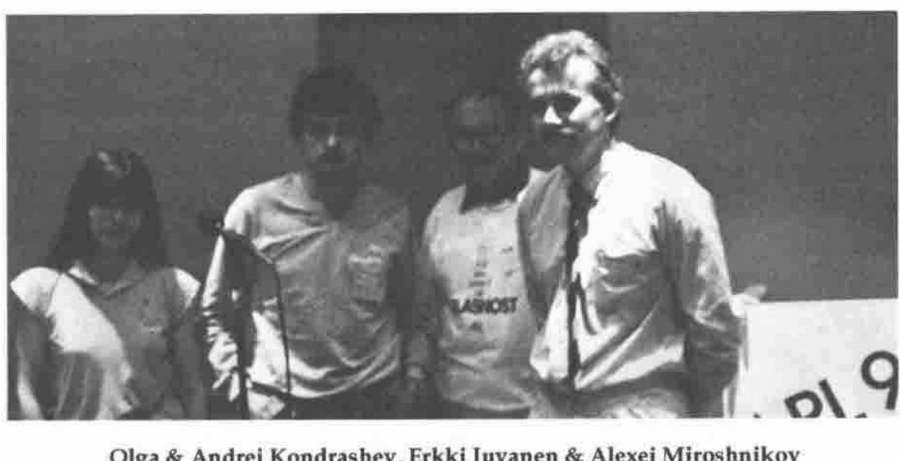

*by John Searle*
{ .byline }

I learnt APL from a Russian man, Michael Szudrich, whose family had emigrated to Australia after World War II. Thus it was no surprise to me that APL was used in Russia and other Soviet Republics, and was finding some acceptance. Russians have been using an expressive, descriptive language and a complex alphabet for a very long time.

*Olga & Andrei Kondrashev, Erkki Juvanen & Alexei Miroshnikov*
{ .caption }

During the APL90 conference it was a pleasure to talk with Alexei Miroshnikov of Leningrad, and Andrew & Olga Kondrashev of Moscow. Andrew sees APL as "a unique opportunity to eliminate language barriers between computers and users". They were intrigued as to why they were receiving so much attention from other conference delegates. Perhaps "flavour of the month" has no translation into Russian? They were very polite to their hosts and Finnish minders, and very diplomatic in their avoidance of political discussion.

APL is in use from the Neva to Novosibirsk, and from Tbilisi to Kazakhstan. the first Soviet APL conference in 1986 had 20 delegates, but annual meetings have since been held with ever-growing numbers. Andrew estimates that there are now between 300 and 400 users in 20 cities.

A sense of humour is very much a part of the Russian culture. "My English is not as good as it seems," Alexey began, using very good English. He told a funny/sad story about "lefthander", a brilliant scientist who could hammer golden nails into the boots worn by the Tsar’s pet mechanical flea, but who died a poor and lonely man. His Moscow jokes are recorded elsewhere (he is, of course, from Leningrad).

Some political discussion was unavoidable, and both speakers were asked if perestroika had changed their work. Alexei said that perestroika had actually made it a little more difficult for his work at the institute, because less money was now available for centrally-funded planning and modelling activity. Andrew initially dismissed the question, and suggested that "you should ask Mr Gorbachev". Then, after some careful consideration, he delighted the audience with his belief that "all political problems cannot be solved by merely using computers".

## Historical Perspective

Eastern European presence at APL conferences is not new. The APL75 conference had delegates from Czechoslovakia, Hungary and Latvia. (Thanks to Henri Brudzewsky for having such a good APL library.) APL first appeared in the Soviet Union around 1977, although most of the early interpreters were not fully implemented. In 1979, the Gilman & Rose book "APL an Interactive Approach" was translated into Russian. It is still in print and is believed to have sold over 37,000 copies.

Ken Iverson and Bob Bernecky, both then at I.P. Sharp, visited Moscow after APL84 in Helsinki, and an IPSA node has been available there since that time. The recent APL interpreters are based on early APL standards work by Falkoff and Orth. The most recent standards work does not appear to have flowed through. Apparently, the channel of communication through ISO to the USSR is open, but as yet there is no data in the channel. The APL/85 interpreter, documented in Andrew’s paper, is the most powerful. It splits the available memory into 2 areas, one for functions and one for data, and the interpreter always runs in data mode. Sounds a bit like DOS?

One of my fondest memories is of the bus trip to Leningrad after APL84. We were an array of about 40 APLers and families from 15 countries, nested together for 4 days, and each of us was amazed by Leningrad’s disclosures. It is a city that combines architecture and geography from Paris, Venice, Florence and Prague. It was midsummer and it was warm. I have a picture of the sun shining brightly on the town digital clock as it "struck" 2300 hours. If an APL conference is to be held in Leningrad in must be held in June. The sun is always over the yardarm, so don’t expect to get much sleep.
