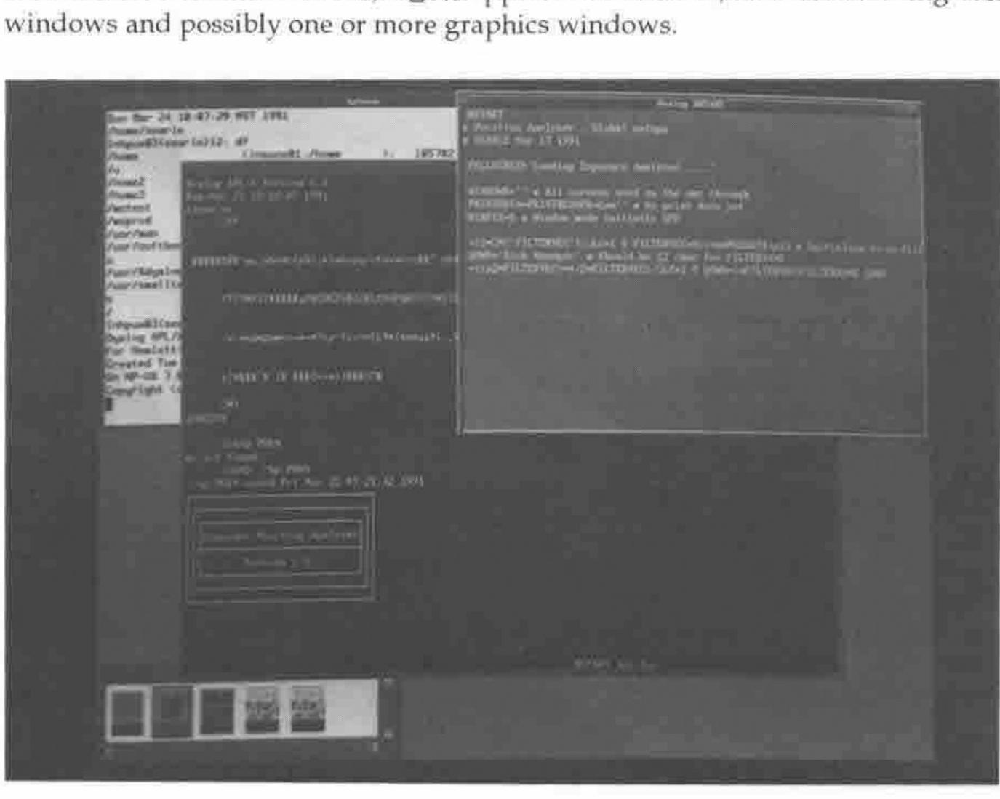
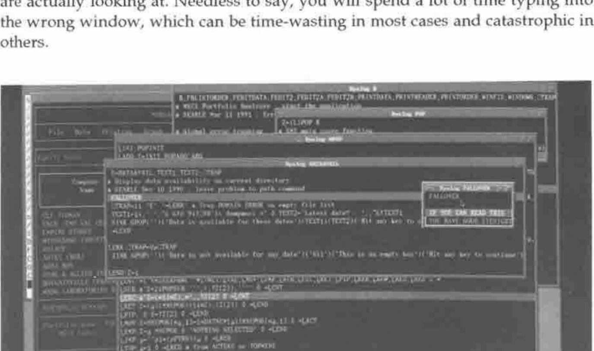
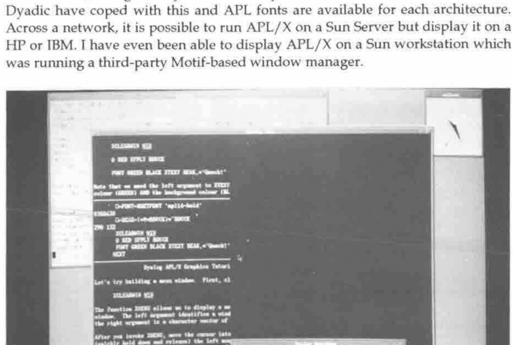
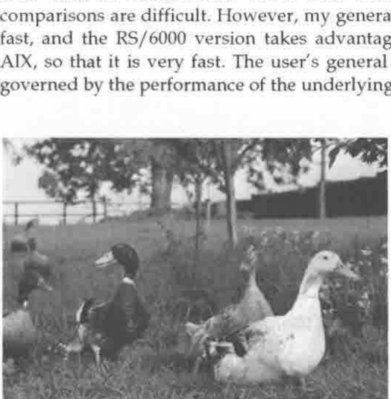

*reviewed by John Searle*
{ .byline }

## Introduction

Dyalog APL/X is the version of Dyadic Systems Limited’s APL interpreter which runs under the Unix X-Windows display manager. It has been available since late 1990 and runs on the IBM RS/6000 under AIX, the Sun Sparc range under SunOS, and the HP 9000 range under HP-UX. It is compatible with Version 6.0 which has been available for much longer on other platforms. I should emphasise that although this review is based on my usage of the product at work, it represents my own opinions and not necessarily those of my employer. Reviewing at work was necessary as the concept of the take-home, lap-top Unix workstation is not yet with us (although several manufacturers are reportedly working on it!)

The major success of APL/X has been the achievement of binary compatibility across multiple machines. The same workspace file may be loaded across a networked file system on a Sun, HP or IBM workstation. Obviously, the APL interpreter is compiled by Dyadic to a different executable on each machine, but the user’s application is completely transportable. For portability between remote machines, 3.5 inch disk transfer is possible between Sun and IBM. The DWSOUT /DWSIN workspaces are provided to move from DOS to Unix or vice versa.

## The Product

APL/X is a set of disks (or a tape in the case of HP), two manuals (in the same style as the DOS manuals) and an "X-Windows Interface booklet". Installation is easy, but a Peter or Pauline is probably at hand to assist. The set of distributed workspaces and files is quite extensive, including all of the usual workspaces plus some new ones specific to X-Windows.

In order to use Dyalog APL/X, you need one of the above-mentioned machines, and the entry cost is not small. The minimum reasonable requirement would be to use a stand-alone Sun IPC workstation which would cost around £6,000. The minimum entry price in the HP or IBM range is around £12,000, but the price /performance relatives are changing regularly. Dyadic are re-sellers of the RS/6000 range so no doubt they can give you a more exact quotation. Having paid that much for a workstation, Dyadic therefore assume you can afford the price of £1,500 for a full release of APL/X.

## Look and Feel

A typical Dyalog APL/X developer’s session involves a terminal window, an immediate execution window, a `⎕SM` application window, several cascading edit windows and possibly one or more graphics windows.

**Figure 1** shows how the various windows can be arranged. The geometry of the windows is configurable, and the application window can be given an appropriate name. As a user, it is possible to set up APL/X so that only the relevant application windows are ever visible. In the same way, multiple edit windows cascade from the top-right corner. Each window is initially the same size, but the mouse can be used to move and resize them. Code can be copied, moved, cut and pasted as needed.

The Sun, HP and IBM keyboards are all different, and this presents a problem when jumping between machines. The key mappings are all different, and a memory-partitioning system is required for the human brain in order to cope. However, at least Dyadic have adopted the policy of matching an operation to the word that appears on the keytop wherever possible. Thus the CUT operation is now found on the "Delete Line" or "Cut" keys, and not on the "Page Down" key as so many of its DOS users have come to know and love. You need to remember that Escape from the Editor is a positive action which saves your changes. Like most things Dyadic, however, if you don’t like it the way it is distributed, you can change the mapping yourself.

Keeping track of the workstation mouse is a somewhat difficult process which requires the user to become an expert Rat Catcher. The mouse must be in the window that you are currently "working" within, but invariably isn’t. APL/X is quite intuitive at deliberately placing the on-screen pointer within the correct window. What is really needed is a helmet that points a beam at the window you are actually looking at. Needless to say, you will spend a lot of time typing into the wrong window, which can be time-wasting in most cases and catastrophic in others.

**Figure 2** show how the "Trace" feature of APL/X causes a cascade of windows to appear. Each window is sized according to the function code, which can create a rather confusing display (although it needs to be distinctly different to the "Edit" window display in colour and behaviour). I find that I use this feature very infrequently, since an Escape from a function which localises `⎕SM` will cause the window to disappear.

## Capabilities

APL/X has no inbuilt workspace size limitation, and is only constrained by the amount of memory (and swap space allocation) on the workstation. It is quite a powerful feeling to get a WS FULL in a 30 megabyte workspace.

An application under X-Windows typically has many sub-windows, and so I suggested that `⎕SM` should be able to address multiple screens. Dyadic’s answer to this has been to associate an APL process with each window, and to make it possible to fire up multiple APL’s as one "application". This is an elegant solution which is more in keeping with the Unix style.

Each of the machines uses a different X-window management system. Sun is the most radically different system called OpenWindows. Both IBM and HP have adopted the Motif style, which is not as artistic as OpenWindows but much more business-like, and generally faster. Each system has a different set of fonts, but Dyadic have coped with this and APL fonts are available for each architecture. Across a network, it is possible to run APL/X on a Sun Server but display it on a HP or IBM. I have even been able to display APL/X on a Sun workstation which was running a third-party Motif-based window manager.

APL/X comes with XGRAPHS and XTUTOR workspaces which take advantage of the X-Windows Graphics facilities. **Figure 3** demonstrates that the infamous Dyadic Duck has even found its way into this modern world. Graphics appear in separate windows, and multiple windows can be driven from the one APL function. Reproducing graphical output is reasonably simple using Unix primitives "xwd" and "xpr".

APL/X uses an auxiliary processor (AP) interface to programs written in C. It is possible to associate a piece of C code with an APL function, pass parameters to it and get results back from it. The "aplarray" structure is an integral part of the interpreter which can be used within an AP, allowing C programs to return nested arrays. I have seen AP’s for calling APL/X from an external C program, for inter-process and inter-machine communication, and for talking to the Oracle database. I am using an AP which shares variables (including nested arrays) between APL/X and Sharp APL on an IBM 3090. This is a powerful feature which allows the product, with some imagination, to do almost anything that can be done on the workstation.

## Weaknesses

I feel that this product has few weaknesses. Most of the things that I don’t like about it are configurable, so I can change them by modifying a file. There are a few irritating behaviours that are "hard-coded", such as the way the cursor only partly tabs into a character field in a `⎕SM` window. I have been involved as a beta-tester, so I’ve seen a lot of warts but equally a lot of rapid improvements.

My main bugbear has been an "Insufficient Swap Space" message whenever I try to fire up more than about 3 APL workspaces with associated C processes, or when APL/X is competing with other memory-hungry Unix programs. However, this is a parameter that can be configured by the Unix System Administrator.

Dyadic have chosen not to emulate the `⎕WIN` screen handling system of STSC, and so it is a significant task to try and convert an APL\*PLUS application if it has a lot of screen code.

The Dyadic approach to editing is a "point and shoot" approach, but sometimes I shoot myself in the foot. The natural thing to do is type a function name, press the edit button, edit the function, exit the editor, and hit return (or otherwise move the cursor). However, if this is a niladic function, it will be executed, whereas functions which take arguments will not. You can end up executing many functions unintentionally.

## Potential

It will be essential to combine the features of APL with the resources supplied by the window manager software, if APL is to survive as a choice in the brave new world of computing. In other words, APL should be able to address "Widgets and Gadgets" as workspace objects to be manipulated. Dyadic have demonstrated some experimental software which does this.

I have found myself putting most of the "data" in an application into functions rather than tabular variables, so that I can edit the data with the ")ED" function editor. I am looking forward to Version 6.1 in which the editor has been extended to simple data arrays, so that data can stay as data.

## Benchmarks

Benchmarking APL/X is quite difficult because Unix does not reliably report subsecond cpu usage back to the interpreter, and hence `⎕AI` cannot report usage finer than 10 milliseconds. Since most benchmarking is now finely tuned, comparisons are difficult. However, my general impression of APL/X is that it is fast, and the RS/6000 version takes advantage of the optimizing compiler for AIX, so that it is very fast. The user’s general impression of speed is, however, governed by the performance of the underlying X-window manager.

*The Dyalog APL Design Group at Work*
{ .caption }

## Conclusion

APL/X feels like such a natural X-Windows product, and the immediate reaction might be "What is All the Fuss About?" Since Dyadic have always used Unix internally, it is not surprising that their Unix APL fits so smoothly. This is a connoisseur’s APL which makes the language truly competitive with other more "modern" application development choices.
