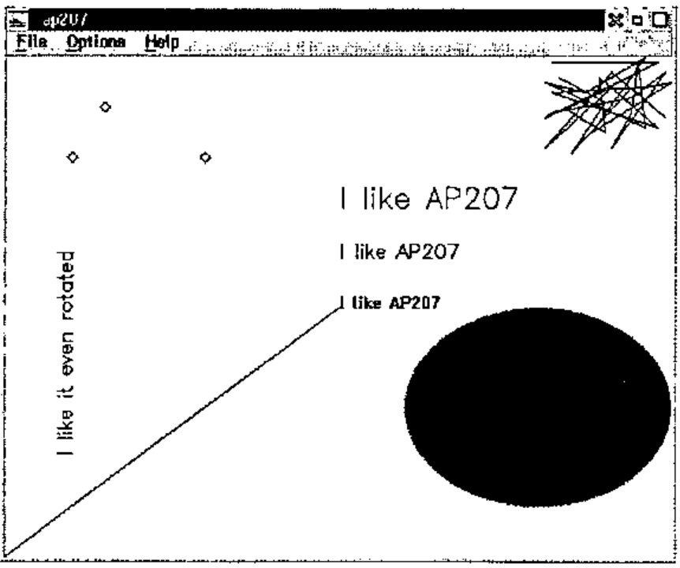
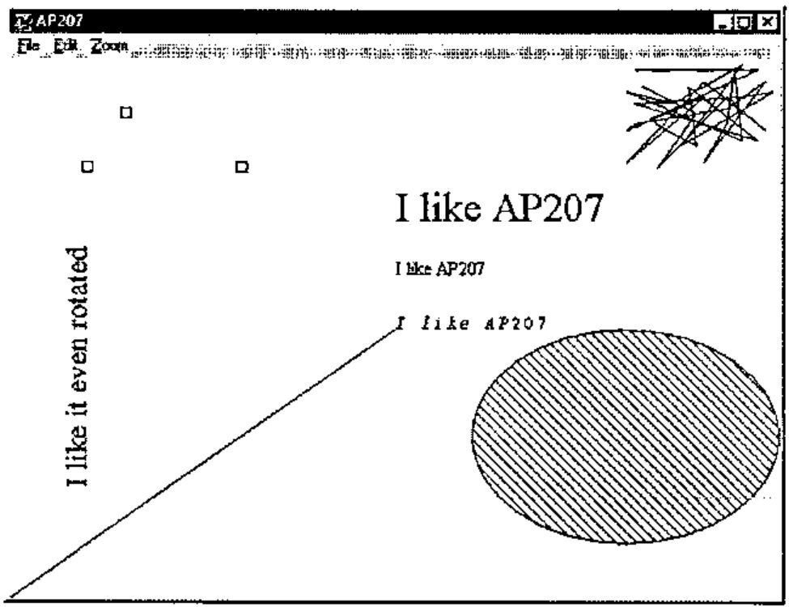
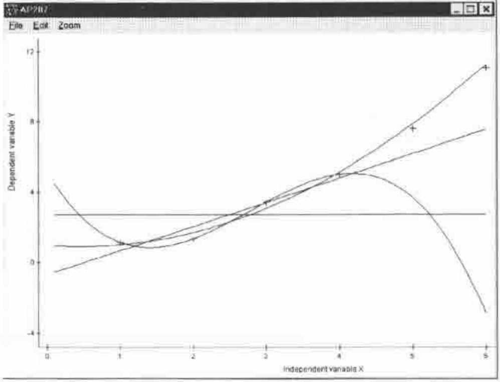
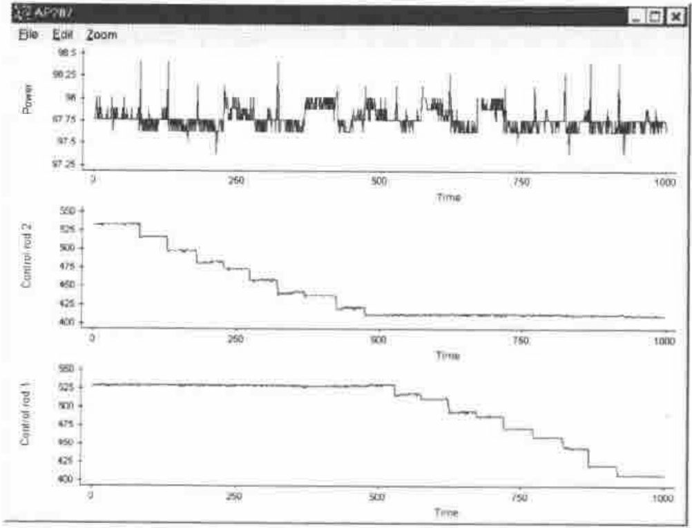
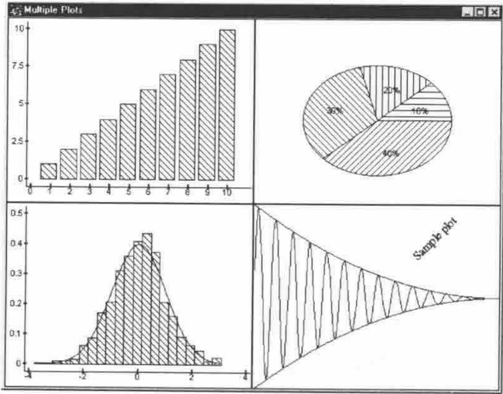
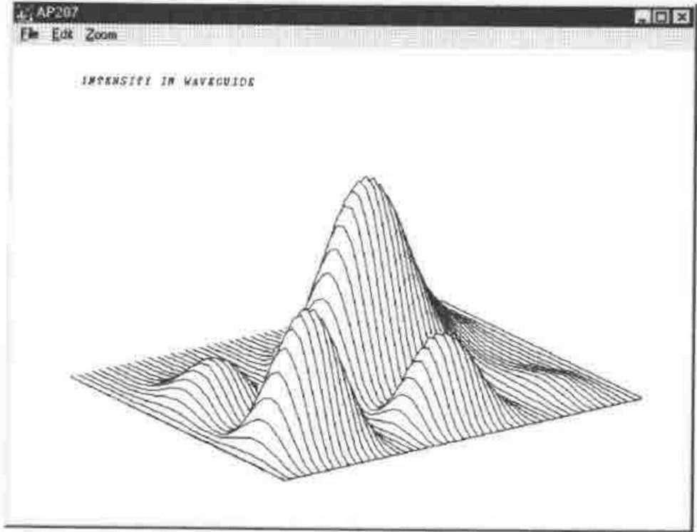
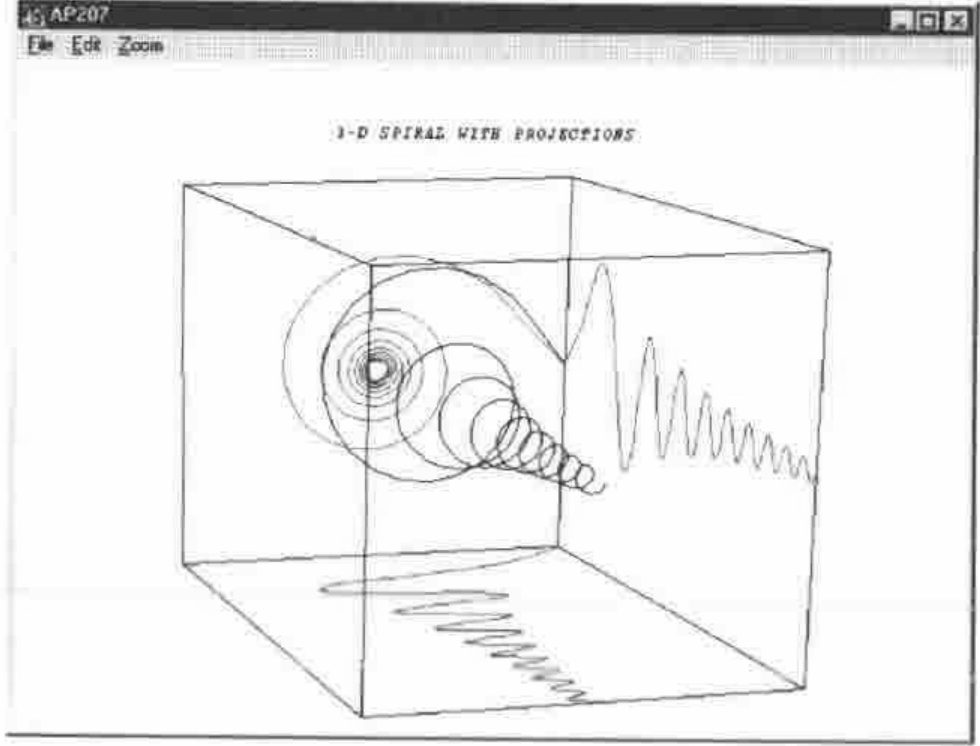
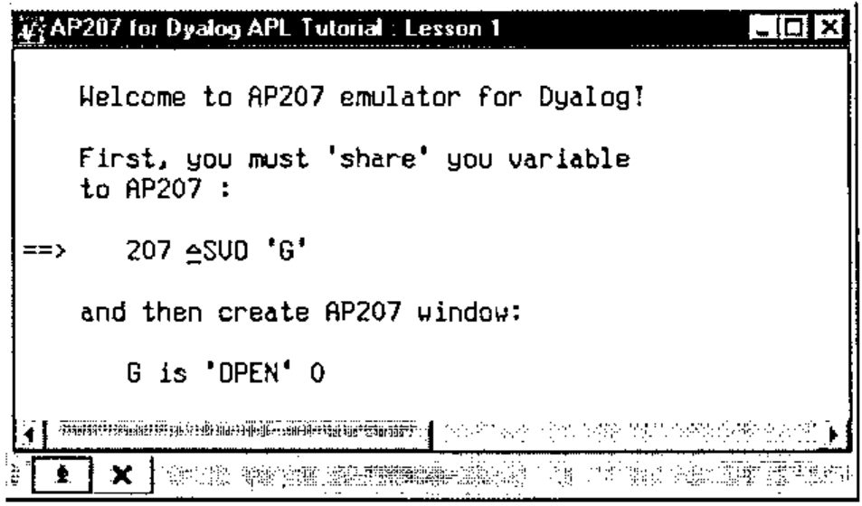

*by Alexander Skomorokhov and Alexander Kornilovsky*
{ .byline }

## Background

What did we miss most of all on starting to use Dyalog APL after years of APL2? Not AP124 of course.

The clear Dyalog approach to GUI based on the object-property-event triangle helps one to forget AP124 easily. The real loss was Universal Graphic Auxiliary Processor AP207. Its easy and powerful syntax seems to us more convenient for creating scientific or business charts than thinking of a line as an object. If you need something in APL you look around or do the thing you need yourself. That is why we implemented an AP207 emulator for Dyalog APL. The goals of development were:

> Easy migration of APL2 graphic applications to the Windows environment;
>
> Giving APL2 programmers the ability to use AP207 syntax in Dyalog APL;
>
> Developing a powerful and easy-to-use set of raw graphic functions for using with Dyalog APL.

## Begin from the End

Let us have a look at the whole thing to start with. Table 1 shows two APL sessions which illustrate working with graphic auxiliary processor AP207, well known to APL2 users on any platform. The left side of the table represents APL2 for OS/2 session. You may get almost the same results running AP207 in the beta version of APL2 for Windows, but it is not fully implemented yet. The right hand side is a Dyalog APL session. We run Dyalog 8.0 under Windows NT (of course you will get exactly the same running it under Windows 95, or running Dyalog APL 7.2 for Windows 3.xx).

The sessions start AP207, open the graphic window, draw simple graphic objects like lines, markers and ellipses, define different fonts and write texts. The sessions look just the same except for the strange pairs “`⎕SVO`,`∆SVO`” and “`←`,`is`”. The results are shown in Figures 1–2 as copies of graphic windows made in OS/2 and Windows respectively. You may distinguish them by window control buttons in the left upper corner and menu bars. How does it look in raw GUI? Here is part of the session up to drawing the ellipse:

```apl
'G' ⎕WC 'Form' 'AP207'  ('Posn' 0 0)('Size' 480 640)('Coord' 'Pixel')
      ('Bcol' (255 255 255))
'G' ⎕WS ('Coord' 'User')('Xrange' 0 100)('Yrange' 100 0)
'G.P' ⎕WC 'Poly' ('Points' ((0 50)(0 50)))
'G.A'⎕WC'Ellipse'('Points' 10 60)('Size' 40 40)('Start' 0)
      ('End' 360)('Fstyle' 3)
```

In general the difference from AP207 syntax is not significant. Why does AP207 seem better in our opinion?

> It gets rid of many object names. Doing scientific or business charts we usually do not want to give a name to each line or sector.
>
> AP207 syntax looks more compact and more natural for plotting charts. And, minor detail, but X should be the first, when we specify point coordinates (remember your college).

**IBM APL2**

```apl
  207 ⎕SVO 'G'
1
  ⎕SVO 'G'
2
  G←'OPEN' 0
  G←'WINDOW' (0 0 639 479 0 0 100
100)
  G←'DRAW' (50 50)
  G←'PATTERN' 3
  G←'BEGAREA' ''
  G←'ARC' (80 30 20 20 0 360)
  G←'ENDAREA' ''
  G←'MOVE' (50 50)
  G←'WRITE' 'I like AP207'
  G←'FONTDEF'('ROMAN'
'ROMSIM.AVF')
  G←'FONT' ('ROMAN' 2)
  G←'MOVE' (50 60)
  G←'WRITE' 'I like AP207'
  G←'FONT' ('ROMAN' 3)
  G←'MOVE' (50 70)
  G←'WRITE' 'I like AP207'
  G←'FONT' ('ROMAN' 2 90)
  G←'MOVE' (10 20)
  G←'WRITE' 'I like it even
rotated'
  G←'MARKER' 3
  G←'MARKER'(3 2⍴10 80 30 80 15
90)
  X←80 80+[2]?30 2⍴20
  G←'DRAW' X
```

**Dyalog APL**

```apl
  207 ∆SVO 'G'
1
  ∆SVO 'G'
2
  G is 'OPEN' 0
  G is 'WINDOW' (0 0 300 350 0 0
100 100)
  G is 'DRAW' (50 50)
  G is 'PATTERN' 3
  G is 'BEGAREA' ''
  G is 'ARC' (80 30 20 20 0 360)
  G is 'ENDAREA' ''
  G is 'MOVE' (50 50)
  G is 'WRITE' 'I like AP207'
  G is 'FONTDEF' ('FR' 'TIMES
NEW ROMAN')
  G is 'FONT' ('FR' 16)
  G is 'MOVE' (50 60)
  G is 'WRITE' 'I like AP207'
  G is 'FONT' ('FR' 36)
  G is 'MOVE' (50 70)
  G is 'WRITE' 'I like AP207'
  G is 'FONT' ('FR' 26 90)
  G is 'MOVE' (10 20)
  G is 'WRITE' 'I like it even
rotated'
  G is 'MARKER' 3
  G is 'MARKER' (3 2⍴10 80 30 80
15 90)
  X←((⍴X)⍴80 80)+X←?30 2⍴20
  G is 'DRAW' X
```

Table 1. Two sample APL sessions
{ .caption }



Figure 1. APL2 for OS/2 graphic window
{ .caption }



Figure 2. Dyalog APL graphic window
{ .caption }

## How it Works

The AP207 emulator is implemented as a single namespace and two interface functions. Each AP207 command is implemented as a separate Dyalog APL function (sometimes with subfunctions) placed in namespace AP207. Utility function `∆SVO` creates the “shared” variable to pass AP207 calls to namespace functions and utility function “`is`” translates AP207 calls to call the appropriate Dyalog APL function and provides a given argument for it. More details follow.

### Giving you the AP207 feeling

To start “real” AP207 you use system function `⎕SVO` (Shared Variable Offer). The purpose is to establish an interface (shared) variable to communicate to an external program (AP207.COM for APL2/PC, for instance). We follow this approach to give a feeling of working in “real” AP207, keep the syntax and simplify migration. But in our case utility function `∆SVO` establishes an interface variable to communicate to functions stored in the AP207 namespace. The function is as follows:

```apl
[0]   Z←{L}∆SVO SHV;⎕ML
[1]  ⍝ Replacement for ⎕SVO in AP207 emulator
[2]   ⎕ML←3
[3]   Z←1  ⍝ Initial degree of coupling
[4]   ⍎((0=⎕NC'L')∧2=⎕NC SHV)/'Z←2 ⋄ →0' ⍝ Final degree of coupling
[5]   →(0=⎕NC'L')/0 ⍝ Exit if was check of degree of coupling
[6]   ⎕CS'AP207'     ⍝ Change to AP207 namespace
[7]   NAME←SHV       ⍝ Remember name of "shared" variable
[8]   ∆PNAME←↑'.'⎕WG'PrintList' ⍝ Default printer
[9]   ⎕CS'#'         ⍝ Change to root namespace
[10]  Z←⍎SHV,'←0'    ⍝ Create "shared" variable
```

It just assigns the “shared” variable name to global variable *NAME* in namespace *AP207*, gets the name of the default printer, and assigns an appropriate return code to the shared variable.

To follow AP207 syntax and to communicate to functions in namespace AP207 we had to replace normal APL assignment by utility function “`is`”. This function checks if the AP207 call is valid, calls the appropriate function from namespace *AP207* with given argument and assigns a return code to the shared variable:

```apl
[0]   l is r;t;res;k;⎕ML
[1]  ⍝ Replacement for assign (left arrow) in AP207 emulator
[2]   ⎕ML←3
[3]   ⍎(2|⍴r)/'t←33 ⋄ →EXIT' ⍝ AP207 length error
[4]   ⍎(~∨/2 3∊≡r)/'res←32 ⋄ →EXIT' ⍝ AP207 domain error
[5]   ⎕CS'#.',t←'AP207'      ⍝ Change to AP207 namespace
[6]   l←NAME ⋄ res←''        ⍝ Get name of "shared" variable
[7]  LOOP:k←2↑r              ⍝ Get command name and arguments
[8]   ⍎∊(~∊∨/∆LIST∊k[1])/'res←31 ⋄ →EXIT' ⍝ AP207 invalid command
[9]  ⍝ Call APL function named as command (k[1]) with args k[2]
[10]  res,←⍎∊'t ',k[1],' ⊃k[2]' ⍝ and get AP207 return code
[11]  →(0≠⍴r←2↓r)/LOOP       ⍝ Continue if multiple-call sequence
[12] EXIT:⎕CS'#'             ⍝ Change to root namespace
[13]  ⍎l,'←res'              ⍝ Return result to "shared" variable
```

The core is line [10], where the AP207 function is executed.

### Do real work

The real work of drawing is done by functions stored in namespace *AP207*. Each command function checks if the argument is valid and produces the needed graphic result using raw GUI. If the argument is invalid the function returns a numeric error code the same way as AP207 does. Here we show as examples a couple of command functions from namespace *AP207*. Some of them are trivial, as function *MOVE* below, which changes or reports the current cursor position:

```apl
[0]   Z←MOVE R
[1]   ⍝ AP207 'MOVE' command to ask or set cursor position
[2]   ⍝ R - empty vector (ask), or 2 items numeric vector (set)
[3]   →(~∆FLAG)/0×Z←51 ⍝ Device was not opened
[4]   →(0=⍴R)/REPORT   ⍝ Report current cursor position
[5]   →(1≠⍴⍴R)/0×Z←34  ⍝ Shared variable rank error
[6]   →(1≠≡R)/0×Z←32   ⍝ Shared variable domain error
[7]   →(2≠⍴R)/0×Z←33   ⍝ Shared variable length error
[8]   ∆CURR←R          ⍝ Set new cursor position
[9]   REPORT:Z←0,⊂∆CURR ⍝ Return code
```

Global variable `∆CURR` is used for cursor position reference. Another function *QWRITE* is a query of text size and position, useful before actually writing on the screen. This function uses the Dyalog APL system function `⎕WS` to get the GUI object properties.

```apl
[0]   Z←QWRITE R
[1]  ⍝ AP207 'WRITE' command - query position and size of string
[2]  ⍝ returns x,y coordinates of the lower-left, upper-left and
[3]  ⍝ lower-right corners of the string R
[4]   →(~∆FLAG)/0×Z←51 ⍝ Device was not opened
[5]   →(1<≡R)/0×Z←32   ⍝ Shared variable domain error
[6]   →(1<⍴⍴R)/0×Z←34  ⍝ Shared variable rank error
[7]  ⍝ Set coordinates for parent object
[8]   ∆DESTINATION ⎕WS'COORD' 'PIXEL'
[9]  ⍝ Get text size in pixels
[10]  L←∆DESTINATION ⎕WG⊂'TEXTSIZE'(R)∆FNAME
[11] ⍝ Restore coordinates for parent object
[12]  ∆DESTINATION ⎕WS'COORD' 'PROP'
[13] ⍝ Calculate result
[14]  Z←0,⊂∊(∆CURR),(∆CURR+1(1⊃L)×÷∆Y),∆CURR+(÷∆X ∆Y)×⌽L
```

Global variable `∆DESTINATION` keeps the name of the parent object for graphics. Other functions may be larger. For instance functions *DRAW* and *MARKER* have about 60 lines, but in general it is quite simple stuff.

## Sample PLOT Functions

Let us illustrate using AP207 syntax in programming chart functions in Dyalog APL. We created a set of basic charts. Here we show the function *PLOT* to illustrate *X*,*Y* dependencies. *Lines*, which draws axes, is omitted to simplify illustration.

```apl
[0]   {L}PLOT XY;X;Y;C
[1]  ⍝ Simple function for various XY plots (axis stuff is omitted)
[2]   ⍎(1=≡XY)/'X←,⊂⍳⍴XY ⋄ Y←,⊂XY'          ⍝ Y Vs ⍳⍴Y
[3]   ⍎(2=≡XY)/'X←(¯1+⍴XY)⍴⊂↑XY ⋄ Y←1↓XY' ⍝ (Y1 Vs X) and (Y2 Vs X) and...
[4]   ⍎(3=≡X ⍎(3=≡XY)/'X←↑¨XY ⋄ Y←2⊃¨XY'  ⍝ (Y1 Vs X1) and (Y2 Vs X2) and...
[5]   ⍎(0=⎕NC'L')/'L←(⍴Y)⍴1'        ⍝ Default are lines
[6]   →(2=⎕NC'∆AP207')/SKIP   ⍝ Skip if already shared
[7]   ∆AP207←207 ∆SVO'∆AP207' ⍝ Start AP207
[8]   ∆AP207 is'OPEN' 0       ⍝ Open graphic window
[9]  SKIP:∆AP207 is'CLEAR' 0  ⍝ Clear previous draw
[10] ⍝ Define window and viewport
[11]  ∆AP207 is'WINDOW'(0 0 100 100,(⌊/¨∊¨X Y),⌈/¨∊¨X Y)
[12]  C←'BLACK' 'BLACK' 'BLUE' 'RED' 'GREEN' 'BROWN'
[13] LOOP:∆AP207 is'COLOR'(↑C←1⌽C) ⍝ Color for first XY pair
[14]  ⍎(1=↑L)/' ∆AP207 is''DRAW''(⍉⊃↑¨X Y)'   ⍝ Line if L=1
[15]  ⍎(0=↑L)/' ∆AP207 is''MARKER''(⍉⊃↑¨X Y)' ⍝ Markers if L=0
[16]  (L X Y)←1↓¨L X Y               ⍝ Drop first XY pair
[17]  →(0<⍴Y)/LOOP
```

The function looks quite simple (and it is!). But it supports powerful argument types. It may be used to draw one or more dependent variables *vs* the same independent variable, or a set of pairs of dependent variables *vs* its independent variable. Each pair may be drawn as points or lines. We used this argument convention for years and found that it serves everyday needs very well.

The details of possible arguments in call `L PLOT R` are presented in the table below:

| | | | | |
|---|---|---|---|---|
| L=1 | Draw lines | | | |
| L=0 | Draw markers | | | |
| L – logical vector | Item L[I] defines line (L[I]=1) or marker (L[I]=0) style to draw Y[I] | | | |
| | L1 | L1 | L1 L2…LN | L1 L2…LN |
| R | X | X Y | X Y1 Y2…YN | (X1 Y1)(X2 Y2)…(XN YN) |
| ≡R | 1 | 2 | 2 | 3 |

Below we illustrate using the function *PLOT* for regression models analysis.

### Regression models

Let us create sample variables in accordance with the model *y* = *a*₀ + *a*₁*x* + *a*₂*x*²:

```apl
X←⍳6
Y←1 ¯.2 .3+.×⍉X∘.*0 1 2
```

And add noise (Normal distribution with mean 0 and variance 1) to the dependent variable.

```apl
Y1←Y+(⍴Y) RAND 'N' 0 1
```

The goal is to estimate (using the Least Squares Method) coefficients of models:

> *y* = *a*₀<br>
> *y* = *a*₀ + *a*₁*x*<br>
> *y* = *a*₀ + *a*₁*x* + *a*₂*x*²<br>
> *y* = *a*₀ + *a*₁*x* + *a*₂*x*² + *a*₃*x*³

and draw sets of real and predicted data. Estimation was made using points 1–4 (learning subset) to keep points 5,6 (testing subset) for models verification.

Here is the Least Square Estimation for all models at once:

```apl
A←(⊂4↑Y1)⌹¨(⊂4↑X)∘.*¨¯1+⍳¨⍳4
```

We calculate predicted values for 60 points to smooth polynomial drawing.

```apl
Yp←A+.ר⍉¨(⊂.1×⍳60)∘.*¨¯1+⍳¨⍳4
```

Now assign axis labels:

```apl
XLABEL←'Independent variable X'
YLABEL←'Dependent variable Y'
```

And call the function to draw the original 6 points of data as markers and 4 regression model predictions (with 60 points) as lines:

```apl
0 1 1 1 1 PLOT (⊂X Y1),(⊂⊂.1×⍳60),¨⊂¨Yp
```

The resulting plot is shown in Figure 3.



Figure 3. Regression models
{ .caption }

### Time series

In addition to the function *PLOT* we wrote function *PLOTN* to present *N* dependent variables *vs* the same independent variable; each is a separate window and viewport. This function is especially useful for joint analysis of time series. We illustrate using this function with data of power and control rod positions in a nuclear reactor during special measurements:

```apl
XLABEL←'Time'
YLABEL←'Control rod 1' 'Control rod 2' 'Power'
PLOTN TIME AP1 AP2 W
```

The result is shown in Figure 4.



Figure 4. Time series plot
{ .caption }

## Another Look at the Stuff

Functions `∆SVO` and “`is`” AP207 calls via “shared” variables are good if you want to migrate APL2 graphic functions directly. But if you write applications in Dyalog APL you probably do not want to play “auxiliary processor” and “shared variable” games. Look at namespace *AP207* as a source of useful and universal graphic utilities. Call them directly as *AP207.FUNCTION*, but keep AP207 conventions for arguments. Just bring the clear and powerful syntax to drawing charts in Dyalog APL.

Here is an illustration. Let us start from a piece of “normal” GUI to create a main form and 4 containers (Static objects) for charts:

```apl
'G' ⎕WC 'Form' 'Multiple Plots'(0 0)(80 80)
'G.P1' ⎕WC 'Static'(0 0)(50 50)
'G.P2' ⎕WC 'Static'(0 50)(50 50)
'G.P3' ⎕WC 'Static'(50 0)(50 50)
'G.P4' ⎕WC 'Static'(50 50)(50 50)
```

Now back to namespace *AP207*. The first part is a simple chart:

```apl
AP207.USE'G.P1'
CHART ⍳10
```

Function *USE* is the AP207 command to select an output device and *CHART* is a sample function, written in AP207 as function *PLOT* above. An example pie chart follows:

```apl
AP207.USE'G.P2'
PIE 10 20 30 40
```

Select the third static object and draw a histogram of random digits with Normal distribution and Gaussian curve:

```apl
AP207.USE'G.P3'
X←1000 RAND 'N' 0 1
21 HIST X
```

Now let us show a piece of raw AP207:

```apl
AP207.USE 'G.P4'
AP207.WINDOW (0 0 100 100 0 ¯1 300 1)
X←⍳300
Y←(⌽(÷90000)×X*2)×1○.3×X
```

We defined a viewport suitable for a sine-curve modulated by a parabola function. Then draw this data:

```apl
AP207.DRAW (X,[1.5]Y)
AP207.DRAW (X,[1.5]⌽(÷90000)×X*2)
AP207.DRAW (X,[1.5]¯1×⌽(÷90000)×X*2)
```

Now define the font and write text with angle 45°:

```apl
AP207.FONTDEF ('FAR' ' Times New Roman')
AP207.FONT('FAR' 18 45)
AP207.COLOR 'BLACK'
AP207.MOVE (200 .5)
AP207.WRITE 'Sample plot'
```

The final result is shown in Figure 5.



Figure 5. Sample multiple plots
{ .caption }

## Easy Migration

How to migrate AP207 code from APL2 to Dyalog APL with the AP207 emulator? You should:

1. Find in any function string “`207 ⎕SVO`” and replace it by string “`207 ∆SVO`”
2. Extract name of variable in string “`207 ⎕SVO SHV`”
3. Find in all functions all strings “`SHV←`” and replace them by “`SHV is `”

Function *MIGRATE* does that for you.

### Function *MIGRATE*

```apl
      ∇MIGRATE[⎕]∇
[0]   MIGRATE;F;C;R;D;SHV
[1]  ⍝ Migrate APL2 AP207 code to Dyalog APL
[2]  ⍝ Find function with AP207 offer
[3]   F←(1∊¨(⊂'207 ⎕SVO')⍷¨⎕CR¨R)/R←((⊂[2]⎕NL 3)~¨' ')~⊂'MIGRATE'
[4]   →(0=⍴∊F)/0 ⍝ There is no share with AP207
[5]  ⍝ Replace {207 ⎕SVO 'SHV'} by {207 ∆SVO 'SHV'}
[6]   C←('207 ⎕SVO')⍷F←⎕VR↑F
[7]   C←C⍳1
[8]   SHV←1⊃(~''''=D)⊂D←(C+8)↓F ⍝ Get name of shared variable
[9]   F[C+4]←'∆'
[10] ⍝ Replace {⎕SVO 'SHV'} by {∆SVO 'SHV'} if exists
[11]  C←('⎕SVO ''',SHV,'''')⍷F
[12]  ⍎(1∊C)/'F[C⍳1]←''∆'''
[13]  ⎕FX F
[14] ⍝ Find assignments to shared variable
[15]  F←(1∊¨(⊂SHV,'←')⍷¨⎕CR¨R)/R
[16] L1:R←⎕VR↑F ⍝ Replace {SHV←} by {SHV is}
[17]  (((-⍴SHV)⌽(SHV,'←')⍷R)/R)←⊂' is '
[18]  ⎕FX∊R
[19]  →(0<⍴F←1↓F)/L1
```

Bring in the content of a migrated APL2 workspace using the Dyalog APL utility workspace APL2IN. Then copy and run *MIGRATE*. Then copy the namespace *AP207* and that works.

### GRAPHPAK

What is GRAPHPAK? It is a well known powerful graphics package. It is 156 functions and 66 variables. It is 153 pages of manual. It is a good example to test how migration works. Figures 6 and 7 are two examples taken from GRAPHPAK DEMO. Many people first saw these figures in mainframe times. Now you may see them in Dyalog APL for Windows.



Figure 6. GRAPHPAK DEMO Waveguide
{ .caption }



Figure 7. GRAPHPAK DEMO Spiral
{ .caption }

## AP207 Tutorial

For those who never used AP207 before we wrote a tutorial workspace. The organization idea is taken from the GUI Tutorial workspace in Dyalog APL. You may read an explanation, execute sample code by pressing a button and see the graphics in a separate window. The starting window of the tutorial is shown in Figure 8.



Figure 8. AP207 Tutorial window
{ .caption }

## Conclusion

We didn’t measure the performance in any way, but we feel ourselves quite comfortable using the AP207 emulator. No slowness in comparison to “real” AP207 under APL2 for DOS or OS/2 is felt.

Every Dyalog APL user knows the RAIN product of Causeway Graphical Systems. To say in one word it is fine. Why use the AP207 emulator? There are two reasons. First, it gives you lower level tools and thus the freedom to create any special plot output you like. Second is the direct action of AP207 commands. We mean that RAIN functions create PostScript code. It’s very good for high quality printing output. But not so good for on-line charts, for instance.

In some ways the AP207 emulator is “a better than real prototype”. We mean the use of Windows facilities. It was easy to implement zooming, copy the content of the graphic window to clipboard, save it as bitmap file, select a printer and print. Pay attention to the menu bar of windows shown in the figures.

## References

1. Rex Swain, *Migration From APL2 to APL/W*, Vector, Vol. 12 No.4 p.64.
2. *AP207 – The Universal Graphics Auxiliary Processor*, in “APL2 for OS/2: User’s Guide”, Version 1.0, IBM Publication SH21-1091-00, 1994.
