*by Alexander Skomorokhov and Alexei Zalivine*
{ .byline }

## Introduction

Many APL people know about OpenGL from the delightful presentation made by Chris Burke at the APL97 conference in Toronto. At least the authors focussed on OpenGL after this event. There are many good things about the Open Graphics Library:

- It is open, cross-platform and free
- It is the *de facto* standard
- Many manufacturere are adding hardware support of OpenGL
- It is a powerful and flexible way to produce complex 3D graphics

You may refer to Vector publications [1-2] and the book [3] for more details on OpenGL in general. Many impressive applications of OpenGL are mentioned there, including Hollywood movies. The authors are far away from an interest in the animation of dinosaurs. Our interest in graphics is limited to scientific and financial data visualization, as a part of complex data analysis. Why did we touch such a monster as OpenGL? It was a kind of bet. One friend of Alexander Skomorokhov, a Dyalog APL user, told him after the conference in Toronto that he was going to learn J. Why? Because of OpenGL support in J. The answer was "it must be easy to do in Dyalog APL" and it was the start of a "project".

We won the bet. But looking back we think it is better to allow people to learn J.

What is bad about OpenGL from the APL programmer’s point of view?

- You should deal with many (about 150) OpenGL calls stored as functions in Dynamic Link Libraries
- You should pass proper APL arrays as OpenGL function arguments, described as C language data types
- You should provide a low-level connection between OpenGL and your Windows application written in APL

After Dyadic Systems put our DEMOGL workspace on their web site we received many responses from APL users. That shows the interest in powerful graphics tools in the APL world and makes some sense of our work with OpenGL. The main purpose of this paper is to show how to use OpenGL from Dyalog APL and to simplify this for APL programmers.

## Getting Started or Stones to Build a House

OpenGL includes two Dynamic Links Libraries: *opengl32.dll* and *glu32.dll*. The direct access to the OpenGL functions from APL uses the system function name association. We implemented an interface to OpenGL DLL functions by writing a cover function for each of them. The following general conventions were used:

The name of the APL cover function exactly matches the name of the OpenGL function it calls

- The name of the associated OpenGL function is a composition of its original name plus the suffix *_DLL*
- Name association is conditional and is performed only when the cover function is called for the first time

These conventions make the OpenGL part of the APL code very similar to the C code used in most books and papers on OpenGL. Well, it is relative pleasure to see C code. But you can just copy it from a book to the APL session and that is helpful.

Some of the OpenGL functions require a pointer to data as an argument. In this case the corresponding APL parameter is given as an enclosed array of rank 0. Many arguments of OpenGL functions are passed as predefined constants with fixed names. Using these constants makes the look of the APL cover functions even closer to the C syntax. We prepared a whole bunch of such constants to be used from APL.

All OpenGL functions and constants are stored in the namespace *gl*.

## Raw GL-programming for APLers

Preparing cover functions and name association of OpenGL commands and all constants is a large piece of work. But all this stuff can not be used directly. OpenGL is a so-called "rendering" system. This means that a programmer should provide "a place" for drawing, and a connection between OpenGL and this place. After you "explain" to OpenGL where to put graphics output, you may start the painting itself. This explanation depends on the platform (if you use a Silicon Graphics workstation or Windows on a PC) and on the language you use. These connections were made so as to provide portability, but they add headache if you want work just under Windows, for instance. In this section we will try to hide the difficulties and to allow as easy a use of the OpenGL calls as possible.

Let us start from the OpenGL minimum:

```apl
      )OPS
OpenGL
      )FNS
Cylinder      GL_Close      GL_Configure  GL_Expose  GL2GUI  Sphere
      )VARS
      )OBS
gl
```

All building blocks, such as APL cover functions to associate OpenGL functions stored in the DLLs and all the predefined OpenGL constants, are stored in namespace *gl*. The main thing in the root is the user-defined operator *OpenGL*:

```apl
      ∇OpenGL[⎕]∇
[0]   obj(GL_Paint OpenGL)par;wgl;conf
[1]   wgl←GL2GUI obj
[2]   obj ⎕WS'Event' 'Close' 'GL_Close'wgl
[3]   obj ⎕WS'Event' 'Configure' 'GL_Configure'
[4]   obj ⎕WS'Event' 'Expose' 'GL_Expose'(1⊃wgl)
[5]   GL_Paint par
[6]   conf←∊2↑¨obj ⎕WG'Posn' 'Size'
[7]   ⎕NQ(obj'Configure'),conf
[8]   (1⊃wgl)GL_Expose 0
```

The purpose of this operator is to provide communication between an APL GUI object, given as a left argument *obj*, and OpenGL functions. The operand *GL_Paint* is an APL function, which contains the "pure" OpenGL code you would like to execute to produce an image on a given APL GUI object. Such a communication needs an identification of the GUI object, such as a window handle and descriptor. These low-level calls to the Windows and OpenGL DLLs are hidden in the function *GL2GUI*:

```apl
      ∇GL2GUI[⎕]∇
[0]   z←GL2GUI obj;handle;DC;hrc;PFD;IPX
[1]   handle←obj ⎕WG'Handle'
[2]   ⎕CS'gl'
[3]   'wglCreateContext_DLL'⎕NA'U4 OpenGL32.DLL.C32|wglCreateContext U4'
[4]   PFD←40 1 37 3,24,(13⍴0),32 0 0 0 0 0 0
[5]   DC←GetDC handle
[6]   IPX←ChoosePixelFormat DC PFD
[7]   SetPixelFormat DC IPX PFD
[8]   hrc←wglCreateContext DC
[9]   wglMakeCurrent DC hrc
[10]  z←handle DC hrc
[11]  ⎕CS'#'
```

It is necessary to define OpenGL behaviour on three main (from the OpenGL view) events: *Expose, Configure* and *Close*. Callbacks to these events are assigned in lines [2-4] of the operator *OpenGL* and are listed below.

```apl
      ∇GL_Close[⎕]∇
[0]   arg GL_Close msg;handle;hrc;DC
[1]   handle hrc DC←arg
[2]   ⎕CS'gl'
[3]   wglMakeCurrent 0 0
[4]   wglDeleteContext hrc
[5]   ReleaseDC handle DC
[6]   ⎕CS'#'

      ∇GL_Configure[⎕]∇
[0]   GL_Configure msg
[1]   ⎕CS'gl'
[2]   glMatrixMode GL_PROJECTION
[3]   glLoadIdentity
[4]   glViewport 0 0,msg[5 4]
[5]   ⎕CS'#'

      ∇GL_Expose[⎕]∇
[0]   DC GL_Expose msg
[1]   ⎕CS'gl'
[2]   glClearColor 1 1 1 1
[3]   glClear GL_COLOR_BUFFER_BIT+GL_DEPTH_BUFFER_BIT
[4]   glMatrixMode GL_MODELVIEW
[5]   glLoadIdentity
[6]   glCallList 1
[7]   SwapBuffers DC
[8]   ⎕CS'#'
```

Callback *GL_Close*, for instance, cleans up and releases the resources used to provide OpenGL-to-GUI object connection on window close. If you do not process this event you waste Windows memory.

The main operator *OpenGL*, the three callbacks listed above and the function *GL2GUI* do not depend on:

- the APL GUI object you would like to paint on and
- the OpenGL commands you would like to execute

All together they encapsulate the system requirements of using OpenGL from APL and allow "pure" OpenGL programming in an APL session.

We are ready to start. Let us create a container form to do some OpenGL painting:

```apl
'F'⎕WC'Form' 'Try OpenGL'('Size' 230 280)('Coord' 'Pixel')
```

Now we have a form, not very impressive, but clean enough to paint on:

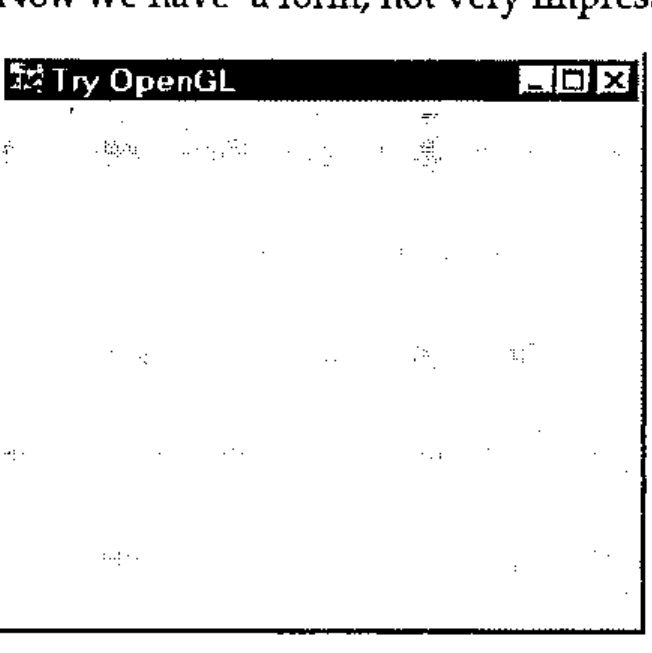

We have an executable system (operator *OpenGL*), we have a place to draw on (Form *F*), but we have not yet decided what to draw. It may be a sphere. An APL (or OpenGL?) function to create the image of a sphere is shown below:

```apl
[0]   Sphere par;sphere
[1]   ⎕CS'#.gl'
[2]   glNewList 1 GL_COMPILE
[3]   glColor3f 0.8 0 0
[4]   glRotatef 45 1 1 1
[5]   sphere←gluNewQuadric
[6]   gluQuadricDrawStyle sphere GLU_LINE
[7]   gluSphere sphere,par
[8]   gluDeleteQuadric sphere
[9]   glEndList
[10]  ⎕CS'#'
```

In line [1] we change space to *gl* to access the OpenGL functions (and return in line [10] after the job is done). Lines [2] and [9] are service lines and should be used in all other functions. They open and close a list of OpenGL commands to be executed to create an image. Lines [3-8] are the main content to draw a sphere. Remember that OpenGL is a procedural, rather than a descriptive graphics language. We describe what should be drawn and how an image should look step by step. Lines [3-4], for instance, describe RGB colour (Red, Green, Blue intensity, ranged from 0 to 1) and rotation around a vector (1,1,1) with angle of rotation equal to 45°. Other parameters of the image are taken from the right argument of the function. It is a numeric vector of: radius of the sphere, slices (number of lines of longitude on the sphere) and stacks (number of lines of latitude on the sphere).

Well, enough on OpenGL. Let us draw on Form ‘F’ a Sphere using OpenGL calls with parameters 0.7, 20 and 20. This English is directly translated to APL as:

```apl
'F' Sphere OpenGL 0.7 20 20
```

And our form view is now changed to:

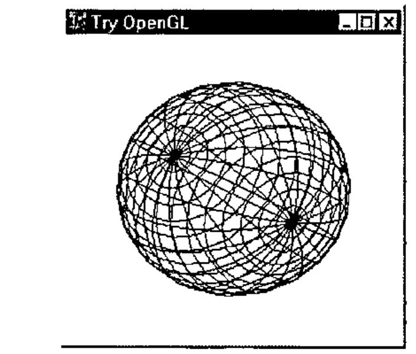

If you would like to draw a "cylinder" you should prepare in the Dyalog APL function-editor an OpenGL script like:

```apl
[0]   Cylinder par;obj
[1]   ⎕CS'#.gl'
[2]   glNewList 1 GL_COMPILE
[3]   glColor3f 0 0 1
[4]   glRotatef 45 1 1 1
[5]   obj←gluNewQuadric
[6]   gluQuadricDrawStyle obj GLU_LINE
[7]   gluCylinder obj,par
[8]   gluDeleteQuadric obj
[9]   glEndList
[10]  ⎕CS'#'
```

And ask APL to draw it on Form ‘F’ as:

```apl
'F' Cylinder OpenGL 0.7 .5 .7 20 20
```

The right argument above defines base radius, top radius, height, slices and stacks. You will get the image:

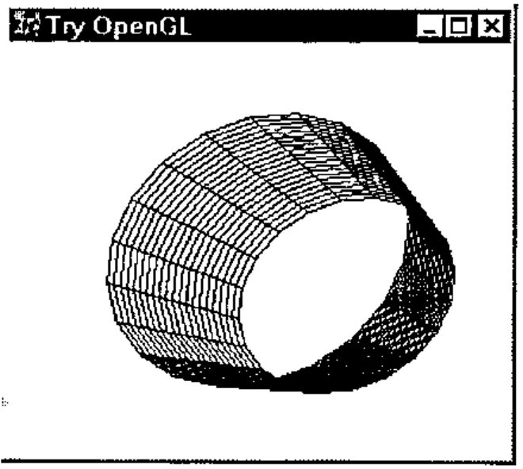

You may even create in APL several GUI objects, like forms or subforms of the same form, and draw OpenGL on each object separately, as illustrated below:

```apl
'F'⎕WC'Form' 'Try OpenGL'('Size' 35 60)
'F.S1'⎕WC'SubForm' ''('Posn' 0 0)('Size' 100 33)
'F.S2'⎕WC'SubForm' ''('Posn' 0 34)('Size' 100 33)
'F.S3'⎕WC'SubForm' ''('Posn' 0 68)('Size' 100 32)
'F'⎕WS'Coord' 'Pixel'
'F.S1' Cylinder OpenGL 0.5 0.5 0.7 3 3
'F.S2' Cylinder OpenGL 0.7 0.3 0.7 33 3
'F.S3' Cylinder OpenGL 0.3 0.3 0.9 33 3
```

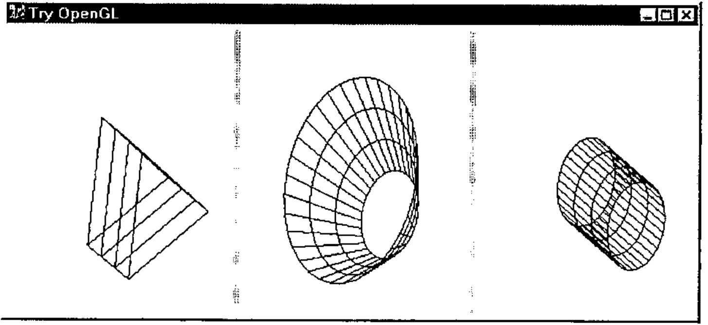

This way allows you to create a multi-window graphical application. It also helps you to see and compare the influence on an image, of different OpenGL settings and parameter values. We will tell more on this in the next section.

## Learn GL-basics With the Help of APL

To assist APL programmers to learn OpenGL comfortably we have implemented a GUI application called *GL Tutor*. On startup you get the two forms:

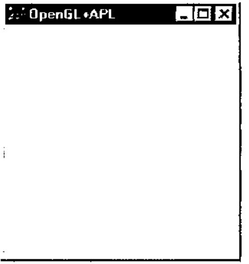

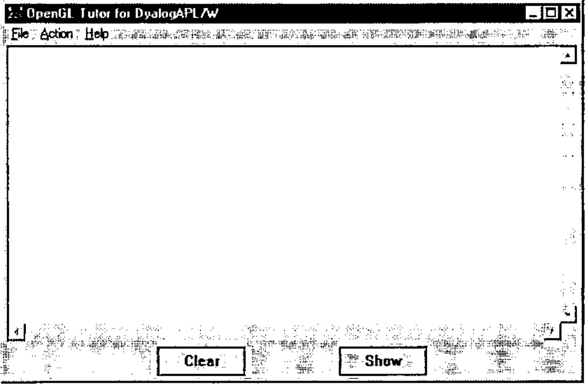

The small one is a container for OpenGL images. The larger one is the work place of an OpenGL student. The main white area is a multiline edit field, where you may enter and edit your "pure" OpenGL code, like the code to draw a cylinder from the previous section. The application takes care of the OpenGL-to-APL interface. In some sense it is a GUI implementation of the operator *OpenGL* from the previous section.

The *File* menu contains a list of prepared examples from the popular book *"OpenGL Superbible"* [3]. Original examples are listed for using by C programmers. We have adapted them for Dyalog APL, but you can see that the texts are very close and the difference is mostly about setting function arguments (representation of C data types in APL). You may select an example using the *File* menu, or enter your own.

The *Action* menu provides the possibility of generating events, like Create, Expose, Configure, Keys, Paint and Close. The *Show* button performs the execution of OpenGL code and creates an image in the OpenGL container form. The *Clear* button does the same, but it clears the previous content of the graphics window before execution. You may also rotate the image in the graphics window using the cursor keys, or move the image around using *Shift*+cursor keys.

Let us select *Example2* from the *File* menu and press the *Show* button:

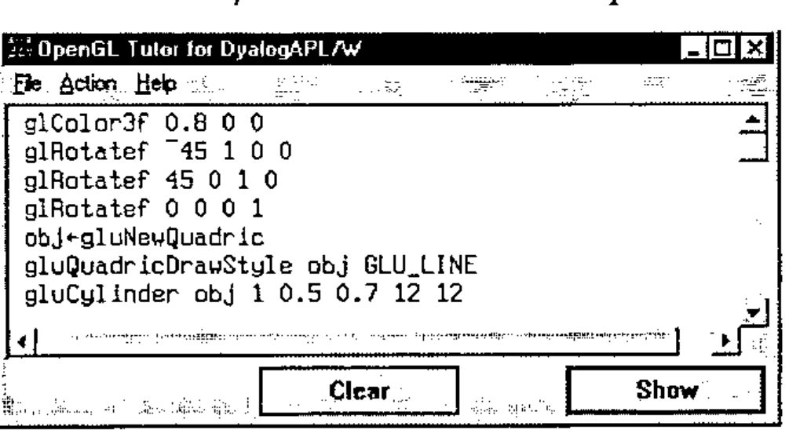

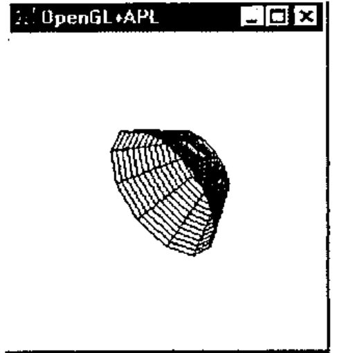

Now edit line `gluCylinder obj 1 .5 2 12 12` to change the height of the cylinder from 0.7 to 2.

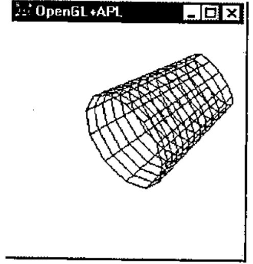

Now change the number of filling polygon lines from 12 12 to 10 40 and see how it affects the image:

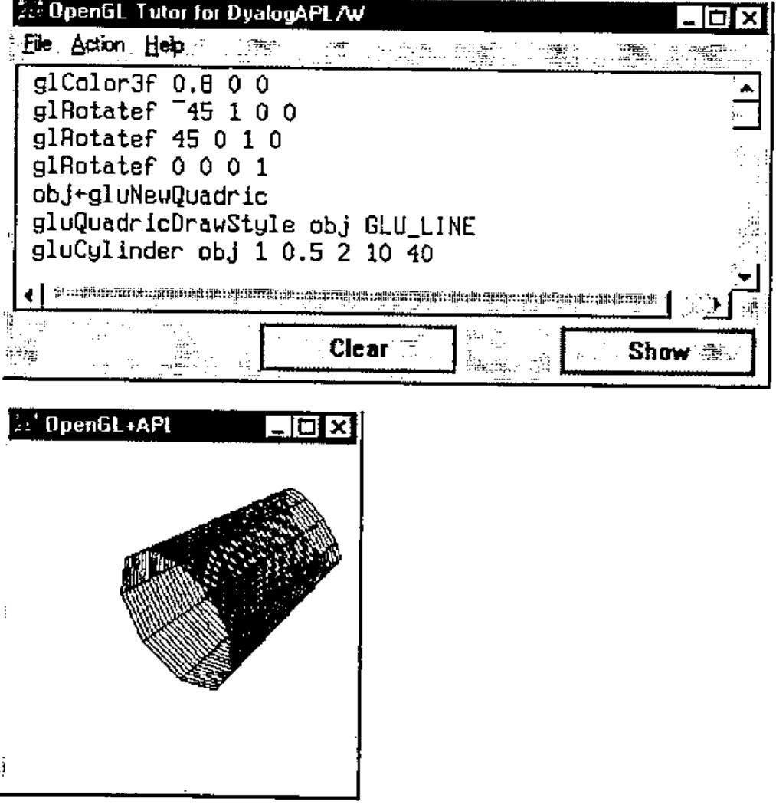

We like the fact that APL is an interactive language (well, not always). Now we have an interactive OpenGL as well.

## OpenGL Function Designer

### Why use GL Designer?

Raw OpenGL programming with the use of a bunch of cover functions to call appropriate DLL functions allows you to use all the power and flexibility of OpenGL. But it costs too much effort to learn OpenGL and it leads to low productivity of programming.

To avoid these difficulties you can develop utility functions. That allows you to hide most of the OpenGL context and to use high-level calls. It is possible at the expense of flexibility. Many parameters and object properties should take some default values in this case. The rest of the parameters and properties are still a valuable set. The user should understand the meaning and influence of each argument, or spend much time experimenting with different function calls.

The main idea of OpenGL function design under GUI control is to combine the advantages of both approaches. The purposes of GL Designer are:

1. Make it easy to try and select parameters and properties of a GL image
2. Automatically create auxiliary functions for further independent usage

### What is GL Designer?

GL Designer is an APL function (and probably a number of subfunctions), separate for each class of OpenGL tasks, like drawing a surface. The *Designer* function uses a minimum number of arguments, first of all the data to be drawn. When you call the Designer function you get two main forms, one a container for an OpenGL image and the other a form to define and select parameters. After any change of parameters you may see their influence by selecting the *Apply* button. When you finish the definition of parameters you select the *OK* button and the resulting APL code is generated automatically.

### An example of using GL Designer

Here we describe using GL Designer oriented to build GL-objects, like NURBS-type surfaces (Non Uniform Rational B-Spline). This task is widespread in scientific data visualisation. The call of the Designer function is as follows:

```apl
Designer arg1 arg2 arg3
```

Where the arguments are: array of control points, array of texture and array of colours. The rest of the parameters take their default values. The user gets two main forms shown below:


The small form is the OpenGL image container. It shows a surface using a mesh of points data which you passed as an argument, and default values of the other parameters.

The larger form stands for the designer itself. You can see six tabs, which group the different sets of surface parameters and properties as follows:

1. Lighting (intensity, angle of scatter of the source of light, point of view and location of watcher, diffused, dispersed or reflected light etc.)
2. Colour, and a possibility of governing the colour of an object and a graphic
3. Material (characteristics such as surface, degree of reflection, etc.)
4. Properties (style of nets and outlines, distances between net nodes, etc.)
5. Texture (level of details of a texture, style of texture imposition, etc.)
6. Effect of Mist (or even fog, type of diffusing a colour, density and other effects).

The next figures illustrate some effects of playing with the property and lighting parameters. The default surface is built in accordance with given data. The display mode is "Polygon" and the sampling method is "Path length" (net with shown numeric parameters).

Now let us change the polygon filling parameters (U-Step and V-step):

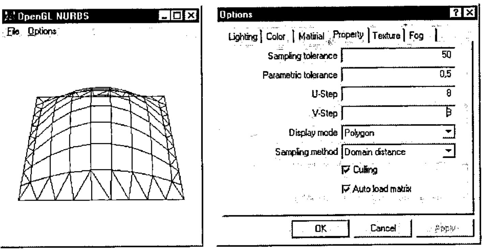

To finish this demonstration set Display mode to "Fill", and allow lighting (CheckButton "Enable" is on):

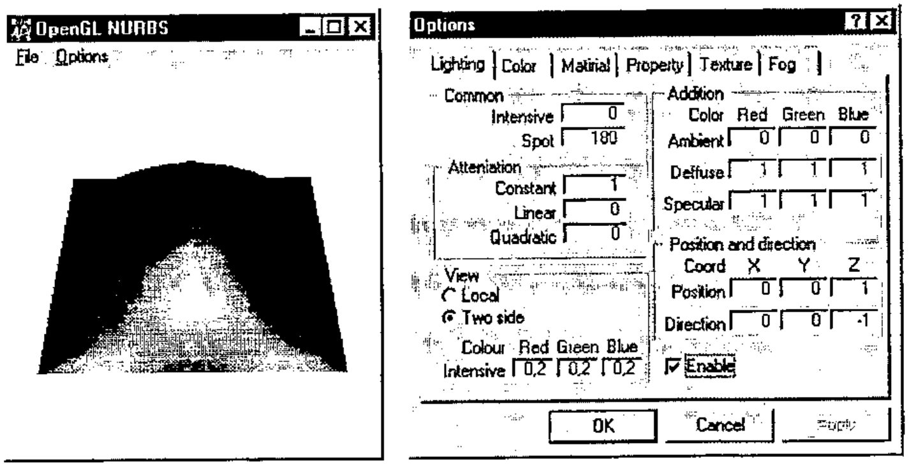

### Generating APL functions

After a developer has got a surface, satisfying the requirements, all necessary functions are generated automatically on leaving the Designer. "Compilation" also checks for used OpenGL commands and minimizes namespace *gl*. Designer stuff is removed also. You may now save the resulting workspace of minimum size, and use it as stand-alone piece of OpenGL graphics in the future.

## Conclusion and Future Directions

The paper illustrates that with the use of the predefined namespace *gl* and the interface operator *OpenGL* it is easy to create OpenGL graphics from Dyalog APL. The GUI application referred to as *OpenGL Tutor* may help in learning the OpenGL language for APL programmers.

An approach based on the *OpenGL Designer* allows implementation of complex OpenGL functions under GUI control and with minimum knowledge requirements of OpenGL.

The other way to increase the productivity of OpenGL programming in APL is in writing auxiliary functions to be used as macros to create complex images. We do not describe this topic here. It will be covered at the *OpenGL and Dyalog APL Tutorial* planned for the APL98 conference.

Another interesting issue is the incorporation of an APL-to-OpenGL interface into the CPro development system from Causeway Ltd. Adrian Smith created an experimental CPro class on OpenGL to allow use of OpenGL as part of a GUI application designed under CPro. The results are quite impressive. We are planning to pay special attention to this topic at the APL98 Tutorial.

Last, but not least, is what we call application-oriented functions. It is a stand-alone small GUI application using OpenGL. An example is shown below:

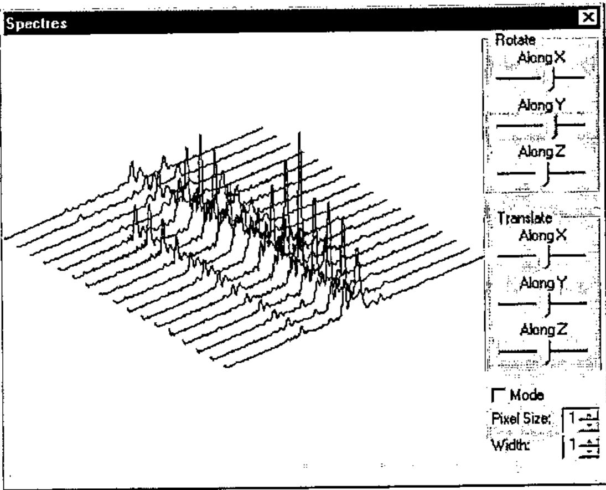

It was created for the visualization and analysis of noise spectra in Nuclear Reactor Diagnostics. Why is OpenGL very helpful here? It makes it easy to implement an image rotation and allows one to see the data from different viewpoints. Altogether it is a simple program, but adds a new dimension to visual data analysis.

## Acknowledgements

The authors thank everybody who was interested in this work from an early stage and that way pushed the authors to the finish. We would like specially thank Adrian Smith for discussion and testing the use of OpenGL from Causeway Pro, and Alexander Kornilovsky who participated in OpenGL namespace and DEMOGL workspace development.

## References

1. Chris Burke, *OpenGL Graphics and J*, Vector, Vol.14 No.1, p.58.
2. Adrian Smith, *Mostly on OpenGL*, Vector, Vol.14 No.2, p.50.
3. Richard Wright and Michael Sweet, *OpenGL Superbible*, Waite Group Press, 1996.
