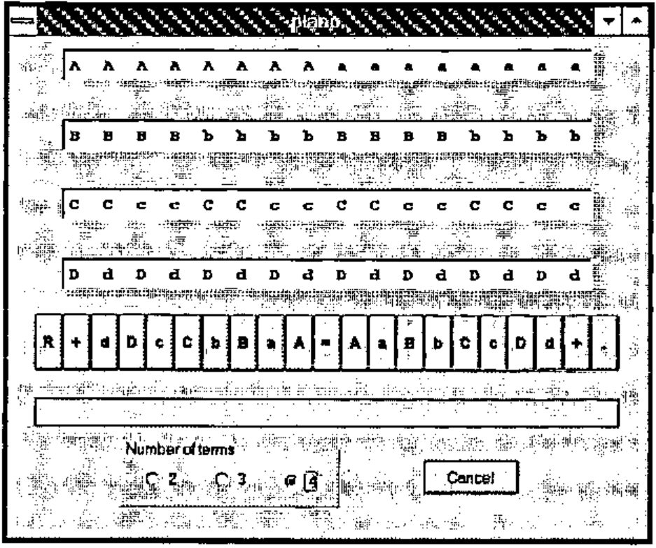
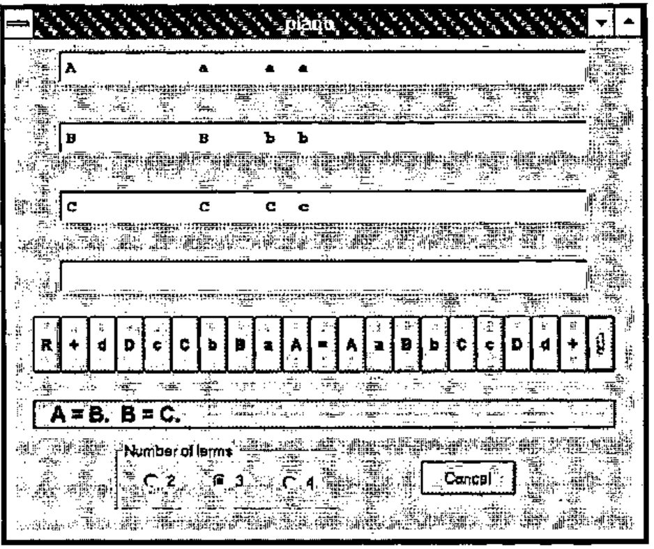
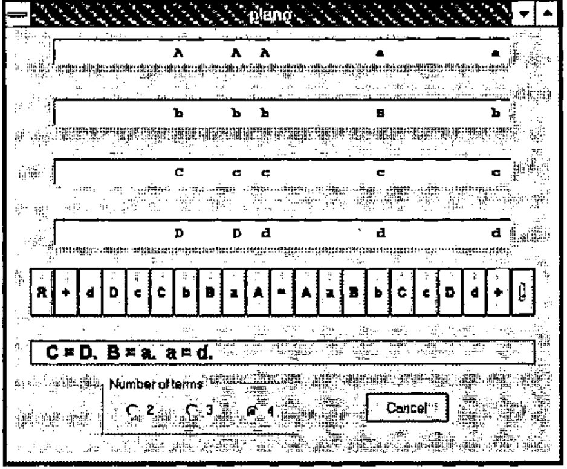

*by Keith Smillie*
{ .byline }

> [M]athematicians are well aware that their science, however much it may advance, always requires a corresponding development of material symbols for relieving the memory and guiding the thoughts.
>
> *W. S. Jevons*

A mechanical device developed in the 1860s by the British political economist and logician W. S. Jevons for solving logical problems is described together with its simulation in J.

## Introduction

William Stanley Jevons was born in 1835 and educated at University College, London having interrupted his studies to spend five years at the British Mint in Sydney, Australia. He then went to Owens College, now the University of Manchester, as a tutor but was soon appointed "professor of logic and mental and moral philosophy" and also "professor of political economy". In 1876 he returned to University College as professor of political economy, a position he held for only four years when he resigned because of poor health. He died two years later in 1882.

As an economist Jevons is remembered for his pioneer work in the concept of marginal utility and as the originator of the theory that trade cycles can be correlated with sunspot activity. As a logician he was one of the first persons to recognize the importance of the work of George Boole. His papers on logic were published in 1890 as *Pure Logic and Other Minor Works* which was reprinted in 1971.

In order to overcome what he considered an awkwardness in Boole’s notation Jevons developed his "method of direct inference" which was a primitive type of truth table and similar to the logic diagrams of his contemporary John Venn. In this method Jevons represented up to four terms by the upper-case letters `A`, `B`, `C` and `D`, and their negations by the corresponding lower-case letters `a`, `b`, `c` and `d`. He would then write down all possible combinations of the letters and their negations, e.g., 16 combinations for four terms, 8 for three terms, etc., and then cross out all those terms inconsistent with the given hypotheses. From the terms remaining he could deduce what followed logically from the hypotheses.

At first Jevons wrote down for each problem a list of of all the possible combinations. He then devised a reusable "logical slate" with the combinations permanently inscribed so that the inconsistent combinations could be crossed out with chalk. Next he devised a "logical abacus" with the terms written on individual strips of wood which were placed on a rack. By means of a system of pegs on each side of the rack and a ruler, strips corresponding to inconsistent combinations of terms could be removed. It was Jevons’s intention that this device be used in the classroom for demonstrating the solution of logical problems including Aristotelian syllogisms.

It was a relatively short step to completely mechanize this last device to produce what has come to be called the "logical piano". Jevons had this device built for him by a clockmaker in 1869, and demonstrated it the following year at a meeting of the Royal Society of London where he gave a paper entitled "On the mechanical performance of logical inference". The paper was published the same year in the Society’s Philosophical Transactions and was included in the collected works referred to above. An excellent discussion of Jevons’s logical work is given in Gardner (1982).

Jevons’s logical piano is now in the Museum of the History of Science in Oxford. A few years ago it was on display on a windowsill together with a few gears from one of Babbage’s machines.

In this paper we shall apply Jevons’s method to the solution of a well-known syllogism with the steps presented in the way that they would be performed with the logical piano. We shall then discuss a simulation in J and illustrate its use with this example and with an example taken from the works of Lewis Carroll.

## A Simple Example

Let us consider the syllogism Barbara which may be stated as follows:

> *Man is mortal.*<br>
> *Socrates is a man.*<br>
> *Therefore, Socrates is mortal.*

If we let `A` = Socrates, `B` = man, and `C` = mortal so that `a` = not-Socrates, etc., then the premises may be stated as

> `A` *is* `B`<br>
> `B` *is* `C` .

Now let us write down all possible combinations of the three terms and their negations as:

```text
A A A A a a a a
B B b b B B b b
C c C c C c C c
```

For the first premise, `A` is `B`, the combinations involving `a`, the negation of `A`, are not relevent and may be set aside. Of the four remaining combinations,

```text
A A A A
B B b b
C c C c
```

the third and fourth are inconsistent with the premise and may be discarded. If we combine the two remaining combinations with the four that were set aside, we have the following combinations consistent with the first premise:

```text
A A      a a a a
B B      B B b b
C c      C c C c
```

Now proceed in a similar manner with the second premise, `B` is `C`. We first set aside the combinations involving `b` so that we have

```text
A A      a a
B B      B B
C c      C c
```

then remove the second and fourth of these which are inconsistent with the second premise, and finally include those that were just set aside so that we have the following combinations consistent with both premises:

```text
A        a   a a
B        B   b b
C        C   C c
```

We may conclude from the first combination that the conclusion of the premise, i. e., Socrates is mortal, is valid.

The consistent combinations may be written as

```text
ABC + aBC + abC + abc
```

which may be simplified to

```text
ABC + a(C + bc)
```

Unfortunately, Jevons’s method of direct inference did not provide for this simplification.

## The Logical Piano

The logical piano resembled a miniature upright piano about three feet high with a keyboard at the bottom above which was a display with four rows and sixteen columns giving all of the possible combinations of four terms and their negations. As the keys were pressed to enter each hypothesis, invalid combinations of terms would be removed mechanically from the display. When all of the hypotheses had been entered, only those combinations of terms consistent with all hypotheses would remain displayed.

The keyboard had twenty-one keys which may be represented as follows:

```text
R+dDcCbBaA=AaBbCcDd+.
```

For typographic convenience we have used `R` instead of FINIS which was used by Jevons, `+` instead of ·|·, `=` instead of COPULA, and `.` instead of FULL STOP. The key `.` represents the end of a premise or hypothesis. Pressing the `R` key would reset the piano to display all sixteen combinations of four terms. The first premise in the example given in the previous section would be entered as `A=B.` and would result in the display of the six terms, two involving `A` and all four involving `a`, consistent with the premise. Similarly the second premise would be entered as `B=C.` Subjects or predicates involving two or more terms could be entered as, for example, `AB=C.` or `A+B=C.` depending on whether logical ‘and’ or ‘or’, respectively, was implied.

Figure 1 shows the Windows form representing the J simulation of the logical piano. The box outlined below the keyboard has been added to the simulation to record the hypotheses as they are entered. Also added to the simulation is the option of displaying those combinations available for two, three and four terms. For example, the eight combinations for three terms may be displayed by selecting the button for three terms and then pressing the `R` key. Figure 2 shows the logical piano after the premises for the example of the last section have been entered.

> The script file for the simulation is available by anonymous ftp at *ftp://ftp.cs.ualberta.ca* in the file *pub/smillie/piano.js*.

## A Second Example

The logical piano may be used to solve some of the problems given in Lewis Carroll’s *Symbolic Logic*. As an example consider the following problem where the object is to determine the consequences of the three hypotheses:

1. No one takes in *The Times* unless he is well-educated;
2. No hedge-hogs can read;
3. Those who cannot read are not well-educated.

> Univ.=‘creatures’; A=able to read; B=hedge-hogs; C=taking in *The Times*; D=well-educated. [We have used the upper-case letters A, B, C and D to be consistent with the notation introduced above whereas Carroll used the corresponding lower-case letters.]

The three conditions may be represented in the notation of Jevons’s logical piano as `C=D.`, `B=a.` and `a=d.` Figure 3 shows the use of the piano simulation for the solution of this problem. We may conclude, for example, from the combination `aBcd`, the only combination involving `B`, that hedge-hogs are not able to read, do not take in *The Times* and are not well-educated.

## Postscript

Jevons considered building a machine that could accommodate ten terms but abandoned the project when he realized that it would take up one entire wall in his study. In 1881 Alan Marquand, tutor of logic at Princeton University, built an improved and smaller version of Jevons’s machine, and in the following year with the help of a friend in the Department of Mathematics he built a more elaborate version. Marquand also proposed a third electromechanical version but because of difficulties with the new electrical technology did not get beyond a prototype built from a hotel annunciator.

A few years ago two American academic economists wrote the mysteries *Murder at the Margin* (1978) and *The Fatal Equilibrium* (1985) with the purpose of teaching some of the principles of economics and at the same time entertaining the reader. The authors wrote under the pseudonym "Marshall Jevons", where the surname comes, of course, from W. S. Jevons and the given name from the British economist Alfred Marshall (1842-1924). These two books may be recommended not only to readers of mysteries but also to those who believe that some lightheartedness in learning is a good thing.

## References

Aspray, William (ed.), 1990. *Computing Before Computers.* Iowa State University Press, Ames, Iowa.

Fisher, John (ed.), 1975. *The Magic of Lewis Carroll.* Penguin Books Limited, Harmondsworth, Middlesex, England.

Gardner, Martin, 1982. *Logic Machines and Diagrams.* Second Edition. The University of Chicago Press, Chicago.

Jevons, W. S., 1890. *Pure Logic and Other Minor Works.* (Reprinted by Burt Franklin, New York, 1971.)

Keith W. Smillie<br>
Department of Computing Science<br>
University of Alberta<br>
Edmonton T6G 2H1, Canada

## Figures



Figure 1. Simulation in J of the logical piano
{ .caption }



Figure 2. Solution of Aristotelan syllogism
{ .caption }



Figure 3. Solution of Lewis Carroll problem
{ .caption }
