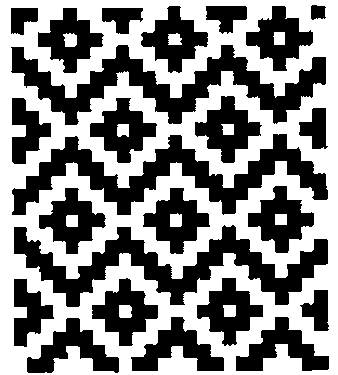
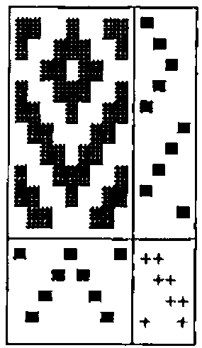
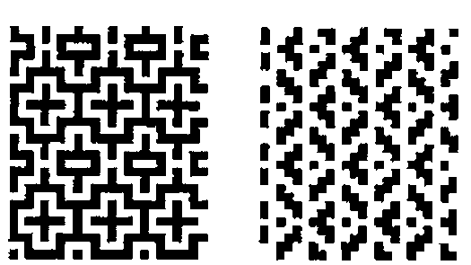

*by Keith Smillie*
{ .byline }



J algorithms are developed for deriving the weave of a piece of cloth from the instructions for setting up a loom, for the converse operation of deriving the setup instructions from the weave, and for introducing colour into the weave.

## Introduction

Weaving is the art of forming a fabric by interlacing threads at right angles and is performed on a frame called a loom. The threads at right angles to the weaver are the warp threads, and the threads parallel to the weaver and which are inserted between the warp threads are the weft threads. The warp threads are alternately raised and lowered to create a shed through which the weft thread is inserted. They are fastened to a warp roller at the back of the loom, pass over a back beam and through the eyes of vertical wires called heddles, and then through reeds which help keep them parallel and in the proper sequence. The woven cloth passes over a front beam and is then wound onto a cloth roller. Each row of heddles is attached to a harness, and there may be two, four, eight or more harnesses. Each warp thread passes through a heddle on any one of the harnesses. The harnesses are raised and lowered by treadles which are worked by the fingers on a table loom and by the feet on a foot loom. Harnesses may be tied together so that more than one may be operated by the same treadle. As a group of warp threads is raised or lowered by the treadles, the shuttle with the weft thread is inserted into the shed between the two groups of threads.

## Drafts

The instructions for setting up the loom with the warp threads are known as drafts. The threading draft determines the order in which the warp threads are drawn through the heddles, the tie-up draft gives the connection of the harnesses, and the treadling draft gives the order in which the treadles are used. The resulting design is known as the weave draft. A cloth diagram is a rectangular display of these four drafts with the weave draft in the upper left, the threading draft in the lower left, the treadling draft in the upper right, and the tie-up draft in the lower right.

The cloth diagram for an upper left corner of the design given at the beginning of this paper is the following:



The threading draft shows that the second and eighth warp threads pass through heddles connected to the first harness, the third and seventh threads pass through heddles connected to the second harness, etc. The tie-up shows that the first treadle is connected to the first and fourth harnesses, etc. The treadling draft shows that the treadles are used in the order first, second, third, etc. Dark squares in the weave draft indicate the visibility of the corresponding warp threads.

## Constructing the Weave

For computational purposes the various drafts may be conveniently represented by boolean tables. Thus the cloth diagram of the previous section may be represented as

```text
┌─────────────────┬───────┐
│1 1 0 0 1 0 0 1 1│1 0 0 0│
│1 0 0 1 1 1 0 0 1│0 1 0 0│
│0 0 1 1 0 1 1 0 0│0 0 1 0│
│1 0 0 1 1 1 0 0 1│0 1 0 0│
│1 1 0 0 1 0 0 1 1│1 0 0 0│
│0 1 1 0 0 0 1 1 0│0 0 0 1│
│0 0 1 1 0 1 1 0 0│0 0 1 0│
│1 0 0 1 1 1 0 0 1│0 1 0 0│
│1 1 0 0 1 0 0 1 1│1 0 0 0│
│0 1 1 0 0 0 1 1 0│0 0 0 1│
├─────────────────┼───────┤
│1 0 0 0 1 0 0 0 1│1 1 0 0│
│0 0 0 1 0 1 0 0 0│0 1 1 0│
│0 0 1 0 0 0 1 0 0│0 0 1 1│
│0 1 0 0 0 0 0 1 0│1 0 0 1│
└─────────────────┴───────┘
```

where the interpretation of the `0`s and `1`s is apparent. In this section we shall show how the weave draft may be very simply calculated from the threading, tie-up and treadling drafts. For convenience, we shall let these four drafts be represented by `W`, `H`, `I` and `R`, representing *w*eave, t*h*reading, t*i*e-up and t*r*eadling, respectively.

First let us define the logical dot product

```text
both=. +./ . *.
```

which gives a value of `1` if at least one pair of corresponding items in its list arguments is `1`, and `0` otherwise. Now the expression

```text
R; (|:I) ; T=. R both |:I
```

has the value

```text
┌───────┬───────┬───────┐
│1 0 0 0│1 0 0 1│1 0 0 1│
│0 1 0 0│1 1 0 0│1 1 0 0│
│0 0 1 0│0 1 1 0│0 1 1 0│
│0 1 0 0│0 0 1 1│1 1 0 0│
│1 0 0 0│       │1 0 0 1│
│0 0 0 1│       │0 0 1 1│
│0 0 1 0│       │0 1 1 0│
│0 1 0 0│       │1 1 0 0│
│1 0 0 0│       │1 0 0 1│
│0 0 0 1│       │0 0 1 1│
└───────┴───────┴───────┘
```

The rows of the third table `T` indicate those harnesses activated by the treadles in the corresponding weft rows of the weave, and, for example, the first row indicates that the first and fourth harnesses are affected. Consequentially, the expression `T both H`, which is equivalent to `(R both |:I) both H` will give the required boolean representation of the weave draft. This may be seen from the expression `T; H; T both H` which has the value

```text
┌───────┬─────────────────┬─────────────────┐
│1 0 0 1│1 0 0 0 1 0 0 0 1│1 1 0 0 1 0 0 1 1│
│1 1 0 0│0 0 0 1 0 1 0 0 0│1 0 0 1 1 1 0 0 1│
│0 1 1 0│0 0 1 0 0 0 1 0 0│0 0 1 1 0 1 1 0 0│
│1 1 0 0│0 1 0 0 0 0 0 1 0│1 0 0 1 1 1 0 0 1│
│1 0 0 1│                 │1 1 0 0 1 0 0 1 1│
│0 0 1 1│                 │0 1 1 0 0 0 1 1 0│
│0 1 1 0│                 │0 0 1 1 0 1 1 0 0│
│1 1 0 0│                 │1 0 0 1 1 1 0 0 1│
│1 0 0 1│                 │1 1 0 0 1 0 0 1 1│
│0 0 1 1│                 │0 1 1 0 0 0 1 1 0│
└───────┴─────────────────┴─────────────────┘
```

where, for example, the first row of third table, which gives the weave draft `W`, shows that the first, second, fifth, eighth and ninth warp threads are visible in the first weft row.

We may define the verb

```text
weave=. (2&get both |: @ (1&get)) both 0&get
```

where

```text
get=. >@{
```

whose argument is the three-item list `H;I;R` of threading, tie-up and treadling drafts and whose result is the required weave draft. Finally a cloth diagram is given by

```text
diagram=. ((weave);2&get),: (0&get);1&get
```

whose argument is the same as that for `weave`. The cloth diagram in the previous section is given by the verb `Cdiagram`, with the same syntax as `diagram`, and is given in the script file in the Appendix.

## Analyzing the Weave

In this section we shall consider the construction of the threading, tie-up and treadling drafts from the weave draft. First of all, we note that if `a` is an arbitrary table, say,

```text
1 4 1 7 1
2 5 2 8 2
3 6 3 9 3
```

then the expression `<"1 |: a` gives the list

```text
┌─────┬─────┬─────┬─────┬─────┐
│1 2 3│4 5 6│1 2 3│7 8 9│1 2 3│
└─────┴─────┴─────┴─────┴─────┘
```

of the columns of `a`, and `= <"1 |: a` gives the table

```text
1 0 1 0 1
0 1 0 0 0
0 0 0 1 0
```

of their distribution.

For a given weave `W` the threading draft is simply its column distribution so that

```text
H=. coldis W
```

where

```text
coldis=. = @ (<"1 @ |:)
```

and the treadling draft is

```text
R=. |: coldis |: W
```

The tie-up draft is given by

```text
I=. (-.|: R) either W either -.|: H
```

where

```text
either=. *./ . +.
```

is the logical dot product which gives a value of `1` if at least one item in each pair of corresponding items in its list arguments is `1`, and `0` otherwise.

We can use the expressions in the last paragraph to define the verb

```text
drafts=. 3 : 0
W=.  y.
H=. coldis W
R=. |: coldis |: W
I=. (-.|: R) either W either -.|: H
H;I;R
)
```

which gives a three-item list of threading, tie-up and treadling drafts corresponding to the weave draft given as the argument. For example, if `W` is the weave draft of the example in the previous section, then the expression `drafts W` has the value:

```text
┌─────────────────┬───────┬───────┐
│1 0 0 0 1 0 0 0 1│1 1 0 0│1 0 0 0│
│0 1 0 0 0 0 0 1 0│1 0 0 1│0 1 0 0│
│0 0 1 0 0 0 1 0 0│0 0 1 1│0 0 1 0│
│0 0 0 1 0 1 0 0 0│0 1 1 0│0 1 0 0│
│                 │       │1 0 0 0│
│                 │       │0 0 0 1│
│                 │       │0 0 1 0│
│                 │       │0 1 0 0│
│                 │       │1 0 0 0│
│                 │       │0 0 0 1│
└─────────────────┴───────┴───────┘
```

We note that even though some of the rows of the threading and tie-up drafts have been permuted, they may be used to construct the original weave draft from which they were derived. Indeed, for arbitrary drafts `H`, `I` and `R`, the expression

```text
W -: weave drafts W=. weave H;I;R
```

should have the value `1`.

## Colouring the Weave

The introduction of colour into the weave is a very simple process if we make use of just a few of the techniques discussed by Clifford Reiter in his book *Fractals Visualization and J*. In particular, we shall use his development of the RGB colour model and the verbs for generating and viewing raster graphics.

In the RGB colour model each colour is considered to be composed of certain fractions of the three basic colours red, green and blue. For example, if all three colours are absent, the resulting colour is black; if they are all present with a fraction of 1, the resulting colour is white; and if red and green are fully present and blue is absent, the resulting colour is yellow.

It is convenient to represent the RGB model as a unit cube with the vertices representing the following colours: (0,0,0) black, (0,0,1) blue, (0,1,0) green, (0,1,1) cyan, (1,0,0) red, (1,0,1) magenta, (1,1,0) yellow, (1,1,1) white. There is a one-one correspondence then between any colour combination and points on or within the unit cube. Since in a raster image each basic colour is represented by one byte, each colour coordinate may be represented also by a triple of integers ranging from 0 to 255 so that, for example, the combination (255,255,0) represents yellow. Finally to generate and view the raster images we shall use the two verbs `writebmp8` and `viewbmp`.

When specifying colours for weaving designs we shall represent the eight colours corresponding to the vertices of the colour cube in the order given above by `b`, `l`, `g`, `c`, `r`, `m`, `y` and `w`, respectively. Furthermore, we shall introduce eight intermediate combinations of colours represented by `B`, `L`, `G`, `C`, `R`, `M`, `Y` and `W`, where `Y` represents (128, 128, 0). This representation is given by the list

```text
Colours=. 'blgcrmywBLGCRMYW' .
```

The corresponding coordinates are given by the table `Palette` with rows `0 0 0`, `0 0 255`, … `128 128 128`, `0 0 128`, … . The colouring of a design according to these parameters is handled by the verb `BMP` given in the Appendix. The details of this verb need not concern us, and we shall note only that its right argument is a weave draft produced by the verb `weave` and the left argument specifies the warp and weft colours as discussed in the next paragraph.

A coloured weave corresponding to specified threading, tie-up and treadling drafts is given by the ambivalent verb `front` defined as

```text
front=. 3 : 0
('b';'w') BMPview weave y.
:
x. BMPview weave y.
)
```

where the right argument is the three-item list `H;I;R` of the drafts. The optional left argument is a two-item list giving the warp and weft colours, and, for example, the list `'rg';'y'` specifies a warp with alternate red and green threads and a yellow weft, and the list `'b';'w'` gives the default black warp and white weft. A similar verb `back` will specify the reverse side of a coloured weave. The verb `BMPview` defined as

```text
BMPview=. 3 : 0
:
x. BMP y.
IMAGEsize viewbmp IMAGEfile
)
```

generates and then displays the file containing the raster image of the weave. The window size and the file name are given by the global variables `IMAGEsize` and `IMAGEname`, respectively, whose default values are given in the script file.

An indication of the influence of the sequence of colours for the warp and weft threads may be seen from the two designs given below which have the same drafts as the one shown at the beginning of this paper which has an all black warp and an all white weft. The left weave has a warp and weft given, as a left argument to the verb `front`, by `('bw';'wb')` while the right weave has the warp and weft given by `('bwbb';'w')`.




## A Windows Loom

Some of the verbs developed in the previous sections have been used in the construction of a Windows form that shows the weave resulting from any one of a number of combinations of threading, tie-up and treadling drafts and warp and weft colours. The figure shown on this page gives the appearance of the form for one of these combinations. The script file is given by anonymous ftp at `ftp.cs.ualberta.ca` in the file `pub/smillie/loom.js`. Documentation is given in the Help menu which is as follows:

> The "Windows loom" permits the generation of the designs resulting from a number of combinations of threading, tie-up and treadling drafts and warp and weft colours. Selected designs may be stored as graphics files for later use. The selection of drafts has been taken from "Weaving. A Handbook for Fiber Craftsmen" by Shirley E. Held (Holt, Reinhart and Winston, Inc., New York, 1973).
>
> The following drafts are available and are selected from the appropriate menu:
>
> > Threading: Twill, Goose eye, Rosepath III, Cord, velveret, Broken twill, Bird’s eye, Wheat
> >
> > Tie-up: Plain, 2/2 Basket, 2/2 Straight twill, 1/3 Straight twill, 3/1 Straight twill, Herringbone twill
> >
> > Treadling: Straight, 2 Straight, Reverse, As Threaded
>
> Either the front or the back of the design may be viewed.
>
> The colour of each of the warp and weft threads may selected from the following: black, blue, green, cyan, red, magenta, yellow, white and grey with the default colours being black for warp and white for weft.
>
> The following controls are available:
>
> | | |
> |---|---|
> | OK: | Generates the design for a given combination of drafts, etc. |
> | Save: | Saves the displayed design as a bit-mapped file numbered 1, 2, …, 25 and increments the file number by 1. The file number is attached to the base file name with a default value "c:\j303a\temp\tempxx.bmp" where "xx" is the file number. |
> | Reset: | Resets the drafts, view option, warp and weft colours, and file number, and the design to the J logo. |
> | Cancel: | Exit program |
> | Help: | View this text. |

Keith Smillie<br>
Department of Computing Science<br>
University of Alberta<br>
Edmonton, Alberta T6G 2H1

## References

Frey, Berta, 1975. *Designing and Drafting for Handweavers*. Collier Books, New York.

Held, Shirley E., 1973. *Weaving. A Handbook for Fiber Craftsmen*. Holt, Reinhart and Winston, Inc., New York.

Hoskins, Janet A. and W. D. Hoskins, 1981. "The solution of certain matrix equations arising from the structural analysis of woven fabrics." *Ars Combinatoria*, vol. 11, (June), pp. 51 – 59.

Reiter, Clifford A., 1995. *Fractals Visualization and J*. Iverson Software Inc., Toronto.

## Appendix. Script file

```text
IMAGEsize=: 256 256
IMAGEfile=: 'c:\j303a\temp\temp.bmp'

both=. +./ . *.
either=. *./ . +.
get=. >@{
coldis=. = @ (<"1 @ |:)
replace=. ] { ({&a.)@[

weave=. (2&get both |: @ (1&get)) both 0&get
diagram=. ((weave);2&get),: (0&get);1&get

Cdiagram=. 3 : 0
D=. 32 178&replace weave y.
H=. 32 254&replace 0&get y.
I=. 32 43&replace 1&get y.
R=. 32 254&replace 2&get y.
(D;R),:H;I
)

drafts=. 3 : 0
W=.  y.
H=. coldis W
R=. |: coldis |: W
I=. (-. |: R) either W either -. |: H
H;I;R
)

wdsize=. 3 : 0
empty IMAGEsize=: 2&$ y.
)

filename=. 3 : 0
empty IMAGEfile=: y.
)

front=. 3 : 0
('b';'w') BMPview weave y.
:
x. BMPview weave y.
)

back=. 3 : 0
('b';'w') BMPview -. weave y.
:
x. BMPview -. weave y.
)

BMPview=. 3 : 0
:
x. BMP y.
IMAGEsize viewbmp IMAGEfile
)

BMP=. 3 : 0
('b';'w') BMP y.
:
P=. (<"0 y.) {&> (({|.(|.$y.)($&.>) x.)
Palette=: (255*#:i.8),128 128 128, 128*}.#:i.8
Colours=: 'blgcrmywBLGCRMYW'
(Palette;Colours i. P) writebmp8 IMAGEfile
)

NB. Drafts for "upper left corner"
H0=. 4 3 2 1 =/ 4 1 2 3 4 3 2 1 4
I0=. |:> 1 0 0 1;1 1 0 0;0 1 1 0;0 0 1 1
R0=. |: 1 2 3 4 =/ 1 2 3 2 1 4 3 2 1 4

NB. Drafts for main figure
H1=. 4 3 2 1 =/ 24 $ 4 1 2 3 4 3 2 1
I1=. |:> 1 0 0 1;1 1 0 0;0 1 1 0;0 0 1 1
R1=. |: 1 2 3 4 =/ 28 $ 1 2 3 2 1 4 3 2 1 4 1 2 3 4

writebmp8=: 3 : 0
:
('spal';'sbmp')=.$@>"0 x.
xsbmp=.sbmp+(i.2)*4|-sbmp
h=.524289 0,(*/xsbmp),0 0,2#spal=.0{spal
h=.(54+(4*spal)+*/xsbmp),0,(54+4*spal),40,(|.sbmp),h
head=. 'BM',,a.{~,|."1 (4#256)#:h
pal=. ,(0,"1~|."1 >{.x.){a.
bmp=. ,|.(xsbmp{.>{:x.){a.
(head,pal,bmp) 1!:2 <y.
)

viewbmp=: 3 : 0
256 256 viewbmp y.
:
wd 'pc bmpviewer closeok;pn ',y.,';'
wd 'xywh 0 0 ',(":<.x.%2.5),';cc g isipicture;set g ',y.,';'
wd 'pas 0 0;pshow;'
)
```
