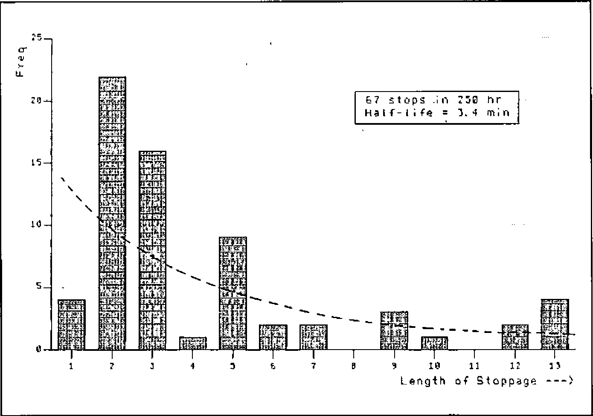
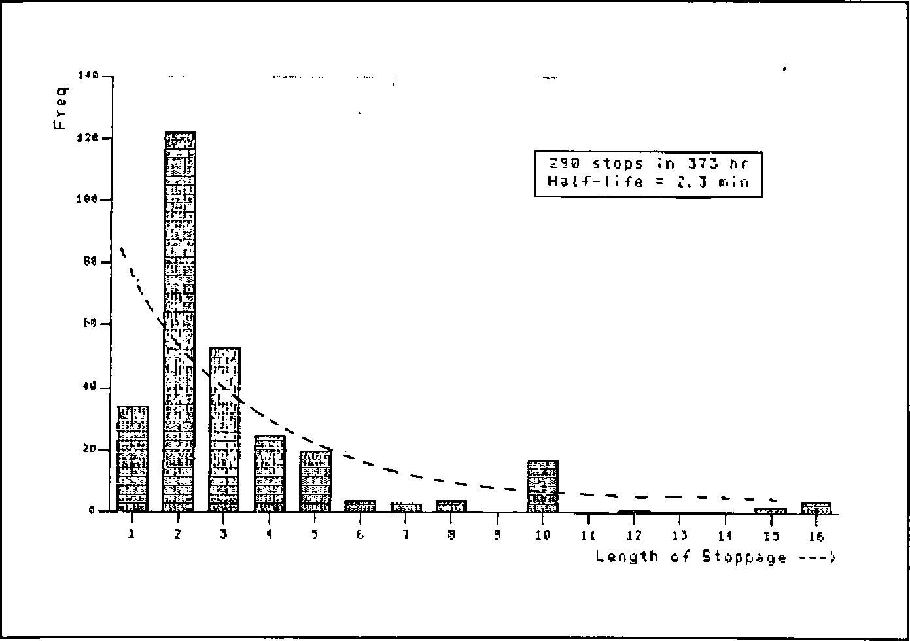
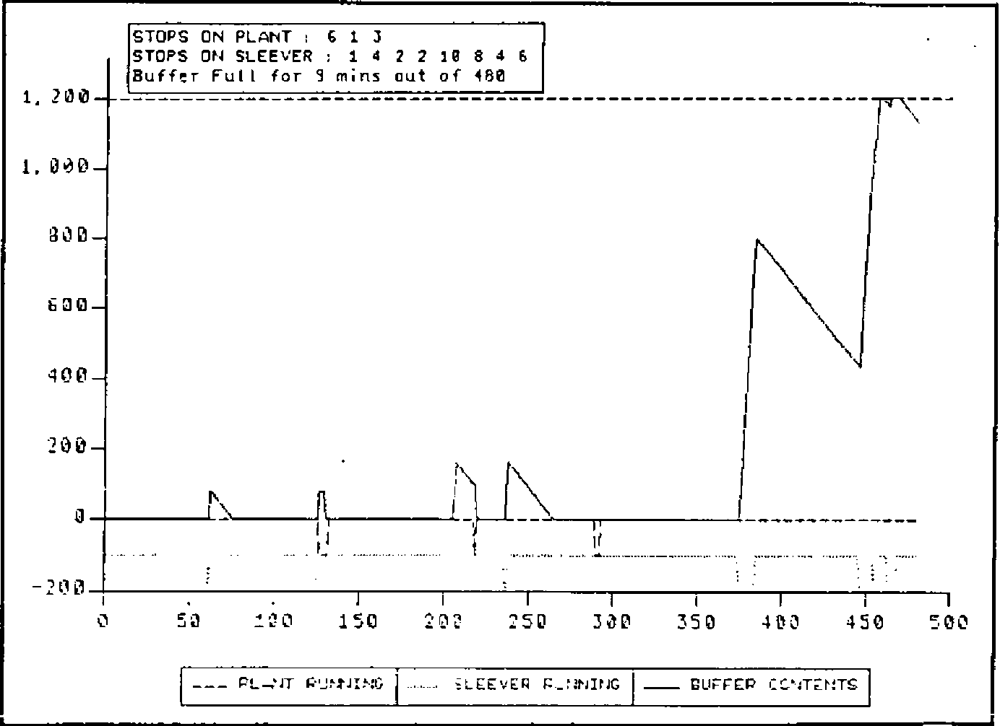
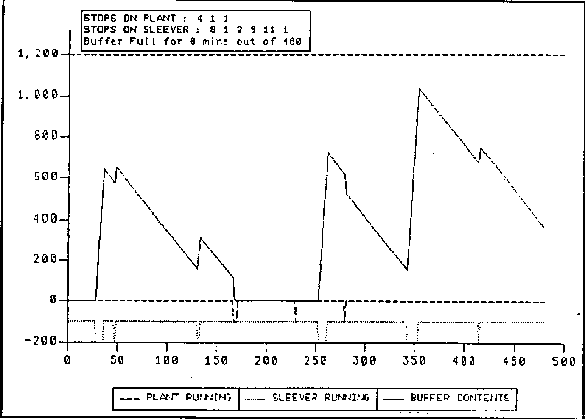
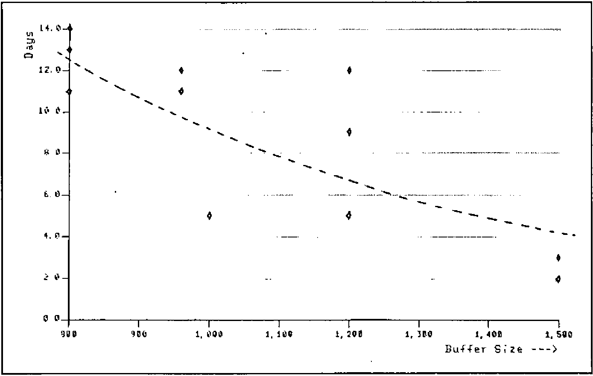
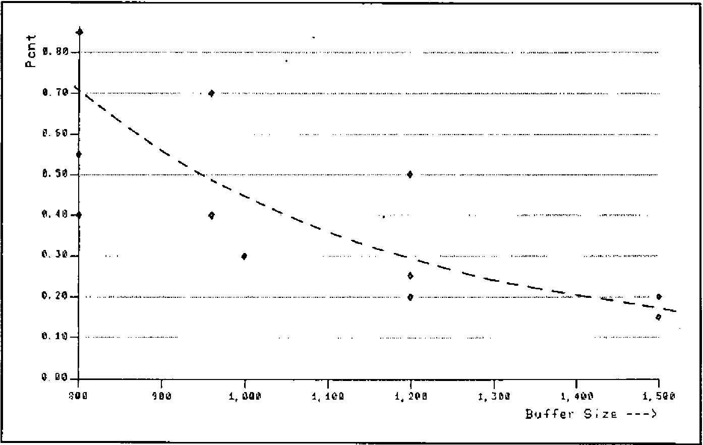

by Adrian Smith
{ .byline }

## Problem Description

Matchmakers are a boxed chocolate produce from Rowntree Mackintosh. Following manufacture, the lines of Matchmakes are scooped into trays, which are inserted into sleeves before final packing. The sleeving process, currently done by hand, is to be mechanized. The running speed and breakdown pattern of both traying and sleeving machines can be estimated from past experience.

Question: how large a buffer is needed between these machines so that the plant can be kept running when the sleever breaks down?

```
Matchmakers                                                      to
───────────►  TRAYING      ───┐        ┌──►  SLEEVING      ───────────►
from plant    (80 per min)    ▼        ▲     (max 86 per min)  packing
                         ?????? BUFFER STOCK ??????
```

Basic engineering reason (like the height of the ceiling) restrict the choice to buffers of between 10 and 20 minutes, with the cost increasing roughly in proportion.

## Hypothesis

With a bit of luck both Traying and Sleeving will stop at random, and the length of stops will show a nice exponential pattern. If so the logic is easy, because in any given time interval (say 1 minute) there will be a constant probability of stopping (PROBSTOP) and having stopped a constant probability of restarting (PROBSTART). All that has to be done is to determine the frequency and half-life of stops, and we can then generate endless random days and see the way different buffers fill and empty over time.

## Snag

By an unfortunate coincidence the foreman had only just cleared out his cupboard, evicting in the process all last year’s records! There was thus a short delay for…

## Data Gathering/Valuation

Over the next few weeks the machine logs were collated for several comparable pieces of plant. To the ill-concealed delight of the experimenter the emerging distributions looked like Figures 1 and 2.

*Fig. 1: Analysis of Stoppage Time on Traying Unit*



*Fig.2: Analysis of Stoppage Time on Sleeving Unit*



*Fig.3: Simulation Logic*


```
    ∇ TRY N;BUFF;LAB;CT
[1]   ⍝RUN <N> ITERATIONS OF MATCHMAKER SIMULATION.
[2]   ⍝⍝ Saved on 25/12/83 at 17.29.
[3]   GOING[ ]←1
[4]   LOG←(3,N)⍴0
[5]   BUFF←0
[6]   ⍝OFF WE GO .........
[7]  LOOP:→LAB←N ITERATE END,CT←1
[8]   →(GO1,STOP1) IF GOING[1]
[9]  GO1:BUFF←BUFF+80
[10]  GOING[1]←PROBSTOP[1]≤?1000
[11]  →SIN1
[12] STOP1:GOING[1]←PROBSTART[1]>?1000
[13] SIN1:→(GO2,STOP2) IF GOING[2]
[14] GO2:BUFF←0⌈BUFF-86
[15]  GOING[2]←PROBSTOP[2]≤?1000
[16]  →SIN2
[17] STOP2:GOING[2]←PROBSTART[2]>?1000
[18] SIN2:BUFF←BUFFMAX⌊BUFF
[19]  LOG[;CT]←GOING,BUFF
[20] END:→LAB[CT←CT+1]
    ∇
```

Taken together with the total number of stops in the total logged running time the graphs give:

```
PROBSTOP [T S]←4.5 13 (per thousand mins running)
PROBSTART [T S]←180 260
```

Assuming an arbitrary upper limit (BUFFMAX←1200) to the buffer, the logic for the simulation now looks like Figure 3.

The results were analysed with a simple COUNT routine (TRY 480 was typical for an 8-hour day); each run giving a report like:

```
Stops on traying  : 5 3 3 1 7 3
Stops on Sleever  : 7 1 3
Buffer full for   : 10 min out of 480
```

Enough sample days were run to check that the generated patterns of stoppage were indistinguishable from the real thing, and several ‘typical’ days were graphed to ensure nothing odd was going on in the logic. The results are depicted in Figures 4 and 5.

*Fig.4: Matchmaker Simulation: 4.5 13 180 260*



*Fig.5: Matchmaker Simulation: 4.5 13 180 260*



As soon as all concerned were happy with the pictures, the project moved to its final stage …..

## Production Run/Problem Resolution

Out of consideration for other computer users this was done ‘out of hours’. Several runs of 28 days were done at each possible buffer size, and the number of days affected by at least one ‘buffer full’ was plotted. Also shown is the percentage of production-time lost in the period (Figures 6 and 7).

At this point it becomes clear that the problem as originally formulated does not have a satisfactory answer; however big the buffer there will always be some days affected. What we can see is the possibility of a trade-off between the cost of lost production (which does fall away quite sharply) and the cost of installing buffers of various sizes. I’ll spare you the details of the economics, suffice it to say that a decision was rapidly reached which pleased all the interested parties.

*Fig.6: Analysis of Days affected per Month on Traying Unit*



*Fig.7: Analysis of Percentage of Production Lost due to Full Buffer*



## Comment

APL is not an ideal tool for simulation — a run of 28 days of 480 minutes (i.e. 13440 iterations of the basic model) cranked up around 20 sec of 3083 CPU time, and several such runs were needed. On the other hand the coding for the whole exercise (including the calls to PGF for the graphics) took just over an hour, and it all ran first shot (once the typos had screened themselves out with SYNTAX ERRORS).

Some other points of interest are: the use of block diagrams to sketch out the logic (yes I did draw the pictures first!); the veritable shoal of helpful utilities (IF and ITERATE are ones I use constantly); and the power of graphics as an analytical tool. I dare say any competent mathematician could have got to the same answers as I did without any computing at all, but try selling that kind of answer to a bunch of engineers and production managers! The use of pictures was important in validating the model, and thus giving credibility to the answers.
