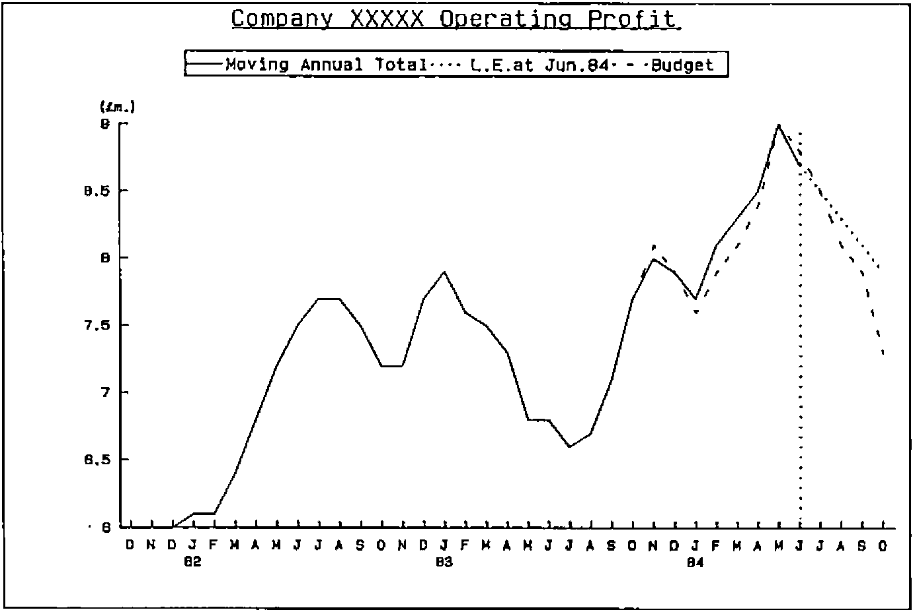
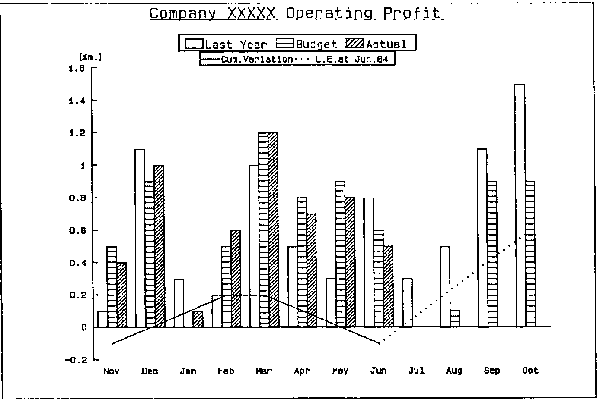
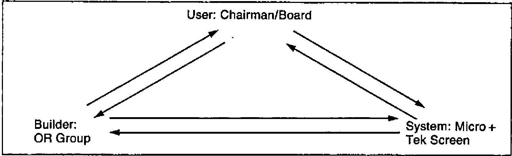
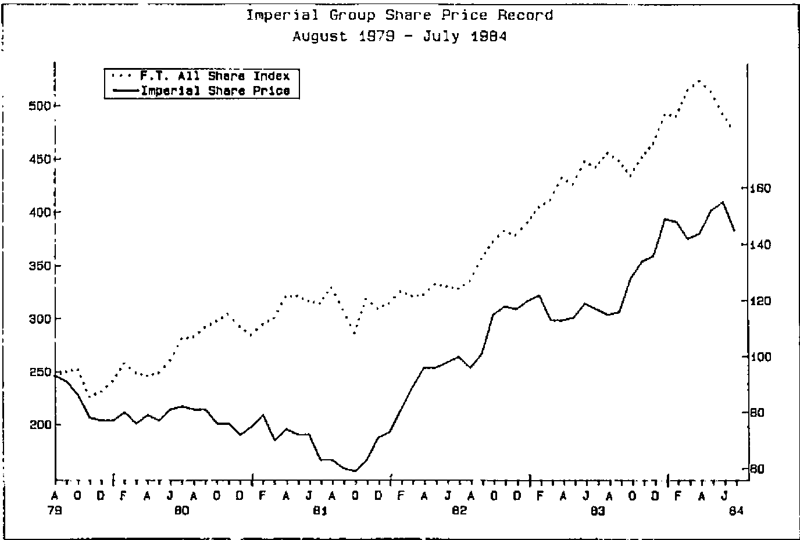
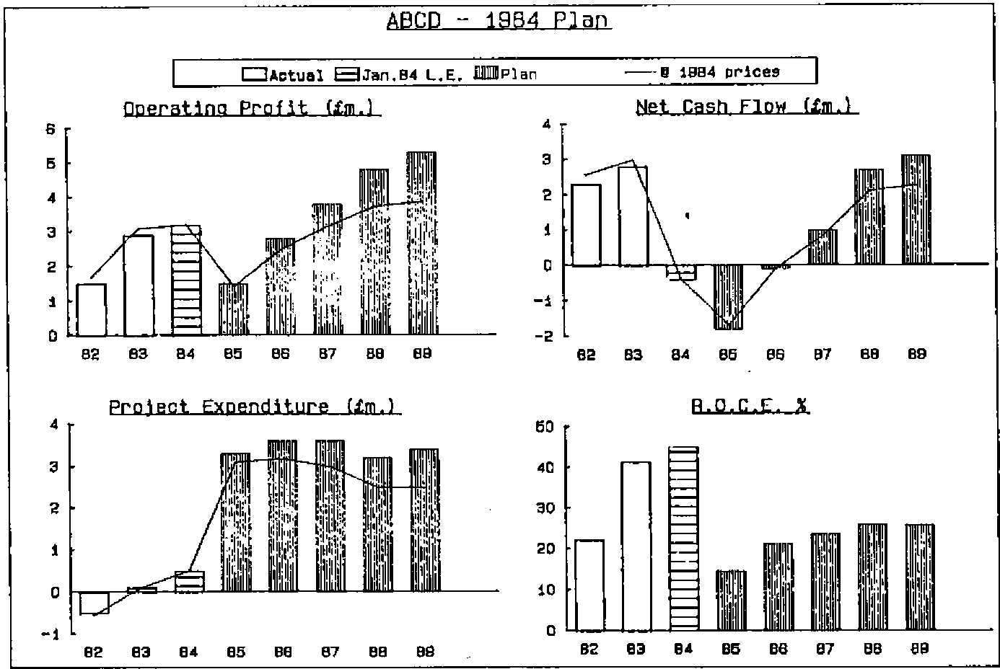

by Adrian Smith
{ .byline }

## Acknowledgements

I would like to thank David Quas and Katie Williamson for inviting me down to Imperial Group HQ. It was a thoroughly enjoyable visit, which was interesting personally as well as in my ‘professional’ capacity as applications correspondent.

## Plea

I would like to hear from anyone who has been using APL in the ‘Expert Systems’ field. This appears a likely theme for the next issue, and offers of material would be most welcome.

## Graphics in Decision Support

### Introduction

Imperial Group have consciously diversified from a tobacco company to a broader base. They have four divisions (tobacco/food/brewing/Howard Johnson — an American Hotel and Restaurant chain) within which are various operating units, e.g. Golden Wonder crisps. The group has a headquarters staff based in London and Bristol, whose job it is to support the chief executive in directing overall policy and in maintaining corporate control. Part of this HQ staff is a 5-man Operational Research team, which has developed and implemented the graphics system described below.

### Current Hardware

Clearly the system is developing rapidly, and the hardware is in a constant state of flux. As I saw it, the computer centre was based round 2 MicroAPL ‘Spectrum’ machines, running a total of about 200 Mbyte of hard disk. The computers are linked via Ethernet, so that any user can run any program on either machine. There is also a (slow) link to a further Spectrum at Bristol.

Virtually the entire London HQ is cabled up with standard RS232 ports, and around 12 Tektronix 4105 graphics screens are scattered throughout the offices of the board members, financial planners, etc. Also there are two HP7221 plotters, which were used for the illustrative graphics included in this article. The Tektronix screens have been modified to output a standard ‘Red/Green/Blue’ signal, so that a whole chain of cheaper colour monitors can be slaved together for conferences. All the screens are on trolleys, so that re-location is very straightforward.

*Figure 1. Graph No. 768*

### Outline of Current System

What I would like to do is to outline quite briefly the system as it now stands, and then to concentrate on the factors which governed its evolution and led to its undoubted success. First let me say that as a user of IBM ‘mainframe’ graphics I found the speed, quality and flexibility of the micro-based systems very impressive indeed. Many of the key features would be quite impossible to reproduce in a big-machine environment.

The nearest analogy I can find to the style of operation is PRESTEL. Each graph (e.g. Fig.1) is given a number, and can be brought up on the screen in one of 3 ways:

- the system starts with a master menu, below which are a series of sub-menus, which soon lead one to the right range of numbers, and thence to the graph.
- each user has a ‘quick reference’ card showing the range of numbers allocated to each type of graph. Thus he can get straight to the appropriate sub-menu, without working through the tree of options above.
- the user can look up the graph number (e.g. ’748’ for Figure 1) in a directory and key it in directly.

Note that only standard graphs are available; to include a new picture in the system involves a certain amount of programming and some changes to the menus. However there are 1825 graphs (and tables) to choose from, and in practice users undoubtedly prefer a range of known formats to a general ‘gimme a graph’ facility.

*Figure 2.*

It seemed to me that the presentation of the system was an important factor in its acceptance at board level. All selection was done entirely on the numeric keypad, and the ‘function keys’ were replaced by specially engraved keycaps saying things like ‘MENU’, ‘CROSS-HAIR’ and so on. The ‘user manual’ was a beautifully presented A5 document covered in gold-engraved leathercloth with good thumb -indexing. The Tektronix screens themselves were quite tidy, and not at all out of place in the office of today’s executive. All in all, I would say that as well as being easy, the system was also pleasant to use; I shall return to these thoughts in the later discussion on evolution.

Many of the neatest features stemmed directly from the capabilities of the Tektronix screen. In particular one could switch colours in and out virtually instantly, for example in Fig. 2 one could start by showing just last year and budget (actually brown/green), then hit the &lt;PURPLE&gt; key to bring in the year-to-date figures, then hit &lt;BLUE&gt; for the cumulative variation. To check the figures that lay behind the picture, one again just hit an ‘OPTION’ key and selected ‘Table’. Again the switch from figures to picture and back was effectively immediate.

Finally, the use of the ‘CROSS-HAIR’ key enabled a simple joystick arrangement to move a cross-hair cursor anywhere on the screen. This could be used to read figures from the axis, to compare the relative height of peaks or to show break points in time (such as the year-end). Again, the overall impression was of a system which felt comfortable in daily use.

### History and Evoltuion

The genesis of the system was in July 1981, when a new chairman expressed interest in a top-level information system. By December discussions had led to a prototype, with a small (Superbrain) micro, a 4-colour plotter, and a terminal to a bureau. In early 1982 the OR group was given a new role in supporting head office functions, and a MicroAPL Spectrum microcomputer was acquired. At the same time the bureau service was being developed to drive a Tektronix 4027 screen, and soon demonstrations were held using live data.

A major step forward was taken in July when a Spectrum was acquired specifically to run the graphics system, and the opportunity of cabling the entire London office complex was taken. By August the menu of available graphs had begun to expand. Several similar systems in the USA were seen, and in November a review of possible future developments was made.

During 1983 the system quietly bedded down, with some output going direct into the board statements as confidence grew. The next stage was to expand from a ‘one-terminal’ situation to the ideal of one screen per user. The Tektronix 4105 was chosen, and the special keytops designed. By September there were 5 screens, and 200 graphs; by November the number of graphs had grown to 500; by February over 1000. Now there are 12 screens and (as of August 22nd.) 1825 graphs, so one can conclude that the initial growth of the system was very rapid indeed.

1984 has been a period of consolidation, with the purchasing of a third Spectrum for development and a gradual increase in disk space for storage, and in the number of terminals available to users. Many minor improvements have been made, but I think it would be reasonable to say that the several elements of the system have now stabilised.

I would like to close this review with another look at this history in the context of the three-way interaction between ‘User’, ‘Builder’, and ‘System’ which typifies the evolutionary process through which a DSS grows. What is clear from both the literature (1),(2) and (3) and my own experience is that if any of these three communication channels become blocked the growth of the resulting system may be badly stunted, or even aborted. The Imperial Group history is a classic example of the DSS method in action.

Essentially the links are:

*Figure 3.*

… and the interactions (in cyclic rather than historic sequence) look like this:

**User to Builder:**

- initial interest.
- requests for new graphs as experience of prototype system grows.
- feedback on usefulness of current range of graphs.

**Builder to User:**

- presentation of existing data in graphical form.
- attempt to define new views of data to extract the maximum of useful information.
- willingness to respond quickly to ad hoc requests.

**Builder to System:**

- requirement for inexpensive, neat-looking graphics terminal.
- ability to replace key-caps, and to extract video signal.
- demand for fast response/ease of use.

**System to Builder:**

- features like cross-hair cursor, easy removal/selection of colours influenced the design of graphs. In particular the full graph could be ‘overloaded’ with lines because it was easy to cut them in and out.
- fast recall of graphs from file (and quite efficient storage) led to the PRESTEL-type ‘pick and choose’ approach.

**System to User:**

- early graphs stimulated new views of existing data, and generated wide interest.
- increasing confidence around screens and keyboards led to quick uptake.

**User to System:**

- the first impression had to be ‘executive’. Presentable manuals, neatly engraved keys etc. were essential.
- initial ease of use was vital. Also ease of re-use after a long period of inactivity. Hence the PRESTEL-like menu-tree.
- a cross-hair cursor was needed so that figures could be accurately read off the axes. Now made largely redundant by the availability of back-up tables.

In summary it is not just the initial ‘User to Builder’ request that mattered. The system evolved through a learning process in which all the six interactions figured strongly. If anyone who reads this is involved in developing this type of Decision Support System I would strongly recommend them to write down the six headings above, and to treat them as a checklist to ensure that all these channels at least remain open. The undoubted succes of the Imperial Group development is to me a real encouragement that the DSS approach does get worthwile results in areas where traditional systems methods are left hopelessly floundering.

### Examples

A selection of typical graphs are illustrated on the following pages.

*Figure 4.*

*Figure 5.*

*Figure 6.*

*Figure 7*

### References

1. Decision Support Systems: Issues and Challenges. Goran Fick & Ralph H Sprague Jr. (Eds)
2. DSS — Research Perspective. P. W. Keen — IIASA Proceedings. Permagon Press 1980
3. Human Interaction with Computers. H. T. Smith & T. R. G. Green (Eds) — Academic Press, 1982
