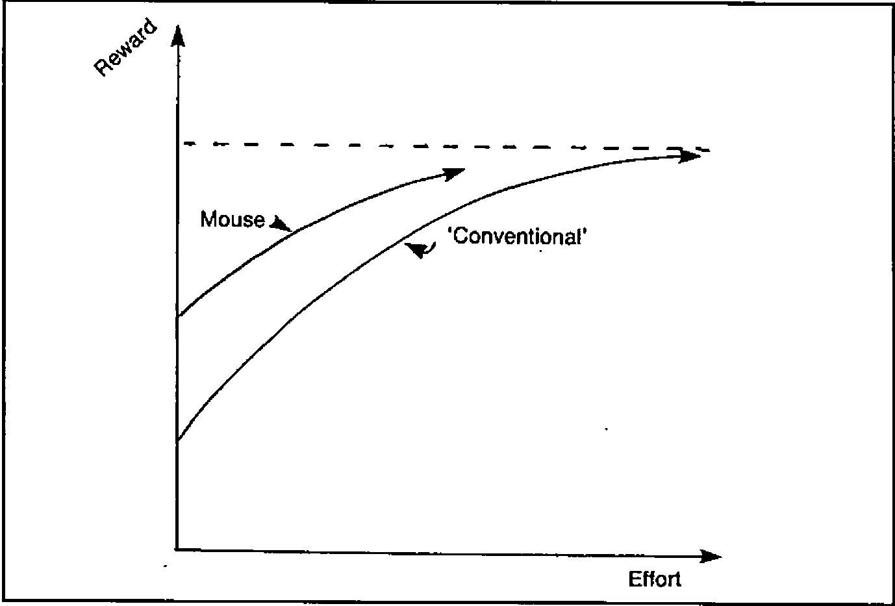
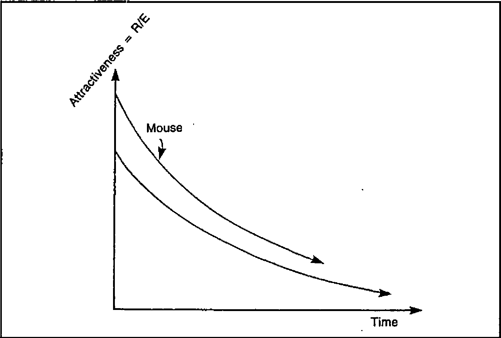
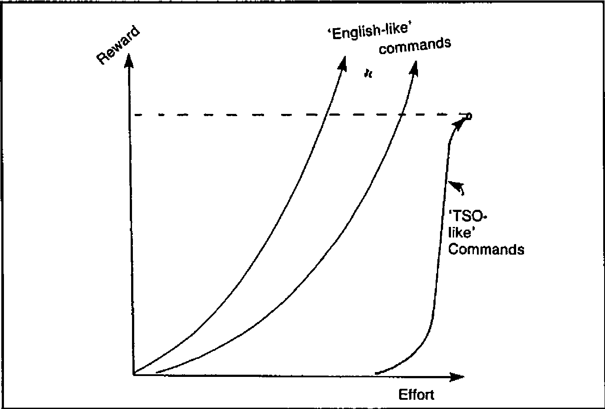
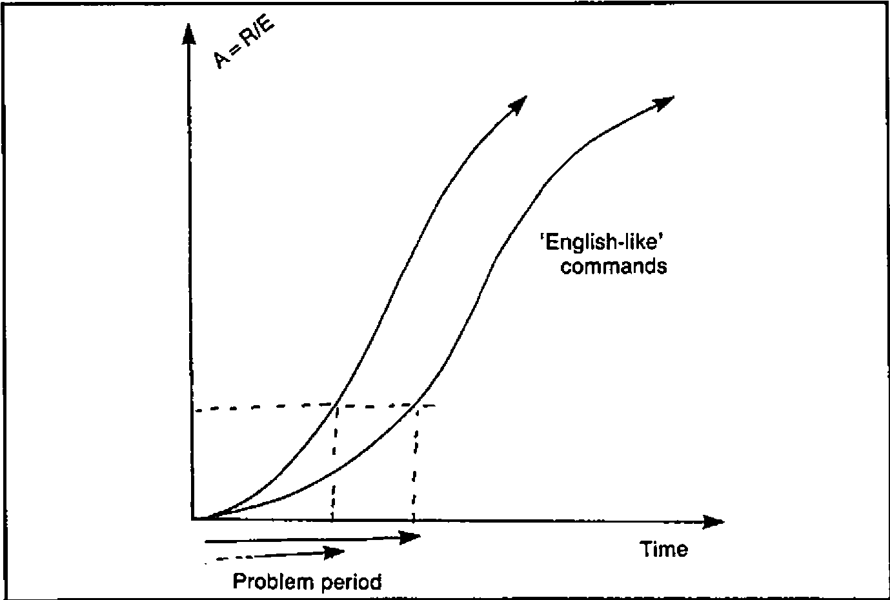

by Adrian Smith
{ .byline }

## Introduction

This paper was given as my contribution to the panel on ‘Menus versus Command Languages’ at the 1984 I.P. Sharp Users Meeting. It is an attempt to view the whole user-interface debate from a different angle, and concentrates on the ability of a system to learn rather than on the precise style of the dialogue. As systems move deeper into the role of management support, I feel that ‘teachability’ will become increasingly important. There are two main reasons for this:

- Usage is optional. A management support system (MSS) must appear initially attractive, but must not frustrate the expert with tedious or inflexible dialogue. It will soon lapse into disuse otherwise.
- The application is unpredictable. No-one knows in advance how a particular MSS will be used by a particular manager; any attempt to pre-define ‘handy’ shortcuts is doomed to failure. Such paths can only evolve from the two-way interaction between each individual user and the system.

The next section looks at menus and ‘masters’ (command languages) in this context. I hope it sheds some light on readers’ own experience of the many types of user-interface they will have met. Having pinpointed the weaknesses of both styles, I then want to show how the idea of teachability overcomes many of these. Finally, the paper outlines a simple idea that lets you turn almost any APL system into one that can learn from its users.

## Reward per Unit Effort: a Measure of Attractiveness.

When you ask someone how much they like a system, the answer almost invariably depends on the ease with which they get results. Taken over time, one can plot the reward obtained against the effort expended; for menu-driven systems the graph comes out like Fig. 1:

*Fig.1*



The ‘first time’ or occasional user gets a reasonable reward for virtually no effort at all; the system is initially very attractive (Fig. 2):

*Fig.2*



Unfortunately the finite range and segmented structure lead rapidly to diminishing returns, until the user reaches a dead end where all the options are known and no increase in effort brings any new reward. At this point the attractiveness of the system has fallen close to zero.

The opposite profile is typical of many command-driven systems. For the really archaic examples (e.g. the TSO operating system) the R/E chart shows an extreme case of unattractiveness (Fig. 3):

*Fig.3*



More representative are the ‘English-like’ commands of most enquiry systems and the ‘Fourth Generation’. They take a bit of learning, but have the great merit of being effectively open-ended; more effort yields an increasingly greater reward. Fig. 4 shows the attractiveness profile of this approach.

*Fig. 4*



The big snag is that first encounter. If you don’t know the right words you will get precisely nowhere, and you may never reach the point where your interest becomes self-sustaining. It usually takes some clearly perceived benefit (well known in advance) to get users through that initial period. Before I move on to describe an approach to the user-interface which attacks many of the above deficiencies, I want to spend a couple of paragraphs on two current ideas which I feel are red herrings.

## Two Red Herrings

It is quite possible (in fact very easy) to make the default menu option ‘whatever you did last’. In really trivial dialogues (the ‘VisiWord’ spelling checker is a good example) this can be very helpful. Just imagine being able to ask your autobank for £20 by entering an id number, and hitting a ‘ditto’ key. The problem with extending this idea to the MSS is that it copes very badly with complex multi-level menus. It is the menu-structure that gets in the way; clever tricks within each menu are no help at all!

The second red herring is ‘natural language’. English is wordy, imprecise and context-sensitive. As long as communication is via keyboards and screens, the minimization of typing will be more important than the ability to waffle and circumlocute. Even given a workable device for voice-input, I find it probable that a computer faced with the stricture ‘Dogs must be Carried’ (see any London Transport escalator) would feel obliged to obtain a suitable dog before venturing into the Underground. So much for English!

## How can an Adaptable Interface Help?

In simple terms, by giving users a Reward/Effort profile similar to that shown in Fig 5:

*Fig.5*


The initial attractiveness is high, because the system can be preset with the ‘obvious’ commands which any novice user is likely to need, for example:

```
* * * * * * * * * * * * * * * * * * * * * * * * * * * * * * * * * *
*                                                                 *
*  Please point the cursor at any of the following lines          *
*  and press (ENTER) ......                                       *
*                                                                 *
*  CHANGE DATA        ...  update the current sales figures      *
*  CHANGE BUDGETS     ...  alter the latest estimates            *
*  DESCRIBE           ...  for full details of the system        *
*                                                                 *
*  )SAVE         ...  to take a safe copy of your data           *
*  BYE           ...  save the data as above, and sign off       *
*                                                                 *
*  _____________________________________________________________  *
*                                                                 *
* * * * * * * * * * * * * * * * * * * * * * * * * * * * * * * * * *
```

At this stage it behaves just like a menu; for ‘one-time’ or very occasional use the two are indistinguishable. The difference only becomes apparent when someone becomes confident enough to try out commands on his own. This vital step is made much easier by the presence of numerous examples ripe for adaptation:

```
SHOW DATA WHERE CODE IS 'KK'
```

… is easily turned into:

```
PRINT DATA WHERE DEPT IS 'MKTNG,SALES'
```

… and then into:

```
PRINT 'NAME,AGE,SALARY' WHERE (AGE > 25)
      AND (SALARY < 10000)
```

… and so on. Some effort is indeed required, but it is far easier for a user to re-work an initial skeleton than it is to invent the whole of a complex query out of thin air.

So far the adaptive idea has yielded the initial attractiveness of menus together with the encouraging open-endedness of a good command language. There is one additional bonus: once a user has taught the system his favourite commands they stay where he put them for next time. The effort needed to get results actually decreases as time goes on. Even after a lengthy break a user will be able to pick up the words and syntax very quickly; the options offered are always the last thing he did!

Next question: can it be done? Oddly enough it can, and very cheaply too. The following section outlines an extremely haphazard path towards the retrospectively obvious.

## Steps Towards a Teachable System

The story begins back in the early days of interactive computing, when APL meant slow teletypes, and none of us knew the first thing about dialogue design. We instinctively avoided menus and lacked the programming skill to build command interpreters; this left only one real option - APL was left to do the work. The user (having achieved the near impossible feat of dialling up and logging on) simply loaded an APL workspace and was let loose in a totally open system with commands like ‘GO’, ‘SCHEDULE’, ‘EDIT’ at his disposal.

Old habits die hard, and even in the modern world of full-screen entry many of us have stuck to this seemingly archaic style while our colleagues moved on to colourful menu panels and function keys. Oddly enough the result has been the development (largely by accident) of a totally flexible interface, which looks ideally adapted to the next leap forward - touch-screens, mice and the rest.

First came some very basic attempts to make the raw APL environment more forgiving. The system insists on upper-case; most users get sick of holding down the shift key, so why not trap their commands and pass them on in big letters. While we are about it we might as well check for any unpaired quotes and have a look to see if all the words actually exist in the workspace. The odd SYNTAX ERROR will still slip through, but the vast majority of simple typing mistakes can be picked up. There is however one big snag with this dialogue: it assumes that the user can type. All very well when the functions are limited to short single words, but when people start getting ambitious:

```
SHOW STAFF WHERE DEPT CONTAINS 'PRODUCTION'
SORT STAFF BY 'SERVICE' & PRINT ALL DATA
```

… the effort involved is only repayed when the rewards are quite significant. It is particularly frustrating when a user has entered some very complex expression, and has to retype the whole thing because of one trivial mistake. Fortunately IBM (in our case with a new release of VSPC) offered a way out.

### Step 1: A Short-term Memory

You still type things in along the bottom line of the screen (echos of the teletype days again), but anything already entered is displayed above (or on a previous screen having scrolled out of sight). To get it back you simply move the cursor up to the required line and hit the (ENTER) key. This brings the whole line back to the bottom to be re-executed or modified as required. Not only does this apply to your own commands; you can also retrieve and execute text which has been put there by the computer. With this simple step it suddenly became possible to write a ‘HELP’ command which cleared the screen and displayed something like this:

```
* * * * * * * * * * * * * * * * * * * * * * * * * * * * * * * * * *
*  CHANGE DATA             ...  to update the figures             *
*  SHOW DATA               ...  for a simple display              *
*                                                                 *
*  SORT DATA BY 'xxxxxx,xxxxxx'          ...  change the order    *
*  SELECT DATA WHERE DEPT IS 'xxxxxx'    ...  pick a subset       *
*  HELP                                  ...  get this back       *
*  DESCRIBE  ...  for full details                                *
*                                                                 *
*  )SAVE     ...  to take a safe copy of your data                *
*                                                                 *
*  _____________________________________________________________  *
* * * * * * * * * * * * * * * * * * * * * * * * * * * * * * * * * *
```

Many of the commonest expressions can be pulled down from this screen and executed with no modification. (Anything to the right of two dots is a comment). Of course this is still some way from a truly teachable system, but at least the code of the ‘HELP’ function is so trivial that it can be redone at a moment’s notice as a pattern of usage emerges. Of course the system does learn quite well in the short term; users can go back up to 10 screens, so even rather complex commands can be built up in easy stages. The final version often gets noted in a ‘little black book’ for future reference and possible inclusion in ‘HELP’.

There now followed a brief excursion up an attractive blind alley. Why not include a command like ‘CHANGE MEMO’ to let people alter the help information themselves? It sounds obvious and straightforward, but (to the best of my knowledge) no-one ever took advantage of it. Perhaps the effort of re-typing the command (and indeed of remembering it) was too great. For several years our systems remained fully teachable only by the programmers, and many became increasingly hard-wired as the options multiplied and menu-trees began to take over.

### Step 2: Long-term Learning

The final development not only sounds straightforward and obvious - it was. As always with such things you wonder why it took you so long to think of it. The basic principle is to split the screen up like this:

```
* * * * * * * * * * * * * * * * * * * * * * * * * * * * * * * * * *
*  Some Kind of Heading                           Date and        *
*  --------------------                           Time of Day     *
*                                                                 *
*  . . . . . . . . . . . . . . . . . . . . . . . . . . . . . . .  *
*  .                                                           .  *
*  .  Area where instructions are entered .....                .  *
*  .                                                           .  *
*  . . . . . . . . . . . . . . . . . . . . . . . . . . . . . . .  *
*                                                                 *
*  . . . . . . . . . . . . . . . . . . . . . . . . . . . . . . .  *
*  .  Area where APL displays results and messages ...         .  *
*  . . . . . . . . . . . . . . . . . . . . . . . . . . . . . . .  *
*  _____________________________________________________________  *
*                                                                 *
*     Notes on what the PFkeys do ..............                  *
* * * * * * * * * * * * * * * * * * * * * * * * * * * * * * * * * *
```

Typically there will be function keys for ‘Leave this Menu’, ‘Hardcopy’ and ‘Help’; everything else (including transfer to other menus) is done by commands. So far nothing new. What is novel (I think) is that the area where commands are entered is saved along with the rest of a user’s data, so that each time he calls up the system the first thing he sees is whatever he did last! As I said before, the principle is very simple. All you need is a driver function which uses standard full-screen facilities to format the screen, and writes the current version of the menu into the middle bit:

```
USEMENU 'REPORTS,HELPREP' ... names of menu and 'help' panels
```

This driver waits for (ENTER), reads back the menu, and then has a look to see where the cursor was; it takes everything from the beginning of that line (or from the previous colon) up to the end of the line, or to the next colon, whichever comes first. An exception is made for ampersands which can be used to chain a series of commands together:

```
SELECT DATA WHERE DEPT IS 'SALES' &
SORT DATA BY 'AGE,SERVICE' & PRINT 'NAME,SALARY'
```

A certain amount of laundering can be done en route, for example a comment facility is obviously essential, and it makes sense to close off unpaired quotes:

```
Load 'staffdata ... personnel details
Lib .... your library : BYE ... save and sign off
```

Having checked that all the (unquoted) names really are lying around in the workspace all the driver needs to do is bang an (EXECUTE) in front of each part of the command list, and loop through them from left to right. As long as all the top-level functions return explicit results (even if only a token such as ‘READY’), it can then pick these up and output them (formatted of course) into the lower window on the screen.

In practice I find that it pays to re-assign the contents of the ‘action’ field back into the menu before I try to execute anything. This way, if there is a disaster, the user can at least restart by correcting the line which failed. Of course those readers lucky enough to use an APL with error-trapping can catch this kind of thing automatically, and thus make the whole procedure rather safer. In fact the only real snag is system commands; these have to be shoved into an input stack, along with a restart to the top-level menu to get things going again. This means that you ‘lose your place’ in the tree whenever you are conscientious and ask for a ‘)SAVE’; an annoyance I haven’t yet found any way round!

## Example and Conclusion

A typical ‘Reports Menu’ (copied straight out of a real system) looks like this:

```
* * * * * * * * * * * * * * * * * * * * * * * * * * * * * * * * * *
*                                                                 *
*  Show data : Show rows unless appl contains 'C,V'               *
*  Show rows where serial contains 'ad923'                        *
*  pagebreak on type [;,1]                                        *
*  Show    rows where (ADDRESS IS 'LU78IAA'):                     *
*  select rows where LOCATION contains 'kit'                      *
*  show rows where appl contains 'T' unless sf contains 'P'       *
*  Select rows where chosen and SF contains 'M'                   *
*                                                                 *
*                                                                 *
*  Select cols 'ADDRESS,APPL,CICS,SERIAL,TYPE,LOCATION'           *
*  Select all rows : Select all defn : SORT ROWS                  *
*  PRINT DATA : SAVE :SETUP :BYE                                  *
*                                                                 *
*  _____________________________________________________________  *
*        PF 9 : Finish        PF 1 : Hardcopy       PF 12 : Help  *
* * * * * * * * * * * * * * * * * * * * * * * * * * * * * * * * * *
```

As you might expect, it doesn’t take long for the keen user to get that nice default menu into a right royal mess! Much as this may offend our professional pride, I have one thing to say in my defence of this intrinsically anarchic approach to the user-interface: it works! On that vital yardstick of Reward/Effort it is initially attractive (I believe it was Al Rose who first used the term ‘Point-and-Grunt’ to describe this style of dialogue); and yet at the same time it is totally open-ended. As long as APL can execute it, then anything goes.

Finally, even the menu structure is fluid: because the menus themselves are simply repeated invocations of the same driver with different panels, the whole thing is naturally recursive, and it doesn’t give a damn whether you invoke ‘Reports Menu’ from ‘Graphics Menu’ or vice versa. Anyway, I always did like open systems; perhaps the whole thing is just another way of justifying an old prejudice? Try it and see!
