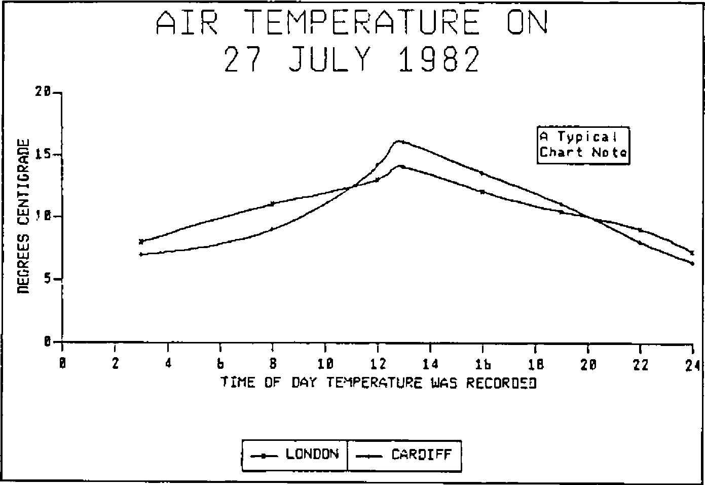
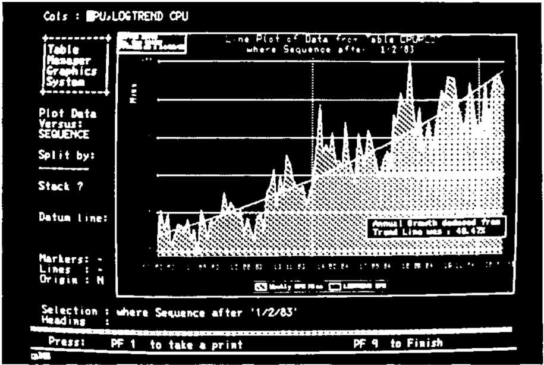
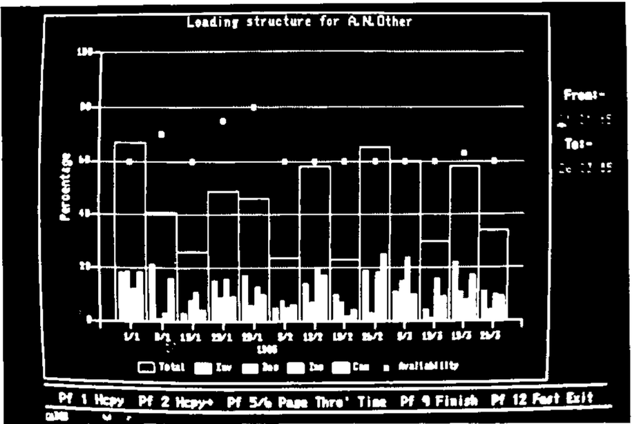
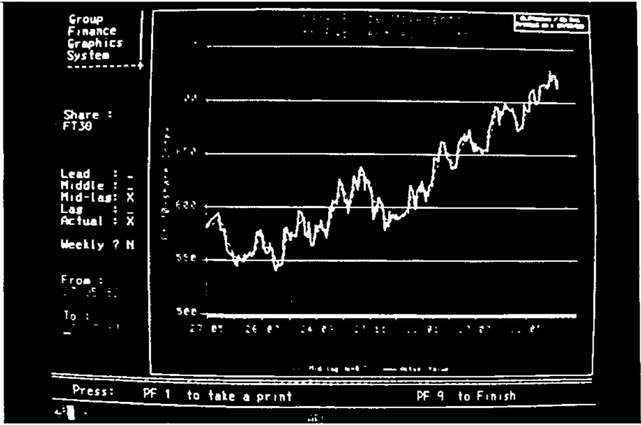

Adrian Smith (Rowntree Mackintosh)
{ .byline }

Basically, this was a slide-show to illustrate the range of use to which Rowntrees are putting GDDM. The slides began with simple alphanumeric screens, demonstrated the effective use of both field and character colours, and then moved on to simple line-drawings and finally ‘business graphics’. Several slides are reproduced (unfortunately not in colour!) on the following pages. Three points were stressed:

- you must integrate graphical output with conventional alphanumeric screens. There is nothing ‘special’ about graphics.
- you should aim for consistent results whatever route you take. Whether CICS-PL/1, Chart or APL, the end-product should look the same.
- you should make the full power and range of GDDM available to your APL systems.

A fourth (tongue in cheek?) point concerned the correct way to approach APL Graphpak; a barge-pole of at least 12ft is recommended!

## Which Way to GDDM?

Figure 1 shows the enormous variety of routes from APL to the physical screen. The first recommendation is to cross out AP124; AP126 is around 30% cheaper even for simple alphanumeric, so it makes obvious economic sense to convert to it. In particular if you want to mix alpha and graphics on the same screen (a pretty fundamental requirement in my view) you must send them both through AP126.

*How Many Routes to GDDM? — Figure 1*


The second recommendation is to ignore APL Graphpak. This goes in at the GDDM level; for reasons about to be explained this is terribly expensive, and a most inefficient use of APL. It also gives APL graphics a ‘house style’ which is instantly recognisable, but is different from everyone else: probably a bad idea in the long term.

One possible route (GDDM Release-3 upwards) is to go via the Interactive Chart Utility (ICU for short); Tim Perry of APL People has used this method with great success. For presentation graphics (not a major use of APL at Rowntrees) this is probably a very reasonable option; however I personally dislike it on two grounds:

- ICU takes over the whole screen; most of our applications require some alpha fields as well as graphics.
- ICU restricts the options available to you. It is pretty difficult (?impossible) to superimpose different chart types, to put rings round points, and generally to ‘tart up’ the finished product.

There is also a possible ‘not invented here’ element in my aversion to ICU - readers must judge for themselves.

My own favourite route from APL to graphics is as follows:

- make sure all your screen-design and screen-access utilities handle graphics naturally, not as a special case.
- push everything through AP126, which splits the requests into three types ….
    1. Alphanumeric (including field and character colouring). Character colouring is often cheaper than the same effect achieved using multiple fields, as long as you only set a few positions to be different from the background.
    2. Drawing lines, shading areas, and writing text at arbitrary sizes, angles, directions. This is handled directly by GDDM.
    3. Business graphics, with detailed control over axes, titles, labelling, chart notes and so on. This goes into PGF, which uses efficient compiled code to turn it into the basic GDDM instructions appropriate to type 2.
- provide a consistent set of APL cover functions to handle the AP126 requests. I suggest FSM… CH… GS… to cover routes 1,2,3.

## The Benefits of PGF

The main advantage of PGF is its speed; a factor of 5 at least over APL Graphpak. This implies CPU timings in the 150 - 400ms band (IBM 3083 running MVS/VSPC) for the typical range of business graphs, giving response times of between 2 and 5 sec on local screens. There is also rather less code to clutter up your workspace - Graphpak comes out at 3600 + lines of APL (some 110K); the PGF route requires a mere 543 lines (20K) of which about half is comments. In fact many of the functions are quite trivial - see for example the listings of GS.delta.DRAW and CH.delta.PIE.

```
    GS∆DRAW MAT
    -----------

[1]       ⍝DRAW A SET OF LINES FROM GIVEN STARTING POINT.
[2]       ⍝ <MAT> IS A 2-COLUMN MATRIX OF X/Y CO-ORDINATES
[3]       ⍝       OR A VECTOR WITH AN EVEN LENGTH.
[4]       ⍝⍝ Saved on  17/05/83  at  09.45.

[5]        →(2=⍴⍴MAT)↑Move

[6]       ⍝RESHAPE TO TWO-COLUMN MATRIX.

[7]        MAT←((⌊0.5×⍴,MAT),2)⍴MAT

[8]       ⍝GENERATE A MOVE TO FIRST SET OF CO-ORDINATES

[9]  Move:CTLs←528,MAT[1;]
[10]       'FAILED TO MOVE CURSOR' FSM∆ERR CTLs
[11]       MAT← 1 0 ↓MAT
[12]       CTLs←530,(1↑⍴MAT),,⍉MAT
[13]       'FAILED TO DRAW LINE' FSM∆ERR CTLs
    ∇

    CH∆PIE MAT
    ----------

[1]  ⍝FORM DATA INTO MULTIPLE PIE CHARTS, EACH
[2]  ⍝ROW OF MAT SPECIFIES THE SEGMENTS OF A SINGLE PIE.
[3]  ⍝⍝ Saved on  19/04/83  at  09.56.

[4]   MAT←(¯2↑ 1 1 ,⍴MAT)⍴MAT
[5]   CTLs←796,(⍴MAT),,MAT
[6]   'FAILED TO DRAW PIE CHART(S)' FSM∆ERR CTLs
    ∇
```

A further benefit is that PGF provides a style of graphics indistinguishable from end-user efforts (via ICU) or mainstream CICS-PL/1 through ICU or PGF. At Rowntrees we have on occasion taken users’ prototypes and rebuilt them in APL extremely accurately (adding on the odd extra feature that couldn’t be done with ICU!).

One final thought on implementation; as far as possible it pays to stick to the syntax and mnemonics used by FORTRAN, COBOL and PL/1 in devising the cover functions. I have found PGF to be an excellent package, and the documentation is first class. It saves a lot of time, effort and expense if you can simply hand someone the ‘PGF Application Programmers Guide’ (SC33-0148) and say “… for CALL CHSET please read CH.delta.SET …..”

```
    R←BIZ2;XDATA;YDATA;PF
    ---------------------

[1]       ⍝AN APL COPY OF THE PL/1 DEMO PROGRAM ON PAGE 126 OF
[2]       ⍝THE PGF MANUAL.
[3]       ⍝
[4]       ⍝THIS DRAWS AN EXTREMELY BASIC GRAPH OF TWO SETS OF NUMBERS.
[5]       ⍝WITH SOME SIMPLE ANNOTATION AND HEADINGS.
[6]       ⍝
[7]       ⍝⍝ Saved on  19/03/85  at  11.28.

[8]        XDATA← 3 8 12 13 16 19 22 24
[9]        YDATA← 2 8 ⍴ 8 11 13 14 12 10.4 9 7.2 , 7 9 14.1 16 13.5 11 8 6.4
[10]       MAT←XDATA,⍉YDATA

[11]      ⍝ESTABLISH SCREEN FORMAT (DESIGNED BY 'DRAW') ....

[12]       FSM∆FMT 'FMTPLOT32'

[13]      ⍝SET OUT CHART LAYOUT ......

[14]       'CHART' CH∆SET 'KBOX,NBOX,CBOX,CURVE'
[15]       'VMAR' CH∆SET 7 1
[16]       'HMAR' CH∆SET 9 6
[17]       0 0.5 CH∆KEYPOS 'BC'

[18]      ⍝DEFINE ATTRIBUTES FOR HEADING, LABELS, .......

[19]       'HEAD' CH∆ATT 'RED,2.5'
[20]       'LABELS' CH∆ATT 'BLUE'
[21]       'TITLES' CH∆ATT 'YELLOW'
[22]       'BOX' CH∆ATT 'CYAN'

[23]      ⍝DO HEADING, KEYS AND AXIS TITLES ......

[24]       CH∆HEAD 'AIR TEMPERATURE ON;27 JULY 1982'
[25]       CH∆KEY 2 7 ⍴'LONDON CARDIFF'
[26]       'X' CH∆TTL 'TIME OF DAY TEMPERATURE WAS RECORDED'
[27]       'Y' CH∆TTL 'DEGREES CENTIGRADE'
[28]       CH∆PLOT MAT

[29]      ⍝FINALLY BANG OUT A NOTE USING X/Y CO-ORDINATES .....

[30]       18 14 CH∆NOTE 'Z7/A Typical;Chart Note'
[31]       CH∆TERM

[32]      ⍝WRITE ALPHA FIELDS, AND HOLD FOR USER RESPONSE ...

[33]       FSM∆FILL FMTPLOT32
[34]       PF←FSM∆PFHOLD
[35]       →(Copy,Exit)IF PF=1
[36] Copy:(VALIN 'HOW MANY COPIES ? :- ')GS∆COPY 'LU40226'
[37]       '*** HARD COPIES TAKEN ***'
[38] Exit:R←'READY'
    ∇
```

*Fig. 2*



## The Future

There remains one unexplained box on Figure 1, labelled ‘PC/G’. So far IBM graphics has meant the 3279, green flashes and all. Because GDDM assembles the whole picture in the centre, then ships the finished product up to the VDU, it can take an eternity to transmit a complex chart to a remote screen. As a stop-gap the 3270-PC looks quite tempting, but suffers from being only a 24-line device. If you can make it work (we can’t, so far) you can scroll the 32-line image locally, but the pictures remain hopelessly distorted. Alternatively you can re-draw all your screens to fit on 24 lines, and then build in some code to switch formats as required (messy!).

A much more promising option (though expensive) is the 3270-PC/G. For the first time this builds the picture locally; only a ‘graphics definition file’ is sent down the line. This looks remarkably like a series of GKS commands (you can simply pop out into DOS and have a look at it!), and is usually at least 10 times smaller than the actual picture it will build. The effect on both mainframe CPU time and remote response time is obvious. As an added bonus you can get decent quality output on real HP plotters (at last including acetates) which is an enormous improvement over dot-matrix printing.

## Postscript

All the FSM functions (and the GS line-drawing routines) are easily rebuilt for APL\*PLUS/PC using the built-in quad-functions. This fits in well with Richard Nabavi’s notion of providing compatibility at the level of user-defined functions, rather than through APs. It is certainly much faster than either the AP205 on IBM’s PC/APL, or even than MicroAPL’s AP124 on the Sage. What chance a fast assembler-coded PGF look-alike for the PC/AT? It could answer a lot of prayers.



*More complex use of graphics: PGF with several ‘chart types’ overlaid.*



*Simple line-drawing (at the GDDM level)*


*Note the mix of alpha fields and graphics.*


