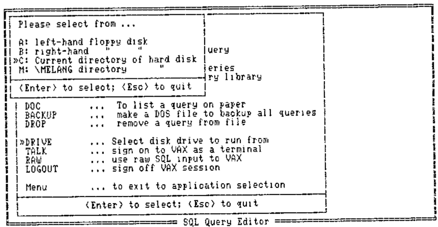
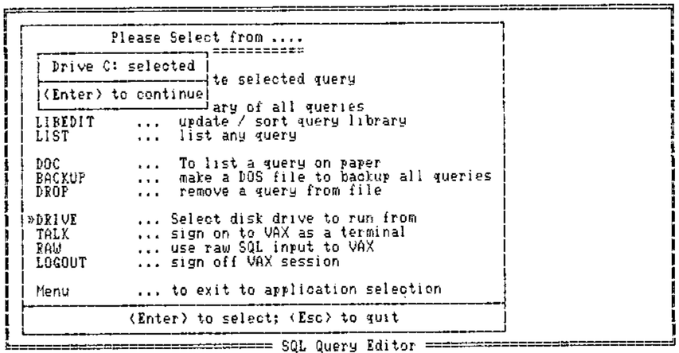
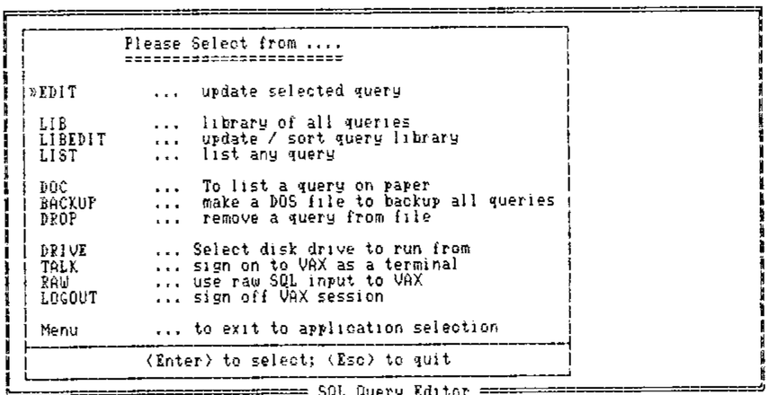
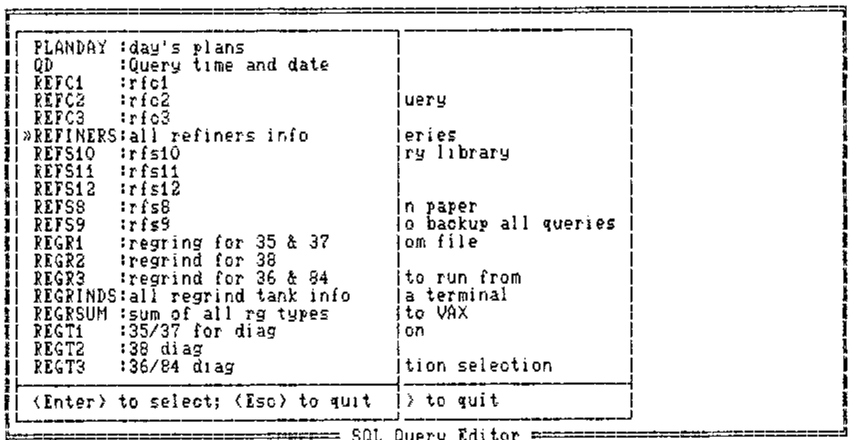
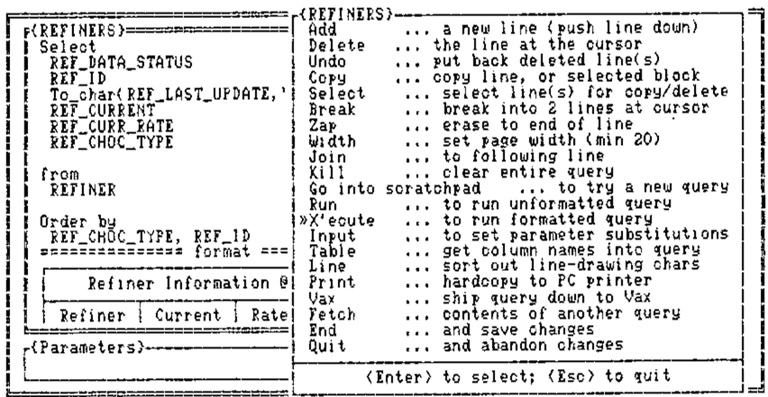
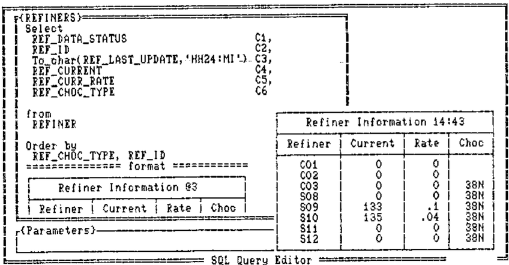

by Adrian Smith
{ .byline }

## Background

This paper was presented to the BAA in November 1987. An expanded (updated) version was also given at APL88 in Sydney. For a more complete writeup (including listings of all the windows functions) please see the conference proceedings.

Windows and pop-ups are rapidly becoming de rigeur in the design of PC applications. Unfortunately the majority of APLers (myself included) have come to the PC with a long history of mainframe design (typically AP124/6 based). The initial temptation is simply to transfer this experience to the PC, using some kind of AP126 ‘look-alike’ as the basis for update and menu selection.

Of course such systems can be made to work; the problem is that they make almost no use of the PC’s real strengths, and typically they run rather slowly in comparison with a mainframe version of the same thing.

In order to better understand the potential of window-based systems I started work on a set of window utilities (written in APL\*PLUS/PC) with no real idea of the final specification these would need. Of course my limited experience of using WIMPish applications gave me a starting point, but in general I only added functions/facilities as they became necessary to particular applications. The notes and examples which follow are a guided tour of the genesis of these routines.

## In the Beginning …

This all started with a prototype enquiry system through which shop-floor supervision could query a database of plant information (stocks, ingredient usages and so on). The brief was for something “so simple even the cat could use it”; ideally data could be accessed with little other than a ‘joystick’ interface supporting ‘up,down,left,right,fire’ commands. The initial design evolved towards a set of screens, each showing a simplified map of part of the plant.

To enquire about any part of the plant the user simply pointed to it with the cursor and hit &lt;ENTER&gt;. An appropriate query would then be run, and the answer would ‘pop up’ on top of the diagram.

To obtain more detail, one could use &lt;PgDn&gt; to ‘explode’ the diagram down to the next level of detail, and so on ….

Taking only the windows aspect of this, the basic requirements were for a utility (winHput say) which would take as arguments the required position (row,col) and a character matrix (no bigger than the screen). It would then frame it up, set a sensible background colour and overlay it on whatever lay underneath. A corresponding function (winHundo say) would restore things as they were:

```
CUPOS WINΔPUT CHARMAT     ... output data at cursor
WINΔUNDO                  ... take it away
```

This simple spec came close to covering all the requirements of the first prototype system. However two enhancements which soon proved essential were:

- some check on the requested position. If it turned out to be to low down, or too far right, the window could be moved to fit on the screen.
- up/down scrolling of long arrays. This is handled in the obvious way with the cursor arrows, PgUp, PgDn, Home and End. &lt;Enter&gt; behaves like PgDn.

I have yet to tackle left-right scrolling of wide data, it is a straightforward extension (probably using Tab and Back-tab); so far I haven’t needed it!

One further enhancement completed this phase of the evolution. Once you allow things to scroll you find you need to freeze the heading line(s) at the top. This led to the syntax:

```
(ROW,COL,FREEZE) WINΔPUT MAT
```

… which gave me all I needed to create a full prototype of the proposed information system.

## Phase-2: Pop-up Data Entry

Those of you with really long memories may just be able to recall the days before full-screen, when we wrote our input functions using quote-quad, and had little utilities like:

```
DATA←VALIN 'Please enter your age:- '
→(ASK 'Do you really want to quit? ')↑EXIT
```

I suddenly realised that I had been going through all sorts of hoops to get this effect in full-screen systems, when all I wanted was a little input window for old-style teletype mode entry:

```
2 3 WINΔOPEN 8 34   .... OPEN A WINDOW 8 BY 34 AT POSN 2,3
NAME←BAREIN  'Who are you? '
WINΔUNDO            .... GET RID OF IT AGAIN
```

It is strange how professional this looks in comparison with the same thing run from the normal APL session! The change of background colour and the smart frame make all the difference.

The windows happily stack up and unpick thenselves with no action at all from the programmer. Rather than specifying the colour of each window, I set up a default cycle of 12 ‘aesthetically pleasing’ foregrounds and backgrounds to be used in turn. So far no-one has complained, and it does speed things up if you don’t have to worry about the colour when you set up the window.

## Phase-3: The Expert System Model

Rule-induction is an aspect of expert-system development which looks particularly promising from an APL angle. Accordingly two of us set out to explore the possibilities of developing rules efficiently from sets of examples, and I used this development to complete my collection of windows utilities (at least for the moment).

The main workhorse function of this system is winHpick, which takes a character matrix (any number of rows) and sets up a slider bar which the user can move with the arrow keys. As before, PgUp, PgDn, Home and End will jump around, and in addition there is the option of hitting the initial letter of the option for an immediate selection. &lt;Esc&gt; quits and returns zero, &lt;Enter&gt; returns the index of the selected row.

```
POS←2 3 WINΔPICK MAT       .... WINDOW AT ROW+2, COL+3
```

As before, you often need to freeze a couple of lines of heading (which the scroll bar is excluded from):

```
POS←5 5 2 WINΔPICK HD,[1] MAT  ... lock top 2 lines
```

Typically a ‘pick’ window should vanish automatically as soon as a selection is made. If you want it to hang around (as in the example above) until you winHundo it, you need another flag:

```
POS←5 5 0 1 WINΔPICK MAT   ... leave it!
```

Finally, it is very handy to pass a default selection (e.g. to select the disk drive to run on you would pass the current drive as default):

```
ΔDRV←(2 3 0 0 ,ΔDRV) WINΔPICK ΔDRIVELIST
```

In practice you would probably check for a zero result (Escape) before re-assigning the variable!

Of course when you have a whole stack of windows it is very pretty to loop round `WINΔUNDO` to take them off one by one; it is much faster to restore the whole initial ‘backcloth’ screen in one shot, hence `WINΔCLOSE` which kills all outstanding windows in one go.

## Summary of Windows Routines

The basic application requirements have so far been met by the following functions:

| | |
|---|---|
| `WINΔPUT` | … data to screen |
| `WINΔPICK` | … from an array |
| `WINΔOPEN` | … an input window |
| `WINΔUNDO` | … the latest window |
| `WINΔCLOSE` | … all windows |

A certain amount of ‘intelligence’ is built in to all the routines, for example: they will all run with no left argument (default position); they choose the colour cycle depending on whether you are on colour or mono; they treat repeated ‘puts’ to the same spot as a simple refresh rather than a request to stack another window. Similarly you can ‘pull’ a window to the top of the heap just by refreshing its contents.

Rather to my surprise, all this runs very adequately fast when coded in plain old APL. Scroll bars keep up with the keyboard repeat (unless you are pushing down a very large amount of data), and the pop-ups really do! I had visions of coding the critical bits in ‘C’, but as long as you have a tolerably fast PC you will have no problems with execution speed.

## Summary of Benefits to the Developer

Simplicity and economy. I feel much more comfortable without the excess baggage of a heap of FSM functions and associated formats. The whole of the windows library is only just over 100 lines of APL (not including comments) and uses very little working storage while running (say 10K on average).

Portability of ideas. As more and more applications take on board the GEM-type interfaces, users get to expect this style from all their systems. Already APL.68000 has good hooks into the window manager on the Atari and Amiga; we should soon be able to make limited use of windows on GDDM Version 2.

Implicit validation. With a ‘pick’ window, you know that all you can possibly get back is zero, or a number in the right range. All that “Invalid day … please re-enter” code can be totally eliminated!

More flexible update. Lotus-123 is quite happy to let you put more in a cell than will fit the column width. Particularly with nested arrays it is a nonsense to fix a maximum value for (say) a name at the width of a screen column. With a window-based editing system the user can point to the row to be changed, open an input window, and enter a name of any length in ‘teletype’ mode. The fact that only the first (say 10) characters show on the screen doesn’t matter at all.

Fun. Experience to date (especially with the shop-floor system) suggests that this is not a trivial point! A system which is colourful, friendly and fast will get used; one which is dull, boring and slow (which FSM tend to be on the PC) will not.

## Footnote

At the end of the talk I handed out the best part of a box of floppies, containing the windows routines. To my great surprise, the majority of these homed within the week, and I think the last straggler made it home at the next BAA meeting!

Many of the functions returned with suggestions and improvements. Thank you all for returning the originals so promptly; I will get an updated set of routines on the software exchange as soon as I am sure that the functions have fully stabilised!












