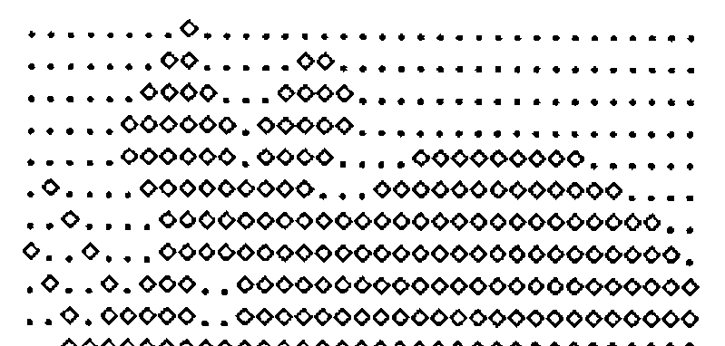

by Adrian Smith
{ .byline }

## Introduction

Some little time ago (see VECTOR 4.1 page 34) I was lucky enough to acquire a Hercules-Plus card for my monochrome system. At the time, this was supplied without an APL font (I gather from the Hercules advertising that they have now added APL to their list), so I was faced with the prospect of designing the entire APL character set from scratch. Fortunately it occurred to me that the APLCHAR.COM file supplied for APL\*PLUS/PC must somehow define the characters; I duly reverse engineered it and thus built a couple of very nice variants of the Hercules-supplied fonts for use with APL.

Of course once one had had a taste of font design, one was hooked! I had the excellent excuse that I needed a variety of funny symbols for valves, taps etc for a plant information system I was building, and anyway I had promised Richard a realistic mouse to manouevre round the simple maze I had written him! The functions listed below are all you need to handle the character definition for the EGA and VGA; I could put them on the Software library, but it hardly seems worth the bother! If you would like the code for the Herc+, please let me know – it is almost identical to the VGA as fonts are interchangeable between the two devices.

```apl
      HELP

∆FILE←'APLCHAR.COM'        ⍝ SET UP EGA FILE NAME
∆HFILE←'APLSTD.FNT'        ⍝ SET UP HERC+ FILE NAME
∆VFILE←'VGACHAR.COM'       ⍝ SET UP VGA FILE NAME

ZZZ←GETCH 252              ⍝ GET GIVEN CHAR DEFINITION
ZZZ← HGETCH '∆'            ⍝ ... HERCULES EQUIVALENT
ZZZ← VGETCH 'A'            ⍝ ... VGA       EQUIVALENT

ZZZ PUTCH 200              ⍝ REPLACE 200TH EGA CHAR
ZZZ HPUTCH 200             ⍝ REPLACE 200TH HERC+ CHAR
ZZZ VPUTCH 200             ⍝ REPLACE 200TH VGA CHAR

EDCH 200                   ⍝ EDIT 200TH EGA CHAR
HEDCH 200                  ⍝ EDIT 200TH HERCULES CHAR
VEDCH 200                  ⍝ EDIT 200TH VGA CHAR
```

## How are Fonts Defined?

Each character you see on the screen is built up from a pattern of dots; the number of dots determines the quality of the final image. The EGA system uses a matrix of 14 rows by 8 columns, i.e. the solid block is effectively `14 8⍴1`. To see how APLCHAR.COM defines a particular character you need to ⎕NREAD the right part of the file, then do a bit of base-2 encoding to make up a 0/1 matrix of the right shape:

```apl
     R←GETCH N;ZZ
     ------------

[1]  ⍝PULL IN FROM ∆FILE ('APLCHAR.COM') AND THEN DECODE CHAR N

[2]   ⍎(0=0=1↑0⍴N)/'N←⎕AV⍳N'
[3]   ⎕NUNTIE ⎕NNUMS ⋄ ∆FILE ⎕NTIE ¯2

[4]  ⍝LOSE 1ST 44 BYTES; REMAINDER IS IN 14-BYTE CHUNKS ...

[5]   ZZ←⎕NREAD ¯2 82 ,14,44+(N-1)×14 ⋄ ⎕NUNTIE ¯2

[6]  ⍝NOW LOOK UP AND BREAK INTO BINARY FORM ....

[7]   R←⍉(8⍴2)⊤¯1+⎕AV⍳ZZ ⋄ R←'.*'[1+R]
     ∇
```

Things are a wee bit harder for the VGA; here each character occupies a 16 by 9 grid, but the 9th column is set for you by the hardware. It is always zero for text characters (i.e. there is always space between the characters even if you set up a solid block), and it always repeats column-8 for the line-drawing set. This means that if you want a multiple character Icon (such as my mouse which uses 4 characters from nose to tail) you must use ⎕AV[180 TO 220] for your work. This is rather a nuisance, as there are only so many spare line drawing characters to attack; if you aren’t careful you will find your nice window borders suddenly acquire nose and whiskers!

Here is the corresponding code to examine VGACHAR.COM:

```apl
     R←VGETCH N;ZZ
     -------------

[1]  ⍝PULL IN FROM ∆VFILE ('VGACHAR.COM') IN VGA FORMAT,
[2]  ⍝AND THEN DECODE CHAR N

[3]   ⍎(0=0=1↑0⍴N)/'N←⎕AV⍳N'
[4]   ⎕NUNTIE ⎕NNUMS ⋄ ∆VFILE ⎕NTIE ¯2

[5]  ⍝FILE IS IN 16-BYTE CHUNKS ...

[6]   ZZ←⎕NREAD ¯2 82 ,16,47+(N-1)×16 ⋄ ⎕NUNTIE ¯2

[7]  ⍝NOW LOOK UP AND BREAK INTO BINARY FORM ....

[8]   R←⍉(8⍴2)⊤¯1+⎕AV⍳ZZ ⋄ R←'.*'[1+R]
     ∇
```

Now you are ready to start changing things! First of all you should take a copy of the standard character set with a new name! Then you simply pull it into the workspace, hit it with ⎕EDIT, and reverse the process to patch it back into the original file. Here are the functions for the EGA system:

```apl
     R←EDCH N;CHAR;INS;SHAPE
     -----------------------

[1]          ⍝GET CHAR FROM EGA DEFINITION, EDIT AND REPLACE

[2]           CHAR←GETCH N ⋄ SHAPE←⍴CHAR

[3]          ⍝ENSURE KEYBD IS IN REPLACE MODE ...

[4]           INS←0 ⎕POKE 149
[5]           ⎕EDIT 'CHAR' ⋄ →(Rewrite,Quit)IF 20=⎕PEEK 258
[6]  Rewrite:CHAR←SHAPE↑CHAR ⋄ R←CHAR PUTCH N ⋄ →Rest
[7]     Quit:R←'Changes abandoned  ..... ready'
[8]     Rest:INS←INS ⎕POKE 149
     ∇

     R←MAT PUTCH N;ZZ
     ----------------

[1]  ⍝Replace Nth char in ∆FILE ('APLCHAR.COM') in EGA format
[2]  ⍝with MAT (suitably encoded)

[3]   ⍎(0=0=1↑0⍴N)/'N←⎕AV⍳N'

[4]  ⍝Default to EGA set if nothing passed

[5]   ⍎(0=⎕NC 'MAT')/'MAT←∆CH[N;;]'
[6]   ⎕NUNTIE ⎕NNUMS ⋄ ∆FILE ⎕NTIE ¯2

[7]  ⍝FILE IS IN 14-BYTE CHUNKS AFTER 44-BYTE HEADER ...

[8]   ⎕AV[1+CODECH MAT]⎕NREPLACE ¯2,44+(N-1)×14 ⋄ ⎕NUNTIE ¯2
[9]   R←'Char loaded .... ',⎕AV[N]
     ∇

     R←CODECH MAT
     ------------

[1]  ⍝ CODE EDITABLE CHARACTER INTO INTEGER FORM ...
[2]   R←⌊2⊥⍉MAT∊'⋄*'
     ∇
```

…. and for the VGA you do much the same, only please note that it is pointless changing column-9!

```apl
     R←VEDCH N;CHAR;INS;SHAPE
     ------------------------

[1]          ⍝GET CHAR FROM VGA DEFINITION, EDIT AND REPLACE

[2]           CHAR←VGETCH N ⋄ SHAPE←⍴CHAR

[3]          ⍝ENSURE KEYBD IS IN REPLACE MODE ...

[4]           INS←0 ⎕POKE 149
[5]           ⎕EDIT 'CHAR' ⋄ →(Rewrite,Quit)IF 20=⎕PEEK 258
[6]  Rewrite:CHAR←SHAPE↑CHAR ⋄ R←CHAR VPUTCH N ⋄ →Rest
[7]     Quit:R←'Changes abandoned  ..... ready'
[8]     Rest:INS←INS ⎕POKE 149
     ∇

     R←MAT VPUTCH N;ZZ
     -----------------

[1]  ⍝Replace Nth char in ∆VFILE in VGA format
[2]  ⍝with MAT (suitably encoded)

[3]   ⍎(0=0=1↑0⍴N)/'N←⎕AV⍳N'

[4]  ⍝Default to EGA set if nothing passed

[5]   ⍎(0=⎕NC 'MAT')/'MAT←∆CH[N;;]'
[6]   ⎕NUNTIE ⎕NNUMS ⋄ ∆VFILE ⎕NTIE ¯2

[7]  ⍝FILE IS IN 16-BYTE CHUNKS ...

[8]   ⎕AV[1+16↑CODECH MAT]⎕NREPLACE ¯2,47+(N-1)×16 ⋄ ⎕NUNTIE ¯2
[9]   R←'Char loaded .... ',⎕AV[N]
     ∇
```

If you want to do multiple-character icons (such as the mouse in the example below) you can quickly hack together the code to get and replace the appropriate block of ⎕AV.

## Examples of Use

The basic reason for using redefined text characters rather than genuine graphics is speed; text is at least an order of magnitude faster. For example, to put an entire plant diagram on screen takes around 1/5th of a second in text mode as against some 20 sec as a graphic! Icons also benefit from being small. I wanted a cursor-selectable ‘mailbox’ on every screen of my system; by redrawing just 2 characters I made a very respectable pillarbox, and two more gave me the ‘signpost’ to go alongside it.

You must also use text if you want true animation. The mouse keeps up very comfortably with the cursor repeat (on the PS/2 you can even use a ‘fast cursor’ poke) which is essential if the game is to be any sort of test of the user’s dexterity!



There is only one snag I can think of; if you want hardcopy you also have to do the download characters for your Epson, which is tedious in the extreme as the character box is now 11 by 9. So far, I haven’t got round to it, which is why there are no illustrations of the mouse in action!

Oh, and do be a little careful in your choice of characters. I used quad and quad-quote to make my pillarbox, as they look roughly right in their natural state. Any code with lots of quad-functions in it looks pretty peculiar when you edit it!
