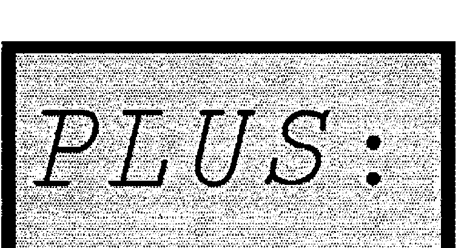

*by Adrian Smith*
{ .byline }

While the rest of you were living it up in New York, your VECTOR editor has been quietly beavering away at the task of coding up a decent PostScript font for APL. Obviously I want to use this in VECTOR as soon as I can, so I thought a good start would be to print a complete list of the characters and invite comments:


This is set at 30pt (before reduction from A4 to A5) and was printed on my LQ-500 dot-matrix with GoScript (as were the rest of these two pages). Of course you can in principle set the APL as big as you like:



… but the font isn’t really designed to be blown up quite to this size! To be technical about it, it uses *stroked* rather than *filled* characters. These are much easier to handle (for the PostScript novice) and give quite a fair impression of the 2741-golfball original as long as you don’t look too closely! Just for interest, here are the definitions of ⍺ and ⍵ as used in the above font:

```
/ALPHA
 { newpath 1 setlinecap 1 setlinejoin
   40 setlinewidth
   504 448 moveto
   508 280 420 20 280 20 curveto
   56 20 56 448 280 448 curveto
   450 450 490 -240 574 130 curveto
   stroke
 } def

/OMEGA
 { newpath 1 setlinecap 1 setlinejoin
   40 setlinewidth
   200 450 moveto
   -100 0 220 -170 340 300 curveto
   220 -170 640 0 530 450 curveto
   stroke
 } def
```

Once you get the hang of Bezier Curves, you need astonishingly little code to define even quite complex shapes. Of course I prototyped my PostScript in APL, and quite a lot of the ‘boilerplate’ in the above definition was generated automatically.

The things I would most appreciate comment on:

- how closely should I stick to the 2741 original? I have tried to ensure that overstrikes really are true compound characters, but you will notice that this leads to a slightly asymmetric ⍉, and that the stile only just penetrates the top of the delta in ⍋. I have made ⍳ a little more curly than standard, and have reshaped the leg of the *R*. Also I cheated on ⍝ which is not quite a true overstrike.
- the lower-case letters. The IPSA font (see page 89) seems to me to be totally inappropriate; I have tried for something much more like IBM’s font as used in the APL2 Reference Manual … basically Courier-Oblique sized to match the APL caps. Comments please!

My target is to run the January 1990 issue on an HP Deskjet+ using GoScript. Incidentally, this text is set in *Palatino*, rather than the standard Times-Roman. Did you notice the difference?!
