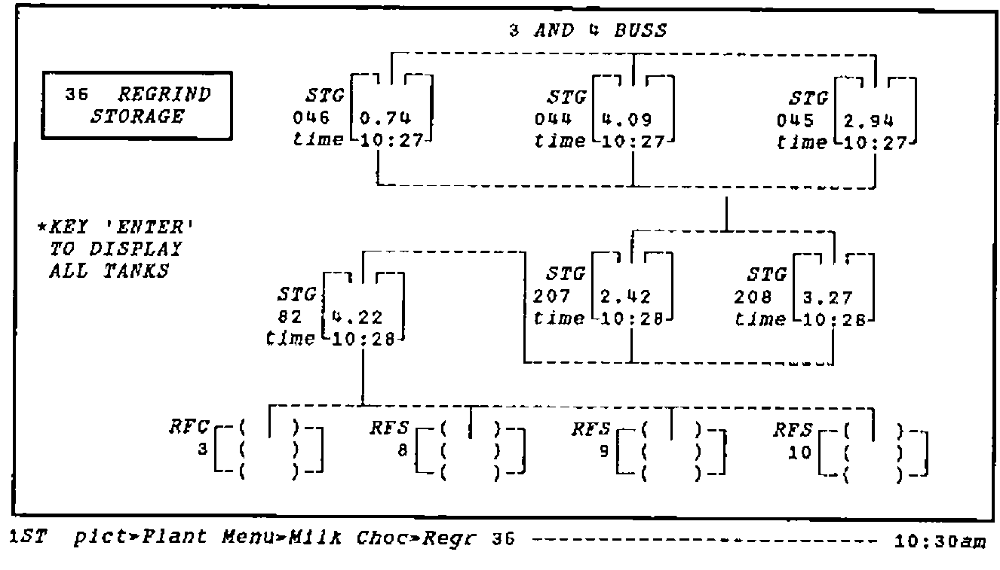

*by Adrian Smith*
{ .byline }

## Background

*ORIEL* is an easy to use front-end designed to make data in an Oracle database accessible to shop-floor personnel. The need for such a system arose partly from the special conditions in the chocolate-making department; this is spread over 8 floors of an old building, and it is quite impossible for a team-leader physically to monitor all the machines in his area. The department was also quite unusual in having an extensive degree of computer monitoring and control at the machine level; much of the current plant status was collected on an old PDP-11/44 and used to run shift-end reports.

The departmental manager had for some time been aware that there was a gulf between the machine-level systems (which monitored and adjusted ingredient flow on a second-by-second basis), and the 4-weekly reporting cycle available to him through the Factory Accounting procedures. Typically, a machine feed could drift out of calibration, and the incorrect ingredient usage would not be detected until several weeks after the event!

He realised that most of the data he needed to control the plant at the shift and weekly level was available somewhere in the machine systems, however:

- much of it was only available at a single display, or was printed out and discarded at the shift end. Often the printers were out of paper or ribbon, and the information was lost.
- there was no easy way (other than laboriously by hand) of cross-matching the output from one process with the input to the next.
- many existing readings (e.g. from load-cells on chocolate tanks) were suspect, due to lack of recent calibration.

He also knew that for an information system to be used on the shop-floor, it had to be absolutely straightforward in operation, and that the information shown must be accurate, and as up to date as possible. Another clear requirement was the need for a simple messaging system, which could be used at shift-changeovers, or to communicate between the team-leaders and the departmental management.

## General Description

The final system design evolved through a series of prototypes over the course of about 9 months. During this time, the decision was taken to collect the plant information into an Oracle database, running on an independent computer (a DEC MicroVax II), and much of the preliminary database design was done. A program of calibration and checking was also instigated, as it was important that the new system gave accurate results from day one.

The final prototype made heavy use of ‘PC’ features such as colour, windows and the ability to ‘time-out’ and refresh screens automatically. For this reason the PC was chosen as the user-interface to the system, in preference to a standard terminal such as a VT-200. The combination of PC and Vax network led to an initial configuration as shown below:

*A Simple Schematic of the Network*
{ .caption }

The user works with a set of plant diagrams, running preset SQL queries by moving the cursor to the appropriate area of the picture and pressing "Enter". If he requires more detail he can usually do "PgDn" to access a more detailed diagram of a specific area of the plant, and hence more detailed queries. There are various options for the expert user, e.g. he can jump directly to the picture he wants, or can set up a ‘tour’ on a single key, which will run a preset sequence of queries for him.

*A typical Plant Diagram with some Oracle data displayed*
{ .caption }

The diagrams and queries are developed using a variety of window-based drawing and editing tools. Typically an SQL query can be assembled and tested very much faster in this environment than in raw Oracle. Queries are saved on the PC until fully debugged, and are then transferred to the MicroVax for production use. In general each query has an associated ‘pro-forma’ into which the data is fed. This provides a very flexible way of laying out reports (and defining simple graphics).

## Examples of use in Chocolate Manufacture

As mentioned in the introduction, one of the key requirements of the Oriel development was to provide ingredients control information to the Team Leaders so that they could take immediate corrective action. A typical display (please note that the recipe figures have been obscured for security reasons) is shown on the following page:

*Typical Ingredients Control Information*
{ .caption }

*Display of Selected Chocolate Storages*
{ .caption }

In the top picture, the feed rates are shown, along with the average feed rate for the run, and the variance of the average from Recipe (SPI) is displayed in barchart format. I have deliberately chosen a time very early in a run, so the average rates are well away from SPI; typically they all converge within 2% after an hour or so.

Another important use of the system is to allow staff to monitor the stock levels in the intermediate and finished storages. It is vital for them to know exactly where chocolate is when they are faced with a sudden change in requirements (typically resulting from a breakdown) from a user department. The lower picture illustrates part of the Kit Kat storage area.

Note that all the data is shown with its time of collection from the plant; this is important, because if part of the network goes down the system will still show the most recent information available. Typically the times will show that the data is between 2 and 5 minutes old.

## Some Technical Details

Oriel runs on an IBM PC (or compatible) with at least 420K of free memory and either an Ethernet connection or a serial port. A colour screen is desirable, with the EGA or VGA type preferred.

Asynchronous Connection to the Vax:

> The windows front end is "plug compatible" with a standard DEC VDU (VT 100), i.e. it can be used over a serial connection direct to a Vax, via a terminal server, or even over a telephone line (although this would give dreadfully slow response).

Ethernet Connection:

> If a PC already has a network connection (DEPCA or 3Com) Oriel can use this to link directly to an SQL task on the Vax with the PCSA Task-to-Task software. Please note that the free system memory must be sufficient (416K is the absolute minimum) after all the network drivers are loaded.
>
> This is the preferred way of installing Oriel, and this type of connection is required for the analyst who is developing and maintaining a Oriel system.

The implementation of Oriel in the York chocolate-making operation involves roughly 40 diagrams, and 150 Oracle queries. An APL\*PLUS/PC run-time license is currently required to use the system; the cost of these is around £100 each. Oriel will be re-implemented on IBM’s APL2/PC during 1990. This provides unlimited free runtime copies with no conditions on their use.
