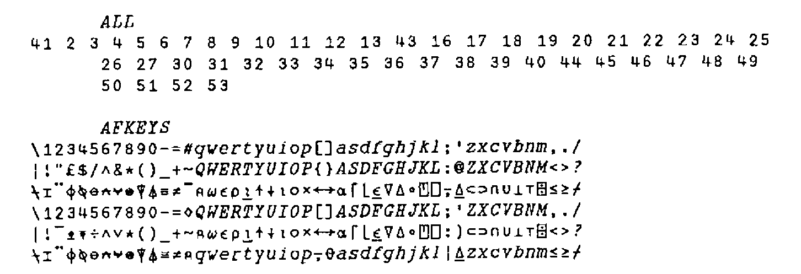

*introduced by Adrian Smith*
{ .byline }

I recently came by a fascinating IBM Research Report (due out shortly in QuoteQuad) by the venerable Adin Falkoff. This was entitled ‘Dual Keyboards are Better’, and was a well-argued case for retaining the dual-mode APL/Text arrangement. Having read his report, I then looked through some of my recent APL\*PLUS/PC code, where I have strayed towards `i←⍳⍴p` rather than `I←⍳⍴P`; I have no doubt that Adin is absolutely right: the upper-case is much easier to read!

This is in interesting contrast with normal text, for example road-signs which are always in lower-case for better readability. With APL it turns out that there is far less chance of confusion between the capitals and many of the symbols, such as `○⍳∊⍴`, to name but a few. The *ITALIC* nature of the APL character set helps to remove any remaining ambiguity.

Next, Adin turns towards the best keyboard layout, given that the ‘classic’ APL keyboard was heavily constrained by the geometry of the Selectric Golfball, and is in many places thoroughly illogical. His first precept is that if a symbol is shown on a key, then that is where it should go; obvious instances being `[]` and `<>`. This immediately breaks up the nice grouping of `+-×÷`, but has many compensating advantages. In general the overstruck symbols can go on the Alt-base symbol, for example `≤≥` are on ALT-`<>` and so on.

I have been running both APL\*PLUS/PC and my mainframe keyboard with a sort of ad hoc mixture (I put the [] on the [] keys, for instance) for years, so it was very little trouble to switch APL\*PLUS/PC to use Adin’s layout. Of course it required a little adaptation for the UK keyboard (¨ stayed with "), but I have very quickly become accustomed to it, and would like to offer it to Vector readers to try out.



This layout is suitable for the UK Enhanced keyboard. If you run the APL\*PLUS standard system (users of the extended system or APL\*PLUS II can have fun typing in lots of key= lines in their config.APL) you can hit the whole keyboard at one shot with the following little function:

```apl
      ZZ←ALL KB∆SET AFKEYS

    ∇ R←KEY KB∆SET DEFN;MODE;TAB
[1]  ⍝REPLACE CURRENT KEY DEFINITIONS WITH TABLE SUPPLIED.
[2]  ⍝
[3]  ⍝ <KEY>  IS A VECTOR OF KEY NUMBERS
[4]  ⍝ <DEFN> IS A MATRIX OF CHARS WITH AS MANY COLS AS THERE
[5]  ⍝        ARE ELEMENTS IN <KEY>.
[6]  ⍝
[7]   MODE←0,⍳¯1+1↑⍴DEFN
[8]   TAB←256⊥⎕PEEK 198 197
[9]   R←(¯1+⎕AV⍳DEFN)⎕POKE TAB+MODE∘.+8×KEY-1
[10]  R←'Keys redefined .... ',,⍕DEFN,[1]' '
    ∇
```

I suggest you try it for a day or two. I feel that for anyone who programs in languages other than APL, but wants to keep their code as readable as possible, it is a big step forward over the existing APL/text arrangement, or over any of the dual layouts I have seen. Comments please!
