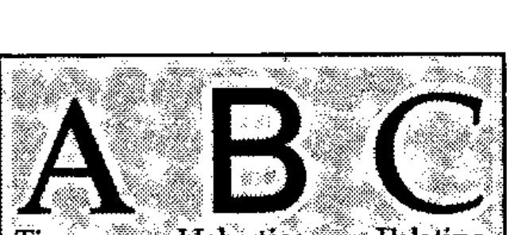
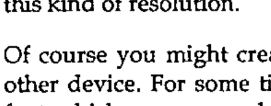
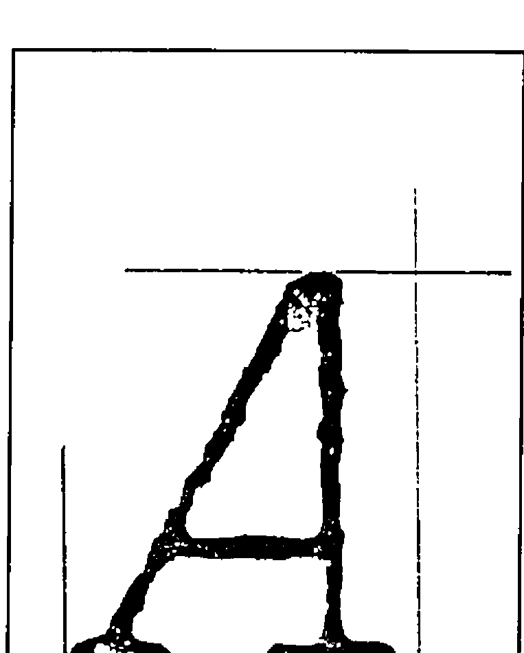
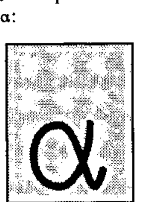
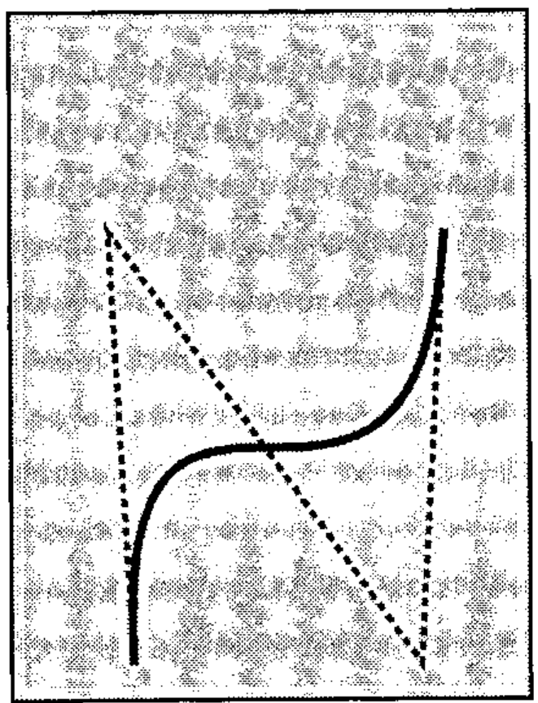

*by Adrian Smith (Rowntree Mackintosh)*
{ .byline }

## Abstract

As well as a unique character set, APL has in the past been distinguished by a unique typeface: the 2741 golfball. This consistency of typography is in danger of being lost as more and more APL typefaces appear on the market. These vary from quite acceptable (e.g. the Laserjet fonts from STSC) to absolutely awful (most of the Mac fonts I have seen). The typographic language of the future is clearly PostScript; a good PostScript version of APL’s original typeface is clearly a must if we are to retain the visual identity of APL code.

In order to design a typeface, you need to show it on the screen, along with its bounding box and various guide-lines. In the case of APL you also need to check that the compound symbols register correctly when overstruck. Fortunately the syntax of PostScript is sufficiently APL-like that it is quite easy to write a reasonable subset of PostScript in APL. This can then be used to draw the characters on the screen (scaled as required) and then to write the completed definition to disk for processing by a genuine PostScript device.

The completed typeface is best described as an original design in the style of the 2741 golfball. It includes all the APL\*PLUS/PC characters, all the APL2 characters, the PC line-drawing characters, and any others I have come across (e.g. the quad-arrow combinations from APL.68000). It is scalable to any required size, and conforms to the font metrics of courier-oblique. The character encoding is APL\*PLUS/PC by default, but can easily be changed to suit any requirements. It is available to any APL or publishing organisation which can make use of it.

## Introduction: Why is a Raven like a Writing Desk?

Just what is this thing called PostScript? Most people will have heard of it, but I suspect that few of us APLers know what it actually is. The common view is that it is some kind of printer-control protocol (a bit like the \015 that you send to your Epson to put it into compressed mode), but of course much more powerful and even harder to understand. This view is only confirmed if you make a superficial examination of the kind of junk that the average word-processor generates when you send your document to a PostScript printer. It looks a bit like this:

```
1296 12448 P 0 12 F 26 15 F B (Introduction:) S E
1296 12768 P B (Why) S 75 J ( is) S 75 J ( a) S 75 J ( Raven) S 75 J (
like) S 75 J ( a) S 75 J ( Writing) S 75 J ( Desk?) S E
```

… you might just make out the subheading at the top of the preceding paragraph! This all serves to conceal the fact that PostScript is actually a very powerful, general-purpose programming language, which just happens to be rather good at handling text. When I first got interested enough to go out and buy the two standard works on the subject [1] and [2] I began to have a strange sense of déja vu:

- see for instance page 77 of the Cookbook: "PostScript arrays are one-dimensional collections of objects. …. PostScript arrays are different from those in other languages in that their elements need not all be of the same type. That is, a single array may contain, for example, strings, integers, dictionaries, and other arrays." There is even a *forall* operator to process each element of an array without the need for an explicit loop!
- OK, so here we have a general-purpose programming language with nested arrays. I can cope with that … what about its attitude to functions and variables? We find on page 28: "A variable is defined by placing the variable’s name and value into the current dictionary. This is done with the *def* operator, as in */ppi 72 def*." In other words `PPI←72`, without any fuss or bother. Functions are defined in a very similar way: */inch {72 mul} def* is the equivalent of `INCH: 72×⍵` in I-APL’s direct definition.
- a couple of other parallels struck me immediately. The first was the use of arrays to manipulate text on the page. The reference manual (page 64 onward) spends some time explaining the use of transformation matrices in scaling and rotating text. The second is the refreshing lack of any operator precedence. Being stack-based, PostScript works backwards, but at least it is consistent about it, and an APLer can quickly get into the habit of thinking left to right rather than right to left!

I hope that gives you enough background to appreciate that the idea of implementing a reasonable subset of PostScript in APL\*PLUS/PC is not only practical, but actually rather simple! Before I go on to explain how the workspace is put together, I feel I should add a little more background on why I felt the need to bother.

## A Short History of APL Typography

Once upon a time, long ago and far away, a little old man worked long hours alone in his little old house, chiselling away at a strangely shaped piece of bright metal. As he cut away, he uttered incantations like "⎕ goes near the equator ’cos it’s fat; | is nice and slim … further North for him …. ". Little did he know that centuries after his death, his work would be rediscovered and used as the basis of a worldwide revolution in mathematical notation.

The 2741-golfball, for such it was that the little old man had accidentally created all those years ago, formed the basis for APL typography for at least the first ten years of the language’s existence. It is a brilliant piece of design, fitting as it does a variety of symbols of differing widths into a standard 10-chars-per-inch Selectric typewriter. It permits endless combinations of the basic symbol set (overstrikes) to allow the notation to be extended almost without limit. It also looks really good on the page!

Since those early days of APL, we have been treated to an ever greater range of display and output devices, and (with a few honourable exceptions) APL typography has gone rapidly downhill. As editor of Vector, I have had to live with Xerox’s attempt (APL-A10) at a font for their 3700 laser printer. Much of it is quite acceptable, but the `⍳` looks like some combination of a backwards Upstile overstruck with a downstile! [3]. I also get to see the originals of submitted papers, often on lovely HP-laserjet with the APL bits written in by hand. Alternatively it will be dot-matrix with STSC’s T=3 graphics output to an Epson printer.

In short, we have almost lost our visual identity, and in consequence we are finding it harder and harder to underline the difference between APL (which I still believe is first and foremost a notation) and all the other fancy things you can do with computers these days. I decided that I would like to see two things happen:

- someone should recreate the original 2741 font (extended to include lower-case and the full ASCII set) in PostScript, and make it available to the APL community.
- the APL group on the ISO should take up APL typography as an important issue, and should recommend a standard APL typeface for use in all APL-related publications. It would also help the typeface designer if there were standard names for all the APL symbols!



My hope is that this will once again give *APL* a clear visual identity; 10 years’ experience in the confectionery industry tells me that this can only be beneficial when it comes to marketing the product out there in the real world.

## How to Build a Typeface

Just what goes into making an ‘A’? There are really two ways of doing it: the first option is to set out a grid of zeros and ones, with the ones representing the dark spots, and the zeros the light spots. This lets you define any character at any size, as long as you have enough patience to type in all those zeros and ones! For the old 9-pin FX-80 you work with 8 rows of 11 columns, and the process is fairly painless. The results, however, are only just acceptable! The second option is to define your character as a series of vectors, which may enclose areas to be shaded in. This is what PostScript refers to as a scalable outline font, and is how all the standard typefaces are defined (See box).

Each method has its advantages and drawbacks. The main benefit of the binary image method is that you have exact control over every dot; on a decent printer such as the LQ-500 (a typical 24-pin device) the results can be really excellent [4]. The drawback is the inordinate length of time needed to create a complete font at this kind of resolution.

Of course you might create your dot-font by scanning in text printed on some other device. For some time, Ed Cherlin [5] has been using a PostScript image font which was scanned from an old 2741! This is again quite effective, but of course it faithfully reproduces all the errors in the original rendition! For example in his `⍝`, the `∘` and the `∩` are ever so slightly offset.



The scalable outline (as its name suggests) can be scaled to any size, and written in any direction. However it does leave you open to rounding errors when written too small on a low-resolution device (see box). In spite of this minor disadvantage, I felt that the benefits of being able to set my APL any size I liked far outweighed the slight loss of control over small characters.

Fortunately, when I tracked down an old listing and put it under the low-power microscope, I realised that the 2741-golfball had simply been engraved with a fixed width tool, in other words the font could be built from a series of line segments of fixed width (what PostScript calls a *stroked* font) with only a very few characters (such as `,'`) requiring filled outlines. This is just like the `Courier-Oblique` font which all PostScript printers already provide, so I had somewhere to start from.



The next stage was to decide on a co-ordinate system, and to plot out the vectors needed for each character on this grid. Because I wanted to match 12-point Courier (one point = 1/72 of an inch) I needed to get 6 chars to the inch vertically and 10 to the inch horizontally at this size. The most convenient grid turned out to be an x-range of 0-720 (with the widest character occupying 0-600), and a y-range of 0-1200 (with descenders down to about -100 and the top of the `⎕` at 700). What I now needed was a complete print of the original font 7cm high, preferably on centimetre graph-paper! Several hours’ work with the photocopier on 156% produced a set of samples like the one on the right, and all that was left was to measure up and plot out the resulting vectors.

## Where APL came into it

PostScript has one very serious drawback: it expects to find a printer as its output device. This means that in order to test out your creations, you really have no alternative but to print them out. I very rapidly found that I needed to see the characters on the screen (preferably overlaid with some xy-axes) to check how they looked. This was particularly vital for characters which would need to be overstruck, such as `⎕` and `|`, or the lower-case characters *abc* which I had to make up as I went along.

This led me to wonder just how hard it would be to write something in APL which would take a simple PostScript fragment and draw it on the screen. As an example, here is the PostScript for *A*, and the stages needed to generate the APL code to draw it on the screen (in APL\*PLUS/PC):

```
/A
 { % PostScript code to draw APL A on 720 by 1200 grid
   % (assumes all lines are 40 units thick)
   20 20 moveto 150 0 rlineto
   370 20 moveto 188 0 rlineto
   70 20 moveto 420 680 lineto
   40 0 rlineto 470 20 lineto
   175 215 moveto 470 215 lineto
   stroke
 } def
```

```apl
⍝ as an APL character vector

 20  20 MOVETO ⋄ 150   0 RLINETO
370  20 MOVETO ⋄ 188   0 RLINETO
 70  20 MOVETO ⋄ 420 680 LINETO
 40   0 RLINETO ⋄ 470 20 LINETO
175 215 MOVETO ⋄ 470 215 LINETO
STROKE
```

```apl
⍝ rebuilt as APL function

∆∆∆∆
 20  20 MOVETO  ⍬
150   0 RLINETO ⍬
370  20 MOVETO  ⍬
188   0 RLINETO ⍬
 70  20 MOVETO  ⍬
420 680 LINETO  ⍬
 40   0 RLINETO ⍬
470  20 LINETO  ⍬
175 215 MOVETO  ⍬
470 215 LINETO  ⍬
STROKE          ⍬
```

I worked with character vectors (called simply `'A'`, `'ALPHA'` etc.), and (being lazy) I used `⋄` to separate the commands, rather than taking the trouble to split the lines intelligently. Because you can’t define an APL function with a left argument only, all my drawing routines were of the form `∇ ARG FOO DUM`, with no explicit results. Hence the patch of `⍬` to the right of all the functions before execution. The PostScript philosophy is to leave the paper blank until a *stroke* or *fill* operator is encountered, so I did the same and simply built a 3-column numeric matrix of x/y pairs and a boolean to indicate ‘pen-up’ or ‘pen down’. `STROKE` then writes this array to the screen, and clears it down having done so.

```apl
    ∇ NEWPATH DUM
[1]  ⍝ Set up an empty path. Cols are [x,y,0/1]
[2]   PATH← 0 3 ⍴0
    ∇
```

```apl
    ∇ X LINETO DUM
[1]  ⍝ Add drawn segment to path.
[2]   PATH←PATH⍪(SCALE×OFF MOVE 2⍴X),1
    ∇

    ∇ R←OFF MOVE MAT
[1]   R←MAT+(⍴MAT)⍴OFF
    ∇

    ∇ STROKE DUM;SEG;LEN
[1]  ⍝ Draw line segments in PATH, and clear it.
[2]  Loop:LEN←(1↓PATH[;3])⍳0
[3]   SEG←(LEN,2)↑PATH
[4]   GS∆DRAW SEG
[5]   PATH←(LEN,0)↓PATH ⋄ →(1↑⍴PATH)↑Loop
    ∇
```

All I now required was a simple driver function to draw the grid and execute the transformed pseudo-PostScript as an APL function:

```apl
    ∇ RES←DO LTR;PATH;OFF;SCALE
[1]  ⍝ Test out Postscript Letter
[2]   GS∆INIT ⍙GTYPE ⋄ GS∆WIN 1000 XY∆MAX GS∆QPS
[3]   OFF← 0 250 ⋄ SCALE←0.95 ⋄ NEWPATH ⍬
[4]   GS∆USE 'DOT,CYAN'
[5]   GS∆DRAW BOX SCALE×OFF MOVE 0 ¯250 600 700
[6]   GS∆DRAW SCALE×OFF MOVE 0 0 600 0
[7]   GS∆DRAW SCALE×OFF MOVE 0 530 600 530
[8]   GS∆DRAW SCALE×OFF MOVE 325 0 325 700
[9]   GS∆DRAW SCALE×(OFF+ 238 0)MOVE 0 0 175 700
[10]  GS∆USE 'SOLID,YELLOW'
[11]  ∆EX LTR
[12]  RES←∆PFHOLD ⋄ →(RES=6)↓Exit ⋄ GS∆COPY
[13] Exit:GS∆TERM ⋄ RES←'Ready'
    ∇

    ∇ ∆EX MAT;∆∆∆∆
[1]  ⍝ Execute tidied up MAT
[2]   MAT[(MAT=⎕TCNL)/⍳⍴MAT]←'⋄'
[3]   MAT←'⋄' ∆TAB MAT
[4]   ⍎⎕FX '∆∆∆∆' CAT MAT,'⍬'
    ∇
```

To go the other way and generate the PostScript code is really just a matter of eliminating the diamonds, adding some {}, changing the comments to % signs, and making everything else lower-case:

```apl
  ∇ RES←PS CHAR;MAT;LDC;POS;STRK;NPTH
[1]  ⍝ Wrap up char in PostScript definition
[2]  ⍝ All linedrawing chars get SQUARE ends.
[3]   RES←'' ⋄ POS←∆AV[;1]⍳CHAR ⋄ →(POS>1↑⍴∆AV)↑0
[4]   LDC←CHAR∊⎕AV[179+⍳45]
[5]   CHAR←7↓∆AV[POS;] ⋄ RES←'/',CHAR~' ' ⋄ →(2≠⎕NC CHAR)↑Ndef
[6]   CHAR←⍎CHAR
[7]   MAT←DTR ⎕TCNL ∆TAB ∆NEATEN CHAR~'⋄'
[8]   RES←RES VCAT ' { '
[9]  ⍝ Prefix with line width and style for square chars ...
[10]  RES←RES,LDC/'0 setlinecap 0 setlinejoin'
[11]  RES←RES VCAT VPACK(((1↑⍴MAT),3)⍴' '),∆LJUST ∆LOWER MAT
[12]  RES←RES VCAT ' } def'
[13]  RES←RES VCAT ' ' ⋄ →0
[14] Ndef:RES←RES,' {} def'
[15]  RES←RES VCAT ' '
    ∇
```

```apl
⍝ Part of ∆AV, which records the character names and
⍝ encoding position

    A  65 /A
    B  66 /B
    ⍺ 224 /ALPHA
```

```apl
    ∇ R←VPACK OBJ
[1]  ⍝ Pack matrix with CR on the end.
[2]   R←OBJ ⋄ →(2>⍴⍴OBJ)↑0
[3]   R←¯1↓(,(⌽∨\⌽OBJ≠' '),1)/,OBJ,⎕TCNL
    ∇

    ∇ R←A VCAT B
[1]   R←A,((⎕TCNL≠¯1↑A)/⎕TCNL),B
    ∇
```

… and the entire font can be built with the addition of a prefix, an encoding vector, and a suffix:

```
%% Font definition header text for APL
/newfont 12 dict def
newfont begin

/FontType 3 def            % Required elements of font
/FontMatrix [1 1200 div 0 0 1 1200 div 0 0] def
/FontBBox [0 -250 720 950] def
/Encoding 256 array def
0 1 255 {Encoding exch /.notdef put} for

% ............. only a small part of the encoding is shown
Encoding  33 /QUOTEDOT put
Encoding  65 /A put
Encoding  66 /B put
Encoding  90 /Z put
Encoding 133 /RIGHTARROW put
Encoding 159 /FROWN put
Encoding 166 /LAMP put
Encoding 224 /ALPHA put
% .....
Encoding 248 /JOT put
Encoding 249 /CIRCLE put
Encoding 250 /OR put
Encoding 251 /RHO put
Encoding 252 /DOWNSHOE put
Encoding 253 /HIGHBAR put
Encoding 254 /STILE put
%...............
% all the character definitions go in here ...
%......................
/CharProcs 216 dict def      % for chars
CharProcs begin
/.notdef {} def

/LEFTPAREN
 {
   420 -120 moveto
   180 0 180 580 420 700 curveto
   stroke
 } def

% and so on ...............

/BuildChar                  % Stack: font char
  { 720 0                   % char width
    0 -250 720 950          % bounding box
    setcachedevice
    1 setlinecap 1 setlinejoin
    40 setlinewidth newpath
    exch begin
      Encoding exch get
      CharProcs exch get
    end
    exec
  } def

… at least it could if all the characters were as simple as `∆` and `⎕`. The power of PostScript is nicely illustrated by a more complex symbol such as `⍺`:

```
/ALPHA
 { % just 3 curves are needed to make an alpha!!
   504 448 moveto
   508 280 420 20 280 20 curveto
   56 20 56 440 280 440 curveto
   450 442 490 -240 590 130 curveto
   stroke
 } def
```



The *curveto* operator adds what is known as a ‘Bézier cubic section’ [6] and [7] to the current path. This is a very economical way of defining complex curves, which is best illustrated by a simple example.



```
130 270 moveto
120 450 lineto
250 270 lineto
260 450 lineto
[3] 0 setdash 2 setlinewidth
 stroke
130 270 moveto
120 450 250 270 260 450 curveto
[] 0 setdash  3 setlinewidth
 stroke
showpage
```

It is defined by 4 x/y pairs, the current point being the first of the set. These points define three construction lines, the resulting curve starts off tangential to the first line, ends tangential to the last, and always remains within the quadrilateral made by the four points.

With just a little bit of skill, and a deal of playing with various curves, you soon learn how to assemble even quite complex shapes, the `⍺` being a fairly extreme example! Much more typical are things like `( )` which can be done very easily indeed.

The APL code to add a Bézier curve to the current path is the final element in the chain of functions I needed to test out my PostScript characters on the screen.

```apl
    ∇ R←STEP BEZ MAT;T;ABC
[1]  ⍝ Bezier polynomial from (4,2) matrix of (X,Y) co-ords
[2]  ⍝ T is the parametric driver .... 0..1 in steps of STEP
[3]   T←(÷STEP)×0,⍳STEP
[4]  ⍝ X(T) = AxT*3 + BxT*2 + CxT + X(0)
[5]   ABC← 2 3 ⍴1
[6]  ⍝ Cx,Cy
[7]   ABC[;3]←3×MAT[2;]-MAT[1;]
[8]  ⍝ Bx,By
[9]   ABC[;2]←(3×MAT[3;]-MAT[2;])-ABC[;3]
[10] ⍝ Ax,Ay
[11]  ABC[;1]←MAT[4;]-MAT[1;]+ABC[;3]+ABC[;2]
[12] ⍝ X(T) and Y(T)
[13]  R←((T*3)∘.×ABC[;1])+((T*2)∘.×ABC[;2])+(T∘.×ABC[;3])
[14]  R←R+(⍴R)⍴MAT[1;]
    ∇

    ∇ X CURVETO DUM;SEG
[1]  ⍝ Add Bezier Curve to current path.
[2]   X←((⌈0.5×⍴X),2)⍴X
[3]   SEG←12⌈⌈⍙CSEG×SCALE
[4]   X←CPT⍪SCALE×OFF MOVE X
[5]   PATH←PATH⍪(1 0 ↓SEG BEZ X),1
    ∇
```

Just for completeness, you sometimes need a simple circular arc (e.g. `∘` or `○`); the APL analogue of the PostScript *arc* operator simply adds a roundish polygon (`⍙CSEG` is a global to determine how well curves are drawn) to the current path:

```apl
    ∇ X ARC DUM;D2R;NSEG;SEGS
[1]  ⍝ Add a series of arc segments to current path.
[2]  ⍝ X gives [x,y,r,⍺,⍵] where ⍺ and ⍵ are in degrees..
[3]   D2R←(○2)÷360 ⋄ NSEG←12⌈⌈⍙CSEG×SCALE
[4]   SEGS←X[4]+((-/X[5 4])÷NSEG)×0,⍳NSEG
[5]   SEGS←SCALE×(OFF+X[1 2])MOVE X[3]×⍉ 2 1 ∘.○SEGS×D2R
[6]   PATH←PATH⍪SEGS,1
    ∇
```

The addition of various other PostScript operators (such as *arcto*) is left as an exercise for the reader; I didn’t need them!

## Summary

PostScript and APL have enough in common that you can quite quickly assemble enough of a PostScript interpreter in APL to try out simple lines and curves. With this assistance available, it is possible to design a stroked PostScript APL font that follows the spirit of the original APL golfball, but can be scaled to any (reasonable) size and printed at any rotation.

The entire font was printed in Vector 6.4, page 116: obviously I welcome all comments, and will do my best to take account of everyone’s views before I make it more generally available. It can be used from within any standard wordprocessor (e.g. Microsoft Word) which supports PostScript printers. Simply select Courier-Oblique in the document where you want the APL to appear and type the appropriate character from `⎕AV`. (e.g. alt-149 for `⎕`). When you print the file, your word processor will first send a prologue file (postscrp.ini in the case of MS Word) to the printer. Patch this to substitute APL-2741 for Courier-Oblique; because the fonts are designed to exactly the same scale, everything will function just as normal, except that instead of sloping courier you will get *APL*.

Please note that although I have used STSC’s `⎕AV` where possible, I have moved any characters which fell below 32, as these tend to do very nasty things to word-processors! Also the oddball symbols like ⍐⍗ just found holes where there was room. Of course you can very easily re-encode the entire font if you prefer APL2!

Adrian Smith<br>
Operational Research<br>
Rowntree-Mackintosh Confectionery Ltd.<br>
YORK YO1 1XY<br>
England

## References

[1] PostScript Language Tutorial and Cookbook. Adobe Systems Inc. Addison Wesley, ISBN 0-201-10179-3

[2] PostScript Language Reference Manual. Adobe Systems Inc. Addison Wesley, ISBN 0-201-10174-2

[3] Vector Vol.5 No.4 page 29.

[4] Iain Hayward (1989), Technical Correspondence, Vector Vol.5 No.3 page 110.

[5] APL Market News / APL News … any recent edition.

[6] PostScript Language Reference Manual, page 140

[7] Fundamentals of Interactive Computer Graphics. J.D. Foley and A. Van Dam. Addison Wesley 1982.
