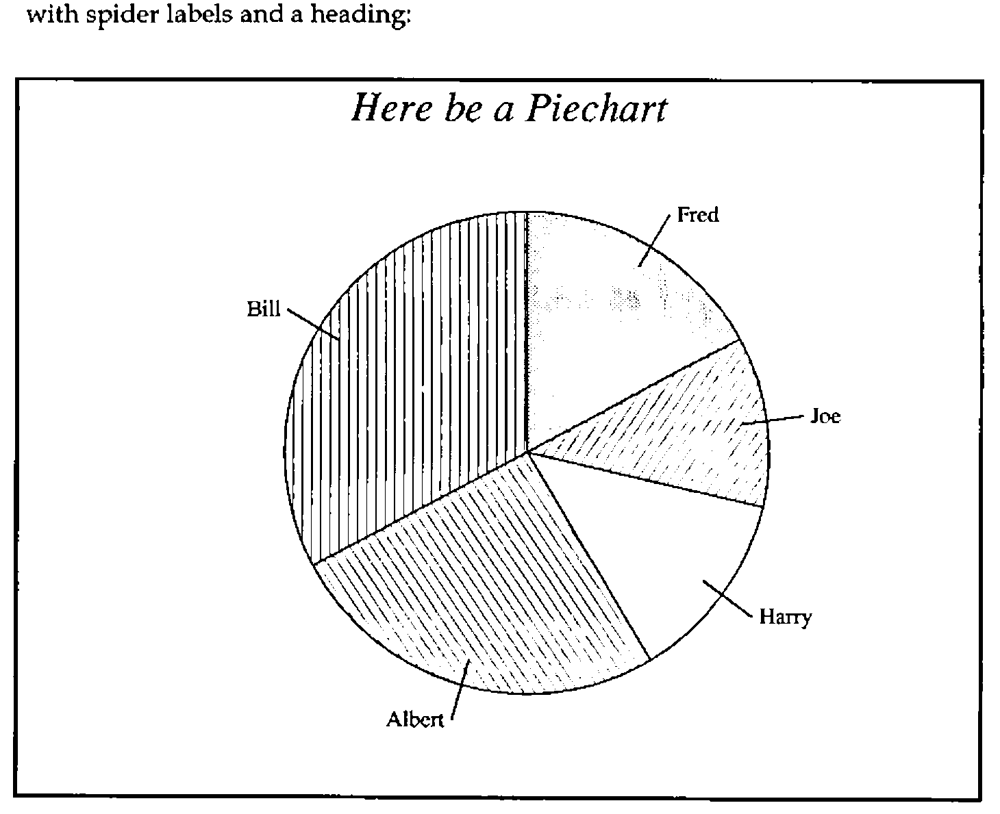
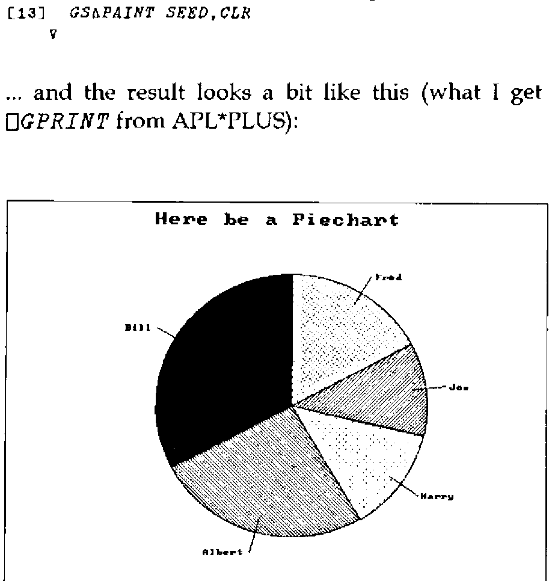
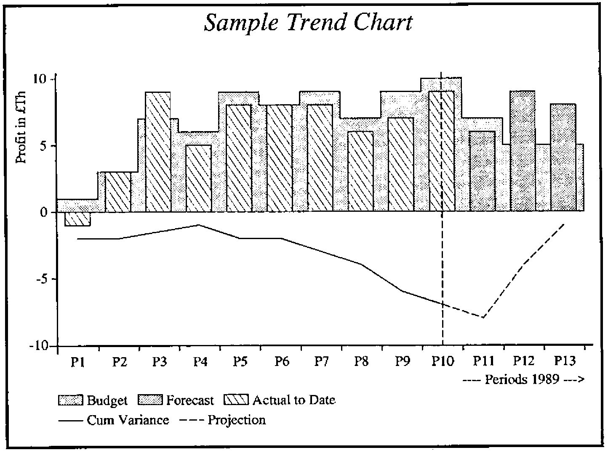
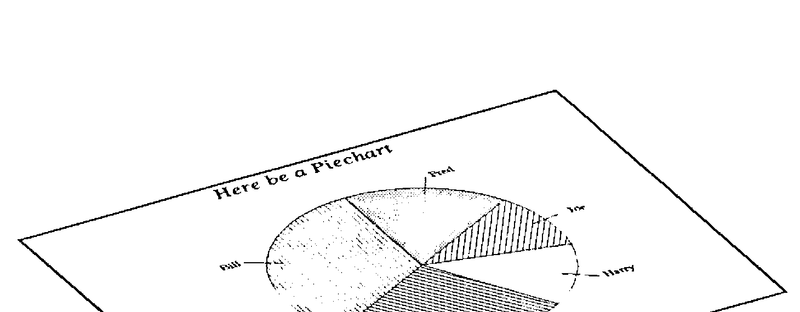

*by Adrian Smith (Rowntree Mackintosh Ltd)*
{ .byline }

## Background

The roots of this talk go way back to Vector No.1 Vol.4, which includes my notes on "Getting the Best out of GDDM". One of the points I made then was of the benefits of using IBM’s Presentation Graphics Facility (PGF) rather than the APL Graphpak workspace. PGF ran at least 5 times faster than Graphpak, and had the added virtue of requiring a mere 543 lines of code (of which about half were comments) instead of over 3600. It also led to pretty trivial APL code like:

```apl
    ∇ CH∆PIE MAT
[1] ⍝ Form data into multiple pie charts ...
[2] ⍝ one row makes each pie.

[3]   MAT←(¯2↑ 1 1 ,⍴MAT)⍴MAT
[4]   CTLs←796,(⍴MAT),,MAT
[5]   'FAILED TO DRAW PIE CHART' FSM∆ERR CTLs
    ∇
```

PGF was remarkably good at giving nice defaults for colours and shadings, and its algorithm for picking ‘good’ scales and tick intervals is still the best I have found. This meant that in the vast majority of cases you could simple say "Hi PGF … take that and gizza barchart" without a lot of preliminary setting up. Of course you needed to know that 796 was PGF-speak for "gizza piechart", but that was easy enough to bury in a cover function.

As things moved towards the PC, I kept thinking that someone somewhere must be working on this … all I had to do was sit around until a decent library of C routines came on the market, and I would be able to call these from APL. Occasionally things popped up like "The Turbo Pascal Graphics Toolbox", but invariable these stopped far short of the PGF functionality I was after. Nothing in the APL world went much beyond the basic "draw a polyline" functionality of `⎕Gxx`, or GSS\*CGI. OK, this is fine for drawing ducks with (as long as you have Dyalog APL!), but leaves all the hard work of designing an effective graphic to the application. "Bother, said Pooh."

## PostScript Basics

Your starter for 10 … name a computer language which:

- has no silly precedence rules
- has a matrix-inverse primitive
- allows any array as an array element
- allows assignment of both functions and variables, with no prior type declarations
- makes no distinction between integers and reals, and automatically converts between them as required.

Hands up those who said APL!! The more perceptive amongst you might have taken note of the title, and said "PostScript", but I feel I ought to discount that as cheating … although you were quite correct. Obviously, there is no way I can teach you PostScript in half a page - all I want to do here is to leave you with the impression that PostScript is a lot like APL, and that the idea of coding in the "intersection" of the two languages is not as daft as it sounds.

Here is the PostScript to draw a square somewhere near the middle of a sheet of A4 paper (all measurements are in points, or 1/72"):

```
newpath                     % clear the current path
200 400 moveto              % bottom left corner
300 400 lineto 300 500 lineto 200 500 lineto
closepath                   % back to the start
2 setlinewidth              % use a 2-point line
stroke                      % draw round the path

showpage                    % print it!!
```

PostScript is entirely stack-based, i.e. all functions are niladic, and pull their input from a stack. If they produce results (none of the above do) the results are pushed on to the stack. You need to think ‘reverse Polish’ to do arithmetic, but otherwise you can get along quite well by regarding the syntax as ‘just like APL’, except that it executes from left to right! All functions are of the form:

```apl
    ∇ ARG LINETO DUM
[1]  ⍝ Draw line from current point to ARG
[2]    .... etc
    ∇
```

The other things you need to know are the syntax for assignment, for function definition, and for representing an array. Assignment is coded like this:

```
/PPI 72 def         % move the value 72 to the literal PPI
/TXT (Hello!) def   % strings get () round them
```

```apl
PPP←72          ⍝ Move the value 72 to the name PPI
TXT←'Hello!'    ⍝ Strings get '' round them
```

The def operator takes a literal (the leading ‘/’ flags literals) and a value off the stack, and stuffs the latter into the former. It also allows function assignment:

```
/M {moveto} def      % for lazy typists
/inch {72 mul} def   % allows us to work in inches

4 inch 6 inch M      % .... etc.
```

Obviously, functions can call other functions (including themselves), and can refer to defined variables. Everything is global by default, although you can manipulate contexts to give the effect of localisation (see [1] and [2] for details). Arrays are very similar to APL:

```
/ARRAY [1 2 3 4] def    % 4-element array
[23 34 45 56] 4 3       % 3-element nested array
```

```apl
ARRAY←1 2 3 4           ⍝ 4-element vector
(23 34 45 56) 4 3       ⍝ 3-element nested vector
```

I think that should be enough to start with … if you really want to know PostScript properly, you should get the Blue Book [1] and the Red Book [2] and a PostScript printer (or some software like GoScript which will put the results on the screen … much cheaper!) and play with it.

## Motivation

As Vector moved gradually up-market in its presentation, I began to feel the need of some ‘publication-quality’ graphics for things like benchmark timings. The charts in question were extremely simple, typically just line-graphs or multiple barcharts, but it was important to get the typesetting details right if the result was to look good on the page. It was pretty obvious that PostScript had just what I needed when it came to detailed control over type sizes and text rotation and placement, so I began to play with some basic routines for things like axis-drawing and labelling.

Roughly at the same time, various parts of my user-community began to agitate for the same graphics support on the PC as they had been used to on the mainframe with PGF … clearly I could no longer afford to wait for someone else to implement PGF as an AP (or in STSC’s case `⎕BARCHART`, `⎕PIECHART` and so on!!). The trigger was provided by a weather station which Richard was given for Christmas … we were accumulating daily records of rainfall and temperature, and soon wanted to produce graphs like this:


As always, when you finally summon the energy to start hacking, things are much easier than you thought they would be. Essentially the exercise splits into two parts:

1. Write the APL bits for the things PostScript does, but APL lacks (like text handling, scaling and rotation).
2. Write the PostScript bits for the things APL does (like Polylines, Polybars - `⎕GSHADE`, and polymarks).

You can then code in the comfortable region where the languages intersect, with appropriate supporting routines to cover the remainder. As a bonus, it turned out that the HP plotter language HPGL also maps nicely to this region, and it took about half a day to get my functions driving an HP7550! I suspect that the same is true of any vector graphics language (e.g. the new AP207 that comes with APL2/PC); certainly having skimmed the booklet on GSS\*CGI that comes with Dyalog APL, I am quite sanguine about implementing all this lot on any APL you can think of!

## Stage-1: The APL End

The examples which follow are all from APL\*PLUS/PC, using `⎕G`-style graphics. I have not attempted complete coverage … if any of this code would be any use to you, APL-385 will oblige for £10 to cover the cost of the disk and postage..

To begin at the beginning … PostScript handles translation, scaling and rotation by holding a ‘Current Transformation Matrix’ in the classical form [3]:

```
    1     0    0
    0     1    0
   tx    ty    1     ... translation

   sx     0    0
    0    sy    0
    0     0    1     ... x/y scaling

 cosθ  sinθ    0
-sinθ  cosθ    0
    0     0    1     ... rotation counterclockwise by θ
```

The matrix starts as `CTM←3 3⍴4↑1`, and successive transformations are applied by matrix multiplications, for example:

```apl
    ∇ X ROTATE DUM;D2R
[1]  ⍝ Catenate rotation to current transformation matrix

[2]   D2R←(○2)÷360
[3]   X← 3 3 ↑ 2 2 ⍴ 1 1 ¯1 1 × 2 1 1 2 ○X×D2R ⋄ X[3;3]←1
[4]   CTM←X+.×CTM
    ∇
```

When it comes to drawing lines, we follow the PostScript philosophy of building a path, and deciding later whether to draw round it (with stroke) or shade it in (with fill). Both these clear the path automatically, but the nervous can use newpath to make sure they start with a clean slate:

```apl
    ∇ NEWPATH DUM
[1]  ⍝ Set up an empty path. Cols are [x,y,0/1]
[2]   PATH← 0 3 ⍴0
    ∇

    ∇ A LINETO DUM
[1]  CPT←A ⋄ PATH←PATH⍪(3↑A,1)+.×CTM
    ∇

    ∇ X MOVETO DUM;NP;LEN
[1]     ⍝ Add / update pen move to current path.
[2]      CPT←X
[3]      NP←(3↑X,1)+.×CTM ⋄ LEN←(⍴PATH)[1] ⋄ →LEN↓Add
[4]      →PATH[LEN;3]↑Add
[5]  Rpl:PATH[LEN; 1 2]←2↑NP ⋄ →0
[6]  Add:PATH←PATH⍪3↑2↑NP
    ∇

    ∇ STROKE DUM;SEG;LEN
[1]     ⍝ Draw line segments in PATH, and clear it.
[2]  Loop:LEN←(1↓PATH[;3])⍳0
[3]      SEG←(LEN,2)↑PATH
[4]      GS∆DRAW SEG
[5]      PATH←(LEN,0)↓PATH ⋄ →(1↑⍴PATH)↑Loop
    ∇
```

`GS∆DRAW` is a very thin cover on `⎕GLINE`. Similar functions will do for the PostScript basics like displaying text:

```apl
    ∇ TXT SHOW DUM;XY
[1]  ⍝ Dummy version of () show
[2]   XY←2↑(CPT,1)+.×CTM
[3]   (XY,FONTSCL)GS∆CHAR TXT
[4]   (TXT STRINGWIDTH ⍬)RMOVETO ⍬
    ∇
```

… but when it comes to working out the space occupied by graphics text, things get nastily device-dependent, not to mention the fact that in APL we are limited to integer multiples of the basic font size:

```apl
    ∇ R←TXT STRINGWIDTH DUM;WID;GT
[1]     ⍝ Find width of text string in current font.
[2]     ⍝ Note that this varies for different adaptors!
[3]      WID← 5.16 6.88 6.34 5.42 ⍝ Herc, CGA, EGA, VGA
[4]      GT←4 ⋄ →(0=⎕NC '∆GTYPE')↑Skip ⍝ Assume VGA
[5]      GT←4⌊'HCEV'⍳1↑∆GTYPE
[6]  Skip:R←2↑WID[GT]×FONTSCL×⍴,TXT
    ∇

    ∇ SIZE SCALEFONT DUM
[1]  ⍝ Rough mimic of scalefont
[2]   FONTSCL←1⌈⌊0.5+0.1×SIZE×CTM[1;1]
    ∇
```

So much for the basics … of course APL is much more efficient when dealing with vectors, so we would really like to work with a polyline:

```apl
    ∇ VEC PL DUM;LEN
[1]  ⍝ APL version of polyline, as used by CH∆LINE etc.
[2]  ⍝ Adds line to path ... it will still need stroking!
[3]  ⍝ Last elements give colour, style and thickness

[4]   VEC[¯2+⍴VEC]SETCOLOUR ⍬ ⋄ VEC[¯1+⍴VEC]SETLINESTYLE ⍬
[5]   VEC[⍴VEC]SETLINEWIDTH ⍬ ⋄ VEC←¯3↓VEC
[6]   LEN←⌊0.5×⍴VEC ⋄ VEC←(LEN,2)⍴VEC
[7]   VEC←(VEC,1)+.×CTM
[8]   PATH←PATH⍪VEC[; 1 2],~LEN↑1
    ∇
```

This is just like **lineto**, except that it expects a vector of x/y pairs, with some extra bits on the end giving the line attributes. These just get bunged into a rat’s nest of globals (except for the line width, which is a dummy). Now let’s have a look at the PostScript end of all this!

## Stage-2: The PostScript End

Another respect in which PostScript is like APL is in its orthogonality. As long as we disregard `⎕`functions, APL has almost no redundancy in the primitives; you add new ones to suit your convenience. You might expect to see PostScript functions for right-aligned and vertical text, but (as with APL) you must make your own:

```
/cshow      % centre text round current point
{ dup stringwidth pop
  neg 2 div 0 rmoveto show
} def

/vshow      % vertical text ... for y-axis titles
{ gsave 90 rotate
  dup stringwidth pop
  neg 0 rmoveto show
  grestore
} def
```

You might also expect to see a whole string of parameters to specify the writing direction of text … again there is no such nonsense! You simply save the Current Transformation Matrix with **gsave**, rotate the paper, write your text normally, and restore afterwards with **grestore**.

Now for something more interesting: the PostScript version of the APL function to tackle Polylines. I shall try to explain this one in detail, because it illustrates a lot of useful concepts. If you are still struggling over the logic of **cshow**, all should shortly become clear!!

```
/pL  % Polyline: stack is array of [x,y] pairs; colour style width
  { setlinewidth setlinestyle setcolour
    /xy exch def
    /npts xy length 2 idiv 1 sub def % halve the shape
    xy aload pop                     % disclose it
    moveto                           % pen to 1st point
    npts { lineto } repeat           % loop for each pair
  } def                              % will need stroking!
```

The top line is mostly a comment, describing what our function expects to find on the stack: this is always good practice when documenting PostScript code. We then peel off the last three elements (in backwards order remember) to set the line attributes. The functions **setlinewidth** etc. are all primitives.

The next line assigns the remaining element (the array of x/y pairs) to a variable **xy** (the **exch** primitive exchanges the top two things on the stack). In order to find out the number of line segments to draw, we need one less than half the shape (remembering the initial **moveto**):

```apl
NPTS←¯1+⌊(⍴XY)÷2      ⍝ /npts xy length 2 idiv 1 sub def
```

We then disclose (or **aload**) the array; this dumps the array contents onto the stack, plus the array itself, which we discard with a **pop**! The stack now holds an even number of x/y pairs, so we pick up the first set with a **moveto**, and then hoover up the rest by looping **npts** times. At the end of this, we have the entire polyline defined in the current path, so we can either draw round it with **stroke**, shade it in with **fill**, or even make it the outline of a clipping region with **clip**.

```
/wedge    % shaded pie slice: stack is x,y,r,α,β,pattern,width
  { setlinewidth setpattern
    /beta exch def /alpha exch def /radius exch def
    /y exch def /x exch def
    x y moveto                    % start at sector root
    x y radius alpha beta arc     % line to edge, and arc
    closepath                     % back to the middle
    gsave currentpatn grestore    % shade it
    [] 0 setdash stroke           % and solid edge
  } def
```

Here is another example … this time PostScript is quite close to APL in the way we draw arcs, so the code is almost trivial. I’m sure I could get away without all those variables, but my brain starts to hurt as soon as I have to deal with anything not on the top of the stack, so I got lazy and just snaffled the lot at the start! Shading patterns are quite interesting:

```
/setpattern % set current graphics pattern: stack is int [1..12]
  { /case exch def
    case 0 eq { /currentpatn {} def } if                         % No fill
    case 1 eq { /currentpatn { .98 setgray fill } def } if       % Light grey
    case 2 eq { /currentpatn { .9  setgray fill } def } if       % Medium
    case 3 eq { /currentpatn { .8  setgray fill } def } if       % Darker
    case 4 eq { /currentpatn { .5  setgray fill } def } if       % Half tone

    case 5 eq { /currentpatn   % diagonal shading
                { gsave 1 setgray fill grestore
                  clip newpath 0.2 setlinewidth [] 0 setdash
                  0 6 patscale mul 600 { -60 moveto -240 360 rlineto } for
                  stroke } def  } if

 .... etc
```

What we are doing is dynamically defining the **currentpattern** function (analogous to fixing a function with `⎕FX` before using it elsewhere) to fill the current path with the selected pattern. Pattern 0 does nothing, patterns 1 to 4 are progressively darker greys, then the fun begins! To get a diagonal shading, we first fill the path with white (using **1 setgray fill**), then set it to be the clipping region, and simply shade the whole page! The same strategy works for all the obvious cross-hatchings, which is why I haven’t bored you with the rest of the code.

Markers are dealt with in a very similar way. First we need a polymark routine:

```
/pM  % Polymark: stack is array of [x,y] pairs; colour marker-type
  { setmarker setcolour
    /xy exch def
    /npts xy length 2 idiv def            % halve the shape
    xy aload pop gsave                    % disclose it
    0.3 setlinewidth                      % set correct weight
    [] 0 setdash  newpath                 % and solid lines
    npts { moveto currentmark } repeat    % loop for each group
    grestore
  } def
```

Then we need to fix ourselves a **currentmark** function for repeated use at each x/y pair:

```
/setmarker  % set current graphics marker : stack is int [1..15]
  { /case exch def

    case 1 eq { /currentmark  % cross
     { -1 -1 rmoveto 2 2 rlineto 0 -2 rmoveto
       -2 2 rlineto stroke } def } if

    case 2 eq { /currentmark  % plus sign
     { -1 0 rmoveto 2 0 rlineto -1 -1 rmoveto
        0 2 rlineto stroke } def } if


 .... and so on
```

Note that the markers are careful to use *relative* moves and lines; this is a typical PostScript device to make such functions re-usable. Finally, font selection and size:

```
/settext  % set text parameters: colour, Size in pts, SSID (0-34)
  { /ssid exch def  /size exch def  setcolour
    ssid  0 eq { /Times-Roman findfont  } if
    ssid  1 eq { /Times-Italic findfont  } if
    ssid  2 eq { /Times-Bold findfont  } if
    ssid  3 eq { /Times-BoldItalic findfont  } if
    ssid  4 eq { /Helvetica findfont  } if
    ssid  5 eq { /Helvetica-Oblique findfont  } if

    ....

    ssid 32 eq { /Palatino-BoldItalic findfont  } if
    ssid 33 eq { /ZapfChancery-MediumItalic findfont  } if
    ssid 34 eq { /ZapfDingbats findfont  } if
    size scalefont setfont
  } def
```

This has the effect of burying the font names (which you have to get exactly right, including the capitalisation) where I need never see them again.

## Putting it all to Work

I would like to end by showing you a selection of examples, where possible with explanations of anything I have so far failed to cover. First, a simple piechart, with spider labels and a heading:



The APL code which generated this undoubted work of art:

```apl
    ∇ R←VPIE
[1]  ⍝ VECTOR PIE DEMO
[2]   CHHEAD 'Here be a Piechart'
[3]   CHXLAB 'Fred;Joe;Harry;Albert;Bill'
[4]   CHSET 'CBOX' ⋄ 'HMAR' CHSET 0 1
[5]   CHPIE 12 8 9 18 23
[6]   CHTERM
[7]   R←'PS PG  ⍝ TO SEE IT'
    ∇
```

… old PGF hands will recognise some of the syntax, and also the mnemonics like ‘CBOX’ to get the chart are boxed! The output from this function is a simple text vector of PostScript code:

```
newpath gsave  % before we translate the origin
[ 4 4 422 4 422 316 4 316 ] 15 1 1.5 pL
closepath # stroke

40 4 translate

11 18 1 settext # 177 294 M # (Here be a Piechart) cshow

15 10 0 settext
185 150 105 28.3 90 2 0.5 wedge
[233.5 231.1 246.9 253.7] 15 1 .6 pL # stroke
249.9 250.7 M # (Fred) show

185 150 105 -12.9 28.3 6 0.5 wedge
[278.6 162.7 304.7 166.2] 15 1 .6 pL # stroke
307.7 163.2 M # (Joe) show

185 150 105 -59.1 -12.9 1 0.5 wedge
[261.5 94.5 282.7 79] 15 1 .6 pL # stroke
285.7 76 M # (Harry) show

185 150 105 -151.7 -59.1 5 0.5 wedge
[159.9 58.9 152.9 33.6] 15 1 .6 pL # stroke
149.9 30.6 M # (Albert) rshow

185 150 105 -270 -151.7 10 0.5 wedge
[103.9 198.5 81.3 211.9] 15 1 .6 pL # stroke
78.3 208.9 M # (Bill) rshow

grestore
showpage
```

… note that the ‘#’ characters have nothing to do with PostScript … they get treated as diamonds by my APL code, and are mapped to `⎕TCNL` when I write out the file for printing. With a bit more trouble I could get APL to infer these line breaks, and save myself the trouble of putting them in by hand.

…. the bulk of the hard grind having taken place in `CH∆PIE`:

```apl
    ∇ R←CH∆PIE VEC;lab;CT;LAB;TG;TGS;CEN;RAD;ARC;HA;YL;XL;EXP;PEXP
[1]      ⍝ Piechart from given sectors

[2]       TGS←CH⍙XLAB ⋄ TGS←((⍴VEC),¯1↑⍴TGS)⍴TGS
[3]       R←'' ⋄ →(∨/'VALU'⍷CH⍙SET)↓Cum

[4]      ⍝ Add sector values to pie tags ....

[5]       TGS←Lj(Rj TGS),((××/⍴TGS)/((⍴VEC),2)⍴': '),Lj⍕((⍴VEC),1)⍴VEC
[6]  Cum:VEC←+\VEC ⋄ VEC←VEC×360÷¯1↑VEC ⋄ VEC←0,VEC
[7]       PEXP←0⌈0.01×(⍴VEC)↑CH⍙PEXP
[8]       XL←(-/CH⍙AREA[3 1])-+/CH⍙VMAR
[9]       YL←(-/CH⍙AREA[4 2])-+/CH⍙HMAR
[10]      R←(⍕CH⍙LATT),' settext',⎕TCNL,R

[11]     ⍝ Find the centre, and a sensible radius ....

[12]      CEN←0.5×(XL,YL) ⋄ RAD←0.35×XL⌊YL

[13]     ⍝ Build segments and tags as we go round ......

[14] Loop:→lab←1+((¯1+⍴VEC)⍴Loop),End,CT←1
[15]      HA←0.5×+/90-VEC[CT+ 1 0]
[16]      EXP←PEXP[CT]×RAD× 2 1 ○HA×(○1)÷180
[17]      ARC←(CEN+EXP),RAD,90-VEC[CT+ 1 0]
[18]      R←R,(CH∆FMT ARC),' ',(⍕1↑CH⍙PATN),' 0.5 wedge ',⎕TCNL
[19]      TG←(2 2 ⍴ARC[1 2])+ 0.9 1.15 ∘.×ARC[3]× 2 1 ○HA×(○1)÷180
[20]      LAB←Lj TGS[CT;] ⋄ LAB←(+/∨\⌽' '≠LAB)↑LAB ⋄ →(0∊⍴LAB)↑Skip

[21]     ⍝ ========== SPIDER TAGS ===========

[22]      R←R,'[',(CH∆FMT TG),'] ',(⍕CH⍙LATT[1]),' 1 .6 pL # stroke ',⎕TCNL
[23]      →(180<90-HA)↑Lft
[24]   Rt:R←R,(CH∆FMT 3 ¯3 +TG[2;]),' M # (',LAB,') show',2⍴⎕TCNL ⋄ →Skip
[25]  Lft:R←R,(CH∆FMT ¯3 ¯3 +TG[2;]),' M # (',LAB,') rshow',2⍴⎕TCNL
[26] Skip:CH⍙KDEF←CH⍙KDEF⍪5↑2,CH⍙PATN[1] ⋄ CH⍙PATN←1⌽CH⍙PATN
[27]  End:→lab[CT←CT+1]
    ∇
```

The only utility function I need to describe is `CH∆FMT` …

```apl
    ∇ R←CH∆FMT X
[1]  ⍝ Format data to 1dpl and subst APL negatives.
[2]   X←0.1×⌊0.5+X×10 ⋄ R←⍕,X ⋄ R[(R∊'¯')/⍳⍴R]←'-'
    ∇
```

Because my printer only resolves to 1/300 of an inch, I reckon I am quite safe rounding distances to 1/10 of a point. I then can just use the APL primitive format (actually it is ideal as it only shows decimal places if there are any, thus saving space), being careful to map the APL high minus to an ordinary dash.

To put it on the screen, I simply run my DIY PostScript interpreter (I don’t think I showed you `WEDGE` in APL):

```apl
    ∇ SPEC WEDGE DUM;XY
[1]  ⍝ Cover PostScript Wedge routine ... x,y,r,from,to,pat,width
[2]   1 GS∆USE SPEC[6] ⋄ SPEC[7]SETLINEWIDTH ⍬ ⋄ SPEC←¯2↓SPEC
[3]   XY←SPEC[1 2] ⋄ SPEC←(2↓SPEC),1
[4]  ⍝ X-scale determines size of pie ... ratio is used as the ellipticity.
[5]   SPEC[1]←SPEC[1]×CTM[1;1]
[6]   SPEC[4]←CTM[2;2]÷CTM[1;1]
[7]   XY←2↑(XY,1)+.×CTM
[8]   15 GS∆WEDGE XY,SPEC
    ∇

    ∇ CLR GS∆WEDGE ARC;D2R;SEED;R;ASP
[1]  ⍝ Pass vector of pie wedge detail ...
[2]  ⍝ ARC: x, y, r, init angle, final angle (in degrees), aspect ratio
[3]  ⍝ The colour was set up by GS∆USE in GS⍙DEF[1].
[4]  ⍝
[5]   ⍎(0=⎕NC 'CLR')/'CLR←15⌊8+GS⍙DEF[1]' ⋄ ⍎(2=GS⍙DEF[6])/'CLR←×CLR'
[6]   R←⎕GMASK ¯1 ⋄ D2R←180÷○1 ⋄ ARC←6↑ARC,1
[7]   ASP←1,ARC[6] ⋄ ARC←ARC÷ 1 1 1 ,D2R,D2R,GS⍙DEF[5]
[8]  ⍝ Find a safe seed point in the middle of the sector!
[9]   SEED←ARC[1 2]+ASP×0.8×ARC[3]× 2 1 ○0.5×+/ARC[4 5]
[10]  ARC[1 3]←GS⍙DEF[5]×ARC[1 3]
[11]  CLR ⎕GCIRCLE 1 1 6 ⍴ARC
[12] ⍝ Fills with GS⍙DEF[1] ... edges with CLR
[13]  GS∆PAINT SEED,CLR
    ∇
```

… and the result looks a bit like this (what I get on my DeskJet when I hit `⎕GPRINT` from APL\*PLUS):



I get something rather similar from my HP plotter, only here the functions build an HPGL string instead of a PostScript string, for example:

```apl
    ∇ TXT RSHOW DUM;XY
[1]  ⍝ HPGL version of () rshow

[2]   XY←2↑(CPT,1)+.×CTM
[3]   HPGL←HPGL,'PA ',(⍕XY),';'
[4]   HPGL←HPGL,'LO7;LB',TXT,'∊̲',nl
    ∇
```

… and of course the colours work rather better!!

One final example, just to prove to those guys at MetaPraxis that anything they can do, I can do too….



## Summary

I am now reasonably convinced that it will be hard to buy a printer without PostScript in 5 years’ time. I suppose it will have to do Epson and HP emulation as well, but the simplification of having a single standard approach to both text and graphics is overwhelming. Just think how many fewer disks WordPerfect would come on if it only supported one type of printer! Accordingly, it makes sense to target your graphics on PostScript as the primary device, and let the rest take care of themselves. As it happens, it is pretty straightforward to convert the PostScript code to HPGL anyway (I think I have seen some public domain stuff which claims to do the whole job), but there are other benefits:

- the resulting graphic is amazingly compact. The whole of that MetaPraxis chart takes up a mere 2856 bytes of disk. If you saved it as a monochrome bit image, it would be well over 1Mbyte … multiply by 16 for colour! As well as saving on disk space, this cuts down on network traffic, and gets the print done very much faster. It took GoScript a lot less time to print the high-quality version of my piechart than it took APL to do the screen dump!
- you can easily pull it back from disk and reshow it on the screen. In fact it is pretty trivial to define functions `ABOVE` and `BESIDE` to let you tile the screen with as many charts as you like … obviously a handy thing for slide shows.

  ```apl
      ∇ R←A ABOVE B
  [1]  ⍝ Put two charts above and below

  [2]   R←'gsave # 1 .5 scale # ',B
  [3]   R←R,'# 0 316 translate # ',A,' # grestore '
      ∇

      ∇ R←A BESIDE B
  [1]  ⍝ Put two charts side by side

  [2]   R←'gsave # .5 1 scale # ',A
  [3]   R←R,'# 422 0 translate # ',B,' #  grestore'
      ∇
  ```

- the results really are publication-quality! If you have a half-way decent word-processor, you can link them in to your final copy, and again the print file is far more compact than it would be if you link in bitmap graphics (such as the output from PC-Paintbrush).

Of course, there are one or two snags! PostScript is quite happy with the idea of rotating anything you put on the page, but of course APL fails to rotate the text, and you also come adrift on things like polybar, as this calls `⎕GSHADE`, which expects to be given the corners of a rectangle, not a parallelogram!! As a final tour de force, here is my piechart again, this time prefaced with:

```
130 150 translate
.8 .4 scale
30 rotate
```



This works beautifully in real PostScript, but I would advise you not to attempt it with my APL version, except possibly for its amusement value at BAA meetings!

## References

[1] *PostScript Language Tutorial and Cookbook*. Adobe Systems Inc. Addison Wesley, ISBN 0-201-10179-3

[2] *PostScript Language Reference Manual*. Adobe Systems Inc. Addison Wesley, ISBN 0-201-10174-2

[3] *Fundamentals of Interactive Computer Graphics*. J.D. Foley and A. Van Dam. Addison Wesley 1982.
