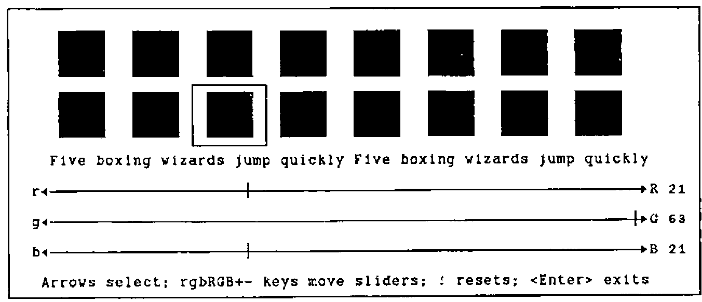
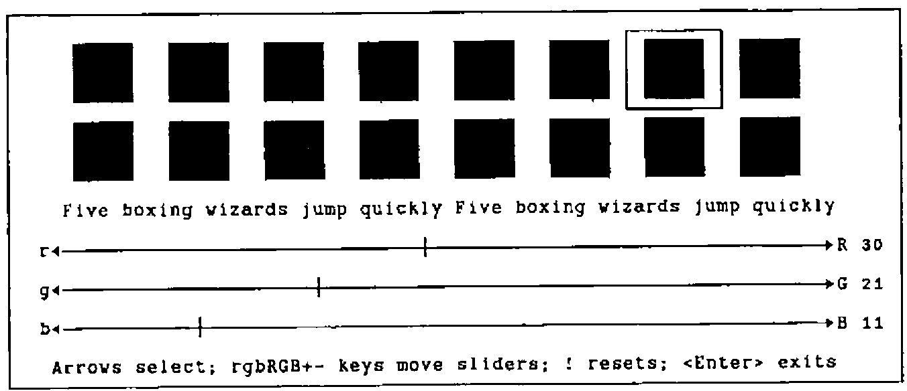

*by Adrian Smith*
{ .byline }

As Dave Crossley rightly points out, the VGA is grossly under-exploited by the vast majority of PC software. The irritating thing is that the required code is easy to build, and will work under pretty well any APL you care to name. The only snag is having to spend the best part of £30 on Ray Duncan’s book! Accordingly, I thought it might be helpful to compile a little workspace of helpful functions (available from APL-385 free if you send me a disk and enclose return postage, but why not just type them in, and have fun writing a better palette editor?!).

So, with thanks to Dave Selby (for pointing out how easy this is), and Duncan Pearson (for lending me **Duncan** for the weekend) … here’s all you ever wanted to know about `⎕INT 16` ….

```apl
VGA∆RESET               ⍝ Sets everything back to default
VGA∆BLINK 0|1           ⍝ Highlighted | blinking background
VGA∆QPALETTE reg        ⍝ Checks current palette setting(s)
VGA∆QCOLOUR clr         ⍝ Checks current colour value(s)
```

```apl
     ∇ VGA∆RESET;RG;W;C
[1]   ⍝ Reset VGA video to MODE 3 and restore active screen
[2]    W←⎕WGET 3 ⋄ C←⎕CURSOR
[3]   ⍝   AH = 0hex       ... BIOS service 0
[4]   ⍝   AL = 3hex       ... standard VGA text mode
[5]    RG←3 ⎕INT 16
[6]   ⍝ Reset background ...
[7]    RG← 4099 0 ⎕INT 16
[8]   ⍝ Put things back as they were ...
[9]    ⎕WPUT W ⋄ ⎕CURSOR←C
     ∇

     ∇ VGA∆BLINK SW;RG
[1]   ⍝ Flip Background from blinking to intensified.
[2]   ⍝   AH = 10hex      ... BIOS service 10 (EGA/VGA only)
[3]   ⍝   AL =  3hex      ... subservice 3
[4]   ⍝   BL = 0/1        ... 0 = intensify; 1 = blink
[5]    RG←(4099,SW>0)⎕INT 16
     ∇

     ∇ R←VGA∆QPALETTE VEC;AX;RG;lab;CT
[1]      ⍝ Query VGA palette register(s) VEC
[2]      ⍝   AH = 10hex      ... BIOS service 10 (EGA/VGA only)
[3]      ⍝   AL =  7hex      ... subservice 7
[4]      ⍝   BH = 0          ... colour returned here
[5]      ⍝   BL = 0-16       ... palette register to query
[6]       AX←(256×16)+7 ⋄ R←⍳0 ⋄ VEC←,VEC
[7]   Lp:→lab←1+((⍴VEC)⍴Lp),End,CT←1
[8]       RG←(AX,VEC[CT])⎕INT 16
[9]       R←R,⌊RG[2]÷256
[10] End:→lab[CT←CT+1]
     ∇

     ∇ R←VGA∆QCOLOUR VEC;AX;RG;CT;lab
[1]      ⍝ Query VGA colour(s) VEC as RGB values
[2]      ⍝   AH = 10hex      ... BIOS service 10 (EGA/VGA only)
[3]      ⍝   AL = 15hex      ... subservice 15h = 21(dec)
[4]      ⍝   BL = 0-53       ... colour to query
[5]      ⍝ Returns 4-col array of [colour,r,g,b] values
[6]       AX←(256×16)+21 ⋄ VEC←,VEC ⋄ R←⍉(4,⍴VEC)⍴VEC
[7]   Lp:→lab←1+((⍴VEC)⍴Lp),End,CT←1
[8]       RG←(AX,VEC[CT])⎕INT 16
[9]       R[CT; 3 2 4]←3↑, 256 256 ⊤RG[3 4] ⍝ returned as G,R,B
[10] End:→lab[CT←CT+1]
     ∇
```

For example, to see the current VGA palette, and the standard RGB colours:

```apl
      VGA∆RESET ⋄ STD←VGA∆QCOLOUR VGA∆QPALETTE 0,⍳15
      STD
 0  0  0  0              ... 56 21 21 21
 1  0  0 42                  57 21 21 63
 2  0 42  0                  58 21 63 21
 3  0 42 42                  59 21 63 63
 4 42  0  0                  60 63 21 21
 5 42  0 42                  61 63 21 63
20 42 21  0                  62 63 63 21
 7 42 42 42 ...              63 63 63 63
```

The next group of two functions allows you to change things! Obviously, there is scope here to put together a simple palette editor … mine uses `RGB` to crank up the colour components and `rgb` to crank them down. It is also handy to provide `+` to increase all three colours together, and `-` to wind them all down.

```apl
VGA∆PALETTE pal,clr     ⍝ Set Palette (0..15) to clr (0..63)
VGA∆COLOUR clr,r,g,b    ⍝ Set clr(s) (0..63) to red,green,blue
```

```apl
     ∇ VGA∆PALETTE VEC;RG;BX
[1]   ⍝ Set Vga palette register VEC[1] to VEC[2]
[2]   ⍝   AH = 10hex      ... BIOS service 10 (EGA/VGA only)
[3]   ⍝   AL =  0hex      ... subservice 0
[4]   ⍝   BH = 0-63       ... required colour
[5]   ⍝   BL = 0-16       ... palette register to set
[6]    BX←(256×VEC[2])+VEC[1]
[7]    RG←(4096,BX)⎕INT 16
     ∇

     ∇ VGA∆COLOUR MAT;RG;BX;CX;DX;lab;CT
[1]      ⍝ Set Vga colour register MAT[;1] to MAT[;2 3 4] (RGB)
[2]      ⍝   AH = 10hex      ... BIOS service 16 (EGA/VGA only)
[3]      ⍝   AL = 10hex      ... subservice 16
[4]      ⍝   BX = 0-63       ... colour register
[5]      ⍝   CH = 0-63       ... green intensity
[6]      ⍝   CL = 0-63       ... blue intensity
[7]      ⍝   DH = 0-63       ... red intensity
[8]       MAT←(¯2↑ 1 1 ,⍴MAT)⍴MAT ⋄ MAT←((1↑⍴MAT),4)↑MAT
[9]   Lp:→lab←1+((1↑⍴MAT)⍴Lp),End,CT←1
[10]      BX←MAT[CT;1]
[11]      DX←256×MAT[CT;2]
[12]      CX←(256×MAT[CT;3])+MAT[CT;4]
[13]      RG←(4112,BX,CX,DX)⎕INT 16
[14] End:→lab[CT←CT+1]
     ∇
```

```apl
     ∇ R←SET∆PAL CRGB;W;IN;LD;SD;lab;CT;OFF;POS;CURR;FRM;BLK;LST;BAR;INX;KB;FP
[1]      ⍝ Allow user to fix VGA colour registers for standard palette
[2]      ⍝ RGB is a 16 4 array of [Colour,R,G,B] values (0..63) for each clr
[3]      ⍝ Result is the same array, with adjusted values
[4]      ⍝ <Esc> returns the original array unchanged, in case of disaster!
[5]      ⍝
[6]       KB←1 ⎕POKE 118 ⋄ LST←CURR←1 ⋄ R←CRGB ⋄ VGA∆RESET ⋄ VGA∆COLOUR CRGB
[7]      ⍝ The first bit is all direct screen update with ⎕WPUT ... Yuk!
[8]       LD←'┌┐┘└│─├┤┼◄►' ⋄ FRM← 18 74 ⍴' ' ⋄ BAR←LD[10,(64⍴6),11]
[9]       SD←(1↑⍴FRM)⍴5 ⋄ FRM←LD[6],[1]FRM,[1]LD[6]
[10]      FRM←LD[1,SD,4],FRM,LD[2,SD,3]
[11]      OFF← 3 4 ⋄ FP←(OFF- 1 2),⍴FRM ⋄ W←FP ⎕WGET 4
[12]      FP ⎕WPUT FRM ⋄ FP ⎕WPUT 143
[13]      FP←'Arrows select; rgbRGB+- keys move bars; ! reset; <Enter> exit'
[14]      ((OFF+17,2),1,⍴FP)⎕WPUT FP
[15]      BLK← 3 5 ⍴'█' ⋄ FRM←' ',BLK,' '
[16]      BLK←' '⍪BLK⍪' ' ⋄ BLK←(5 2 ⍴' '),BLK, 5 2 ⍴' '
[17]      SD←(1↑⍴FRM)⍴5 ⋄ FRM←LD[6],[1]FRM,[1]LD[6]
[18]      FRM←LD[1,SD,4],FRM,LD[2,SD,3]
[19]      POS←(16 2 ⍴OFF+ 0 4)+((8⍴1),8⍴5),[1.5]16⍴8×0,⍳7
[20]  Lp1:→lab←1+(16⍴Lp1),End1,CT←1
[21]      FP←POS[CT;], 3 5 ⋄ FP ⎕WPUT CT-1 ⋄ FP ⎕WPUT '█'
[22] End1:→lab[CT←CT+1]
[23]      ((OFF+ 9 3), 1 65)⎕WPUT FP←'Five boxing wizards jump quickly '
[24]      FP←POS-(⍴POS)⍴ 1 2
[25]     ⍝ Frame active colour, and mark it off on each colour indicator ...
[26] Mark:(FP[LST;],⍴BLK)⎕WPUT BLK ⋄ (FP[CURR;],⍴FRM)⎕WPUT FRM
[27]      ((OFF+ 9 3), 1 32)⎕WPUT,⍉ 2 16 ⍴(16×CURR-1)+0,⍳15
[28]      ((OFF+ 9 36), 1 32)⎕WPUT,⍉ 2 16 ⍴(16×0,⍳15)+CURR-1
[29] Rule:((OFF+ 11 1), 1 68)⎕WPUT 'r',BAR,'R'
[30]      ((OFF+ 13 1), 1 68)⎕WPUT 'g',BAR,'G'
[31]      ((OFF+ 15 1), 1 68)⎕WPUT 'b',BAR,'B'
[32]      ((OFF+11,3+CRGB[CURR;2]), 1 1)⎕WPUT LD[9]
[33]      ((OFF+13,3+CRGB[CURR;3]), 1 1)⎕WPUT LD[9]
[34]      ((OFF+15,3+CRGB[CURR;4]), 1 1)⎕WPUT LD[9]
[35]      ((OFF+11,70), 1 2)⎕WPUT 2 0 ⍕CRGB[CURR;2]
[36]      ((OFF+13,70), 1 2)⎕WPUT 2 0 ⍕CRGB[CURR;3]
[37]      ((OFF+15,70), 1 2)⎕WPUT 2 0 ⍕CRGB[CURR;4]
[38] Hold:VGA∆COLOUR CRGB[CURR;] ⋄ IN←⎕INKEY ⋄ LST←CURR
[39]      →(14 183 138 165 136 134 =⎕AV⍳IN)/(Exit,Quit,Up,Dn,Lf,Rt)
[40]      →('QqRrGgBb+-!'=IN)/(Quit,Quit,(6⍴Cset),(2⍴PlMn),Reset) ⋄ →Eh
[41]     ⍝ Adjust r|g|b component of selected colour and patch ruler ...
[42] Cset:INX←'rgbRGB'⍳IN ⋄ INX←1+ 3 3 ⊤INX-1 ⋄ SD←9+2×INX[2]
[43]      ((OFF+SD,3+CRGB[CURR;1+INX[2]]), 1 1)⎕WPUT LD[6]
[44]      CRGB[CURR;1+INX[2]]←0⌈63⌊CRGB[CURR;1+INX[2]]+ ¯1 1 [INX[1]]
[45]      ((OFF+SD,3+CRGB[CURR;1+INX[2]]), 1 1)⎕WPUT LD[9]
[46]      ((OFF+SD,70), 1 2)⎕WPUT 2 0 ⍕CRGB[CURR;1+INX[2]]
[47]      →Hold
[48]     ⍝ Gang the three sliders together on +|- keys ...
[49] PlMn:CRGB[CURR; 2 3 4]←0⌈63⌊CRGB[CURR; 2 3 4]+-/IN='+-' ⋄ →Rule
[50]     ⍝ ! resets back to where we came in.
[51] Reset:CRGB←R ⋄ VGA∆COLOUR CRGB ⋄ →Rule
[52]   Eh:⎕SOUND 2 2 ⍴ 400 20 600 20 ⋄ →Hold
[53]     ⍝ The cursor arrows move us round the colour selection ...
[54]   Up:→(CURR<9)↑Eh ⋄ CURR←CURR-8 ⋄ →Mark
[55]   Dn:→(CURR>8)↑Eh ⋄ CURR←CURR+8 ⋄ →Mark
[56]   Lf:→(CURR=1)↑Eh ⋄ CURR←CURR-1 ⋄ →Mark
[57]   Rt:→(CURR=16)↑Eh ⋄ CURR←CURR+1 ⋄ →Mark
[58] Exit:R←CRGB
[59] Quit:KB←KB ⎕POKE 118 ⋄ VGA∆COLOUR R ⋄ ((OFF- 1 2),⍴W)⎕WPUT W
     ∇
```

```apl
NEWPAL←SET∆PAL STD      ⍝ Palette editor
VGA∆COLOUR NEWPAL       ⍝ Set new palette (16,4 array)
```

As you can see, most of the heavyweight code is to do with making the screen look pretty; if you just want the bare essentials, lines [38] to the end are all you really need! Here are a couple of screen snaps to show the general effect:



This is the standard VGA bright green … note that it has a barely detectable amount of red and blue added in. Incidentally, the *Five Boxing Wizards* is used to show the effect of all the foreground colours on the selected background, and vice versa. It is a slightly more convenient form of the *Quick Brown Fox*, being only 32 letters long!

For comparison, here is a nice rich brown, which I think is a much better background colour than the standard offering:



That’s all folks!
