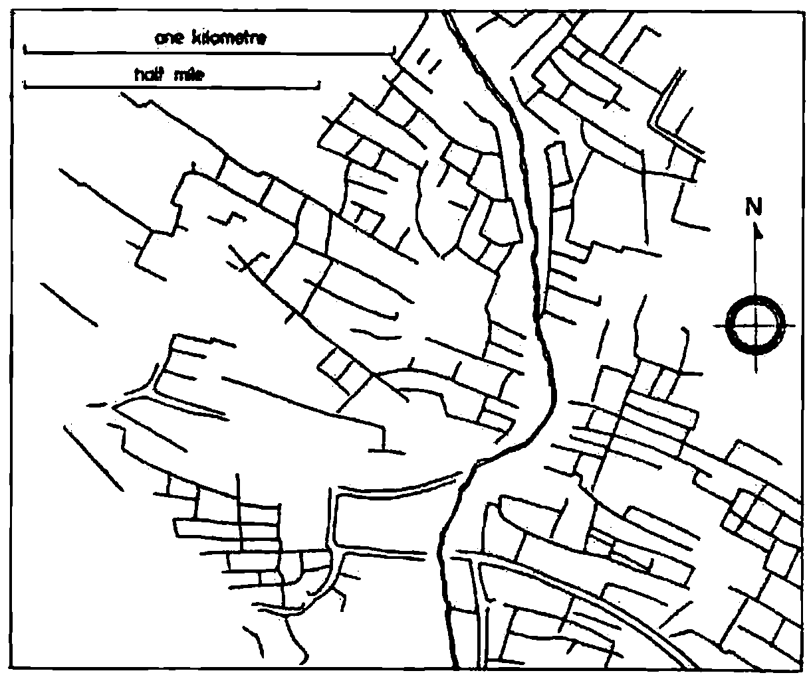
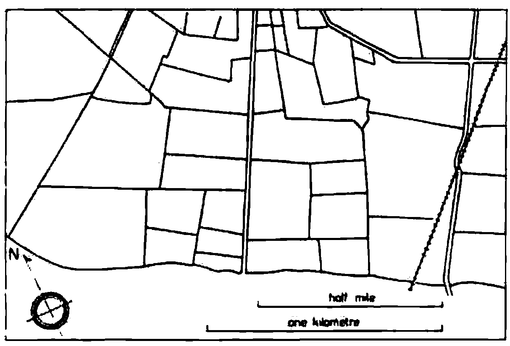
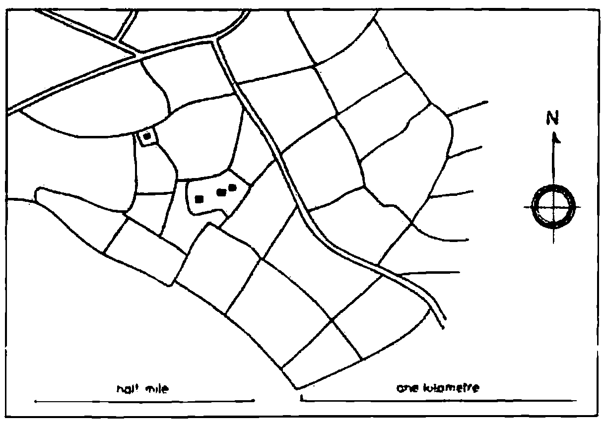
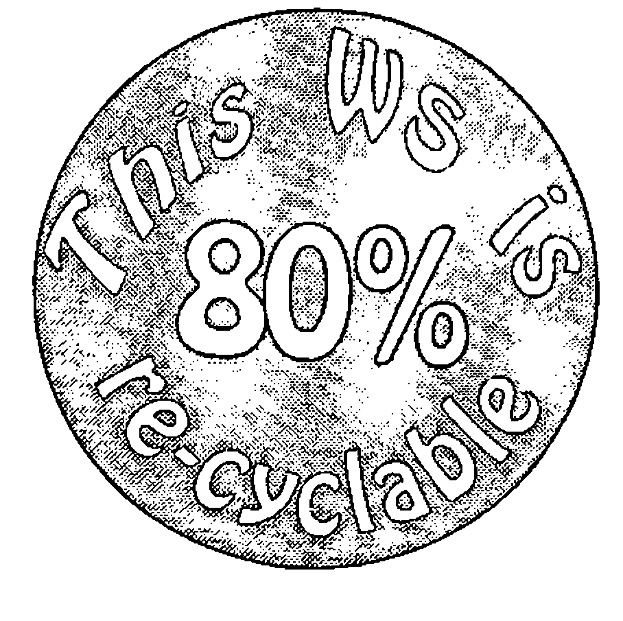
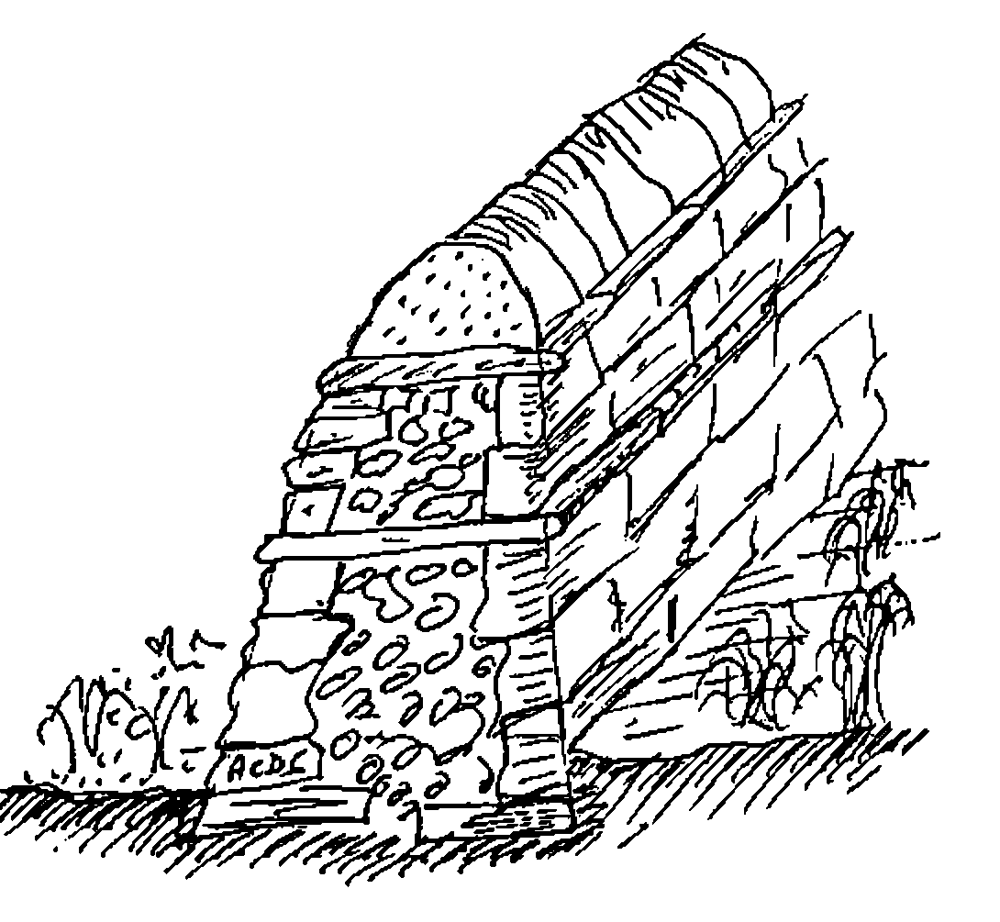
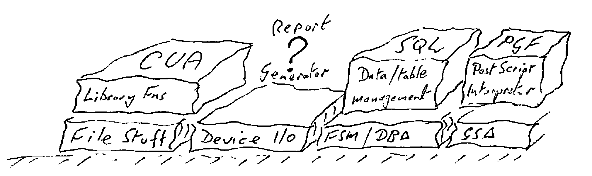
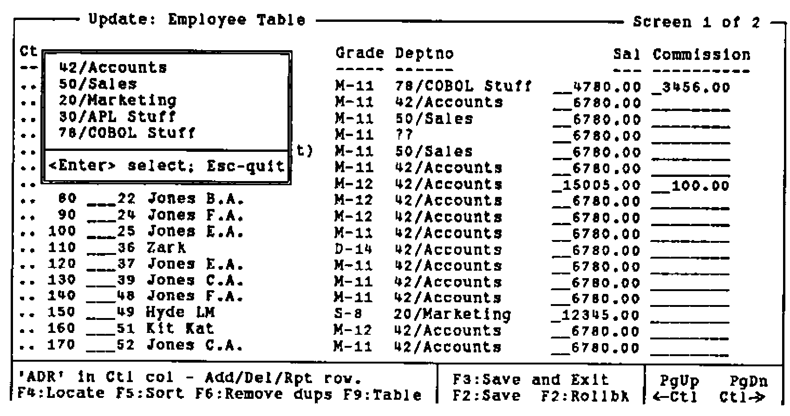
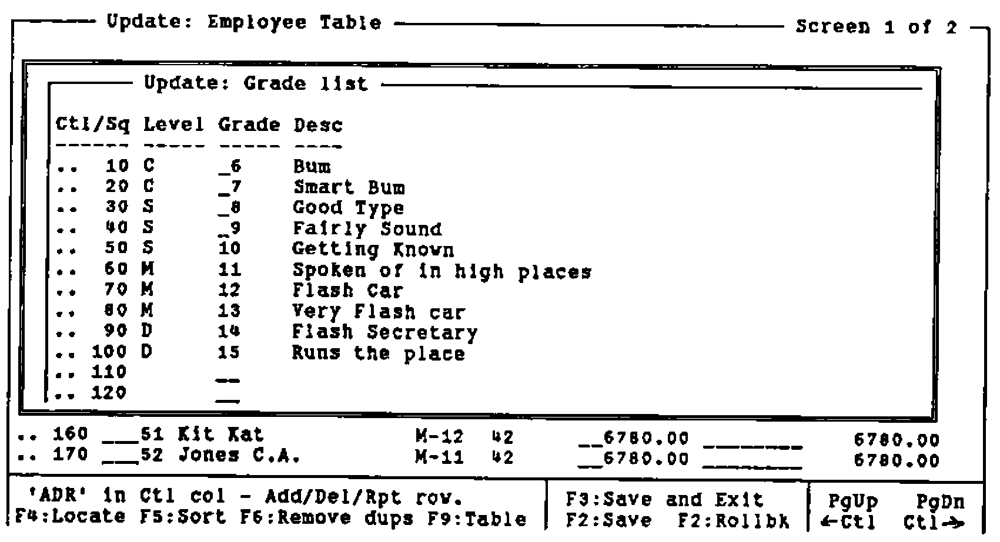
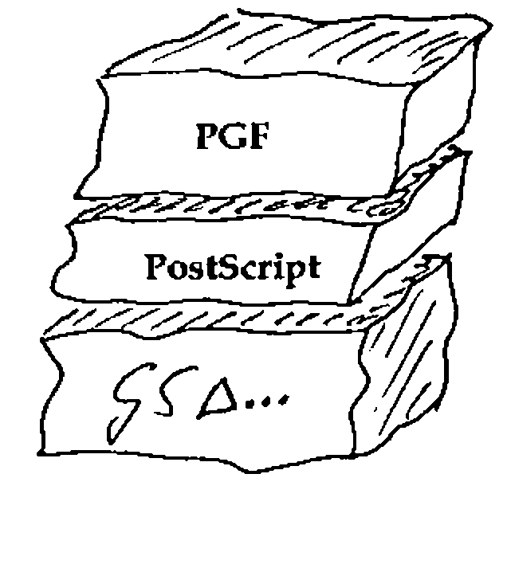
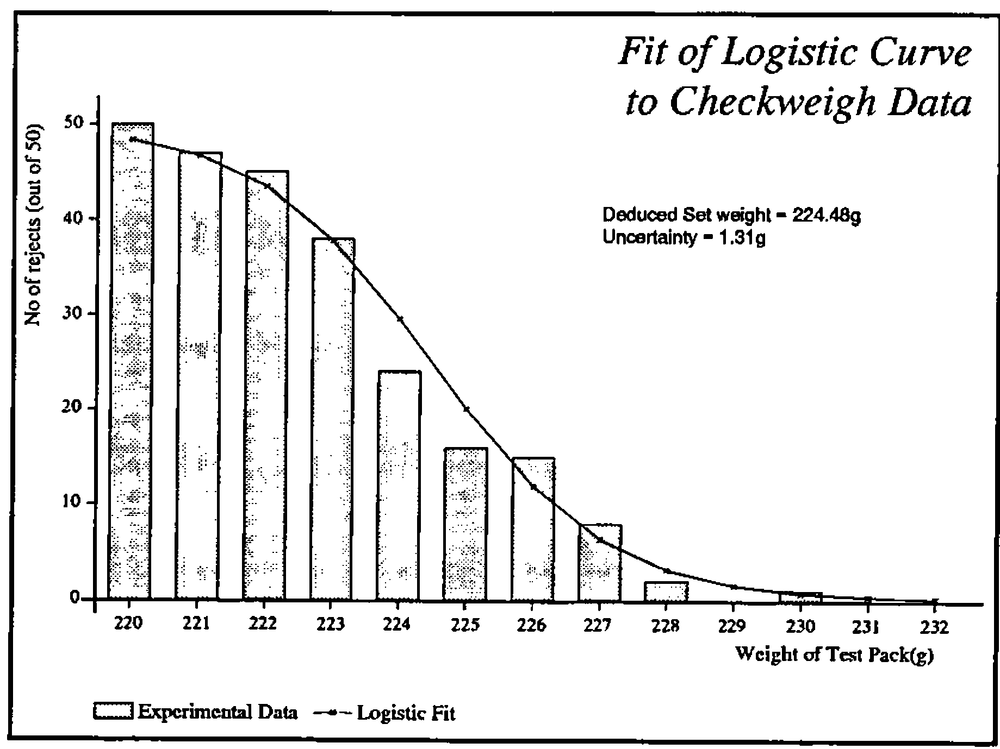

*by Adrian Smith*
{ .byline }

## Introduction

This talk falls naturally into two parts: the first is about philosophy, and the second about practical detail. In order to be an effective wall-builder, you need to get both parts right: it is no use having all the right attitudes if you can’t fit the stones together; conversely all the craft skill in the world will avail you nothing if you lack the vision to build your wall in the right place!

Incidentally, the title (and some of the subject matter) arises from an unguarded comment I recently made to Ken Iverson (on holiday in Yorkshire) that I thought that the most useful bits of my education were at primary school in the Durham dales. In particular, dry-stone walls are an intrinsic part of the local culture, and the skills involved in building them are somehow "in the blood" of any dales native. Being Ken, he immediately picked me up on this rash statement, and I spent a tough few minutes rationalising just why the art of stone-walling is helpful in designing APL systems. What follows is a first attempt to put these thoughts together into a coherent essay.

## Philosophical Stuff

The world is full of hype and fluff about OOPs. You can design your systems with an OOM (Object-oriented methodology), set up the data with an OOD, and hack out the code in an OOL. What no-one seems to realise is that none of these fancy ideas will do any good unless the people who use them have the right attitude of mind. Let me illustrate with three approaches to wall-building:

- the project plan involves creating a visible barrier from Bowness-on-Solway to Newcastle-upon-Tyne. The barrier must be a firm statement about the power and prestige of the builders, as well as serving a practical purpose of keeping out the Scottish riff-raff. The ‘design and build’ cycle went something like this:

    > Measure the total distance: every mile set down a milecastle; between each milecastle set down three equally spaced turrets (a Roman mile is roughly 1611 modern yards).
    >
    > For each yard of wall, calculate the number of standard stones (each 1ft by 9" by 6"), and hence calculate the number of stones required for the entire wall (approx 150 x 1681 x 85 = 21,432,750).
    >
    > Add the extra materials required for the milecastles (each with a fancy arched gateway etc.) and set up the appropriate management structure (Quarrying, Transport, Engineering, etc.) to deliver the right quantities of the right materials to the right place at the right time (these days it would be called Logistics).

    This approach is appropriate if: you know exactly what you want; you control the future; you have an unlimited supply of slave labour. For a modern example, look at the way IBM built OS/2. It leads to fascinating local anomalies like the gate at Milecastle-37 (just along from Housesteads fort) which opens directly over a 200ft cliff.

- For a completely opposite approach to the art of wall-building, you need to travel to Connemara in Western Ireland. Here the ground is littered with large boulders, and in order to create fields you must pile them up into walls. The result is a fascinating landscape, where many fields have no gateways, and the only access is by temporarily unpicking a section of wall!

    This way of working is typical of the Apple Computer Corporation. It is appropriate if: tomorrow may never come; you are having far too much fun building walls to stop and ask yourself why; you have lots of rocks to get rid of. For an APL example … "Oh look, there’s an interesting rock with `A←+/` written on it … we could fit that in here … now how about this one with `∘` …. surely we can’t leave that out, it’s far too pretty …." (with apologies to Dyalog fans).

- There is a middle way! Take a weekend break anywhere in the Yorkshire Dales, and look and learn. The first thing you will see is **Vision**: walls which run in delightful patterns up valley sides and along the edge of the un-improved moorland. The second thing you will see is an **Awareness** of existing materials and resources, coupled with the **Skill** needed to fit them together. Finally (if you look hard) you will begin to see that each stretch of wall is the outcome of a **Negotiation**; where there was a soggy piece of ground the wall went round it; walls tend to meet streams at places which are easy to bridge, and so on. The client got what he wanted (the wall kept most of the sheep in the right place, most of the time); the builder got some fun out of picking the most sensible route; the whole thing was done as cheaply as possible by using the stone that just happened to be lying around!

    This way of working typifies my OOA (*Object-Oriented Attitude*). It works well when: you are allowed to negotiate the spec; you have limited time and resources; you might have to live with the result (and patch it up occasionally).

As a final illustration, here are three sets of field patterns [1] which stem from the three approaches to wall-building:



Prehistoric field system, Piddletrenthide, Dorset. Bounded by earthen banks and scarps.
{ .caption }



Fields formed by parliamentary enclosure of common arable, Slawston, Leicestershire. Thorn hedge boundaries.
{ .caption }

The haphazard layout of the prehistoric field system is in stark contrast with the ruler-straight lines and carefully partitioned areas of the enclosure fields. I find it hard to blame modern farmers for ripping out most of these recent quickthorn hedges and reverting to the previous open-field system!

The last example shows the OOA in action: here you can see both vision and sensitivity. The fields are more or less the same size, the lane is more or less straight …. but the contours of the underlying landscape are still clearly visible and the radial pattern round the farmstead merges elegantly with the grid pattern further away.



Fields formed for sheep farming, late fifteenth century, Little Rollright, Oxfordshire. Botanically mixed hedge boundaries.
{ .caption }

To summarize part-1:

- Object-orientation is in part about techniques, but mostly about an attitude of mind.
- Techniques are easy to teach, but I don’t know how you inculcate attitudes. I have always had an OOA, and yet my 8-yr old (in spite of a hefty dose of parental guidance) will take the Roman approach every time. (The 6-yr old seems to be going down the anarchist route, but it is too early to be sure.)
- It may help to get out into the country and try and understand why things are the way they are. Go and walk a section of Roman Wall, go and find some prehistoric fields in Cornwall, go and drive along some of the enclosure roads in Lincolnshire. You may not come out with a fully developed OOA, but you’ll surely feel better for it!

## Practical Stuff



How Green is your workspace? I think 80% recyclability is achievable in almost any APL application, and if we can do that, we have a right to join the Object Oriented club! What I want to do is take a complex application (an interactive planning board, with inbuilt data-maintenance and graphics) and unbuild it layer by layer to show how you can put your OOA into practice.

This particular example is by no means perfect, and in fact it only achieves 58% recyclability. Suggestions for improvement welcome.



Here is a short length of wall: there are a few things about it which you should notice:

- there is a foundation layer below ground.
- the wall is broader at the base than at the top.
- there are two clear strata of ‘through stones’ which both bind the wall together horizontally and isolate the layers vertically.
- the top layer of cap-stones is well isolated from the rest of the wall. It is to this layer that the majority of damage occurs; it is designed to fall apart relatively easily without causing severe structural damage to the wall below.

The foundation layer in APL is obvious … it looks like this:

```apl
+ × / ⌽ ⌹ ⍴ ⍳ ⍋ ⎕CR   and so on
```

Perhaps it also includes some of these:

```apl
¨ ⊂ ⊃ ⍪ ⍠ ⌷ ⍥ ⍷ ⎕DEF   and so on
```

… but for the moment (until there is a real extended standard that isn’t just APL2) my walls are built strictly on a VS APL foundation.

The point about a good foundation layer is that it is totally portable. This means that it emphatically does not include these:

```apl
⎕FMT  ⎕ARBIN  ⎕CALL  ⎕WIN  ⎕Gxxx  ⎕Fxxx  ⎕SVO  ⎕NA   ... etc.
```

… and you need to be a little wary about anything with a `⎕` in it (even the apparently harmless `⎕NC` is badly behaved in APL\*PLUS/PC).

The first ‘above ground’ part of the wall is all about providing a generic layer of functionality, which will insulate your system from both the hardware and the APL system it happens to be running on. It looks a bit like this:

![Hand-drawn row of stones labelled File Handling, Device I/O, FSM∆/GS∆ and Helpers, resting on the ground; beneath them ⎕Fxx, ⎕Nxx, ⎕SVO, ⎕ARBIN, ⎕NWRITE, ⎕WPUT, ⎕AV[…], ⎕FX, ⎕GLINE, ROWFIND, ⎕SS and ⎕CALL](art10008420/layer1.png)

This layer is quite easy to build, and the need for it has been obvious for long enough that most APL sites do it without thinking. I hope you will never find `⎕SVO 2 4 ⍴'CTLSDATS'` embedded in any serious APLer’s mainframe code, and no decent APL\*PLUS/PC application should go near `⎕WIN`, `⎕WPUT`, `⎕ARBIN` etc.

The need to cover APL idioms (e.g. `(+/∧\' '=X)⌽X` by `∆LJUST`) is less obvious, and clearly there are numerous grey areas. I have a utility called `∆WIDTH`, which just does a `↑` on the columns (i.e. the last axis) of an array. This saves me a bunch of parentheses at some minimal overhead in execution time; whether you want this kind of thing in your code is mostly a matter of taste. On the other hand, it is well worth covering ‘table find’ (mine is called `∆IOTA`) as the idiom is pretty hairy, and there are numerous fancy algorithms to make it go faster. These algorithms are very environment dependent (on APL\*PLUS/PC you just bury `ROWFIND`) so it is important to isolate them from your application.

Of course you sometimes find that a ‘utility’ collapses into a primitive (e.g. `∆SS` to `⍷`) but the behaviour is often different in some circumstances (which way round do the arguments go, how does it handle empty objects, does it extend to higher dimensions … `∆IOTA` does) and I still think you should treat anything remotely suspect as the lowest visible layer of your wall, and not risk burying it in the foundations.

To summarize, the lowest visible layer provides environment-independent functions to allow your application to:

- get data from files, and write it to files. You will probably need to handle at least ‘native’ files (QSAM, VSAM etc. on mainframes, ASCII text on PCs) and ‘component’ files. Increasingly, you may also need to talk to relational databases like Oracle and Paradox.
- send things to printers. This may be a subset of the above (you can usually treat a printer just like a file on DOS and Unix), or it may require a whole raft of really horrible code if you have a bunch of Xerox 4045s attached to your mainframe.
- send stuff to the screen. This covers everything from formatting numbers to some reasonably device-independent way of writing text to the right part of the display. I started my *FSM* functions on dear old AP124, and they have been going strong ever since. It was fascinating to see how easily they could be moved to Dyalog/W … suddenly all my old mainframe code came up looking quite authentically Windows. (Duncan has taken time off to get married, but he will definitely be writing up his notes on Dyalog/W for the next Vector!)
- manage tables of data. I like to handle groups of related variables by giving the group a name, and then treating it as a single logical table. I only need 4 functions [2] to do the obvious manipulations (`DB∆RHO`, `DB∆TAKE`, `DB∆COMP` and `DB∆INDEX`) each applied to the namelist (in `⎕NL` format) of the variables in the table.
- handle the basic graphics functions. At this level, I mean drawing lines, marking points, filling polygons. Many of these are trivial in many interpreters, but try writing a robust polygon-fill in APL\*PLUS `⎕G...` and see how far you get!
- any other obvious generics, where either the idiom is too hard to remember (e.g. ‘delete trailing columns’) or the function is highly machine-dependent (e.g. `VGA∆PALETTE`). I err on the side of making everything a utility, if only because I have twice been through the pain of moving interpreters, and I don’t want to inflict the same suffering on those who may come after me.

The next layer of the wall looks like this:



It is much tougher to define this layer well, but if you are serious about that 80% target, you need to do it. Let me start with the easy bit!

## Library Management (the CUA layer)

This fits directly on top of the file functions (which file functions you use is up to you). Until recently, there has been no sensible standard for getting data to and from an application, so many APL systems simply copied the `)LOAD`, `)SAVE`, `)DROP` convention established by the interpreter. More recently, people have begun to copy the Lotus-123 style (File-retrieve etc.), but as of the release of Windows-3, there is really no alternative:

```text
File ...      New
              Open
              Save
              Save as ...
              Exit
```

… and anything which might result in loss of data (e.g. ‘Save as …’ with an existing file name) must be confirmed by the user. I have a little raft of functions `LM∆NEW`, `LM∆SAVE` and so on, which offer something very close to the CUA standard behaviour. I also included `LM∆DROP` and `LM∆LIB` as users sometimes need to get rid of data too (a fact not currently acknowledged by the majority of windows applications).

The advantage of decoupling these functions from the raw file handling should be obvious! As an example, I recently converted the entire set to use the APL\*PLUS/PC `∆pack` workspace [3] for a 10-fold increase in speed. On Plus-II and Dyalog, you are better off with component files, APL2/PC users might like to use AFM, and so on.

## Report Generation

This is the one big gap in my wall! The data-management layer (see next section) offers the basics, but it does not go beyond simple tabular listings, with basic paging across and down. The problem is that most APL systems are **not** simple, and that much of the printed output is highly specific to the application. Often it involves some kind of timetable (days across the page, machines down the side, activities noted in the appropriate cells) which is a structure I have never managed to genericize. Sorry!

## Data Management (the SQL layer)

As with the CUA approach to file handling, there is an accepted standard for data management, so the simple message is **use it**!! This layer also begins to illustrate the importance of those ‘through stones’ which isolate the layers from each other. Whatever access method you use, you need to apply a lot of self-discipline to stop yourself bypassing it!

The great advantage of a ‘real’ SQL database (or Paradox database or whatever) is that you physically **can’t** get at the data other than through the authorised channels. The problem with doing all this in APL is that you know that database is actually just a bunch of variables sitting around in the workspace, and the temptation to update them directly can be overwhelming!

Typically, this layer looks like:

```apl
CREATE TABLE 'EMP'     ⍝ Define a new table
CHANGE TABLE 'EMP'     ⍝ Change the table definition

SELECT '*' FROM 'EMP' ⍝ Returns a simple formatted list
                ... WHERE ∆SALARY>20000  ⍝ etc

CHANGE '*' FROM 'EMP' ⍝ A simple full-screen edit
```

The use of the SQL syntax is fine if you give this layer directly to users (as long as you front-end it with a little routine to patch in the quotes!), but I think it is probably a mistake from an application-builder’s point of view. Better would be:

```apl
DB∆CREATE 'EMP'
DB∆CHANGE 'EMP'

{sel} DB∆SELECT 'EMP:*'

{sel} DB∆VIEW 'EMP,DEPT:name,deptno,deptdesc,salary'
```

This keeps all the rats in one trap! the trouble with the SQL clone (apart from the need to put in the quotes) is that it has to keep remembering things in global variables (`∆ROW∆SEL` is updated by `WHERE`, and so on). If you are foolish enough to type `'name,salary' from 'emp'` it never gets the chance to sweep up.

Below the surface, these functions do a great deal of work (much more than a standard relational model does). For example, where tables are associated (EMP:Deptno → DEPT) the knowledge of that link is maintained explicitly in the table definition. In fact there are two sorts of links, those which allow implicit deletion and those which do not. As an example, suppose I had:

```text
Employee History → Emp  → Dept → Location → Country
```

… if all the links are implicitly deletable, the removal of Switzerland would automatically eliminate Nestlé HQ, any departments which reported directly to it (e.g. Nestec, York), Debbie, and Debbie’s salary history. If the link from Dept to Emp was marked ‘non-deletable’, the previous deletion would be bounced as long as there remained any employees in departments which reported to any location in Switzerland.

I think this is called ‘referential integrity’ in the jargon; whatever you call it, it is very useful, and saves an enormous amount of code!

Another advantage of remembering where the links go is that you can provide automatic ‘pop-up’ lists of valid options when the user can’t remember the department names:



It is also rather nice to allow a ‘dive down’ option, so that if you are halfway through an edit on the Employee list, and suddenly remember that the grade table needs fixing …



… you can drop down (i.e. follow the link to the next table in the chain), fix it, and exit back to where you were before. Of course (*this is APL after all*) this is nicely recursive, so you can go hunting down the links as far as you need, make the changes and back all the way out again.

Again, I should stress the value of keeping this Table Management layer separate from the physical database layer, and minimising the calls your application makes to the underlying tables (`(∆SALARY>0) DB∆COMP ⍙EMP`). This gives you the future option of pulling out one physical layer, and plugging in something completely different (APL\*PLUS II users might like to try the Paradox engine, Dyalog users would probably go to Oracle) without any knock-on changes to the application.

## The Business Graphics Layer (PGF/PostScript)



I have still to find a better set of business graphics primitives than the original GDDM/PGF package from IBM Hursley Park [4]. I am also a firm believer in PostScript as the best (device independent) way of describing a page [5]. Accordingly, my business graphics layer itself rests on a PostScript layer!

As a very brief example of the power of this graphics language:

```apl
    ∇ R←CHW;PACK;EXP;FIT
[1]   ⍝ VECTOR example (Vector 8.4 page 78)
[2]    PACK←219+⍳13
[3]    EXP← 50 47 45 38 24 16 15 8 2 0 1 0 0
[4]    FIT←50×÷1+*(PACK-224.48)÷1.31
[5]    CHSET 'CBAR,CBOX,HRIGHT'
[6]    'HMAR' CHSET 5 3
[7]    CHHEAD 'Fit of Logistic Curve;to Checkweigh Data'
[8]    CHXTTL 'Weight of Test Pack(g)'
[9]    CHYTTL 'No of rejects (out of 50)'
[10]   CHXLAB 'I3' ⎕FMT PACK
[11]   CHKEY 'Experimental Data;Logistic Fit'
[12]   CHBAR EXP ⋄ CHPLOT FIT
[13]   8 40 CHNOTE 'Deduced Set = 224.48g;Uncertainty = 1.31g'
[14]   CHTERM
[15]   R←'PS PG ⍝ to see it'
    ∇
```

The resulting vector of PostScript code is a mere 2220 bytes long, and can very easily be wrapped around with a .EPS cocoon so that you can simply include it in documents like this …



Or of course you can simply fire it straight to a PostScript printer. At least, with PostScript there is very little temptation to fiddle with the intermediate data (which looks a bit like this):

```text
%!PS-Adobe-2.0 EPSF-1.2
%%Creator: APL-385
%%Title: Fit of Logistic Curve to Checkweigh Data
%%BoundingBox: 0 0 426 320
%%CreationDate: 1992 5 23 18 54
%%EndComments
/APLDict 50 dict def
APLDict begin

% Standard prologue for APL charting routines ===================
% Version 1.3 Feb 1991
% Assumes b/w output device ... append chrgb.h for colour support!
/M  {moveto}  def
/L  {lineto}  def
/rL {rlineto} def
/patscale 1 def
/currentmark {} def   % default marker is null
/currentpatn {} def   % default pattern is no shading
/setcolour {pop} def  % dummy for b/w devices ... see chrgb.h

/cshow      % centre text round current point
{ dup stringwidth pop
  neg 2 div 0 rmoveto show
} def

 ....
 ....
 ....

14 8 4 settext
213.5 163.2 M
 (Deduced Set weight = 224.48g) show
213.5 153.6 M
 (Uncertainty = 1.31g) show

0 -51.4 M
12 2 16.2 6.3 bK
11 9 0 settext
( Experimental Data   ) show
6 1 0.4 1 16.2 9 lK
11 9 0 settext
( Logistic Fit    ) show

grestore

showpage

%%Trailer
end
```

Again, I should repeat (to the point of irritating repetition) the value of keeping the interpreter-specific code well and truly bottled up in utilities. I gave Alan Sykes a copy of my PostScript interpreter a couple of weeks ago, and within a week he had a pretty complete version running in Dyalog APL.

All he had to redo were half a dozen easily-understood functions (`GS∆DRAW`, `GS∆MARK` etc.); if I had embedded `⎕GLINE` in my interpreter, he would have had to understand (and then fix) `PL`, `STROKE`, `FILL`, `PB`, `SHOW`, `SETPATTERN` and several dozen more. Of course, Alan’s version does shading patterns properly (has anyone out there ever made `⎕GSHADE` fill with anything other than solid colour?) and makes a rather better fist of the text than `⎕GWRITE`.

## Wrapping it Up

If you are willing to live within the confines of someone else’s imagination, just how far can you go towards that initial goal of an 80% recyclable workspace? Just for interest, I did a quick analysis of that planning board system, which comes out as follows:

| | | |
|---|--:|---|
| Application-level stuff | 97K | |
| High-level SQL stuff | 35K | (packaged) |
| Low-level *DB∆* stuff | 6K | |
| Mouse support; *MS∆* | 3K | |
| *FSM∆* screen handling | 11K | |
| *WIN∆* pop-ups etc | 22K | |
| *LM∆* library management | 8K | |
| PGF level Graphics; *CH∆* fns | 22K | (packaged) |
| *PS* interpreter | 19K | (packaged) |
| *GS∆* drawing level | 2K | |

I reckon that this workspace is 56.89% recyclable! Most applications should come in higher than this; the problem with planning boards is that they have a lot of very application-specific code. This was compounded by the lack of any really effective report-generator (reporting functions tend to get horribly large), and by the need to trade re-usability for speed (the cursor repeat-rate is crucial … if your code can’t get around its loop in the time it takes the next keystroke to arrive … !).

Yes, I can and will do better. The reporting issue will go away (who needs paper these days), and advances in interpreters will do away with all that `⎕WPUT` stuff and will maybe eventually let us treat everything as objects. Maybe one day we will all have Display PostScript, and I can finally throw out all my lower level? At least, if you build your systems this way, it doesn’t hurt quite so much when you have to throw half your code away.

## References

[1] Taylor, Christopher, *Fields in the English Landscape*, Dent & Sons, 1975

[2] APL Business Technology 83, Conference Proceedings

[3] Smith, Adrian, *Fast Filing with* `∆pack`, Vector Vol.8 No.2 page 125

[4] Smith, Adrian, *Getting the best out of GDDM*, Vector Vol.1 No.4 page 65

[5] Smith, Adrian, *APL and PostScript Graphics*, Vector Vol.7 No.3 page 76
