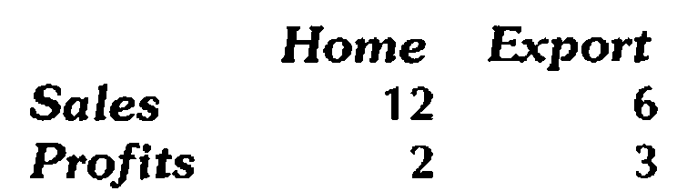
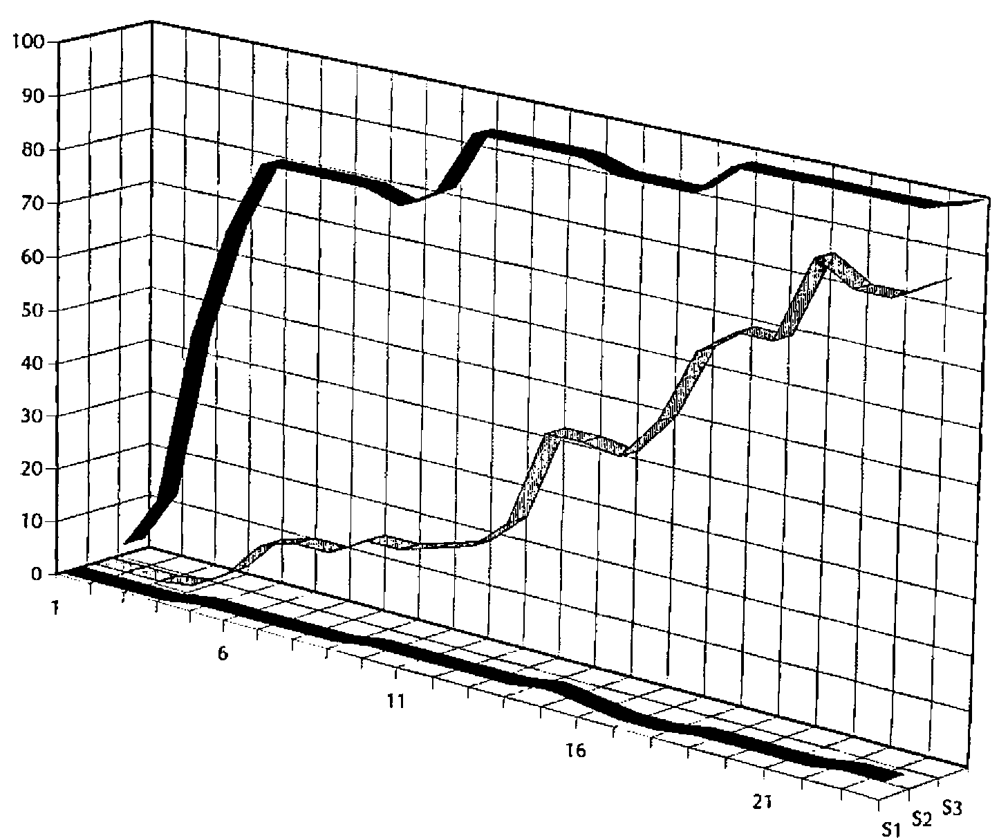

*by Adrian Smith*
{ .byline }

## Introduction

You are on holiday in Marbella. A nice young lady approaches, and asks if you would like to share your variables with her. Do you:

a) Explain that you are English, that you have a wife and two delightful children back at the villa, etc. etc. ….

b) Pretend you haven’t heard;

c) Engage her in a detailed technical discussion about the merits of concurrent processing, co-operating tasks, hot-links and cold-links, etc. until she wanders away in complete confusion.

Answers on a postcard please.

This was going to be a simple, practical guide to the use of shared variables and DDE under Dyalog/W and Windows 3; however it occurred to me that any APLers who have grown up since the mid 80s may never have encountered `⎕SVO` and `⎕SVC` at all. Consequently, I will start with a brief introduction to the philosophy behind concurrency in APL, and (hopefully) show how Windows DDE fits closely into the same pattern.

In part-2 (the bit subtitled "Practical Stuff (3)") you will learn:

- how to use Excel as a simple report formatter for APL
- how to use APL to supplement existing Excel formulae (e.g. to fit a Fourier Series through a column of sales data)
- how to drive Excel 3-D graphics from an APL numeric array
- how to exchange text between Winword paragraphs and APL nested vectors.

The point is that DDE is a very general mechanism for exchanging data between Windows applications. The new ‘OLE’ protocol that Microsoft are making such a fuss about still uses DDE underneath, so with a bit of digging in the manual, you should find that you can ‘hot-link’ APL data to almost anything. The possibilities are limited only by your imagination!

## Historical Stuff

The original motivation for shared variables is well explained by Wheatley in "Extending the Domain of APL" in the recent APL Systems Journal (Vol.30 No.4, pp. 446-456). They were first postulated as a means of modelling the channel architecture in the APL representation of the IBM/360; subsequently they were implemented in APLSV as a generic way of managing I/O facilities. The original concept was somewhat diluted by a series of rather unwieldy implementations, which failed to exploit the intrinsic symmetry and elegance of the basic idea. Consequently, many APLers regard `⎕SVO` more as a tacky way of reading VSAM files than as a generalised communication channel between co-operating tasks.

IBM were also very inconsistent in the provision of true ‘user-to-user’ shared variable processing, and unfortunately failed to implement the necessary event messages to allow efficient programming of concurrent tasks. Only VSPC came close to providing a usable system, although there is an Interprocess product which supports user-to-user `⎕SVO` under VM and TSO.

IP Sharp did rather better, partly because they have always operated with very tight restrictions on workspace size, and partly because they provided a good event handler in `⎕TRAP`. If you want to go digging, there are several good papers in IPSA conference proceedings which describe the use of background tasks for data management, workspace documentation and so on.

Meanwhile, the focus shifted to the PC world with its strictly single-tasking approach. IBM persisted with `⎕SVO` in APL2/PC, but simply as a way of porting a mainframe style of file access and screen I/O. It was not until the arrival of limited multi-tasking under Windows-3 that a genuine use of `⎕SVO` again became possible; by a useful coincidence Windows already defines a reasonable shared-variable manager (the DDE protocol), and Dyalog had chosen to use the IP Sharp approach to event handling. With both these crucial elements in place, it is not surprising that Dyalog/W has the first truly effective use of shared variables since APLSV.

## Practical Stuff (1): Shared Variable Basics

I had better begin with a very basic tutorial, aimed at those APL\*PLUS/PC users who never tangled with `⎕SVO` in their mainframe days.

Suppose you have two APL users sitting at their VSPC terminals, connected to the same mainframe; Adrian is user 2001, Alice is 2014. Here are excerpts from their session logs:

```apl
Adrian (2001)                  Alice (2014)
-------------                  ------------
      X←⍳6
      2014 ⎕SVO 'X DATA'
1
                                     2001 ⎕SVO 'QQQ DATA'
                               2
                                     QQQ
                               1 2 3 4 5 6
                                     QQQ←'Hello Adrian'
      X
Hello Adrian
```

This illustrates the simplest possible use of a shared variable: to move data quickly between two APL users. For a time, Rowntree shared production of the Dairy Box assortment between York and Edinburgh, and a shared variable link (very like the above) was used to allow both planners to see (and change) the same data at the same time.

To explain briefly what is going on:

- Adrian creates *X* and offers it to Alice with the (optional) alias *DATA*. The result indicates that his offer has not been taken up (possible results from `⎕SVO` are 0: offer not made, 1: offer made but not matched, 2: offer accepted).
- Alice offers *QQQ* to Adrian with the same alias name of *DATA*. This time she gets a result of 2, the number of links to the object known to the shared variable manager as *DATA*. On referencing *QQQ* she gets the value that Adrian put into it.
- Alice re-assigns *QQQ*. Some time later, Adrian looks at the content of *X*, and finds that it has taken the new value.

There are several potential snags with this simple arrangement. One obvious one is that there is no way for Adrian to tell that Alice has sent him a new copy of *X*. In many systems, this may not matter; if Alice is the counter on a Kit Kat wrapping machine, she will re-assign *QQQ* several times per second, but the plant manager (Adrian) will only be interested in the cumulative total a few times per day. The fact that several thousand intermediate values go to waste is quite immaterial. On the other hand, if Alice is an ATM machine at your bank, it is pretty crucial that Adrian (the bank’s central computer system) gets to know every transaction!

In order to manage the interchange of data under many different circumstances, Adrian and Alice need to make use of Shared Variable Control, which allows them to impose interlocks on the communication channel:

```apl
Adrian (2001)                  Alice (2014)
-------------                  ------------
      1 0 0 0 ⎕SVC 'X'
1 0 0 0
      X←'Hi, Alice'
      X←'Goodbye'     ⍝ Adrian's session now hangs until ...

                                     ⎕SVC 'QQQ'
                               0 1 0 0
                                     QQQ
                               Hi, Alice

      2+2             ⍝ Adrian is alive again!
4
                                     QQQ
                               Goodbye
```

The left argument to `⎕SVC` is a boolean vector, inhibiting you/your partner from setting/using the shared data according to the ravelled 2x2 array:

```text
     You  Partner
Set   0      0
Use   0      0
```

A `1` in the top left corner stops you setting *X* until your partner has used it (when Alice checks the value of `⎕SVC`, she sees a `1` in the top right corner, as her partner can’t set *X* until she has used it). Consequently, Adrian’s terminal locks up as soon as he assigns a second new value into *X*. Eventually, Alice comes back from lunch and examines *QQQ*; the second assignment is released, Adrian’s terminal unlocks and Alice can reference *QQQ* again to see the final value.

This simple protocol works fine if you can rely on your partner not going out to lunch! In most mainframe IBM systems the partner is an Auxiliary Processor (such as AP126 for managing GDDM screen access); it will always be there, and it will always respond more or less straight away. Consequently you will normally find `⎕SVC` set to `1 1 1 1`, as you want to ensure GDDM has processed your format request before you send it your field data.

Things get harder when you want to manage genuine concurrency between two processes which mostly just want to get on with life, but occasionally may need to inform each other of a change to some shared data. You could imagine a market monitor, which takes a constant feed of share information, and is triggered to set an ‘alert’ flag when certain pre-set conditions arise. You cannot have the trading system suspended until an alert arrives, but you do want to be informed instantly when it does. Mainframe IBM APL never provided the tools to implement such a system; it was left to IP Sharp to devise a consistent definition of ‘events’ (see Vector 6.1 and 6.3 for the background to event trapping) which is the final piece in the jigsaw.

## Practical Stuff (2): DDE Basics for Windows

DDE stands for **Dynamic Data Exchange**; it allows co-operating Windows programs to access the same piece of data at the same time. For example, you might calculate some figures in your Excel spreadsheet, and create a link to the table from Winword. The figures get printed as if they were part of your document, but any changes you make in the spreadsheet are automatically reflected in the Word report.

You can see DDE in action even within a single application: enter some data into an Excel spreadsheet and open a Chart. Whenever you change the numbers, the chart moves, and in some cases you can drag the chart with the mouse to change the data in the spreadsheet cells. If you look under <u>F</u>ile,<u>L</u>inks in the chart menu you will see that Excel has set up a DDE channel from the spreadsheet to the chart, and that the two are actually running as concurrent tasks.

DDE is an excellent protocol as long as you are working on a single machine. However consider what happens when you send your Winword document (and Excel worksheet) to a friend who does not own Excel! When he loads the document, Word will try (and obviously fail) to re-establish the link to the spreadsheet. The data is there alright, but in order to access it, Word needs to fire up Excel to act as the DDE Server. OLE (**Object Linking and Embedding**) overcomes this problem by giving you the extra option of embedding the spreadsheet data into your document. Word now saves the spreadsheet as part of the final document (with some hidden information on where it came from), but in order to update it you must explicitly select it (which starts Excel for you with the data already loaded).

The picture is further confused by the tendency of modern Windows applications to make life as easy as possible for the user!! In Winword-1 you simply selected <u>I</u>nsert,<u>F</u>ield and were offered ‘DDE’ and ‘DDEAUTO’ as possible field types. You then had to type the source of the data, e.g. ‘DDE(AUTO) ExcelWorksheet Sheet1 R1C1:R5C2’. In Winword-2, you are expected to copy the worksheet range into the clipboard, and use <u>E</u>dit,Paste<u>S</u>pecial in Word. Word examines the clipboard for you, and inserts the DDEAUTO field automatically. This is fine, except that the details of how to do the job by hand have been removed from the manual, and are only to be found in the on-line help file!

In summary, DDE is now, and for the foreseeable future will be, a widely supported channel for data sharing between Windows applications running on the same machine (and shortly between machines attached to the same network). However, some persistence might be needed to establish the syntax needed to set up (by hand) DDE links to your particular Windows application. The examples below will work for Excel-4 and Winword-2; in extremis you could always link APL to one of these, and employ the newer <u>P</u>aste,<u>L</u>ink syntax to make a second link from there to your final target!

## Practical Stuff (3): DDE from Dyalog/W to Excel and Word

### Scenario-1: Excel as a report formatter

> It is 11.03am. You have just completed a company reporting system in APL, which does all sorts of hard sums and comes up with a simple table of consolidated results. These have to be included in the Company Report, which must go to the printers at 11.15 sharp; outside you can hear the motorcycle courier revving his engine impatiently. You have just been told that you have to use the official corporate typefaces (18 point Souvenir Demi-Italic for the heading and 18 point Optima-Bold for the data); here is what you do …

```apl
      ⎕WSID
SALESWS

      REPORT          ⍝ A nested array with your data
         Home        Export
Sales      12             6
Profits     2             3

      ⍴REPORT
3 3
      'DDE:' ⎕SVO 'REPORT data'
1
```

> Load Excel, select cells A1..C3, and type:
>
> ```text
> =Dyalog|salesws!data
> ```
>
> … and hit CONTROL+SHIFT+ENTER to enter an array formula. You will see your report appear in the selected cells. Select row-1, click the right mouse button, choose <u>F</u>ont and set the top row to Souvenir Demi-Italic 18pt. Repeat for the first column, and the body of the report (only this time select Optima-Bold). Double-click the border to get the cell widths set correctly, right align the headings in row-1 and print it:
>
> 
>
> Dash downstairs and hand the paper to the courier. It is 11.12, and you have 3 minutes to spare.

### Scenario-2: APL as an Excel calculator

> You have just set up a really nice sales forecasting system in Excel. This makes use of all the gee-whiz features your user could possibly want (macros attached to buttons, a custom toolbar with your own design of icons, 3-D tower charts with rotatable perspective), but unfortunately the forecaster has just read a paper recommending Fourier Series as the best way of fitting a mixture of trending and seasonal data. You know of a nice way of fitting a Fourier Series in APL, but a rapid search through the list of Excel add-ins leaves you stumped. Here’s what you do …
>
> Select the column of Excel data, and use <u>F</u>ormula,<u>D</u>efineName to call it something sensible (say ‘series’). Start APL, and enter:
>
> ```apl
>       'DDE:ExcelWorksheet|ddesales.xls' ⎕SVO '∆XXX series'
> 2
>       ⍴∆XXX
> 104 1
> ```
>
> You may like to check some values in *∆XXX*, modify them in Excel and check them again. You will notice that *∆XXX* is ‘hot-linked’ to the range called ‘series’, and that any changes in the spreadsheet are applied automatically in your APL workspace. Apply your Fourier function to *∆XXX*, and return the result to Excel as described in Scenario-1.

This is fine for a one-off exercise, but you would like to make the process fully automatic. The full details are well described in the Dyalog APL User Guide, but there are a couple of snags along the way! Dyalog APL provides you the option of trapping a ‘DDE’ event; if you set up an event trap on the root window:

```apl
'.' ⎕WS 'EVENT' 50 'CALC'
⎕DQ '.'
```

your workspace will detect any change to the data in ‘series’, run *CALC* to calculate a new Fourier fit, and bounce the result back to Excel automatically.


The snag is that *CALC* gets triggered on any DDE event, including your return of the completed data to Excel! You need to ensure that it only bothers to run the (quite lengthy) calculation when the data has changed. In theory, you can use `⎕SVS` (Shared Variable State) to check whether ‘series’ has altered since you last referenced it; in practice this frequently reports a change when nothing has actually happened!

This may be Dyadic’s problem (in which case it will doubtless get fixed), or it may be something odd at the Excel end (in which case it would be as well not to hold your breath while waiting). The best plan is probably the simple-minded approach of copying the data, checking for a mismatch and exiting otherwise …

```apl
    ∇ CALC
[1]    →(xxx≢∆XXX)↑Run
[2]    →0
[3]   Run:FIT
[4]    xxx←∆XXX
    ∇
```

If you ensure that DYALOG.EXE is in a directory on your search path, Excel will start APL automatically as soon as you open the worksheet, load your *FFIT* workspace, and (assuming you have defined a sensible `⎕LX` to share the variables and initialise *xxx*) your APL code will be up and running with no user intervention.

**Health Warning**: when playing with shared variables and DDE you should `)SAVE` as often as you can. Unfortunately, Dyalog cannot save the workspace when there are active shared variables; unfortunately (again) one of the best ways of killing APL (and sooner or later the whole of Windows) is to retract the share at the APL end (with Excel still running) and then try to `)SAVE`. If you do get into this state, don’t try to rescue anything, just hit Ctrl-Alt-Del while you still have the chance.

**Useful Advice**: beg, steal or otherwise obtain a copy of SPY.EXE from the Windows Software Development Toolkit (this also requires HOOK.DLL). With SPY running, you can watch the DDE messages flying backwards and forwards, which is invaluable in debugging anything more complex than the simple examples described above.

### Scenario-3: Excel as an APL graphics server

> You have just written a little workspace to explore the performance of simple genetic algorithms with APL. You would like to see the outcome of each generation plotted as it happens, rather than waiting for the APL run to finish and then drawing the entire history. You rather fancy a 3-D ribbon chart ….



> Proceed as per Scenario-1. Start your results array the right shape, then as you index into it generation by generation, you will see the chart plot your results as they happen. Once you have set the run going, you can minimize APL and simply look at the moving chart.
>
> It is interesting to look at the links, both in the chart and the worksheet: the chart is linked to the worksheet, and the worksheet is linked to APL. If you can fit all three on the screen together, you will see the sheet update fractionally before the chart!

### Scenario-4: Text transfer between APL and Word

> Suppose you have a stack of documentation in an APL workspace, which you need to access in Word, so that you can compile it into a Windows Help file. However you would rather like to continue maintaining it in APL. Here is what you do …
>
> ```apl
>       ⍴TXT                     ⍝ 25 paragraphs
> 25
>       ⍴¨TXT
> 123 28 257 ....                ⍝ made up of characters
>       ⎕WSID←'APL2MSW'          ⍝ ensure WSID is set OK
>       'DDE:' ⎕SVO 'TXT'        ⍝ as normal
> 1
> ```
>
> In Word, select <u>I</u>nsert,<u>F</u>ield from the menu, ignore the choices offered, and type:
>
> ```text
> DDEAUTO Dyalog APL2MSW TXT
> ```
>
> … you will see your text inserted at the appropriate point in the document. If you modify *TXT* in the workspace, the updates are immediately reflected in the Word document.
>
> To effect a similar transfer in the reverse direction (say from a document called ‘manual’), select the text in Word and name it with a bookmark (e.g. <u>I</u>nsert,Book<u>m</u>ark ‘word2apl’). Then in APL:
>
> ```apl
>       'DDE:WordDocument|manual' ⎕SVO 'XXX word2apl'
> 2
>       ⍴XXX
> 12                    ⍝ 12 paragraphs
> ```
>
> As before, any changes in the document are instantly apparent in *XXX*.

## Summary

DDE is a good general-purpose mechanism for moving data ‘in real time’ between concurrent Windows tasks. It is philosophically very close to the existing APL ideas embodied in `⎕SVO`, `⎕SVC` and `⎕TRAP`. Dyalog/W uses shared variables in a simple and consistent way to allow APL to co-operate with other Windows programs. This opens up the possibility of exploiting the power of Excel graphics as part of an APL application, or of using APL simply as a calculation engine for an existing spreadsheet system.

APL Multi-media, anyone? I wonder if I can share a Bach Canon with my SoundBlaster card … perhaps I should digitize the dog and profile his bark in APL …. The End.
