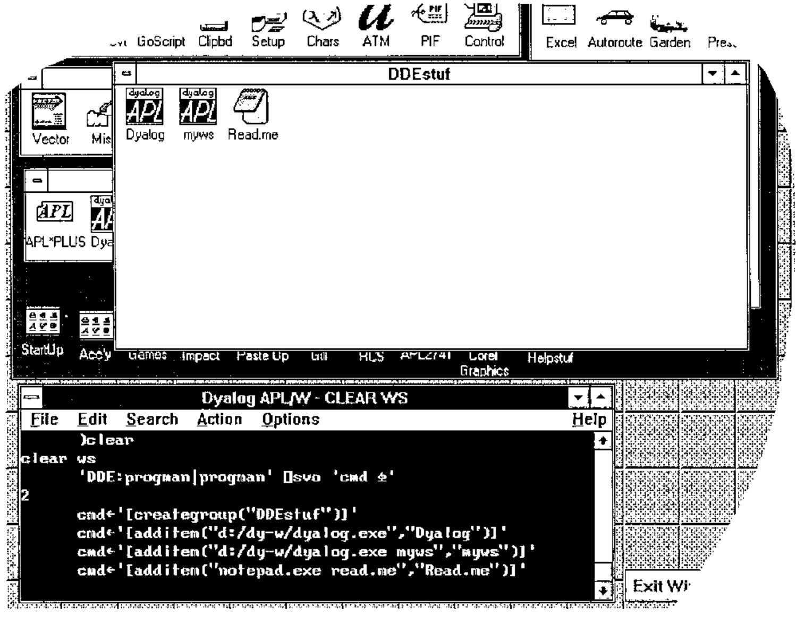

*by Adrian Smith*
{ .byline }

Did you ever wonder how such a wide variety of Windows installation routines manage to get their target software added into Program Manager? The final act of a well-behaved ‘Setup’ is to add a new group, and then populate it with a string of icons, usually including an instance on ‘Notepad’ preset to open a READ.ME file. Something a bit like this, in fact:



… all of 5 lines of APL achieve the same effect! As is so often the case with Windows, there is a simple and well-documented interface — once you find the appropriate documentation [1]. In this case you need to look towards the back of the chapter on DDE, but you also need to understand a little of how Windows applications treat ‘DDE-Execute’ commands.

In the examples from Vector 9.2, I showed a few ways of exchanging data with a couple of standard Windows applications — MS Word Vn 2.0 and Excel Vn 4.0 [2]. In both these examples, I worked with a DDE ‘Topic’ which in some way marked out the data to be shared — in Excel it is a named range, in Word it is a block of text marked with a Bookmark. All well-behaved Windows programs also offer the additional option of communicating with a ‘system’ topic, and one of the useful things this does is to *execute* commands passed over the DDE channel — essentially you can drive the application by remote control!

Windows Program Manager illustrates the technique rather well — in the example shown opposite I first set up a connection to its ‘system’ topic (called ‘progman’ just to add a little confusion):

```apl
      'DDE:progman|progman' ⎕svo 'cmd ⍎'
2
```

From now on, anything assigned to *cmd* is executed for us by Program Manager … the example adds a new group and inserts a couple of APL icons (and a Notepad icon) into it (yes, all those `[]` and `" . "` do matter!):

```apl
cmd←'[creategroup("DDEstuf")]'
cmd←'[additem("d:\dy-w\dyalog.exe","Dyalog")]'       ⍝ ... etc.
```

The Program Manager macro commands you need to know about are:

```apl
cmd←'[creategroup("Groupname")]'
cmd←'[additem("cmdline","descr","Iconfile",IconIndex)]'
cmd←'[deletegroup("Groupname")]'
cmd←'[showgroup("Groupname",action)]'          ⍝ See below ...
```

‘Creategroup’ will simply display "Groupname" if it already exists; the entries for "Iconfile" and "Iconindex" are optional … by default you get the first icon in the .EXE specified as the cmdline. Valid (and useful) showgroup actions are:

| | |
|--:|---|
| 1. | Activate and display group window |
| 2. | Activate, but iconize group |
| 3. | Activate and maximize group |
| 6. | Minimize group window |

I hope that gives you enough information to get you going.

## References

[1] Microsoft. *Windows 3.1 SDK Guide to Programming*, Chapter 22, pages 20-24.

[2] Smith, Adrian. *Shared Variables and Windows DDE*. Vector Vol.9 No.2 p128.
