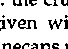
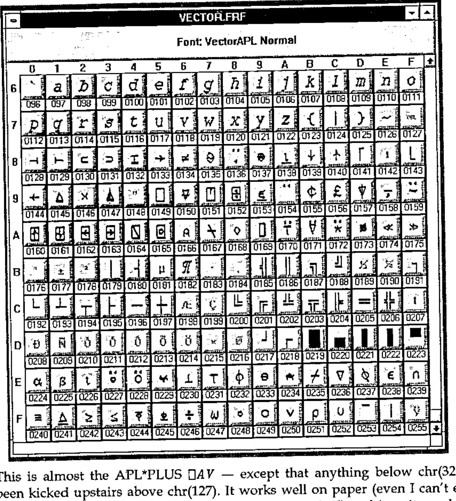
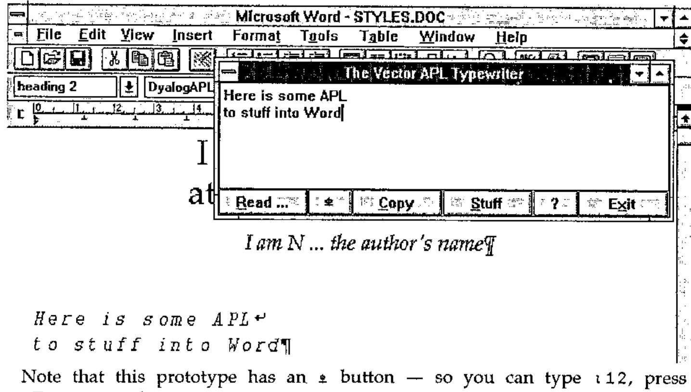

*by Adrian Smith*
{ .byline }

## Motivation

First, let me state a prejudice — I think the world would have been a better place had TrueType never been invented. PostScript already provides an excellent standard for rendering text onto paper, and with the advent of Adobe Type Manager (ATM) under Windows 3.0, it ensured that what you saw on the screen was **exactly** what you got on the paper. ATM also does a marginally better job at rendering awkward fonts (such as *APL*) on screen at small sizes.

PostScript also has a long tradition of naming fonts, for example Vector is typeset in *Palatino-Roman* 13/16 (before reduction). I object violently to having to select something called *"Book Antiqua"* in Winword to get an apparently identical font, but one which is sure to have at least one subtle difference to get around copyright problems! For example, compare the "R" in Helvetica and Arial … !

Unfortunately, Microsoft are bigger than I am, so (like 7 million other Windows users) I have to go along with them. It is obvious that an increasing proportion of Vector material will be prepared in either Windows Write or Winword; Vector production remains in Word 5.0 under DOS … so I need a solid and simple way of getting Windows material across into DOS.

## The Options

I could simply move over to Winword. At the moment, a sufficient volume of material is still in DOS format (typically APL\*PLUS/PC workspaces) that I would have similar problems moving material across. Also, I find Word 5.0 at least 30% faster for basic mechanical typing and formatting. Vector is quite a big document, and DOS word (in text mode) can scoot around it much faster. Also, Windows has stolen a lot of the most useful keys — for example to make a subheading I simply hit &lt;Alt+s&gt; in Word 5.0; in Winword it would be &lt;Ctrl+Shift+s&gt; which takes that little bit longer.

I could write lots more little translation routines. Jonathan’s review of ISI APL was (not unreasonably) created using the ISI TrueType font, and hence the ISI `⎕AV`. It was about half an hour’s work to make a `∆ISIAV` vector, read the whole review into APL, and spit it back out translated. The problem with this approach is that you rapidly start getting confused and applying the wrong translations … which makes the APL bits look very funny indeed.

I could try to guide the APL world towards submitting material in the format that is easiest for me. There is only one way to do this — I have to make it easier to use my `⎕AV` than anyone else’s. That means I need to provide both a TrueType APL font encoded how I want it, and some kind of simple APL typewriter so that you can enter code without the hassle of &lt;Alt+0251&gt; to get a `⍴`.

## The Joys of Font Design

The APL stuff in Vector is printed with an Adobe Type-3 font, which is designed to be human-readable as well as computer readable. For example `≠` is simply defined as:

```text
/sf { 3 1 roll moveto 0 rlineto} def % Serifs
/NE { 125 400 400 sf
      125 200 400 sf
      175 80 moveto 475 520 lineto
      stroke } def
```

… the crucial thing is that PostScript allows you to stroke the font with a pen of given width. You also get nice rounded line ends [1] simply by setting the linecaps property:



Converting this to TrueType is not easy! This time, you are only allowed filled outlines, so you have to draw around the character boundary (crossing lines are strictly verboten) and do those nice round ends yourself. It also turns out to be very important to work on a grid such that when the TrueType engine draws your character on the screen, things like `¯` don’t fall through the cracks in the pixel rounding and vanish from sight.

I did this by asking GoScript to render a complete sample font at 72-point, and output the result to a .PCX file (rather than to paper). I then loaded the resulting file into CorelTRACE and asked it to convert the bitmaps to vector outlines by edge-tracing them. This gave me a reasonable starting point, but obviously it introduced a certain amount of spurious fluff. The tedious bit was to take these outlines, snap them to a standard grid, remove the fluff, and output each character to TrueType. CorelDRAW helped a lot with this process, for example you can draw your own shapes on the ‘guidelines’ layer and get other characters to snap to them. I worked throughout with an underlying `⎕` to ensure correct geometry and centering, and an underlying *I* to check the obliqueness of the alphabetics.

Once you have a TrueType font, you are on the downhill slope. The next package I can recommend is FontMonger (Ares Software: USA+415 578 9090, cost $145; available in the UK from Camelot mail order: 0800-565656, cost £79+VAT) which is not to be confused with AllType (which has four legs and barks and is not recommended at all). FontMonger will read and write fonts in almost any known format, and it does a pretty good job of adding ‘hints’ to TrueType to improve the rendering on screen. It makes remapping a font a breeze — you simply start a new font and cut-and-paste from an existing layout. Here is the Vector font as shown on Fontmonger’s edit screen:



This is almost the APL\*PLUS `⎕AV` — except that anything below chr(32) has been kicked upstairs above chr(127). It works well on paper (even I can’t easily spot the difference between it and the APL2741 original) and is quite usable on the screen.

## A Prototype APL Typewriter

The requirement seems to me to be quite simple: a little edit box which will sit on top of Word and let you type APL snippets with a sensible unified keyboard mapping. The box should be capable of importing APL code from ASCII files (translating from all known `⎕AV` orderings) and should allow you to copy the contents to the Windows clipboard, so that you just click back to the underlying word processor and hit paste. In fact for Winword it can go one better — you can use DDE to stuff text directly into a document at the current cursor position. Something a bit like this, in fact:



Note that this prototype has an `⍎` button — so you can type `⍳12`, press &lt;Execute&gt; and get `1 2 3 4 5 6 7 8 9 10 11 12` on the following line automatically. I need to check this with Dyadic, as it may be a bit close to the edge of what you are allowed to ship with a runtime interpreter! It also requires Dyalog 6.3, as an essential part of the design is to have the APL typebox visible at all times, even when Winword (or Write) is running full-screen. This limits availability to "RSN", in other words, some short while after Dyalog release a pukka copy of version 6.3.

*Subject to the above, to get your copy of the font and APL typebox, please send a blank formatted disk (at least 1.2Mb) to Vector Production. Don’t forget to include your name and address!*

## Reference

[1] Joey K. Tuttle, *"APL pi — Designing an APL Type font"*, APL81 Conference Proceedings, pp298 — 302
