*proposed by Adrian Smith and Duncan Pearson*
{ .byline }

## Abstract

This is the first of a set of three papers which together outline a common approach to programming the Windows User Interface from APL. The base utility set is now complete for Dyalog APL, and will quickly be ported to APL\*PLUS III now that we have a beta-release of the interpreter. This will be freely available at no charge (other than handling and postage) from APL-385 or the British APL Association.

This paper covers the background, specifically:

- why we feel that a common approach to GUI development is a good (indeed necessary) thing for APL.
- the philosophy behind the design, particularly the idea that what you see and manipulate on the screen is simply the visible manifestation of some APL variable.
- some of the pretty things you can do, and some idea of how fast it is to do them in this environment.

The second paper will be a detailed technical walk-through of the code that forms this basis layer. All the major functions will be listed and discussed, and the commonality of approach across Dyalog and PLUS III will be highlighted.

The third paper will focus on two particular features of the environment: printing and high-quality graphics. It will also introduce the ‘developers’ kit’ for use by any skilled APLer in producing (and maybe even selling) objects which go far beyond the base functions shown in today’s proposal.

## Why a Common Approach?

The basic answer is very simple – because it greatly increases the life-expectancy of your APL code. At Rowntree, we have always built our mainframe systems on a layered set of utilities; screen handling went through FSM from the early days of AP124. This allowed us a simple migration to AP126 and GDDM (and hence we could exploit colour and graphics) while the Nestlé systems which we have recently inherited are still firmly stuck on AP124 and look old and cranky by comparison. The FSM approach transferred easily to the APL\*PLUS/PC environment, and allowed us to train new graduates on a single set of utilities, regardless of the platform they were working on. This not only reduces training costs, but it allows the OR manager far greater flexibility in deciding who can go on holiday when! In the end, it is things like this which determine whether an old system lives on, or whether the business cannot face the cost of a rewrite, and reluctantly abandons something useful.

There is an important, indeed crucial, difference between the simplistic ‘cover function’ approach taken by the consultants who built the Nestlé systems, and a true platform-independent layer which is designed from the outset to be portable. Simply hiding all your `⎕SVO` calls under 1-line utilities may make you feel better, but it takes you nowhere. You are still structurally tied to one particular way of (in this example) writing data to the screen. You may just move your code to another mainframe system (AP124 to AP126, say) which is closely related, but you will never move it to a Vax or a PC which handles the display in a fundamentally different way.

Of course there is another (usually unspoken) reason to make sure your code is portable: the vendor from whom you bought your interpreter might either go out of business, or might just decide not to bother with APL any more. If I was dependant on Vax APL, or even APL2/PC I would be seriously concerned that both Digital and IBM have bigger fish to fry, and I might without any warning get ‘stabilised’ and eventually de-supported. Both Manugistics and Dyadic are small companies, and one or both might simply curl up and die sometime over the next 10-20 years. I am proud of the fact that I still have code running with 1982 timestamps on it – can I rely on both of the above still to be there in 2006? The odds of at least one of them being there are very considerably higher, but which one?!

However, portability isn’t just about paranoia! If you build your utility set from the perspective of what the application needs, rather than what the subsystem provides, you just get a much better utility set. The Visual Basic design toolkit [1] is a classic example of how not to do it – it simply offers you everything Windows has thought to provide, and it is your problem to work out which of the multifarious elements you must combine to make a sensible application.

The first thing I found I was doing in APL was making something which looked like this:

```apl
      name←'Adrain Smith'
      Gui_call sample1         ⍝ A utility fn to call 'sample1'
```

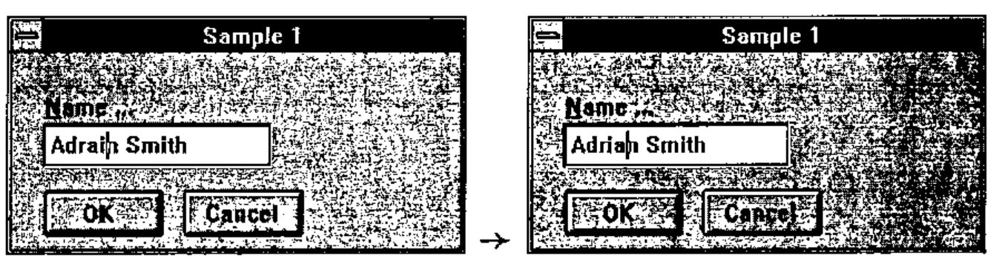

```apl
      name
Adrian Smith
```

*The text field is just the visible manifestation of a variable!* If that variable should change for any reason, the visible text will automatically update to show the new value. If I make a change to the visible text, as soon as I quit the field, the variable is assigned to match what I can see on the screen, and any other objects which might happen to be linked to it get updated *automatically and immediately*.

How many objects can you see? Including the form itself, I can see four:

- a simple form with a caption of "Sample 1"
- an OK thing (no caption needed here) which will close it
- a Cancel thing (ditto) which will abandon it
- a text thing, with a caption of "Name..." where I can type something. In this example, it has been linked to the APL variable `name`.

More or less every dialog box will have some combination of OK, Cancel, Close, so I should be able to add one of these to my form, and it should already know how to behave (e.g. OK should close its form, and return 1 to whatever called it up). Virtually every edit field has a caption, and I generally want it just above, left aligned. I have spent enough frustrated minutes watching our PowerBuilder developers trying to line up their labels with their edits to realise that there had to be a better way!

I want a matrix object, which will take an array of numbers, sling it on the screen, let me type all over it, and ensure I get something sensible back! And so on, and so on.

```apl
      numbers←23 12⍴⍳1000
      Gui_call testmat
```

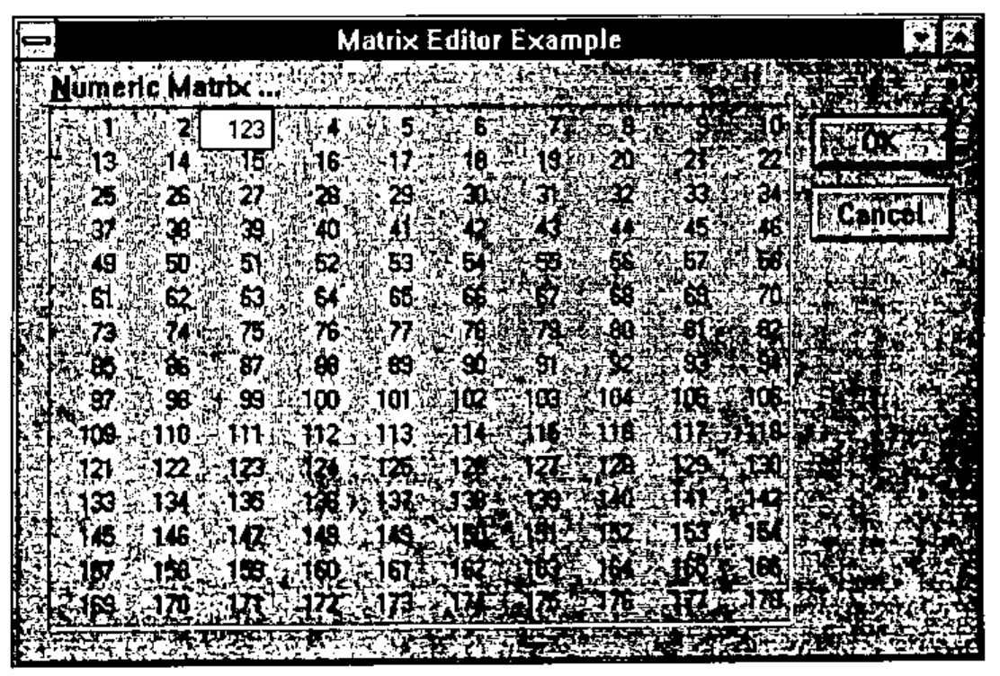

```apl
      numbers
  1   2 123   5
 13  14  15  16  ... etc.
```

This is APL after all! Windows offers you one or two quite good vector controls (like the list box) but is quite hopeless at arrays.

**To summarise:** a common approach should give you two things: insurance against future change, and a development platform that started life with the APL application developer in mind. How well Duncan and I have achieved that goal, it is up to you to judge.

## Design Philosophy: 1 – Direct Manipulation

The first thing we must do here is to acknowledge our joint debt to Ian Clark. We first saw APLomb[2] at an APL vendor forum just a year ago, and independently came to the conclusion that, if there was a right way to do it, this was it.

The key concept to grasp is that what Ian offers is direct manipulation of APL variables by the Windows objects. By this, I don’t mean fancy stuff like dragging lorries across the map to move goods from factory to depot (although it does this too), but much more mundane things like editing text and setting numbers to values.

Now look at this:

```apl
      cooktime←20
      gasmark←4
      Gui_call sample2
```

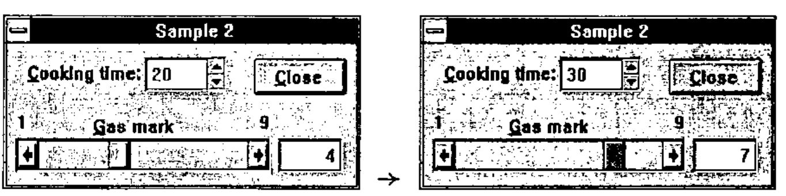

… dragging the scroll bar changes the number to its right; typing over the number shifts the scroll. I can spin the cooking time (in 5-minutes units) or just type it in. When I close the form:

```apl
      cooktime gasmark
30 7
```

The example above nicely illustrates our first design objective: it requires absolutely no APL code, and it took me less than 3 minutes to make it, test it, and copy it from APL to the printed page. I simply assigned the variables (as above), drew the form, added a ‘Close’ thing, a ‘Spin’ thing, a ‘Parameter Bar’ thing and a ‘Number’ thing, linked the spinner with `cooktime` and the other two with `gasmark`, and ran it. Naturally it worked first time, because there was almost nothing to go wrong!

## Design Philosophy: 2 – Forms follow Functions

What we mean is that we like the way APL functions call other functions (with arguments) and get results back. We also like the way functions can have local variables. In short, a function can behave strictly as a black box, and execute with no side effects in the workspace. This makes for reliable applications, easy maintenance, and facilitates the evolutionary design process that is one of the great strengths of APL. Something a bit like this …

```apl
      ⎕←'Adrain Smith' Gui_call sample1
Adrian Smith
```

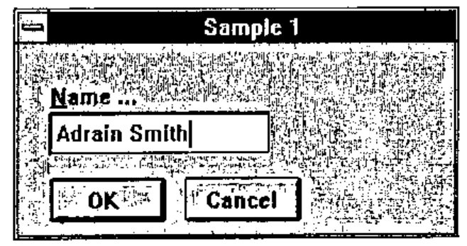

The form definition is held in matrix `sample1`. It is called with ‘Adrain Smith’ as its argument by utility function `Gui_call`, which returns the corrected value … assuming I typed correctly and hit the OK button.

The form keeps a local copy of the original text so that if I type incorrectly and hit &lt;Cancel&gt; it can return the original value. In the old days, I would have made a simple function such as:

```apl
    ∇ new←fix name
[1]   new←name
[2]   name←input 'Enter new name'
[3]   →(⍴name)↓0
[4]   new←name
    ∇
```

My form is really just another way of achieving the same ends: it takes the old name as argument, copies it (so we can cancel), and returns what you did. To do something as simple as this, I should not require a function as well as a form! All normal APL rules apply, so that if you have a button on a form which makes another form, it can pass arguments and get results in just the same way. Code executing from the child form can see (and modify) local variables defined by its parent, and so on down to the globals in the workspace.

**To summarise:** we like the APL approach to functions, arguments and results because it lets us build complex systems from simple (tested) components with no unexpected side effects. We want the same behaviour from our Windows systems, which may be a lot more complex than anything we have yet built.

## Design Philosophy: 3 – Events Trigger Actions

This idea follows on quite logically from the way we always used to program our old mainframe systems! How many of you have written code like this …

```apl
Wait:PF←GDDM∆WAIT
 →(Add,Delete,Save,Error)[1 2 3⍳PF]
Add: do this ⋄ →Wait
Delete: do that ⋄ →Wait
Save: Saveit ⋄ →Done
Error:GDDM∆BEEP ⋄ →Wait
```

The only "events" you needed to handle were 12 Pfkeys, &lt;Clear&gt; and &lt;Enter&gt;, so a simple multi-way branch was fine. Under Windows, life is far richer, but potentially far more complex. Trying to write similar code which unscrambles the results of a ‘wait’ (in Dyalog this is a `⎕DQ '.'`) results in an enormous and unreadable main function, which could easily run to several hundred lines [3]. The alternative is to specify, for each object in your dialogue box, a table of events that interest you, and the APL code to be executed when each of them occurs. Here is `sample1` again, slightly modified to illustrate the idea:

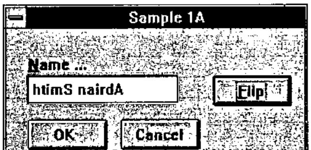

You can guess what happened when I hit the ‘Flip’ button! Well, buttons only report a couple of interesting events, and in this case all we want to hear about is a ‘Select’. The dialogue-box defines an entry which flips `name`, and also lets the edit field know that its linked variable has changed.

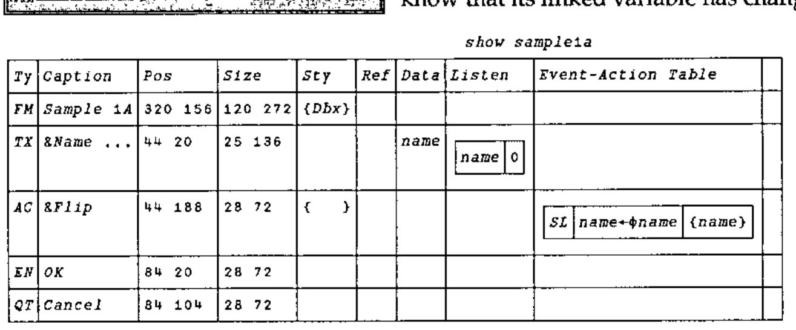

Once again, no programming is needed, or at least you could say that the dialogue-box is the program!

## Design Philosophy: 4 – We Define the Objects that WE Need

When I say "we define" what I really mean is "Microsoft did not get everything right". Nearly every Gui-builder package that we have seen slavishly follows the Microsoft lead and has three sorts of buttons, but functionally there is almost no similarity between ‘Push’ buttons, ‘Check’ buttons and ‘Radio’ buttons. Here is what might be useful to an application builder:

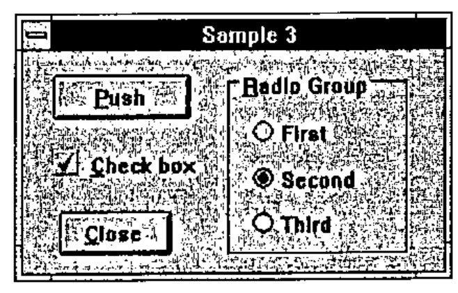

The ‘Push’ button is the same as the Windows kind … it reports a ‘Select’ event when pressed, and I should execute a piece of code. Easy.

The ‘Check’ is typically linked to a boolean scalar. They rarely trigger actions, so have very little to do with the first kind.

Radio buttons only make sense in groups, so why not just make a ‘Radio Group’ object which is linked to two variables: an option vector (`'First' 'Second' 'Third'` in this case) and an integer which tells it which one is selected (2 in this case). Quite soon, you run out of screen space, but this is no problem, as you simply switch from a radio-button group to a ‘drop-list’. In the same way, you quickly find that the closest relative of a check-box group (like a multi-select radio-group) is actually a list:

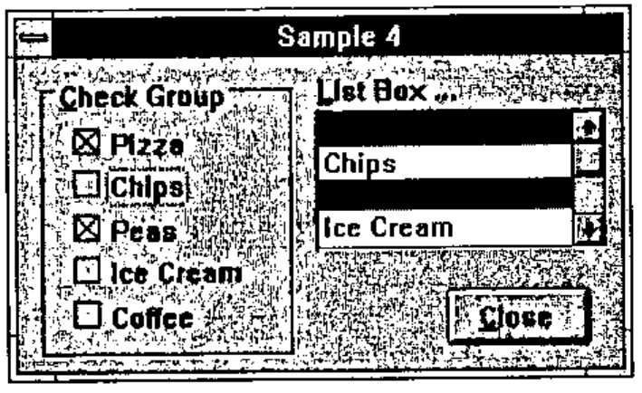

Both of these objects naturally link to the same type of data: a vector of names to choose from and a vector of integers (`1 3` in this case) which marks the picked elements. It is simple for the programmer to choose the most appropriate way of representing the data – without making any changes to his APL code.

We could go on – Windows offers you an apparently innocuous choice between ‘single’ and ‘multiline’ edit fields, yet there is a difference in kind between simple text entry (such as I used a few pages back) and a ‘notepad’ which is a full scale word-wrapping editor, and naturally watches a vector of text vectors! Let’s make a collection of objects sensibly classified by what they do, and the kind of data they watch:

Just to give you a flavour (the appendix lists the full range of objects) here is a screen-shot of our designer, offering to add an item from its range of ‘texts’:


The designer does the obvious things – you can add and delete objects, drag them around, stretch them and shrink them and snap them to the grid of your choosing. It also does some less obvious things, like anchoring objects to a given edge (so you can stick your ‘Close’ button to the bottom right corner) or to the height/width of the form (so your notepads grow when the user resizes the form). It is good at aligning, cloning, framing, and just generally making the finished product look professional, all with the minimum of effort!

Here is the dialogue box it drew:

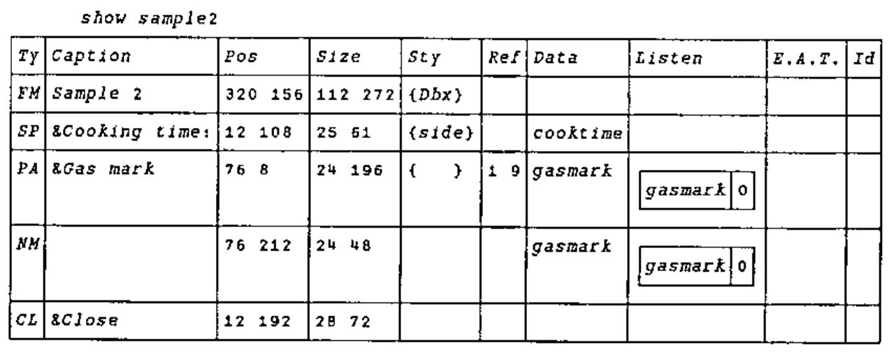

One final example, which is really just showing off:


Have a look at the object table in the Appendix, and see how many of these you can identify. I suppose I should repeat (because I still find it hard to believe) that this entire screen requires almost no code, other than schoolboy APL such as `bits←⊖bits` which is what the &lt;&lt; Flip &gt;&gt; button does when you hit it. Fancy stuff (like the recessed label which tracks the colour value as the mouse moves over the bitmap) was almost too easy; note the ‘Mouse-Move’ action which sets a local variable to the row/column position of the mouse (in a co-ordinate system which matches the bits in the bitmap). All the label needs to do is link to a simple expression which reports these numbers, and the `(⊂coord)⊃∆beach`.

![DISP dbx_psbk[sel;1 2 9] (selected objects only): FM Bitmaps and Charts;cht;cell with CR cht←1 ⋄ cell←1 1 {}; BK Simple Bitmap Viewer with MM cell←⌊⍵[3 4] ⍝⍝ is the message {cell}; AC << Flip >> with SL ∆beach←⊖∆beach {∆beach}; AC &Browse with SL tmp←⎕TC[3] ∆csvton ⍎×pg×,⍕cht ⋄ ted ∆tmp× {}](art10008510/table3.jpg)

## A Practical Example: Building Windows Help Files

Just as a way of rounding this off, here are a couple of screens from a genuinely useful application that took all of a Saturday morning to build:


I finally got sick of trying to make help files in Winword (keeping track of the jumps quickly covers your screen in Post-It notes) and spent a couple of hours understanding what it actually wrote to that .RTF file. Then I made a little function to convert APL data to .RTF (easy) and I thought a little about how I wanted my help files organised. Then I got hacking. The screen above shows the overall structure of the help system … you can add, remove, rename and group topics. Here is the Contents page it made for me:

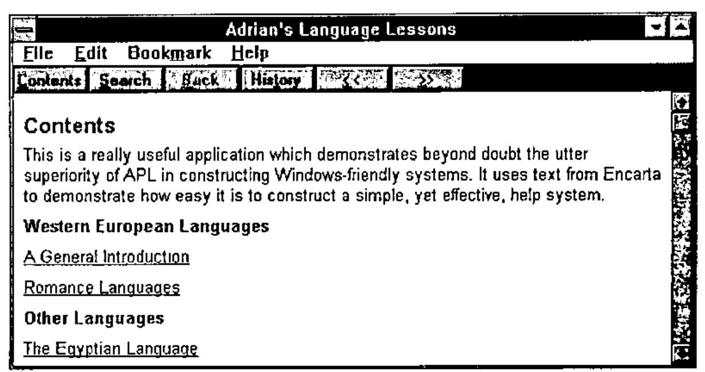

Double-click on a topic in the APL Helpmaker and:

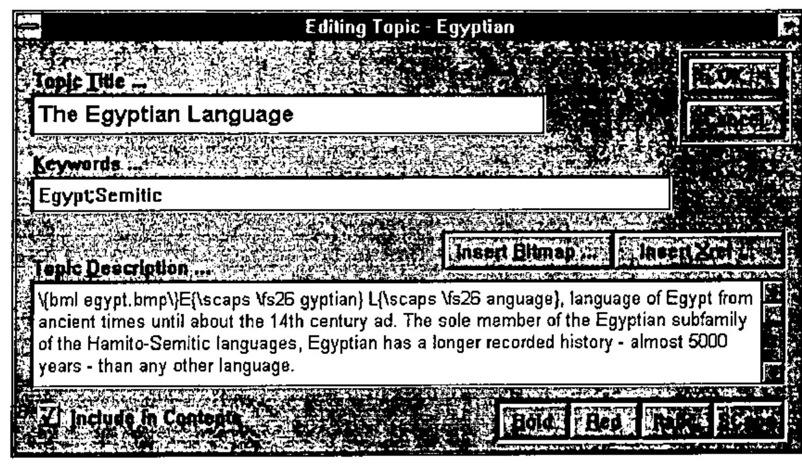

… the funny stuff in the text is what you need to put there to make your RTF turn into a nice help file! It was all inserted for me by the buttons above and below.

Run the output from this through the SDK help compiler, hit Egypt, or search for ‘Egypt’ or ‘Semitic’ and hey presto:

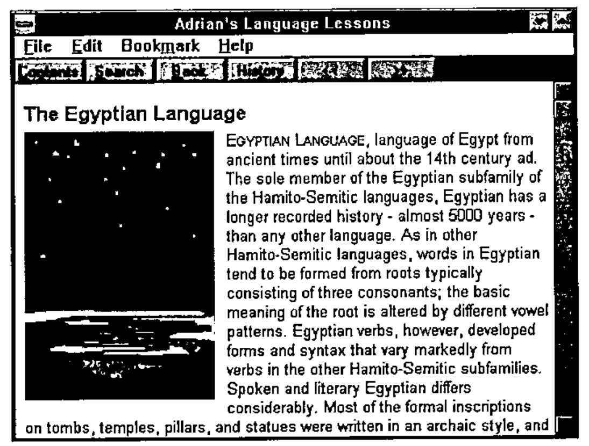

What does this tell us about GUI design? The fact that I built the guts of it in a day (and I am slowing down, unlike Duncan) says a lot for the ergonomics of the designer, and for the choice of objects in that list a few pages on. The fact that it virtually all worked first time (once the typos were cleared) and has been utterly reliable during some pretty tough use, suggests that the basic idea of objects which watch data and trigger actions is the right way to build things.

What else might be important? Perhaps it runs a touch slower than the same screen built in raw `⎕WC`, but I would never have built something that looked that good in a week, never mind a morning. For simple dialogues, I can honestly say that speed is not an issue, and that is running on my dear old PS/2-70 at work, not my super-whizzo Elonex at home!

## Coming in Next Issue

How it all works. The dialogue-box matrix defined in detail, and every nut and bolt of the object-prototype matrix laid out before you! The mechanics of localisation, and a blow-by-blow account of exactly what happens when you change a value on a form over here, and the same variable is linked to three other things on another form over there!

Yes, it was hard going, but it feels like the best APL environment we have ever had, and it may just give us a fair run against the Visual Basics and PowerBuilders which all claim to do this sort of thing, then let you down badly when the going gets tough.

## References

[1] Adams, Martyn. *"APL Experiences and Microsoft’s Visual Basic for Windows"* Vector Vol.9 No.4 pp.100-112

[2] Clark, Ian. *"APLomb: the view through QUAD-shaped spectacles"*, Vector Vol.10 No.3 pp.41-50

[3] Eastwood, David. *"Working with Windows"*, Vector Vol.8 No.1 pp.102-103

[4] Microsoft Encarta (1994 edition) *"Languages"*

## Appendix: the Object Catalogue at 18th March 1994

| Id | Description | Primary Data | Reference Data |
|---|---|---|---|
| FM | Parent Form | Icon (bits array or ‘file’) | Menu structure |
| RU | Roll-up toolbox | Bitmap backcloth (‘file name’) | (unused) |
| EN | OK Button | (unused) | (unused) |
| QT | Cancel Button | (unused) | (unused) |
| AC | Action Button | Bitmap to place on button | (unused) |
| CL | Close Button | (unused) | (unused) |
| VC | VCR Buttons | Current Index | Reference list to step through |
| SB | Scroll Bar | Thumb (integer 1..max) | Range, step, large step |
| PB | Picture Button | Bits array or ‘bitmap file’ | (unused) |
| LB | Label | Label value | (unused) |
| AN | Text Annotation | Panel contents | (unused) |
| TX | Text entry | Text variable | Format (‘XXXX’ is u/c 4 long) |
| NM | Numeric Field | Data (single number) | Format Picture (e.g. ‘ZZ9.99’) |
| DT | DateEdit | Data variable (integer date) | (unused) |
| SP | Spin Box | Data (number, or index to list) | Increment or Reference List |
| NP | Notepad | Data (vector of text vectors) | (unused) |
| YN | Yes/No choice | Data (boolean singleton) | (unused) |
| GR | Radio Button Group | Data (selected indices) | Reference List (button labels) |
| CK | Check Box Group | Data (picked values) | List (button labels) |
| LS | List Box | Data (selected values) | List (listbox contents) |
| SL | Drop-down Selection | Data (index) | List (drop-down contents) |
| CB | Combo selector | Data (text) | Reference List (alphabetic) |
| DC | Drop-edit Combo | Data (text) | Reference List (alphabetic) |
| PA | Parameter Bar | Data (number) | Reference (min,max)... |
| IC | Icon Holder | Bits or ‘file name’ | (unused) |
| BM | Bitmap Holder | Bits or ‘file name’ | (unused) |
| AT | Artistic Text | Text to show | Font Specification |
| PS | PostScript Graphics | Data to draw (PostScript code) | (unused) |
| BK | Backcloth | Bits array | Placement (Tile,Stretch) |
| PI | Progress Bar | Progress to date (current,max) | (unused) |
| GV | Grooved Rectangle | Depth (negatives give ridges) | (unused) |
| PL | Plinth or Recess | Depth (negatives give plinths) | (unused) |
| MA | Matrix | Numeric matrix | Format (as APL thorn, default is 8 2) |

This is the most readable part (columns 1,2,10) of our class table, which is used by the designer to prompt for data, make Cue-cards and offer the choice of objects shown on the previous page. The rest of this table has the code to make them, update what you see on the screen, and retrieve what you typed, or clicked or dragged. This is what we shall be looking at in the next issue!
