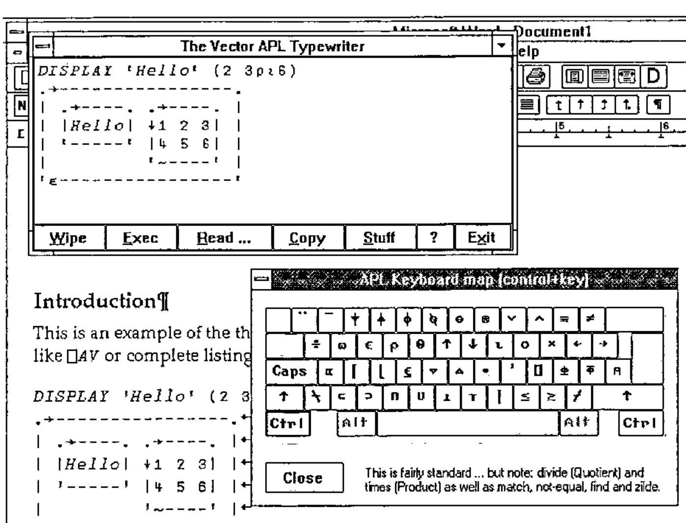

*by Adrian Smith (Production Manager)*
{ .byline }

Vector has the interesting technical problem that it must cope with APL code arriving in all sorts of different character sets. For a long time, I could work with the APL\*PLUS/PC `⎕AV` as a de facto standard, but all that has changed now, and code arrives in *Word* and *Write* documents having been pasted over from Dyalog/W, ISIWIN, and (shortly) APL\*PLUS III. Commonality of `⎕AV` is not relevant any more, because everyone maps their characters to their TrueType fonts in a unique way. What Vector needs is some way of:

a) encouraging as many people as possible to submit articles in my favourite VectorAPL TrueType font (so I don’t need to do anything). 
b) coping easily with submissions in the native font of the APL of your choice. This looks to me (unfortunately) to be the most likely scenario.

It seems to me that if *Vector* can solve this problem, the solution is likely to be of general value to the APL community. In particular, what we can offer is an APL font that includes all the APL symbols known to man, and a unified keyboard layout that you can type them with!

## The Current State of the Art

The screen-snap on the facing page shows *VECTYPE* in action, and illustrates most of what it does. Basically, it is a runtimed Dyalog APL workspace (no royalties necessary) which makes a simple ‘ontop’ window so that you can run Word full-screen and still see your APL typebox. When you ‘minimize’ it, it rolls up to its titlebar, which is easy to park over the Word titlebar, and much more convenient than an ‘ontop’ icon!

You can simply type APL text into the box (the key mappings are as standard as I could make them, given that this covers all known APLs) or you can execute simple expressions (the workspace includes some common utilities like *DISPLAY*) and have the results shown below. Normal cut-and-paste works as you would expect, to any Windows application, or you can use the &lt;Copy&gt; button to put the contents of the whole Vectype window into the clipboard. When you paste this (e.g. into Write), you will need to select it and and set the *VectorAPL* font by hand.

Vectype will import APL code from DOS text files in any of the common `⎕AV`s (many thanks to David Appleton for checking out the APL2), and will read ISIAPL, Dyalog APL and APL\*PLUS III from the Clipboard. This enables me to grab code from a Winword document in (say) ISIAPL format into the Vectype Window, and promptly stuff it back in the VectorAPL font! I feel I shall want something like this to move code easily from Dyalog/W to PLUS III and back!

If you use Winword, you can take advantage of the &lt;Stuff&gt; button! This sets up a DDE channel and sends the entire contents of the Vectype window directly to Word, where it is inserted at the cursor. If there is only a single line in Vectype, it simply selects it and sets the VectorAPL font for you; if there are several lines, these are entered as a separate paragraph, with ‘newline’ characters at the end of each line. Again, the VectorAPL font is set automatically.

If you can make use of this, it certainly helps me to get Vector together in less time with less hassle! Send me a blank 1.44Mb disk with return postage, or mail me on Compuserve 100331,644 and I will reply with a copy of Vectype and a runtime Dyalog interpreter ready to install. Then, give it away to your friends!
