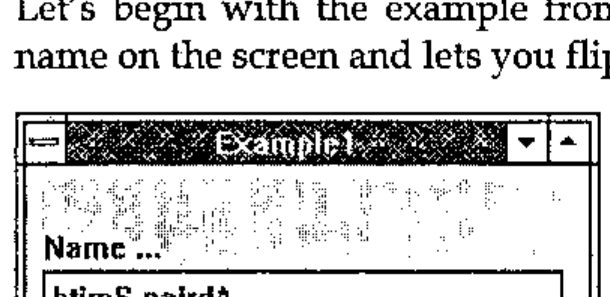
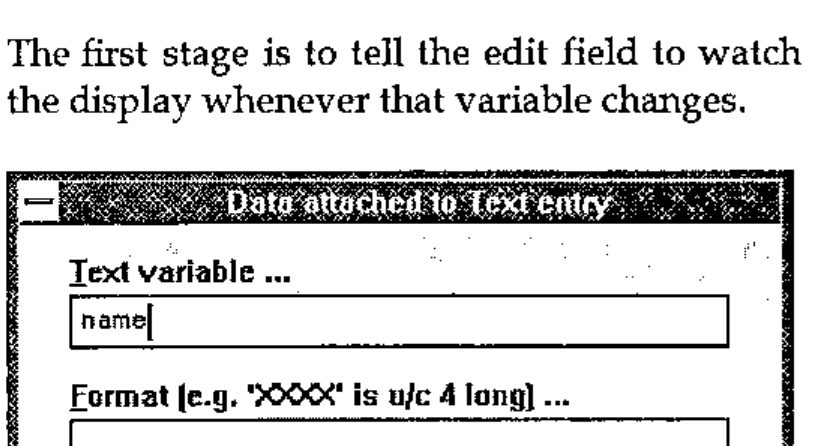
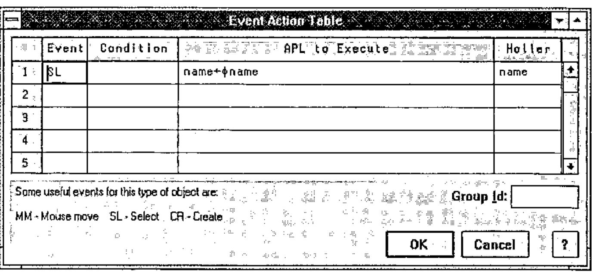
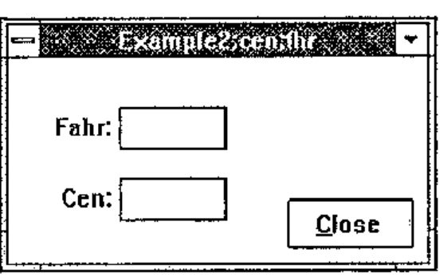
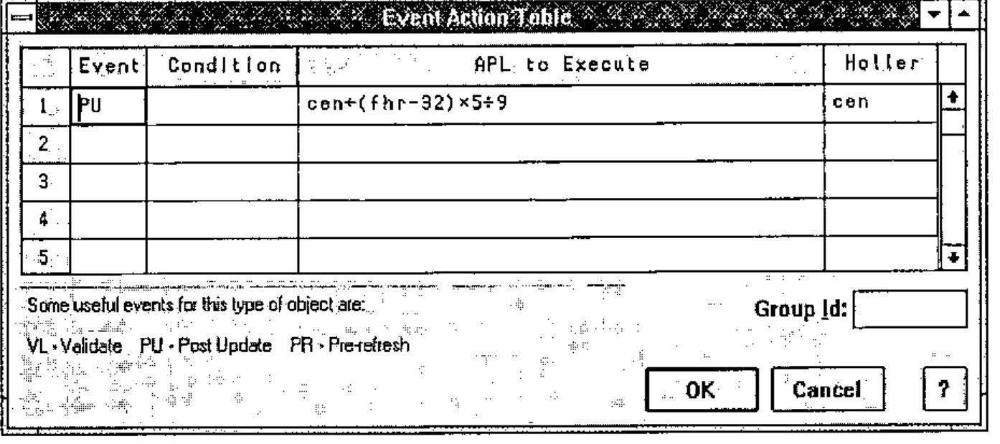
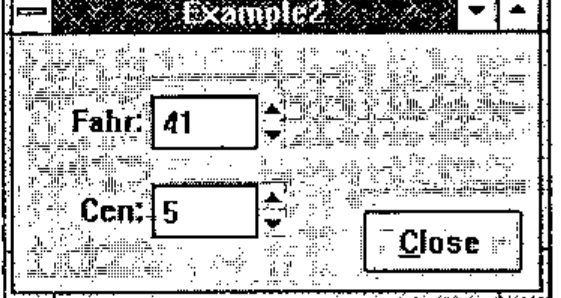

*Causeway in Helsinki — notes by Adrian Smith*
{ .byline }

## Background

October 94 was an eventful month! Having attended the Frankfurt meeting on the 14th, I flew straight out to Helsinki for a most enjoyable weekend, before settling in for a hard day’s seminar on the Monday. This was at the invitation of FinnAPL, and we had the use of a splendidly equipped lecture hall at the Finnish timber agency METSA. The day was designed as a follow-up to Swansea, with the objective of introducing a varied population of APLers to the strange new world of Windows programming. We covered the basics of event-based design, with an hour or so of hand-waving around the well-known Windows game of Minesweeper. In my view, an ability to (a) play and (b) design and code this game should be a pre-requisite for any serious Windows programmer. The rest of the day was strictly about APL, and how we can bring our existing APL skills and ideas to bear in this slightly frightening new programming paradigm.

## What is Causeway?

Causeway is an architecture for portable GUI development with APL. It is:

- a published and documented standard, freely available
- supported by the British APL Association and encouraged by many other APL clubs around the world
- open to anyone. APLers are positively encouraged to build implementations for the interpreter of their choice
- currently implemented (documented and supported) for Dyalog APL, and available for early testing in APL\*PLUS III. These implementations are copyright Adrian Smith and Duncan Pearson respectively.

All the workspaces are available with fully commented source code for you to copy and extend. Causeway offers you:

- faster development
- less complexity
- fewer functions
- more reliable applications

*Small systems are realised faster; big systems hurt less — HOW?*

## How is Complexity Mastered?

The key difference you need to grasp is that you base your design around the Windows objects you see on the screen. These objects already know how to display and update APL variables, but they do a lot more than that:

- objects can be told to watch specific variables, and will update themselves automatically when any watched variable changes.
- objects can react to user-actions through a simple table

    > event + condition &gt;&gt; action

    where the action is any APL expression. Of course it may change some APL variables, in which case other objects will respond as required.

- the main ‘container’ objects (forms) may have local variables, which are visible to their child forms, and so on down the stack — just like APL functions!

It is hard to believe how much difference this approach can make to development times, so here is a small challenge for you: design and build a Centigrade to Fahrenheit convertor, such that when either number is changed the other immediately flips to match. Ideally, the user should be able to either type in the data, or spin the values from an initial setting of 0=32 with spin boxes. The centigrade figures should spin in 1-degree increments; the Fahrenheit should spin in 2s. *How long do you think this should take you?*

The replies (I tried this in Frankfurt as well as Helsinki) were well spread, and apart from one facetious suggestion of 5 minutes, were all in the half-hour or above range. Most people who thought hard about this (as I hope you will) estimated at least half a day.

## Starting with Something Simple

Let’s begin with the example from Vector 10.4 — the one which just puts your name on the screen and lets you flip it with a push-button.



To build this, you start with a quite ordinary APL variable:

```apl
name←'Adrian Smith'
```

and then build your form with:

```apl
Dbx 'example1'
```

The first stage is to add that text edit field using the right-mouse menu:


… which is dragged out to a nice size and captioned with the ‘appearance’ dialogue (left button on the object). Now we can add a close button and an action button (called ‘Flip’) and we are ready to start the serious work!

The first stage is to tell the edit field to watch the variable *name*, and to refresh the display whenever that variable changes.



This is the dialogue box you get when you ask for ‘data to watch’ on any of your objects. All objects have built-in documentation, so the prompts you see are picked up directly from the object definition.

If you define objects of your own, the designer is quite happy to work with them.

Now we should add an action to the push button to flip *name* whenever it is pressed. This will need to execute some APL code, and also ‘holler’ *name*, so that any other interested objects know that something happened to it.



In the first column, you list any events that you want the object to notice. The second column is an optional condition (any APL expression returning a boolean), and the third column is the code you want to run when that event occurs and the condition (if any) is satisfied. The final column is a list of the variable names which the expression may have modified.

Now you can press the &lt;Run&gt; button on the designer, and your form will work. When you exit to the workspace, *name* will have the last value you saw on the screen.

Stop and think for a moment … this (admittedly trivial) application requires:

- no functions
- no variables
- no logic

All you coded was a statement of the problem:

```apl
name←⌽name
```

*It will be utterly reliable, because it is too simple to fail.*

## Moving On

It is interesting to think again about the Centigrade to Fahrenheit problem. Clearly a couple of local variables will be required, and these should be initialised when the form is created (i.e. before it becomes visible on screen). Let’s start with a form and a couple of spin-boxes and see how it goes:



Note that locals are added to the form’s titlebar, and can be initialised by setting an action like:

```apl
cen←0 ⋄ fhr←32
```

which you set on the ‘CR’ or creation of the form itself.

Now for the tricky bit! Each spin box is set to watch the appropriate variable, and the formatting data is used to set the increment. What we must also do it to catch a ‘Post Update’ on both objects and holler the name of the *other variable* (which got changed in our APL expression):



Now, when you run the completed form:



Spin either box, and the other follows along. The ‘Post-update’ trigger is fired just after Causeway has assigned the new value into the variable your object was watching: your code runs, calculates a new value for the corresponding variable, and hollers the name. That is all you need to do!

## In Summary …

No variables, no functions, just two APL statements. Best time to date 2 minutes 29 seconds. *You* stated the problem, *Causeway* handled the GUI.

*Now you can be an APL programmer again — just like the old days!*
