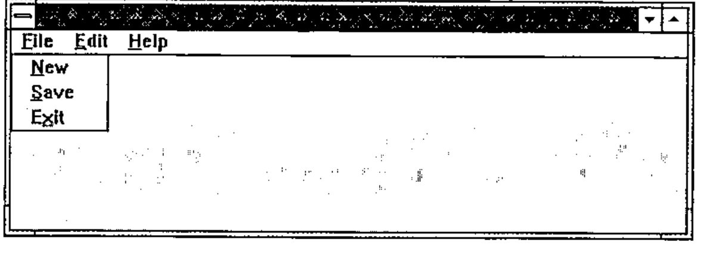
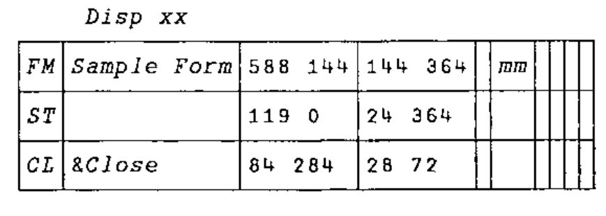
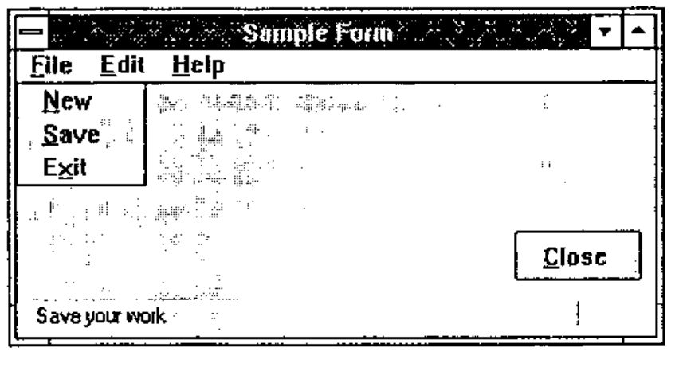
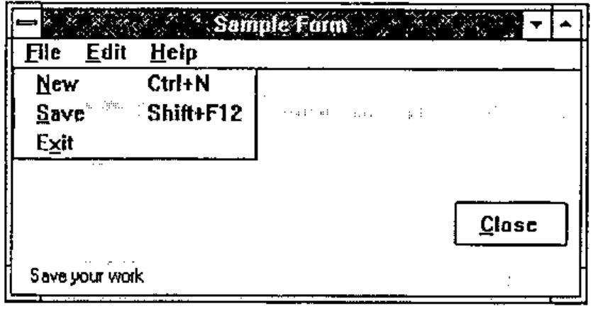
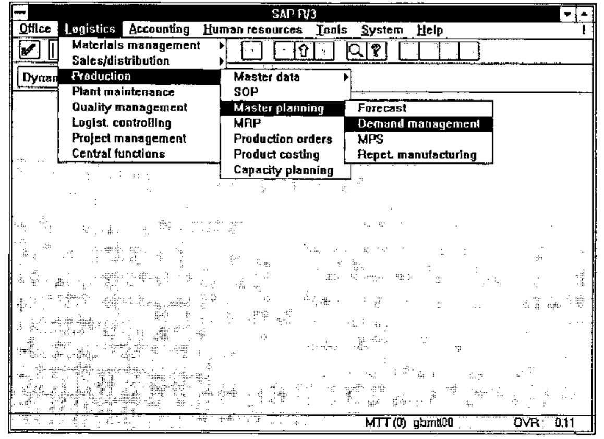
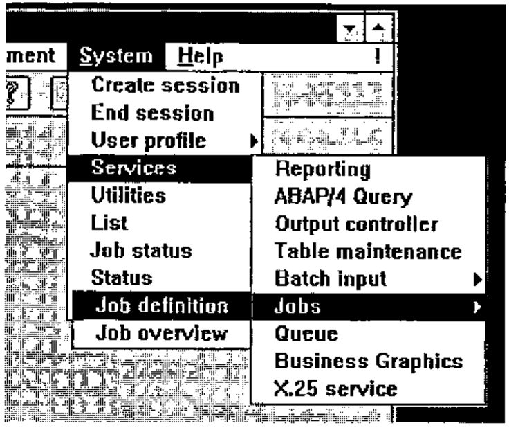

*by Adrian Smith*
{ .byline }

## Introduction

At the heart of any significant Windows application is the menu-bar for your top-level form. For the user, this menu-bar is the gateway to all that APL code you spent days or weeks developing — so the design and structuring of the menu options deserves more thought than it often gets. However the menu can serve another equally useful purpose — as on-line documentation which will point some future APLer at the function names in the workspace, and that will go some way towards describing what they do.

This article describes how menus are constructed in the Causeway utility set, and includes examples from a number of recent APL systems, as well as a couple of classics (from the SAP package — see Appendix-2) which may help you to avoid the worst excesses of the over-enthusiastic Windows programmer. An old stand-alone version of the menu-builder utility function (in Dyalog 6.3 code — see Appendix-1) is included for those who would like to try these ideas, but do not want to take on the whole Causeway workspace.

## Getting Started

In its simplest terms, a menu is simply a caption (for the user to see) and either an action (to be executed) or a pointer to another menu. It could look like:

```apl
Hello:2+2
World:⍳12
```

This might be a vector of vectors, or a simple character matrix. The text to the left of the colon is what the user sees; the text after the colon is executed by APL when the user selects that option:

```apl
Gui_menu 'Hello:2+2' 'World:⍳12'
```

Dyalog-7 users can load the Causeway workspace and try this for themselves. The effect is to create a pop-up menu (where the mouse is at the time) and echo either `4` or `1 2 3 4 5 6 7 8 9 10 11 12` to the APL session when an option is selected. This is fine for a simple pop-up (obviously you would normally have a function call here), but in a real system the first thing you need is normally a menu-bar for your main form. The convention that most Windows programs adopt is to hang a sub-menu underneath each and every entry on the menu-bar, so this simple style needs to be extended slightly to cope with (recursively) nested menus. I based my ideas on the Motif standard (Unix users can look at `.mwmrc` which is the Motif root menu definition) to give a definition like this:

```text
[root]
 &File>file
 &Edit>edit
 &Help>help

[file]
 &New:2+2
 &Save:3+3
 E&xit:'Farewell cruel world'

[edit]
 ... and so on
```

I hope you can see the pattern! Anything after the colon gets executed (as before) and anything after a &gt; chains to another menu. The indenting and spare lines are just for clarity, but the square brackets are essential, and the names must match exactly. Of course you can nest the sub-menus as deep as you like, but do read the Microsoft style guide before you give all your users a bad attack of the screaming heebie-jeebies with 4-level cascading menus. If you cannot hang everything you need on a single layer of pull-downs (with judicious use of right-mouse pop-ups for context-sensitive functionality) your application is too damn complicated and you should go back to the drawing board until you have simplified it.

Let’s make a small form and see the effect of hanging a menu definition on it:

```apl
      Gui_init ''
      'ff' ⎕wc 'Form'
      'ff' Gui_menu mm
Farewell cruel world
```



As you can see, I chose the ‘E<u>x</u>it’ option and the corresponding message was echoed to the APL session. A more realistic example (note that any line starting with a hyphen is treated as a separator) might be:

```text
[root]
 &File>file
 &Edit>edit
 &Dictionary>dict
 &Arrange>arrange
 &Options>options
 &Help>help

[file]
 &New: NEWFILE
 &Open: OPEN ''
 &Save: SAVE 0
 Save &As: SAVE 1
 &Merge:MERGE ''
 Print Pre&view...: print_view
 &Print ...: print_sel
 Print Setup ...: psetup
 --- SEPARATOR ---
 E&xit: EXIT

[edit]
 &Undo: undo
 &Goto page ...: jump ''
 Go &Home: home
 &New page ...: new ''
 &Copy page ...: copy
 --- SEPARATOR ---
 Select &All: select_all
 --- SEPARATOR ---
 &Rename page / change descr ...: rnm
 &Remove page from pad ...: zap
 --- SEPARATOR ---
 &Maintain Function/Process info ...: fnproc

[dict]
 Collate &Transaction list ...: collect_tran
   ... etc

[arrange]
 &Link selected objects: linkup
   ... etc

[options]
   ... etc

[help]
 &Contents ...: Guide
 &About ...: ABOUT
```

From the user’s point of view, this definition is entirely adequate, but what can the APL coder (in this case me) hope to get out of it? This workspace was completed in late 1993, so I have by now forgotten most of the function names — what better way to find my way into the code than to put the menu definition on screen:

```apl
)ed ∆menu
```

… and double-click my way to the underlying code? In a sense, the main menu definition of a Windows workspace performs the same role as the `⎕LX` in an old mainframe application — it is the starting point from which the maintenance programmer finds his or her way to the APL code. Given this fact (which I only began to realise some while after I finished writing this particular system), what can we add to the definition to help matters? An obvious possibility would be some judicious comments:

```text
[file]
 &New: NEWFILE          ⍝ Start a new drawing
 &Open: OPEN ''         ⍝ Open an existing drawing
 &Save: SAVE 0          ⍝ Save your work
 Save &As: SAVE 1       ⍝  ... with a new name
 &Merge:MERGE ''        ⍝ Merge with another drawing
... and so on
```

… but perhaps it would be handy for the user to see those comments as well! Here we must move to Dyalog-7, so be warned that the `Gui_menu` code quoted in the appendix does not support this extra feature. This time, I am going to make my form with the Causeway designer, and specify the menu definition as the ‘data’ for the main form:

```apl
      Dbx 'xx'
      Disp xx
```



```apl
Gui_call xx
```



```text
      ↑mm
[root]
 &File>file
 &Edit>edit
 &Help>help

[file]
 &New; Start a new file   :2+2
 &Save; Save your work    :3+3
 E&xit; Sign off          :'Farewell cruel world'

[edit]
 ... and so on
```

Here I have added a ‘Status Bar’ object to my form — Causeway automatically set this as the ‘Hintobj’ for any children of that form — and picked out the part of the caption following the first semi-colon as a hint. This way, the user sees the comments as he or she runs the mouse up and down the menus, and the APL developer sees the comments too! Again, the alignment is ignored by `Gui_menu`, but it helps the programmer a lot.

## Adding Hot-keys

Again, this is specific to Dyalog-7, and I rather wonder if I am beginning to overload the definition. However, here is how I did it:

```text
[file]
 &New=Ctrl+N; Start a new file      :2+2
 &Save=Shift+F12; Save your work    :3+3
 E&xit; Sign off                    :'Farewell cruel world'
```



Anything in the caption after an = sign is stripped off, parsed and set as the accelerator key for that option. Now if I were to hit Ctrl+N I would see `4` echoed into the APL session. I also turn the = into a tab character, which makes the menu look much neater to the user.

## Taken from Life

Those of you who came to Swansea in July will remember the help-file builder I used to illustrate some features of a Causeway system. Here is its main menu:

```text
      ↑∆menu
[root]
 &File>file
 &Edit>edit
 &Options>options
 &Help>help

[file]
 &New;Starts a new file                  :NEW               :∆file
 &Open;Opens an existing file            :OPEN              :∆file
 &Save=Ctrl+S;Saves your work            :SAVE 0
 Save&As;Takes a copy with a new name    :SAVE 1            :∆file
 &Export .TXT ...=Ctrl+E;Makes a plain ASCII file...:Export tsel
 -----
 &Build .RTF ...=Ctrl+R;Makes a suitable file ...   :Build
 &Hex error ...=Ctrl+H;Quick search for any ...     :browse_rtf ∆file,'.RTF'
 &Testfly .HLP ...=Ctrl+T; Tries out the Conten ... :Testfly
 -----
 E&xit:Gui_post 'SC'

[edit]
 &Find=Ctrl+F; Locates a text string anywhere in the topic list :find_txt

[options]
 &Set Copyright;Adds copyright details to contents page:
∆copyright←∆copyright Win_input 'Please enter your name and the date ...'
 &Headers ...;Sets up type-styles and other op...   :headers
 &Chapters ...;Sets up chapter headings and sequence:    Chaps:∆topics
 &APLFont ...; Toggles the use of an APL font in the editor :setfont
 &Icon ...; Picks an Icon ...: ∆iconfile←∆iconfile Win_input 'Icon file ...'

[help]
 &About ...:ABOUT
 &Help Contents...=F1:WHLP 'helpstuf.hlp'
```

Note that I have truncated some of the hints to save the text wrapping across two lines. Just in case you worry about the time taken by APL to riffle through all this and get the form on screen:

```apl
Gui_menu ∆menu
```

… has a pop-up on screen in about 0.8 seconds (DX2/50 processor), and of course you only do this once, when the application is started. I think this is a small price to pay for a menu structure which is easy to read, and could potentially be pulled in from a simple ASCII file at startup time. Maybe your users would like to redefine some of your structuring, eliminate some of the less interesting options, translate the hints into Finnish?? All they need is a text editor and this article!

## Appendix-1: the Stand-alone Code

```apl
 {_pnt}Gui_menu _arg;_dq;_mt;_grp;_cap;_nm;_ps;_itm;_inm;_iex;_ict;_sct;⎕IO
⍝ Build menu structure defined in <_mt> at section [grp]
⍝ This either hangs from a menubar, or is rooted. Rooted
⍝ menus are popped up at the cursor and locally DQed.
 ⍎(0=⎕NC'_pnt')/'_pnt←''''' ⋄ ⎕IO←1
 ⍎(3>|≡_arg)/'_arg←⊂_arg' ⋄ _arg←3↑_arg,2⍴⊂'' ⋄ _dq←0
 _mt _grp _cap←_arg ⋄ _ict←_sct←1
⍝ Check for top-level menus, which may be owned by a FORM.
⍝ If so, make a MENUBAR to hang them on!
 →(0=⍴_pnt)↑Root ⋄ →('FORM'≡_pnt ⎕WG'TYPE')↑MBar      ⍝       <<<< WATCH IT <<<<
Child:_pnt←_pnt,'.menu',_grp ⋄ _pnt ⎕WC'MENU'_cap ⋄ →Sect
MBar:_pnt←_pnt,'.menubar' ⋄ _pnt ⎕WC'MENUBAR' ⋄ →Sect
Root:_pnt←'rootmenu1' ⋄ _pnt ⎕WC'MENU' ⋄ _dq←1 ⋄ →Sect
⍝ Now chop out the right section of the structure ...
Sect:_ps←'['=⊃⊃_mt ⋄ →(⍴_grp)↓Top
 _ps←_mt⍳⊂'[',_grp,']' ⋄ →(_ps>⍴_mt)↑0
Top:_grp←_ps↓_mt ⋄ _grp←(¯1+(⊃¨_grp)⍳'[')↑_grp
 ⍝ Check each entry, and make item or another menu ...
Next:→(⍴_grp)↓Done ⋄ _itm←⊃_grp ⋄ _itm←(+/∧\' '=_itm)↓_itm
 →(⍴_itm)↓Skip ⋄ →('-'=⊃_itm)↑Sep
⍝ Split off name and ⍎ part at ':'
 _ps←⌊/_itm⍳':>' ⋄ _inm←_ps↑_itm ⋄ _iex←_ps↓_itm
 →('>'=¯1↑_inm)↑Menu ⋄ _inm←¯1↓_inm
⍝ =============== MENUITEM ====================
 _nm←_pnt,'.item',⍕_ict ⋄ _ict+←1
 _nm ⎕WC'MENUITEM'_inm ⋄ →(' '∧.=_iex)↑Skip
⍝ Set items to execute action on select ...
 _nm ⎕WS'event' 30 'Gui_exec' _iex ⋄ →Skip
⍝ =============== SEPARATOR ===================
Sep:(_pnt,'.sep',⍕_sct)⎕WC'SEPARATOR' ⋄ _sct+←1 ⋄ →Skip
⍝ =============== SUBMENU =====================
⍝ Next menu down gets our caption as its title (Yuk)
Menu:_pnt Gui_menu _mt(_iex~'[]')(¯1↓_inm)
Skip:_grp←1↓_grp ⋄ →Next
Done:→_dq↓0 ⋄ ⎕DQ _pnt


_ex Gui_exec _msg
⍎ _ex     ⍝ also not required in Dyalog 7
```

This will be fine in Dyalog 6.3 — but Dyalog 7 users will need to change *FORM* to *Form* (thanks lads) to make it work. The nasty names are to avoid conflicts with executed code (relevant to pop-ups only, as `Gui_menu` won’t be on the stack when your application runs otherwise).

## Appendix-2: How not to do it!

Here are a couple of screen snaps from the SAP system, which illustrate very nicely the pitfalls of over-enthusiastic menu design:



Seen like this, it doesn’t look all that bad, but think of the poor user who wants to be in *Demand Management* and can’t remember where it was. She starts off looking under *Materials Management* — about `6 × 6 × 4` options to explore, before homing in on *Production*, but a quick scan of the sub-menu shows nothing interesting … and so on.



Even for the expert, navigating accurately down and across and down and across requires a lot of concentration and is both visually and physically tiring.

Sometimes, the sub-menus get so far across the screen that they start popping up to the left, and confusion reigns supreme.

*Don’t do it!*
