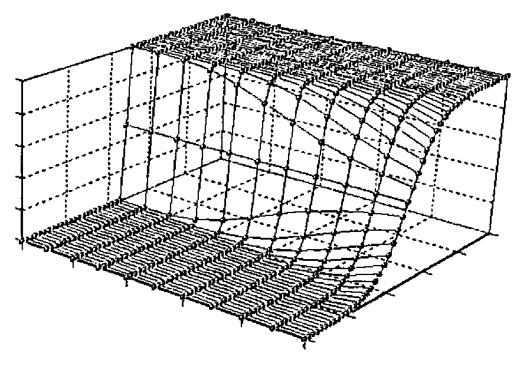

*notes by Adrian Smith*
{ .byline }

From the presenter’s point of view, a 3-hour workshop is a little tougher to prepare than a 45-minute paper, but infinitely more rewarding. I think we all got good value from this — I used it in part as a teaching opportunity and in part to explore what people really wanted from an APL graphics package. I was particularly keen to get a consensus (see Eke van Batenburg’s paper in a recent QuoteQuad) on the requirements for 3D data-presentation and basically to prove that my *Rain* utilities were heading in the right direction to become an accepted standard for business graphics in APL.

The first hour and a half was mostly examples and philosophy. I quickly realised that many of the audience were already Tufte converts ("*The Visual Display of Quantitative Information*" — Graphics Press … buy it!) and were aiming to go above and beyond the facilities in Excel or GRAPH.VBX. The afternoon was punctuated by questions beginning "I tried to …. in Excel and found there was no way I could do it!". I worked hard on the message that a good business graphic requires the classic "concept — design — program" cycle and that a package with a bunch of options (however sophisticated) will never do exactly what you want. A good example is the "Playfair" classic from Tufte’s book where the x-axis tick marks (and grid lines) are computed from the data, and vertically-written notes are also placed to harmonise nicely with the rise and fall of the British National Debt over time.

I think I also got the message across that typography matters, and that you must take great care when scaling a large graph down in size (say to print 4-up on the page). *Rain* automatically thins out the tick-marks, for example if there was space on the full page to mark 0 2 4 6 8 10 12 … it is likely that a half-size version will only have space for 0 5 10 15 … and a ‘Thumbnail’ may need to come down to 0 10 20. Surprisingly (but see any manual on typography) the type-sizes scale down roughly in square-root proportion, so that in halving the size of the chart you probably come down from 18-point to 12-point for your main heading! Line-weights adjust in the same way, and of course it is important to get the right relationship between the main axes, the major and minor ticks, and grid lines.

In the second part of the afternoon, we opened up a much more general discussion on "where next" with business graphics and APL. Two topics were of particular interest:

- how should a graphic report user-events back to a Windows APL application? Clearly there is a need for interactive graphs — users want to click on the heading and be offered an edit box to change the text/placement/style. They want to select data points and hide or annotate them. What is needed is a general set of hooks for the application to step in and do something specific.
- 3D presentation of data. I was amused to see the wonderful old *SKYSCRAPER* plot in an IBM handout on the latest graphics tools for APL2! However, I appreciate that there is a real need for tools which help you to visualise 3-dimensional data. Experimental results where *Yield* is some function of *Pressure* and *Temperature* are always a cloud of points in 3-space. What the experimenter needs is some way of visualising the shape of the cloud, and 2D cuts are never enough to do this adequately.

As it happens, all the code you need to actually draw the stuff was published in Norman Thomson’s excellent "*APL for the Mathematics Classroom*" (Springer-Verlag 1989); the tricky part is specifying the viewpoint and the degree of perspective distortion in a way that users could control with a bunch of Windows tools (slider-bars and the like). There was universal agreement that the Excel "grab the corner and pull" method was just plain confusing, and that something more like the CorelDRAW! ‘extrude’ tool was appropriate. To help the discussion along, I showed some simple demo stuff (all totally hard-coded) like this …

One completely off-the-wall idea was to use Flight-Simulator as a model and ‘fly’ your viewpoint around and through the data. I feel a Pentium may be barely adequate for the job!

We closed with some thoughts on the integration of graphics with text, in the form of management reports and technical papers. I have always assumed that it was adequate to push out the completed chart as a .EPS file, and that some high-end publishing tool would take care of the rest. However several people have tried this route and found that they really wanted the whole process under APL control, as the text (which sections to include, what special conditions to apply) was also very data-dependent. This seems to be particularly true of insurance companies where just about every policy is different!

All in all, a useful 3 hours, both for me as presenter and for the majority of the audience, who kept it going well past the official finishing time. Thanks to all concerned, and watch this space next year!
