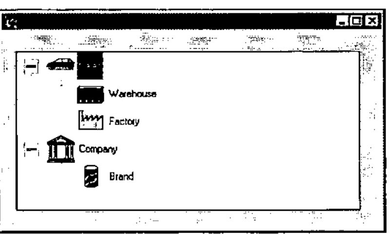
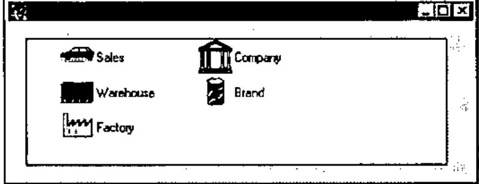
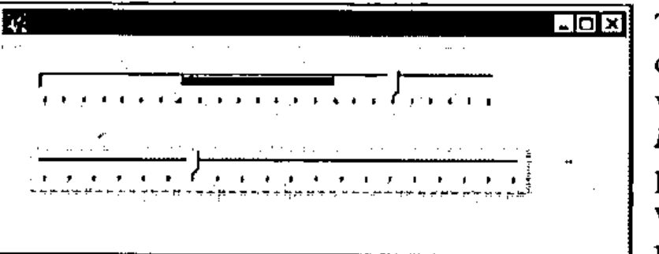
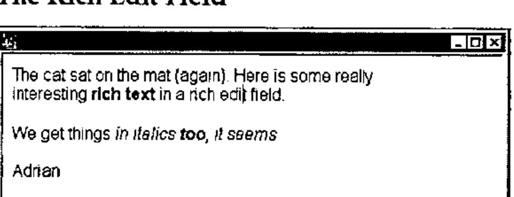
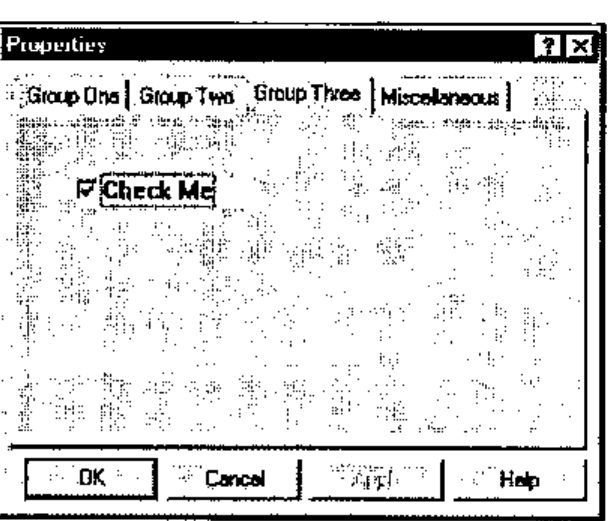

*first impressions, by Adrian Smith*
{ .byline }

## Disclaimer

Dyalog for Windows 95 arrived at the weekend, and is still not fully documented, so I cannot claim that this is in any way a full and fair evaluation. I have spent most of an afternoon playing with it – that is all.

## Background

This is a full 32-bit native Windows program, and uses the Win32 dynamic link libraries, rather than the old 16-bit code. On the surface there is little visible change, but it loads quickly and offers easy access to all the new controls that form part of the ‘95’ look and feel. The only conversion required is to `⎕NA` calls which must be changed to use the new 32-bit libraries. Here you may need to do some research, for example I have yet to find the equivalent call to *SndPlaySnd* (in `mmsystem.dll`) which I have been using to annoy Duncan by making silly noises from within APL.

A major step towards Windows 95 integration is the addition of a *DropFiles* event to Forms and many of the ‘List box’ objects. The basic interface of Windows 95 is very much more Mac-ish, and users will expect to scatter directories (sorry, *folders*) all over the screen (sorry, *Desktop*) and be able to drop them on to application short-cuts or running applications. If you set the *AcceptFiles* property of your form to 1, it reports the name of the dropped file for you, which is just what you need to go and open it (having checked the extension to ensure it is one of yours!) without the user ever touching a menu or toolbar button.

The rest of this short review concentrates on the new Windows controls, hopefully giving you some clue as to where you might find them useful.

## Some of the New Controls

Here are a few of the things I was able to turn over this afternoon. All of them worked first time, and I only blew the interpreter out of the water once. Even here, I can report a major improvement in behaviour – it shut down without causing any damage to Windows, and I was able to restart Dyalog immediately.

### The Tree Viewer



This supersedes the `msoutlin` control from Visual Basic, but is used in a very similar way to build indented lists which the user can roll up and uncurl as required. As you can see, it is very easy indeed to put pictures into it, and you can also have more than one item at the top level (an annoying limitation of the old tree). I tried it with some very big lists (easily enough to blast the old .VBX to kingdom come) and some ludicrous indents (up to 1000, after which the control has had enough and keels over, but fair enough I think).

In summary, it looks good, is dead easy to use and I can think of lots of places I could put it to work. 10/10 to Bill Gates for this one.

### The List Viewer



Here is what it took to make the pictures (also used in the tree shown above) and then create a window to manage them as a list:

```apl
'il' ⎕wc 'ImageList' (32 32)
'il.' ⎕wc 'Icon' 'pics\ou-so'
'il.' ⎕wc 'Icon' 'pics\ou-whse'
'il.' ⎕wc 'Icon' 'pics\ou-plant'
'il.' ⎕wc 'Icon' 'pics\ou-co'
'il.' ⎕wc 'Icon' 'pics\ou-dv'
'ff.lv'⎕WC'ListView'('Posn' 16 16)(120 400)
'ff.lv'⎕WS'Items' ('Sales' 'Warehouse' ...)
'ff.lv'⎕WS ('Imagelist' 'il')('ImageIndex' 0 1 2 3 4)
'ff.lv'⎕WS'View' 'List'
```

This strings a bunch of icons into the new *ImageList* object and then sets this list as the property of the *ListView*. You can re-use the icons as many times as you like, as you specify which picture to associate with each item by a separate *ImageIndex* property. I was in `⎕IO=0` here, by the way.

Once you have your list, you can get all the different views that Windows itself provides from Explorer. If you choose to tabulate the items, the object will let you set the headings, column widths and so on. The user can also drag the items around, and (if you set *AutoArrange* to `1`) the object will line them all up nicely in the new sequence.

In summary, some imagination will be needed to make good use of this one, not to mention an artistic streak to make decent icons (both 32 by 32 and 16 by 16 sizes required). Let’s give Bill 8/10 for effort.

### The TrackBar



Two basic styles, either of which can be used horizontally or vertically (by setting the *Hscroll* and *Vscroll* properties – yuk) to set the volume on your sound card, record the results of a questionnaire (the wishy-washy qualitative kind), play with the fitness factors for your Genetic Algorithms, and so on. The range and tick values can all be set, and the range is no longer limited to values from 1 upward, *mirabile dictu*.

The major improvement here (apart from the visuals) is that it gives you a stream of events as it tracks, so you can steer the aeroplane, zoom the view, or rotate the 3D barchart ***as the user pulls the slider,*** rather than waiting for him to drop it. PLUS III already had this on scroll bars – but this is better for the job it does. In summary, another winner. 10/10 again.

### The Rich Edit Field



This is going to take some getting used to! It is more or less a complete word processor in a box, with font and formatting properties which apply to the *currently selected text*, rather than the whole content of the object. It will read and display existing .RTF files (such as those saved by Word) or you can save text (such as the above) to file, and read it in Word with no problems. More interesting from a programming angle – you can get at the *RtfText* property directly. This is always a simple vector and has all the formatting codes embedded. I can see that for applications which must build and print form letters (with the punter’s name in italics and the special offer in a fancy bold font), this could be a god-send. I think I had better reserve judgement on this one, but 8/10 or better is likely. Approach it cautiously, with manual in hand.

### Property Page and Property Sheet

This one is lovely! Having tangled with the tabbed subforms in the current Dyalog release, it is wonderful to throw out all that horrible stuff with TabBtns (which never quite fitted right as soon as you changed the defaults) and just let Windows do it for you.

The Property Sheet is a top-level object, which comes ready supplied with buttons for OK, Cancel, Apply and (optionally) Help. As you add Property Pages to it, they appear with their titles in the tabs, correctly aligned and ready to use. You then simply add objects to each page, and everything else is done for you.

```apl
'ps' ⎕wc 'PropertySheet' 'Properties' (0 0)(120 400)
    ('coord' 'pixel')
'ps.pp1' ⎕wc 'PropertyPage' 'Group One'
'ps.pp2' ⎕wc 'PropertyPage' 'Group Two'
'ps.pp3' ⎕wc 'PropertyPage' 'Group Three'
'ps.pp4' ⎕wc 'PropertyPage' 'Miscellaneous'
'ps.pp3.ck'⎕WC'Button' 'Check Me' (32 32)(24 120)'Check'
```



If I could give Bill 11/10, I would. A lot of messy Causeway code goes out of the window, replaced by a ‘Properties’ object which does the same job faster and better.

## Conclusions

I have not had time for a decent go at the spinner or progress bar – again both replace existing Causeway objects but will be quicker to build and more responsive. If you are starting from raw Dyalog, the Spinner will save you a lot of time and some quite subtle Gui programming.

Basically, this all came straight off CompuServe, we unzipped it and it worked. The new objects are excellent, but don’t expect any startling change in the rest of the product until later in the preview cycle. An essential upgrade for the serious Windows developer.
