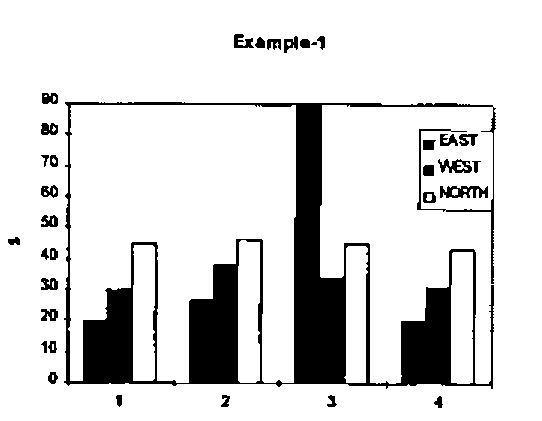
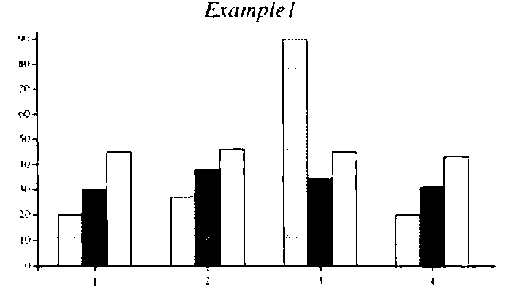
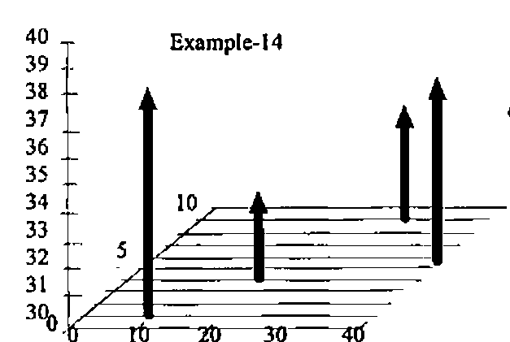
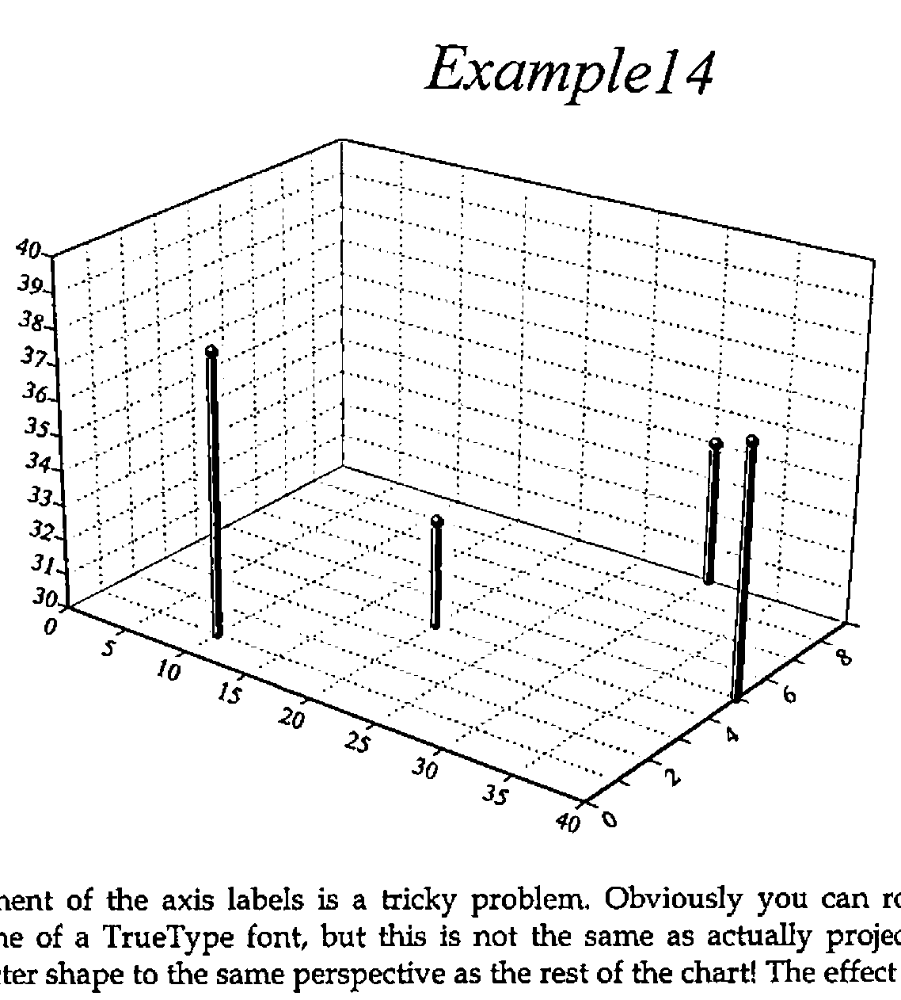
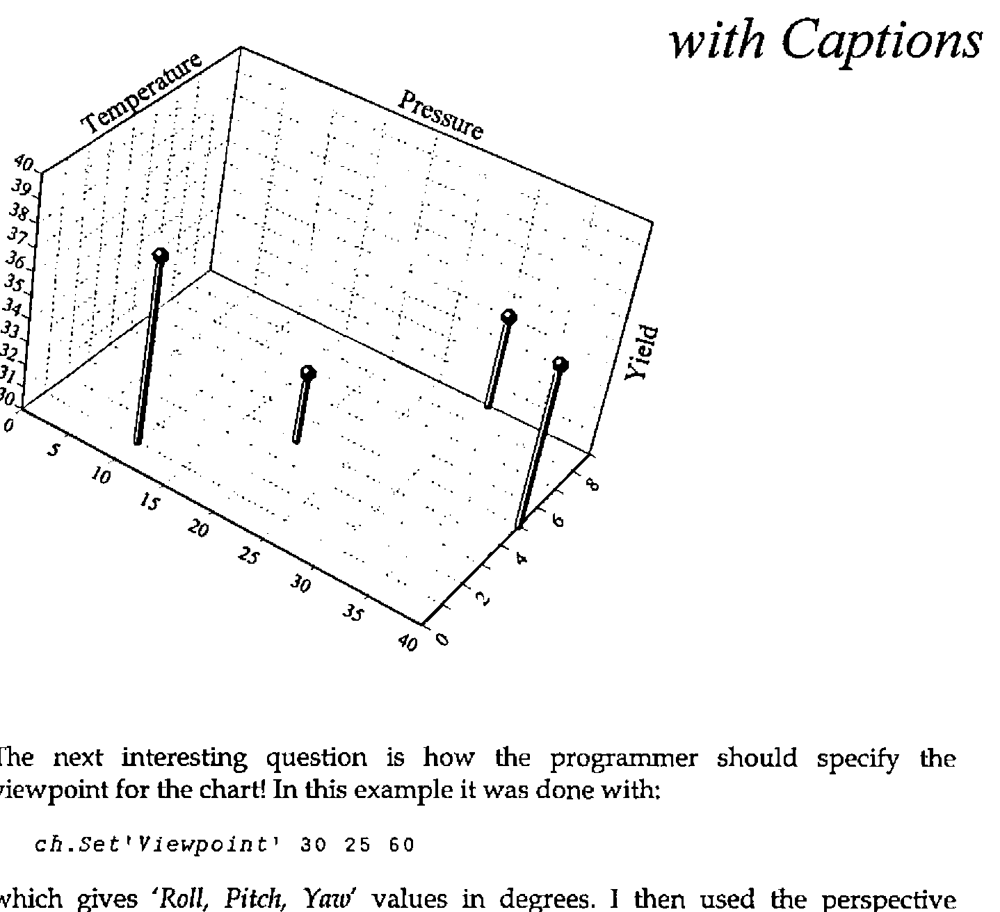
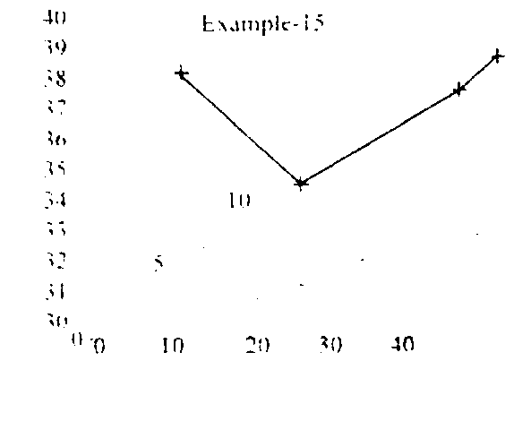
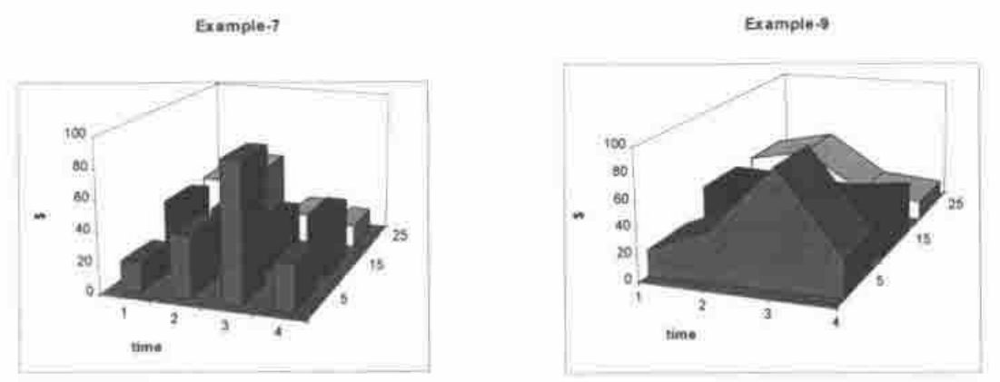
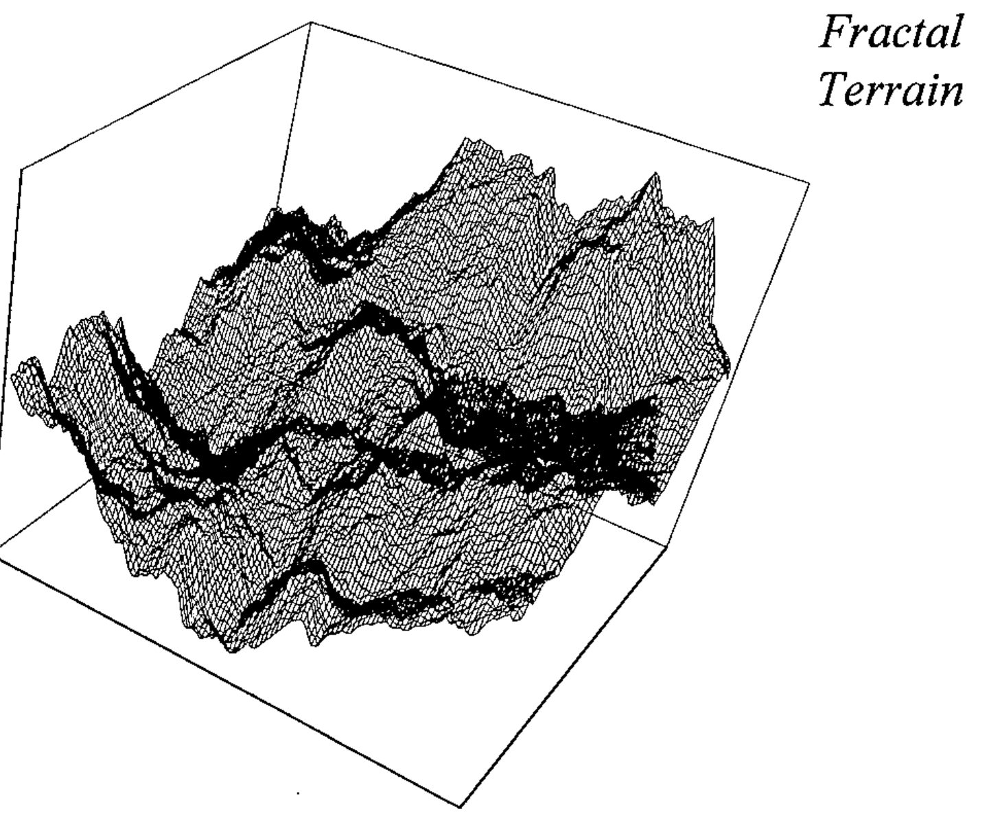

*by Adrian Smith (in reply to F.H.D. van Batenburg)*
{ .byline }

## Background

This is mostly in reply to Eke van Batenburg’s article *"Powerful and Easy Graphics; a Cry for Help"* [0] which was printed in Quote-Quad Vol.25 No.3. Because many Vector readers will not have seen the original, I will reproduce parts of it here (mostly the figures) as required.

His basic requirement was for a simple (data-driven) language which would allow the APL programmer - in virtually any environment from Mac to Atari to workstation - to generate effective business graphics with the minimum of fuss. At APL95 I ran a 3-hour workshop on the "Rain" language for generating 2-dimensional plots, and at a subsequent panel session on portability, it was generally accepted that this language could form the basis for a portable standard [1].

The main difference in approach between Rain and Eke’s specification is that he saw the format (as well as the data) being passed as APL data to some kind of *PLOT* function.



```apl
data[1]←⊂4 4⍴    1 20 30 45 ,
   2 27 38 46 ,
   3 90 34 45 ,
   4 20 31 43

data[2]←⊂'xy'
data[3]←⊂'T%Example-1' 'X%time'
data[4]←⊂ ...
```

… and so on. His data is a 4-element vector, of which the first element is the values to be plotted and the subsequent elements provide the chart style and other possible formatting (titles, keys and so on).

For simple examples (one data-set, one plot at a time) I think this works very nicely, and it would have been very easy to write the Rain functions to work in this way. I chose instead to use a more functional approach mainly because I couldn’t see how I could specify more complex plots - such as a line graph superimposed on a bar chart - in a single call. Of course internally Rain simply has a large table of Property-Value pairs which are set by many of the function calls. To produce a barchart similar to Eke’s example we would start with something like this:



```apl
r←Eke1;data
 data←4 3⍴20 30 45,27 38 46,
          90 34 45,20 31 43
 ch.Set('Head' 'Example1')
       ('Xlab' 1 2 3 4)
 ch.Set('Style' 'forcezero')
       ('gap' 0)
 ch.Bar data
 r←ch.Close
```

… where I needed to over-ride the default bar spacing and force both axes through zero to get the same effect. Please note that the syntax used in the examples from Rain is (at the moment) specific to Dyalog APL, as it uses a *ch* namespace to contain all the plotting functions and working variables.

## Extending the Syntax to 3D Charts

I think I can take it as read that this syntax will work nicely for all the standard 2-dimensional charts. It is easy to add new properties (a radar-style chart may well need some extra specification) as required, as *ch.Set* simply checks against column-1 of a four-column table:

```apl
      )cs ch
#.ch
      20 4↑∆chdefaults
 Prop  Description      Type  [values]
 ST    Chart Style      ST    /LINE/MARK/WIPE/HALO
 XS    X-axis Style     ST
 YS    Y-axis Style     ST
 ZS    Z-axis Style     ST
 HS    Heading Style    ST
 KS    Key Style        ST
 NS    Note Style       ST
 VS    Value-tag Style  ST    /OPAQUE
 HE    Main Heading     CV
 XC    X-caption        CV
 YC    Y-caption        CV
 ZC    Z-caption        CV
 VA    Value Labels     VV
 KE    Legends for Key  VV
 XL    X-Labels         VV
 YL    Y-Labels         VV
 ZL    Z-Labels         VV
 HF    Heading Font     AS    4 18 3
 CF    Caption Font     AS    6 10 2
```

… where the type determines the validation, for example *VV* is a vector of text vectors, *AS* is an Axis Specification like *'blue,dash,fine'* (colour, line-style, nib weight) and so on. As long as the new property falls within the existing types (such as the Z-axis labels which are just another sort of axis label) there is very little work to be done in allowing *ch.Set* to accept it. At the moment all the properties must be unique on the first two letters - this dates from Rain’s APL\*PLUS/PC days when I was anxious to keep the code as compact as possible, and it does make dyadic iota and membership run a touch faster in Dyalog.

Here are some of the 3D chart types that Eke proposes as generally useful; it would be helpful to have some feedback (and ideally some real data) on the kind of data-set that these would best be applied to.



```apl
data[1]←⊂4 3⍴   10 1 38,
  20 4 33,
  30 9 34,
  40 5 37
```

A good way of starting an argument is to draw three axes on a scrap of paper and ask the people in the room to label them ‘X’, ‘Y’ and ‘Z’. Eke and I both take the view that Z is always the vertical dimension, and that what you have on the plane is a standard XY plot. This one seems to me to be quite easy to specify, as it is effectively just a scatter plot with risers from the XY plane. You may need grids on any of the XY, XZ or YZ backplanes, and of course there are axis captions to be taken care of.

Here is the code which will be needed to make something quite similar in Rain:

```apl
r←Eke2;data
 data←4 3⍴10 1 38,20 4 33,30 9 34,40 5 37
 ch.Set('Head' 'Example14')
 ch.Set('zrange' 30 40)('xstyle' 'forcezero')
       ('ystyle' 'forcezero')
 ch.Set('style' 'risers,nolines,grid')('marker' 15)

 ch.Cloud data

 r←ch.Close
```

Marker 15 is a medium Parkhouse Ball [2] which gives a nice solid feel to the data points on the screen; getting a good effect on paper is not so easy:



Placement of the axis labels is a tricky problem. Obviously you can rotate the baseline of a TrueType font, but this is not the same as actually projecting the character shape to the same perspective as the rest of the chart! The effect is rather like inscribing the text along an angled plinth, which I think is acceptable, at least at sensible projections. If we add axis captions and use a rather steeper viewpoint, you can see the sort of effects that result:



The next interesting question is how the programmer should specify the viewpoint for the chart! In this example it was done with:

```apl
ch.Set'Viewpoint' 30 25 60
```

which gives *'Roll, Pitch, Yaw'* values in degrees. I then used the perspective calculation from *APL for the Mathematics Classroom* [3] to convert from XYZ triples to XY values with a given amount of perspective distortion. I think I may change this to use a *'theta' 'phi'* approach (see Duncan Pearson’s article in this *Vector*) but I find it very hard to guess at ‘good’ numbers in the abstract. It is also not clear where the visual centre of gravity should be, i.e. through which point the verticals should remain strictly vertical. More experiments needed, I think!

Eke’s next example is a variant if the XYZ-scatter with the points joined and the line echoed down on to the XY plane:



I can also see a valuable use of a simple scatter, with the distribution echoed on all three back planes. This should give an excellent picture of the shape of the relationship between three variables, particularly when this is strongly non-linear in one of the dimensions.

*Examples of real data welcome!*

## More ‘Presentational’ Charts

Eke’s next examples are typical of the ‘gee-whiz’ charts popularised by Excel and taken to extremes by many of the popular presentation packages. There is the ubiquitous tower chart, and a variety of shaded surface and ribbon styles.



Do we really need these enough to bother, or would it be better to leave the seriously glossy work to packages like CorelChart which major on it? Tower charts are relatively simple to draw, *as long as you restrict the viewpoint to a sensible angle!* All you need are three faces and an edge-trace per tower, working from the back corner, increasing X then decreasing Y as you go. It only gets tricky if the user can look at it from behind, or below, when you need to adjust the drawing order (and draw different faces, lit differently) - my inclination would be to cheat and stay with positive angles and a small perspective distortion, thus eliminating the problem. For tower spacing, I think it would be OK to use the existing barchart *'gap'* property to set the inter-tower spacing in the X direction, and use the *'group-gap'* for the Y-direction.

## Response Surface Plots

One final type of 3D plot is used by mathematicians to visualise function shape, and also by statistics packages (*Statgraphics* being a good example). In some ways it looks like the XYZ scatter, but the data is presented on a regular XY grid, in a form similar to the data for a tower chart. There is some very pretty code in David Laur’s paper [4] for generating fractal terrains, which makes just the right kind of test data:

```apl
 r←Terrain depth;new;h;v;d;max;lab;ct
⍝ Create and plot fractal terrain to given depth
 max←100 ⋄ m←2 2⍴max÷2

Loop:→lab←1+(depth⍴Loop),End,ct←1
 h←1⌽m ⋄ v←1⊖m
 d←h+v+1⌽v
 new←(0.5×(m+h),m+v),0.25×m+d
 new←(max÷2*ct)Jiggle new
 m←¯1 ¯1↓(2×⍴m)⍴1 3 2⍉(2,1 2×⍴m)[3 1 2]⍴m,new
End:→lab[ct←ct+1]

 'Now to plot it ...'
 ch.Set('style' 'nomarkers')('Head' 'Fractal;Terrain')
       ('hstyle' 'right')
 ch.Set('Xstyle' 'plain')('Ystyle' 'plain')('Zstyle' 'plain')
 ch.Set('Viewpoint' 30 25 60)('hmar' 12)('vmar' 48 12)
 ch.Resp m
 r←ch.Close

 j←max Jiggle n;r;s
⍝ For fractal terrains (see Laur ToT V p.26)
 r←1000 ⋄ s←0.5
 j←n+max×((?(⍴n)⍴r)÷r)-s
```

This algorithm works by dividing an initial 2-by-2 matrix along each edge and at the centre, perturbing the new points by a reducing random amount (inversely proportional to the number of divisions already made) and repeating. To go beyond 8 you need a Pentium and a large workspace, but the effects are very nice.

This (still early prototype) plot just draws the lines and (optionally) markers, rather than a properly tiled surface. At the density generated by *Terrain 8* there are enough lines to give quite effective ‘hidden line removal’ by default, but I think that a version with a correctly shaded surface will be needed too. Again, you can cheat quite nicely if you restrict yourself to a small range of viewpoints and always light it from the top left.



## Making Plots More Interactive

The major limitation of the *Rain* approach to charting is that the plots are effectively dead, once drawn. Eke rightly asks for the possibility of the user interacting directly with the chart, for example to change the heading by clicking on it, or to add text notes in a defined area by marking this with the mouse. He sees this as the result of a function which takes a chart specification as its argument, and returns the modified specification when the user completes his changes and clicks &lt;OK&gt;. This is a very clean approach, and is a major advantage of his completely data-driven style. However I wonder if it is flexible enough to be embedded in any conceivable APL application. For example, the way in which you request a heading might need to be adapted to the data you are plotting (say to offer a pick-list of region codes and expand the chosen item to its full name), or you might simply want to prompt in Finnish.

My suggestion is that there should be a set of defined chart events, which are triggered by the user double-clicking (or using a right-mouse menu) over areas such as the heading, axes, axis captions, keys, and so on. On a 2-dimensional plot it is easy enough to convert back from a drag-selection on the screen into XY co-ordinates, which could then be used by the application to identify any data points in the selected region; obviously on a 3D plot this identification is only possible where X and Y are known in advance, for example on response surfaces.

## Fast-moving Data

Eke’s final plea is for the possibility of setting up all the framework once, then having the line or bars leap about fast enough to track the progress of a simulation; typically once every second or faster. I am not sure whether it makes sense to do this with the same tool that you would use for a final ‘publication-quality’ chart. It can also do without a lot of fancy code for auto-ranging axes, as you almost certainly know the range of permissible values in advance, and what’s more the early iterations are unlikely to generate a sensible range anyway!

## Summary

I hope this adds some useful detail to Eke’s original proposal, as well as raising some of the issues associated with an extension of our plotting space to 3 dimensions. *Rain* is shipped as shareware with Dyalog APL, and was demonstrated in prototype form under APL\*PLUS III at San Antonio. It will also be shipped with the next release of J for Windows, so the majority of modern APL platforms are or can be covered. It does not (yet) do all the things Eke has asked for - what I need now is some feedback on what is most urgent, otherwise I will gradually add the things that I need, or that are most fun to do. I know that this is how Falkoff and Iverson devised APL in the first place, but it is probably not the best way to go on.

## References

[0] F.H.D. van Batenburg, *Powerful and Easy Graphics; a Cry for Help*, Quote-Quad Vol.25 No.3 pp 49-56

[1] *Report on Workshop on Portability*, Vector Vol.12 No.2 page 59

[2] Graham Parkhouse, *Graphics from First Principles*, Vector Vol.7 No.4 pp 83-98

[3] Norman Thomson, *APL for the Mathematics Classroom*, Springer-Verlag 1989

[4] David M. Laur, *A Fractal Experimenter’s Toolkit*, APL Tools of Thought V, New York, 1987, pp 21-37
