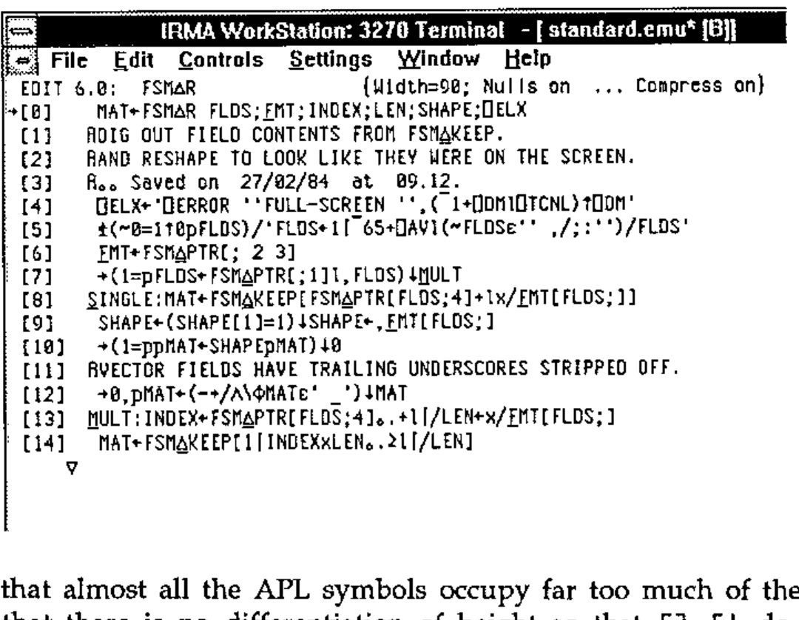
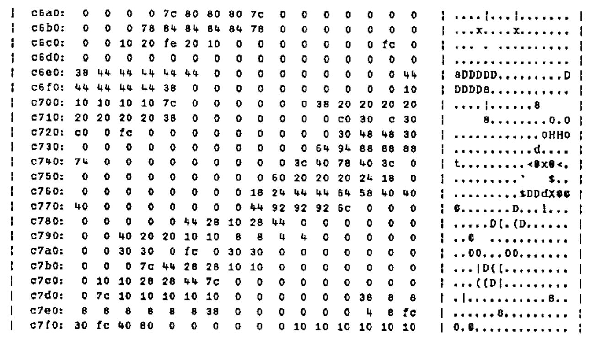
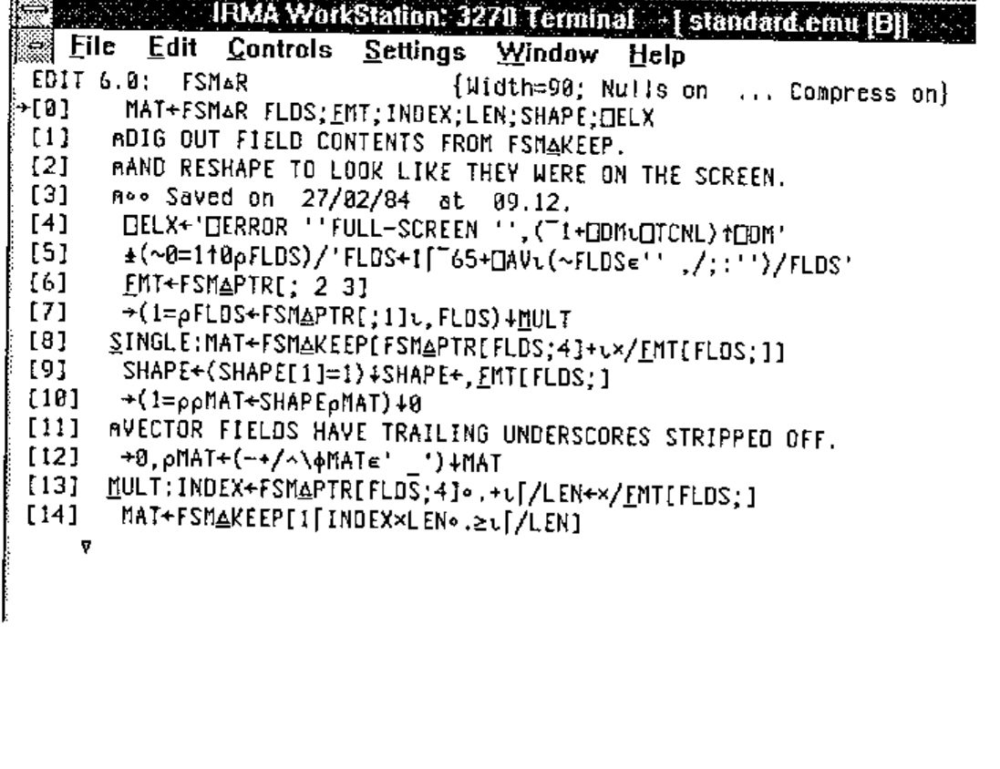

*by Adrian Smith*
{ .byline }

## Motivation

I find it helpful to be able to read my own APL code occasionally, but essential to read other people’s code which I am trying to maintain. As I write this, I am a few days into a short contract which involves changing over some quite complex mainframe code to run with a new set of input sources, while maintaining a lot of existing output structures. The first day — having got through the routine pay-and-rations stuff — was spent browsing workspaces and generally trying to understand what the existing system was doing. I found this to be a lot harder than it should have been, at least in part because of the quite awful rendering of the APL font by the IRMAWin software I was using. It seems as if the people who designed (if that is the word) the APL characters had set out to make APL nearly as hard to read as J! Here is the sort of thing I was faced with ...



Notice that almost all the APL symbols occupy far too much of the available width, that there is no differentiation of height so that `[] ⌈⌊` do not show clearly, and that `⍳` and `⍴` look like nothing on earth. If I was finding this hard to read, what about all the other poor mainframe users out there, who have had their nice old terminals taken away and replaced by ‘modern’ Windows-based PCs. If you are suffering as I did — read on.

## Investigation

Well, a font is a font is a .FON — even if it has some 32 different sizes in it so IRMA can pretend to be every known type of 3270 device. I already had a little APL\*PLUS/PC workspace for maintaining font files, which I used to build the CAUSEWAY.FON that Duncan designed in the style of the old mainframe character set. I settled on 15 by 7 and 15 by 8 as nice sizes to work with, so the challenge was on to find the right place in the DCAAPL.FON file to patch. Now 15 is a good number to look for if you have a hex-dump utility for DOS files, as the file is listed in 32-byte sections so you get a very clear diagonal pattern from a 15-character repeat ...



If you don’t have a suitable hex-dump utility, this one (written in C, by me, in 1988) is included on the DOSPP page on APL-385’s web site at www.demon.co.uk/apl385. Now, each character in a .FON file is made up of n bytes, where n is the depth of the character cell. What we would expect to find here is a collection of integer vectors, each 15 long, having the pattern of the character represented as the topmost 7 bits (for the 15 by 7 set). All we need to do is read the file into the workspace (using *rget* from *Vector* 11.1 p126) and dig into it around the c700 spot to see what we find ...

```apl
      ⍴ff←rget'dcaapl.fon'
215040
      16⊥¯1+'0123456789abcdef'⍳'c700'
50944
      '.⎕'[1+⍉(8⍴2)⊤15↑50944↓ff]
...⎕....
...⎕....
...⎕....
...⎕....
.⎕⎕⎕⎕⎕..
........
........
........
........
........
........
..⎕⎕⎕...
..⎕.....
..⎕.....
..⎕.....
```

... looks hopeful. We have a straddle across what might be a base and what might be the top of a ceiling! Now to have a look at the font ordering in *charmap*, and sure enough we find that the `⊥` is one character before the `⌈`, on the positions normally given to N and O in the font. A little gentle arithmetic yields the base point of the font as `base15←50232` (incidentally the 15 by 8 set is based at 87096) and we now have the following function to browse the characters:

```apl
      ∇see15[0]∇
[0]   r←see15 ch;pos
[1]   ⍝ 7 wide by 15-deep chars
[2]   pos←dcav⍳ch
[3]   r←'.⎕'[1+⍉(8⍴2)⊤15↑(base15+15×pos)↓ff]
      ∇
```

... where *dcav* was simply read off charmap and typed in. Now all we need to do is to read in the causeway font, lift the definition from there, trim unwanted rows or columns, and patch it in to the DCA font ...

```apl
      ∇put15[⎕]∇
[0]   ch put15 def;pos
[1]   ⍝ replace 15-deep char
[2]   pos←dcav⍳ch
[3]   (15↑(base15+15×pos)↓ff)←(8⍴2)⊥⍉~def∊' .'
      ∇

      ∇Patch[⎕]∇
[0]   Patch ch;cs
[1]   ⍝ Substitute baselined causeway char
[2]   cs←1⌽¯1⊖¯1 0↓see ch
[3]   ch put15 cs
      ∇
```

## Results

The proof of the pudding is in the eating, and I am glad to report that my mainframe screen now looks like this ...



... which I find very comfortable to work with, and very nearly as readable as the original (excellent) 3179 fonts of 10 years ago. *Moral*: if your job is chopping down trees, there is ***always*** time to stop and sharpen your axe.

## Getting Hold of this Stuff

It is probably not sensible for me to put the patched DCAAPL.FON up on the Web, as it has at least 37 copyright statements embedded in it, and I don’t want to upset anyone. However the Dyalog workspace is absolutely tiny, so you can grab it from **www.demon.co.uk/apl385/ragbag** and save yourself some typing.

Next issue: *Making J Readable* (no, sorry ... even for the April Vector that was a joke in very poor taste — perhaps a Neural Net application to discriminate between J and line-noise would be more interesting?).
