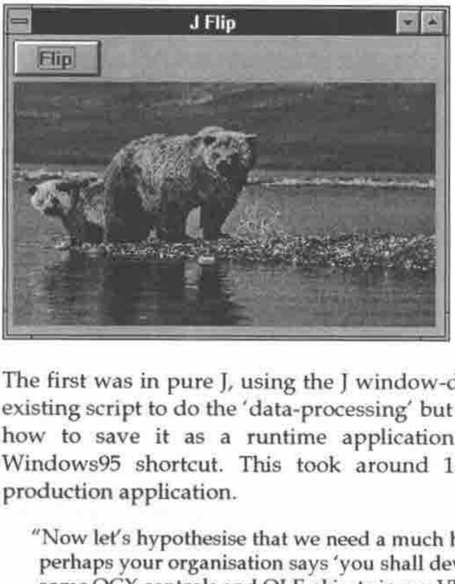
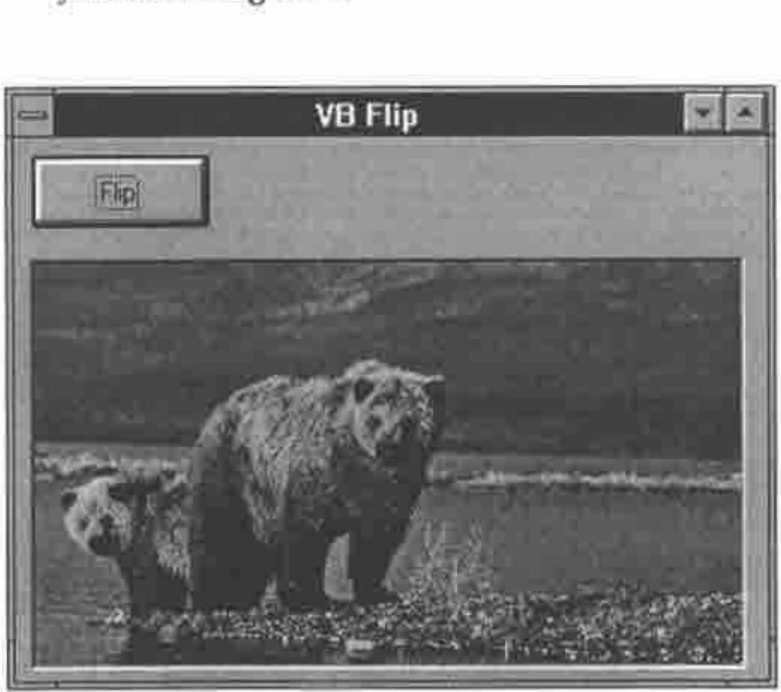
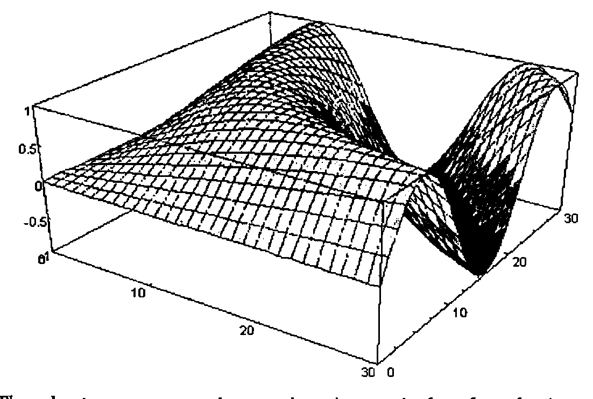

*notes by Adrian Smith*
{ .byline }

## Introduction

This was a special meeting, arranged at short notice to take advantage of Eric Iverson’s presence in the UK. It was one of the best attended meetings for years, with a really good mix of APL old-timers and new faces. Eric talked a little about the background to J, then spent the bulk of the talk demonstrating the power of calling J as an OLE2 server. Finally he showed some of the new graphics facilities and demonstrated the power of the language in calculating some interesting statistics on a ridiculous number of primes, and then plotting the resulting chart with upwards of a million data points.

## J — Background and Motivation

J is produced by Iverson Software Limited, which was formed as a software development company in 1988. In 1989 Ken Iverson and Roger Hui had been working on a first implementation of J, and they decided to join forces with ISI and to make J the primary ISI product — it was first shown at APL90 in Copenhagen. About a year ago, Kirk Iverson joined the team, so there are now 4 people focussed on the design and development of the language.

All marketing and sales support is handled by Strand Software, which leaves ISI free to concentrate totally on the interpreter.

Eric drew a very interesting timeline on the board, which helped to explain the original motivation for J, and also to put it in the context of the general development of array-processing languages.

1964
: The APL notepad epoch. APL came into being as the Iverson Notation at Harvard.

1966
: The first machine-implementations of APL by IBM. There was a rapid evolution of ideas, carried on by STSC and IP Sharp until around ...

1984
: No-one was funding language changes any more. Sharp added box and rank, but the language was no longer moving forward.

1984
: The J notepad epoch. Ken took the APL design philosophy and began sketching ideas for an ‘ideal world’ language ignoring all that had accumulated over the previous 20 years.

1989
: The first machine implementation led to the same dynamic explosion of ideas as had occurred in APL. Very early in the cycle, J acquired some very fanatical users.

1993
: J became a serious commercial product as the language definition stabilised.

1996
: J3 is now a *really* serious commercial product!

So — how do you go about getting the best productivity from a high-level language like J? The crucial thing is the language itself, not the interfaces which are driven by fad and fashion and changes in the hardware.

J and APL would have been useful to the Babylonians, are useful now, and will still be useful in 1000 years time. Array problems don’t change a great deal, but the interface is ‘flavour of the month’ and has been changing radically every 5 years and it’s getting faster. Look at the timeline — there has been a huge change in the computing environment over this period, and most of it has been totally unpredictable!

> "ISI are strictly J language people — we are concerned with data-processing problems — we are J folk, not Gui folk.
>
> To make a living, you have to sell something perceived as useful by other people! There are plenty of problems with no Gui — problems in Physics or Astronomy or weather-forecasting. These are good targets for APL or J. Then there are problems which are nearly all Gui — games and most spreadsheets have minimal DP, maximum user-interface — use the best tools available! Probably this is whatever tool the corporate IT department has given its stamp of approval to!
>
> The interesting challenge is where you have high DP and high Gui content! In the time-sharing days APL had both the best language **and** the best user-interface. For many years in the PC world everybody else was miles ahead on the user-interface; Dyalog and APL2000 have done a phenomenally good job of nearly catching up! They don’t dictate where the Gui is going, they are doomed to failure — they are always going to be behind!
>
> So what about ISI? Given that we gave up the Gui chase, how do we remain viable? All that architectural framework that comes with the operating system has finally made it possible to realise the dream of 10 years ago — we can prototype in pure J, build the Gui in the tool of choice and ship the result as a single seamless package."

Eric continued with a sequence of 3 very impressive demonstrations. He produced 3 very similar-looking applications which simply had a main form, with a button on it to reflect the classic ‘bears’ picture left-to-right.



The first was in pure J, using the J window-driver to build the Gui. Eric used an existing script to do the ‘data-processing’ but built the Gui on the fly and showed how to save it as a runtime application which could be started from a Windows95 shortcut. This took around 15 minutes from start to finished production application.

> "Now let’s hypothesise that we need a much heavier duty Gui component, or perhaps your organisation says ‘you shall develop in VB’. You ask ‘Can I use some OCX controls and OLE objects in my VB application?’ Naturally, they say yes, so here goes ..."



Eric proceeded to build the exact same system, using a Visual Basic interpreter installed off the CD that morning. The Gui design phase was similar, and he needed to add a line of code to declare the J EXE server. The *onClick* handler for the ‘Flip’ button called the J script and forced a repaint of the bears picture.

```text
Public js As New jexeserver

Private Sub Command1_Click()
js.Do ("flip 'c:\b.bmp'")
picture1.Picture = LoadPicture("c:\b.bmp")
End Sub

Private Sub Form_Load()
js.Show (1)
js.Log (1)
js.Do ("0!:0<'c:\flipbmp.js'")
End Sub
```

Again this took less than 20 minutes to set up and involved no weird stuff at all in the VB code. To make it ready for distribution, Eric switched to the J DLL server so that on calling J, VB just loaded the J engine (no session) as an in-process DLL. He noted that it is as efficient to do ‘JDO(’`expression`’)’ as any other DLL call. It is simply a call-return.

Eric concluded this part of the talk by taking on the same problem in Borland Delphi and arriving at a visually identical solution in less than 10 minutes (well, we were running late for the tea break!).

He now had 3 icons lined up in a row, each of which could load and flip a 256-colour picture. In each case, the same J script was doing the data-processing (non-trivial, by the way) but the interface was built in a quite different way. It would have been fun to try it in Dyalog 8 too (J is perfectly usable as an OLE server from APL) but we really had run out of time.

```text
// Delphi flip code

uses oleauto

var js:variant;

// formcreate
js=:createoleobject('jexeserver')
js.show(1);
js.log(1);
js.do('0!:0<''c:\flipbmp.js''');

// button1click
js.do('flip ''c:\b.bmp''');
image1.picture.loadfromfile('c:\b.bmp');
```

A very rough byte-count showed Delphi well ahead at 600K for the entire system, native J second at 920K, and VB a long way last at 2.5M. However Eric pointed out that the J and VB numbers would change very little as the system became more complex, whereas Delphi grows quite quickly to around 1.5M where it too seems to level out.

## Graphics in J

After the break, Eric gave us a quick demonstration of the new graphics capabilities in J. He very generously acknowledged the debt to ‘Rain’ which Chris Burke had used as a model, and to some extent as a target in terms of quality and flexibility.



The charts were very impressive, in particular the plotting speed for large volumes of data. There is also the option of some of the ‘shaded contour’ style plots beloved of mathematicians and advertising copywriters!

## Questions and Answers

The meeting ended with a lively discussion, with most interest on the future plans for the J system. Eric stressed the importance of the Dec Alpha and other Unix platforms, and also introduced the possibility of adding ‘infinite precision’ arithmetic to the language at an early date.

## Coverage in Byte Magazine

Eric strongly recommended any J novices to read the article *"The Joy of J"* in the August 95 issue of Byte magazine. This is an extremely positive summary of the language by Dick Pountain, who has been a Byte staff writer for many years. It was a particular pleasure to meet Dick for an hour or so after the meeting had ended (unfortunately he was unable to attend due to other commitments) and to hear his views on the likely future of the OLE technology and the ‘array server’ approach adopted by ISI.
