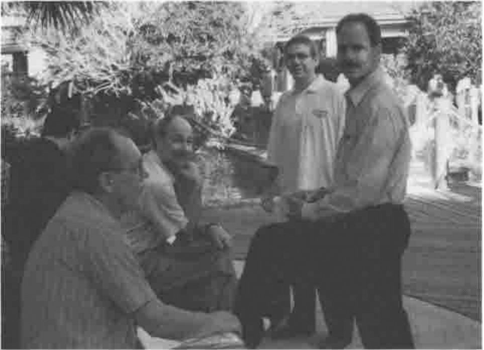

*reported by Adrian Smith*
{ .byline }

## General Impressions

There was no doubt that this was an overwhelmingly positive conference. I went along not really knowing what to expect; this was the first time that the APL\*PLUS (PC and Unix) world had got together after being gradually abandoned by the ‘M’ company (delegates were willing to speak of Dyadic by name, but not of the other lot!) and I think everyone present was mightily relieved to see their interpreter moving forward again.



The overall attendance was 80+ (excluding APL2000 delegates) which was at least 20 more than expected, so there was some moving of rooms to accommodate meals and sessions. Otherwise the organisation went like clockwork; everyone was given a very nicely indexed folder with all the papers included, an APL2000 tennis shirt, and a name badge with his or her name in **readable** lettering. Future APLnn conferences please note!

The travel was very straightforward, as Orlando is a major holiday destination, and the hotel was comfortable, low-rise, and friendly. It was much more appropriate to this kind of gathering than the vertical kind, being basically a collection of motel-type units (all cars around the outside) clustered around a large garden area with tennis-courts, 3 swimming pools, and lots of shady areas to sit down in and chat with other delegates. The climate was perfect — hot but not humid during the day and warm enough at night that we could sit out for breakfast at 6.30am watching Venus fade to invisibility as the sun came up. We never did get the ‘wake-up’ call to work, but the local bird life (of the Mockingbird variety) went off with absolute reliability at 6.30 (and again at 7.00) so this was never a problem!

## Conference Diary

### Opening Session (Eric Baelen)

The proceedings opened at 8.00 on Wednesday 23rd with breakfast and registration, and Eric Baelen welcomed us to the conference at 9.00 in a typically upbeat style. The delegate list was strongly biased to the USA, with a particular interest from the insurance / healthcare / actuarial sector, but there were representatives of 11 other countries including Finland, France, Sweden, Columbia (maybe a first for an international APL gathering?) and Australia.

Eric’s message was a simple one "I’m proud it’s in APL" and he encouraged everyone to adopt this as the message of the conference. In fact when any other speaker suggested that some work "looked just like Visual Basic, so we don’t need to tell anyone it’s in APL" Eric would leap to his feet and admonish them. He introduced delegates to the latest interpreter — a new version was included in every conference pack — and gave a brief roundup of the main sessions to come. It was interesting to see the reaction to the new Gui components, many of which have been available in Dyalog APL for at least 6 months; I would say that the majority of this audience were not even aware of the "D" company at all, and those that had heard of it were totally uninterested. It is probably also true that they do not really need sophisticated Windows programming tools — insurance systems tend to be simple form-filling applications and actuaries are quite happy running their functions from the session prompt. What they need is a fast array engine with a fast, adequate Gui interface: this is exactly what Eric is giving them! What they also need is the ability to do this stuff across corporate networks, which is where the TCP/IP interface comes in — see later!

### SoftMed moves to Windows (Chris Lee)

When Chris first came across the SoftMed company, he naturally asked them what they did; on being told "Medical Records" his reaction was the same as everyone else’s — well, that should take about 20 minutes, then what do you do? In fact it is a massively complex area, and it is becoming increasingly necessary to get it right. There have been several recent examples of hospitals getting the wrong record in the wrong place at the wrong time, and people have been hurt or killed as a result. The SoftMed system is the market leader in the US because it includes a very thorough authentication and checking process, and because it was designed by someone who knew what the issues were and how they could be solved by computer.

Chris began by running through the history of the system, then he took us through the somewhat stop-go history of the Windows conversion, before showing us around the current product. It all started 14 years ago when Don Segal saw a need for a software solution, bought an IBM 5120 and programmed a one-hospital system in APL. After 14 years it had been installed in over 1000 hospitals, and consisted of a large collection of APL\*PLUS/PC workspaces embodying years of effort making that original little system do all the things the users wanted it to do. It never even moved to PLUS II — many users were working on old 286 kit.

When Windows first came along, SoftMed wondered what to do about it, and got a unanimous reaction from their users: "DOS is faster, simpler …" and so they quite reasonably stayed with it. Then about 1 year ago the wind suddenly changed. Microsoft started a healthcare consortium, all the new customers wanted Windows and the IS departments started giving Windows 95 machines to many of the existing users. Overnight it became a case of going to Windows or losing market share. When you are the market leader, you get very upset at losing share!

Very early in the design process, SoftMed set some important ground rules:

1. They would protect the existing DOS user base. Bugs would still get fixed and vital enhancements included.
2. They would maintain database compatibility across the old and new systems. This would allow the systems to co-exist and would allow hospitals to upgrade with a simple software installation. One problem with hospital records systems is that you can afford no long periods of downtime, so a massive file-conversion process was never likely to be possible.
3. Don Segal appreciates what the users do — every keystroke counts. If they transcribe 1 less document in a day, they lose money! The system must save keystrokes wherever it can by tabbing well, anticipating input, providing short codes like ‘t’ in date entry fields. Windows is not designed this way!
4. Coding style must be consistent. The old system evolved to conserve symbol table, so it has dense complex code with short meaningless names. In its 12-year lifetime it has seen many APL programmers pass by, some of them not very good. Chris was determined to set some rules on modularity, coding style and code management.

The next phase was what Chris called "Toe-Wetting"; finding a small self-contained project that they could use as a learning experience. They had started work in C on a system to store and retrieve EEG charts; C was used because of the apparent impossibility of building anything useful with the APL\*PLUS II Windows interface. They ‘sold’ the product with a delivery date of February and by the major show in October they were in the state where "… well, it works on my machine" with very little prospect of delivering on time. They couldn’t simply abandon it (having already sold it) so they had 4 months to get something off the ground in PLUS III which was becoming stable enough to work with.

Chris’ team worked on the 4 or 5 functions that produced the data and they used LEX2000 consultants to develop the Gui front end. By February they had a working product, a satisfied customer and something to demonstrate to the marketplace. Next they tried a simple conversion — ESA or Electronic Signature Authentication. This has a quite complex back end (who can sign for what, under what circumstances) but a very simple interface. It proved a good choice and was moved successfully in January 95.

Having made two successful forays into the Windows world, SoftMed now settled down to draw up the ground rules for a major migration of all the existing systems. They already had a code management system, so one rule was that there should only ever be one live copy of each function. Naming conventions are just a matter of someone setting a rule and everyone sticking to it. As Chris put it "I got to be the somebody, so they’re *great* rules". APL does not have static locals, so delta-underbar means "keep off this variable"; modules have public functions, any others have `∆tla` (Three Letter Acronym) in front, non-public variables are marked similarly. There is a ‘base workspace’ which is built by the `]CodeInit` command, and has some 212 common functions and 28 base variables included.

The next big decision was to go for user-defined classes as a way of encapsulating special behaviours. For example they needed a list box which only pulled the data as the user required it, rather than all at once before anything was shown. These were made to feel very like the built-in `⎕WI` controls which gave a consistent interface to the developer. They also ensured a consistent look and feel to the end user.

The DOS code was riddled with file reads and user prompts, and file writes and prompts. Chris was determined to separate data access code from Gui code — there would be no file reads in Gui code and no dialogue boxes popping up in the data-access code! This immediately meant they were into a significant rewrite, not just a simple code migration.

He was also doing his best to ‘raise the bar’; programmers like to solve problems, so let’s set them real application problems, not nasty low-level ones. The objective is to build with bigger and bigger pieces, so the application developers can concentrate on putting it all together. An excellent example of this philosophy was a user-defined class which took a matrix of field definitions and added a single control with the fields neatly laid out below each other. It handled scrolling with &lt;Up&gt; and &lt;Down&gt; buttons as required, and had sensible resize behaviour built in. As a result, programmers who were faced with the need to generate many rather simple data-entry forms quickly could stop messing around in `]WED` and simply define the required fields. The class sorted out the spacing, tabbing, and other little details like bolding the caption of the active field. I think of all the things which were shown on the first day, this was the one which really got people’s attention! Mental note to put something similar into the next Causeway release!

So much for the groundwork — everything was just nicely ready to start when a stack of urgent work came in and (see objective (1) above) everyone was switched back to the DOS product. Chris did what he could to validate and test the groundwork during this period, and with hindsight the hiatus of nearly a year was time well spent. When the Windows work came back to the front of the queue it did so with a bang, and having a solid base meant that the standards worked, and got used, from day-1.

The two shows that count are in October and February, so when the message went out in July "Windows or Bust — we do not show the DOS product any more" they had to move 3 major apps in a very short time. After a month Chris was behind, as there was more tricky detail in the field-level behaviour than he had anticipated. However he just made it in time, and was sufficiently confident about the February deadline to take time out to give his talk! He was also keen to point out the benefits of working closely with APL2000, who now owned the interpreter and were listening hard to the users (and their own consultants) and fixing the major irritants in the interpreter. The ‘conference bag’ release has a couple of extra events to ensure that field-exit is always caught, and that it can be rejected if the data is invalid; these are in there because SoftMed was finding it painful to work around all the holes left by validation on UnFocus. Where next? Chris was confident that by February he will have at least one major customer running live with the new system.

### FAQs, Tips and Techniques

This was the first of the parallel sessions, and was of most value for the printed material, and the helpful workspaces on the supplied diskette. This included handy code for things like turning the paper around, simulating `⎕EDIT` under program control, and so on. The questions were mostly oldish chestnuts like ‘why this ridiculous co-ordinate system, what’s wrong with pixels like everyone else uses?’ or legitimate complaints about `]WED` (which does not handle extensions to styles for existing objects, or any of the recent additions like property sheets). People seemed to be having a lot of trouble with multi-line edit fields, and in general were advised to wait for the RTF edit field, which sounds like a case of sledgehammer and nut. In general, I felt that this session was a good idea which failed to work as well as it should have done — I would be interested to hear what the other attendees thought.

### New Language Features (Bill Rutiser)

I was sorry to miss this session; unfortunately it clashed with the first of our two presentations on Rain and NewLeaf. To summarise briefly from the printed notes:

- Ravel with axis, both with integer and fractional axis, giving lamination in the latter case.
- APL2-style partition with axis. Personally I find this quite horrible to use, and bless APL+ for retaining the sensible version as `⎕PENCLOSE`, but I suppose the APL2 compatibility is necessary.
- Axis specification on all the scalar dyadics, so you can add vectors to matrices easily. Fine, and handy, but please can we have rank as an alternative? This is one thing that J does so much more consistently!
- Object attributes with `⎕AT`, again in APL2 style. APL\*PLUS has been storing function timestamps since 1984, but only now can you reveal them! You can also check the object’s syntax without actually taking the trouble to parse the header. It was noted in the QA session at the end that this is reset whenever the function is fixed, so is of little value to anyone with a file-based code management system. They will have to continue with checking component timestamps until +Win adds Dyalog-style `⎕OR` which preserves the timestamp on fixing.
- N-wise reduction. This is a real gem, and is one of the things that adds genuine ‘tool of thought’ power to the language. Of course you can do moving averages trivially, but it allows so much more, for example looking for runs in data, or the ultimate one-line ‘life’ program. This gets a lot more relevant these days when everyone is into bitmap processing — the first thing you do when smoothing jaggies is to count neighbours, and how better to do it than to border with zeros then take the `3+/3+⌿MAT`? So simple, yet so much in tune with the kind of array-thinking that APL encourages.

All the new features will be in APL+Win and APL+Dos by the end of the year, and APL+Unix early in 1997.

### The LEX2000 Financial Reporting Software (Michael Steiner)

This session was a run through the raison d’être of APL2000’s major application, and a demonstration of several of the more interesting Gui features. The market is defined by the gap between spreadsheets (easy to use, flexible, manually intensive, prone to casual errors, hard to maintain) and General Ledger packages (strong on data integrity, trial balance built in, lots of standard reports, inflexible, limited budgeting and forecasting, lots of redundant accounting structures).

LEX2000 uses the classic 4-dimensional data model (see e.g. Bittlestone, APL Business Technology 83) with dimensions representing:

- **Time.** This is more complex than it sounds, as the accounting periods can vary and it must include moving windows for concepts like ‘last quarter’.
- **Account.** Typically this is a consolidated general ledger with a summarised chart of accounts which can be common across geographically separated subsidiaries.
- **Component.** This represents the business organisation, and can be multiple trees, for example by product group, legal company and so on.
- **Submission.** This is an arbitrary label attached to a particular set of accounting data, such as ‘Last Year’s Budget’ or ‘1995 Actuals’. Typically the system would be asked to make comparisons between submissions.

The demonstration of the finished system showed some neat tricks, for example any three of the four dimensions could be presented as ‘Page’ ‘Row’ ‘Column’ and you chose the presentation simply by dropping the appropriate icon into the correct box. As you clicked and dragged, the icon made itself into a cursor so it looked as if you had picked it up with the mouse. When you dropped it, the report re-arranged automatically.

### Support for OCX objects (Patrick Parks)

This wasn’t beta code, nor yet alpha code — it was ‘aeroplane code’ but it all seemed to work and promised a much better integration of the FarPoint grid control, and all the other emerging OCXs, into the user’s application. At the moment you need to know the OLE registration string to connect to the object, but soon you will just be able to `⎕WI 'New' 'FarPoint'` to place a registered control on your form.

Controls will have the obvious properties mapped to the standard `⎕WI` syntax, so ‘where’ will work as expected, but will obviously have lots of extra properties which will be passed on untouched. Any event messages will be passed on exactly as they arrive from the OCX, so the co-ordinates on mouse-down could well be xy rather than row-column. Patrick was unsure whether to preface all control-specific properties with a standard prefix, or just those which could clash with an APL+Win standard, for example if a control had its own ‘where’ property this would appear in the property list as ‘xwhere’.

For the first time, all properties will be case-insensitive ("Maybe it’s time to lighten up a little, Patrick …") ’cos that’s how OLE is.

### The Knights who say NI (Mark Osborne & Michael Steiner)

This was a very educational two-part session which started with an excellent introduction to the basic ideas in Client-Server, covering everything from simple web browsers, through ‘Fat Client’ to multi-layer models.

In the first session Michael introduced the basic ideas of Client-Server with the ‘coffee shop’ analogy. The customer (client) orders "Coffee with cream and sugar" from the bar (server) via the waitress (network). This is a typical ‘thin client’ example, where the client has nothing to do other than drink the product. Extending the model to ‘fat client’ would be simple; the customer orders "strong Java" which comes black. He adds sugar and cream to taste, and stirs with the spoon provided. The network does a little more (it carries the spoon), the server does a lot less, and the client takes on the stirring, and can make some choices about the precise dose of sugar and cream required for maximum satisfaction.

Now suppose the order is "Irish coffee with Cheesecake". The barman sends out for the cheesecake and gets an assistant to measure the whiskey. This is typical of a multi-layer Client Server, where the customer sees no difference (other than perhaps an increase in waiting time), but the server may become a client for a while as the request is assigned to other servers, and the results collated and packaged. This is typical of many more advanced Internet applications, where the customer fills in a simple form and hits the &lt;Submit&gt; button.

We were given a very quick demonstration of PC-PC client server, running ‘peer to peer’, with a neat application implementing a shared whiteboard between two APL sessions. Either side could draw stuff, and have it appear in the other machine, effectively simultaneously. This was run using two video projectors on side-by-side screens, and there was no visible delay — very impressive and all the more so given the total programming time involved: less than 4 hours.

After lunch we continued with a more technical view of the network, and how TCP/IP sockets actually work. Hopefully, *Vector* can talk Mark or Michael into writing up their slides as a proper paper, as I thought they gave a particularly lucid description of the concepts involved and I cannot really do justice to it here.

We started with the **Socket** (a communications endpoint) which has four attributes:

1. **Descriptor.** This is a small integer, assigned by the system when the socket is created and unique within the process that made it.
2. **Host Address.** This is the internet address of the physical machine on which the socket has been created. It looks like 192.168.160.212.
3. **Port Number.** These relate to the service the socket will provide, and several are reserved for standard services, for example 7 (echo), 21 (ftp), 23 (Telnet).
4. **Connection.** A link to a single partner socket.

So, how do we set up a socket and get it to connect to another socket ‘out there’ on the network? First both client and server make a "Socket" call which creates a socket, allocates a descriptor, and returns it. Now they must fill in items 2 and 3 of the above list, which is done with a "Bind" call, giving the host address and any reasonable free number (such as 2002) for the port. Now the server can be told "Listen" and will be ready to accept incoming connections which have the correct address and port number.

Now the clever bit! The client sends out a "Connect" call from its socket, the server accepts it, clones itself with a new descriptor, and sends an "Accept" thus making the link. The original socket is still there, still listening, and can accept more connections (cloning itself again) as required. The connected sockets can now use "Send" and "Recv" to move arbitrary data across the link, and everything in between is ‘just some magic’ — we don’t care how it happens.

The new system function `⎕ni` handles everything you need to make these sockets, get them talking, and move data between APL systems or any other TCP/IP host which happens to be out there. It will be built into the interpreter on both the PC and Unix platforms, but will be too late to make the 2.0 release. Expect to see it with the first update release in 1997. The general syntax is simply

```apl
rc←⎕ni 'function' arguments
rc←data ⎕ni 'function' arguments
```

… where the return code is 0 (for OK) followed by some data, or -1 followed by an error number and possibly some additional information. The "Send" and "Recv" functions default to moving data in internal APL format, so you can move arrays very efficiently between processes on different platforms. Other data types such as ‘char’ and ‘int’ are provided for communication outside the APL world. Examples of simple function calls could be:

```apl
      ⎕ni 'gethostname'
0   delilah
```

… which finds out where we are, or to get the actual address details:

```apl
      ⎕ni 'gethostbyname' 'delilah'
0 delilah  2  4  192.168.160.212
```

… which returns the address type, length and actual value. Now to make a socket:

```apl
      ⎕ni 'socket'
0 3
```

There are arguments, but they default to the common case and can be elided here. The 3 is the descriptor we need (more or less like a file tie number) to set up the remaining socket attributes and start communicating:

```apl
      ⎕ni 'bind' 3 2005 '192.168.160.212'
0 0
```

… so now three of the four attributes are filled in (2005 is our port number) and we can set it listening:

```apl
      ⎕ni 'listen' 3 5    ⍝ tie number and queue depth
0 0
```

The queue depth will default to 5 if we leave it out. Now for the fun part! Suppose someone out there has gone through the same sequence and now issues:

```apl
      ⎕ni 'connect' 3 2005 '192.168.160.212'
0 0
```

… giving the port number and address of our server. We can establish the link by accepting the incoming request:

```apl
      ⎕ni 'accept' 3
 0   5 2 2005 '192.168.160.216'
```

… getting back a new descriptor for the clone socket thus created, and the address of our new partner. Now we can send and receive in either direction, so the notion of client and server more or less vanishes as soon as the connection is completed:

```apl
      data ⎕ni 'send' 3 'APL'
0 35
```

… the result is the number of bytes transmitted. On the receiver side:

```apl
      ⎕ni 'recv' 5 'APL'
0   there's too many kids in this tub
```

Of course you need to know that something is ready to receive! At the moment the only option is to run a timer and make a ‘Select’ call to check what is waiting. By the time the product is released, there will be an event (possibly on the system object) to let you know that something has arrived. Finally we must release (untie) the sockets:

```apl
      ⎕ni 'close' 3 4 5 7
0 0
```

… giving a vector of descriptors to be closed.

Of course all you have here is the roadway — it is up to you to build the vehicles to drive down it, and decide how you will load or unload them. This is what is called a ‘protocol’ and in the simplest case would just be a numeric code appended as the first element of your data to tell the receiver what to do with it. For example in the shared whiteboard application, 3 followed by a ‘Draw’ command string was interpreted as ‘draw this’ and so on. If you want to talk to standard applications (such as the *Alta Vista* server or the Netscape client) then you need to look at the messages they exchange and use these protocols yourself. Fortunately this is all character-based and quite simple to copy (Michael included a simple ‘spy’ version web browser on the demo disk to reveal the underlying message format) so building a basic Web server is much easier than it sounds. As we were well out of time by now, the details were ‘left as an exercise for the reader’.

### User Defined Classes (Chris Lee)

This was the session I was saddest to miss — again it fell opposite our own slot in the schedule. It was also very squeezed for time, as breakfast over-ran by nearly 20 minutes (it was served out on the terrace and everyone was enjoying it far too much to move inside), but lunch was a fixed point. The basic idea is to extend the built-in classes by adding new properties and methods, and to provide access to all the properties and methods via a cover function `QWI` which worked in exactly the same way as raw `⎕wi` would. (*Query: +Win does not support user-defined events, which Causeway would find it hard to live without. What does Chris do to get around this restriction?*)

Each UDC is defined by a single function, and typically involves the creation of several Gui objects. The newer ones have been constructed from a standard template which ensures good documentation and structure. Some examples in the handout:

- `⍙Adder` which puts up a pair of list boxes and some means of transferring items between them, and sorting them.
- `⍙ButtonGrp` which takes a vector or array of button values and returns information on the state of the group as a whole.
- `⍙Date` which accepts dates as masked input and knows how to handle short code for ‘today’ or ‘+n’ days from today.
- `⍙FromTo` — a pair of date UDCs separated by a ‘to’ label
- `⍙Spin` — an edit field or Date UDC coupled with a pair of spin buttons.

As you can see, the UDCs can be defined in terms of simpler UDCs and so on down to the raw Gui controls. This looks like a very powerful and extensible idea, and probably should be supported by whatever replaces `]WED` as the standard design tool. More details (and a copy of some of the latest UDCs and their documentation) are available from Chris by e-mail. Chris is happy for anyone to make use of these ideas, and in return only requests that you send him any particularly interesting UDCs that you make.

## Roundup

The main conference ended on Thursday, and was followed on Friday by a solid training session for users new to the +Win Gui. Flights being hard to get after Thursday evening, Gill & I skipped before the official finish, but I am sure that the closing session went well. Thanks to all who made it such a useful event, particularly to Sonia Beekman who found the hotel, handled the admin and set up the excellent conference folders. We look forward to meeting them all again next year, same time, same place.
