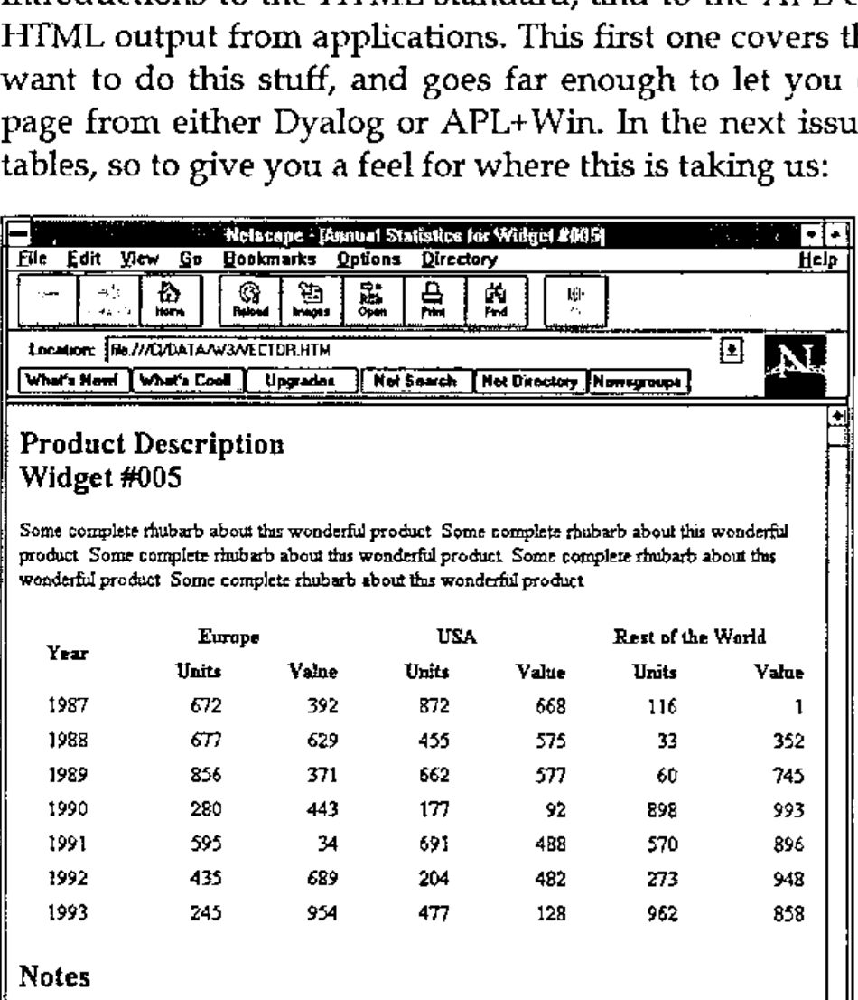
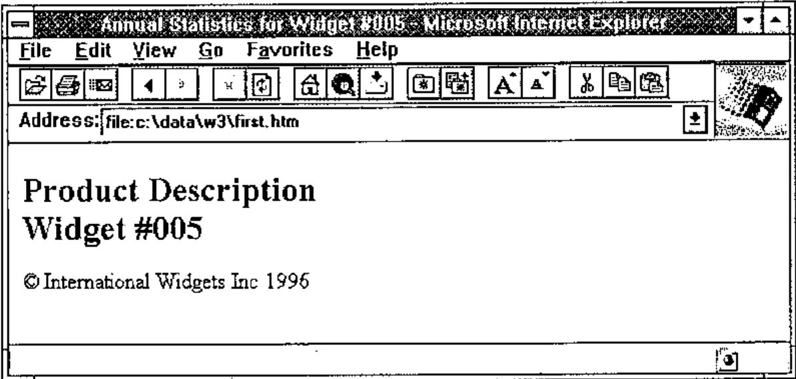
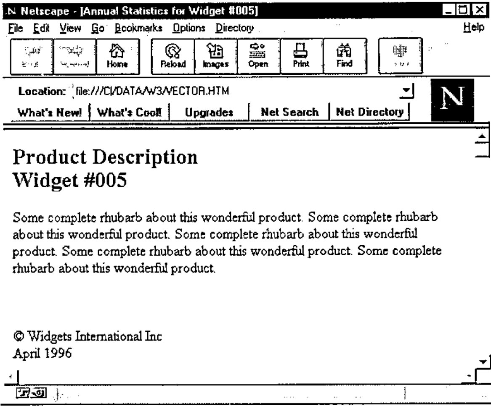

*by Adrian Smith*
{ .byline }

## Introduction

This is the first article in a set of at least two, and probably three tutorial introductions to the HTML standard, and to the APL code that I use to generate HTML output from applications. This first one covers the reasons why you might want to do this stuff, and goes far enough to let you create a very simple Web page from either Dyalog or APL+Win. In the next issue, we will go on to tackle tables, so to give you a feel for where this is taking us:



Throughout this series, all the sample code will be in APL+Win 1.8. However it will translate trivially to a Dyalog namespace, and is available on the Causeway web site (www.causeway.co.uk/html.zip) in both formats. The code may be freely downloaded and used with no restrictions.

## Motivation

One of the best attended workshops at Lancaster, and the most exciting topic at Orlando, was the TCP/IP hookup that can now be used to enable APL systems to act as purpose-built web servers, probably connected to an internal company network or **Intranet**. Both Dyadic and APL2000 are well on the way to providing TCP/IP sockets as a native component of the interpreter, so it is now up to you to develop applications which take full advantage of standard browsers such as *Netscape* or Microsoft’s *Internet Explorer*.

Essentially, this means formatting your application output to the HTML standard. Of course you could give up and just return a formatted array as a simple text file - most browsers will display this in a fixed-pitch font with spaces preserved - but do you really want to maintain APL’s reputation as a cranky old mainframe language which cannot even present a table decently?

Of course you probably want to play with this stuff in the comfort of your own front-room on a portable with no connections to anywhere. You probably don’t want to understand all that TCP/IP jargon just yet, so how do you begin? Fortunately the web browsers make no distinction between a page that has come in from the net, and a simple text file formatted to the HTML standard. This makes it very easy to get started - grab a copy of Netscape (version 1.1 is entirely adequate for anything we need to do) and write your output to a simple ASCII file with the .HTM extension. Open it in Netscape, and park the window somewhere convenient. Then all you need to do is to keep overwriting the same file from APL and hitting Netscape’s "Reload" button to view the results. You will soon get quite proficient at generating very acceptable web pages, and will very probably prefer APL to any of the over-engineered (over-priced) web-site generators that you see advertised in the magazines.

## What is HTML Anyway?

Not an easy question to answer! A year ago the philosophy was clear, and the definition matched the philosophy; now everything is becoming a complete mess as Microsoft throw more and more junk into a language that was never designed to take it. The basic idea was that you describe **content**, and have your user (via his/her browser) determine the **presentation**. The beauty of this approach is that content is completely independent of the target machine, so you can publish material which anyone with an Internet connection can read. The downside is that you cannot specify that your headings should be 14-point Book Antiqua Bold,
because you have no idea if the page will be viewed on a machine which can display TrueType fonts, let alone one which has that font installed.

Now consider the market where the serious money is - the so-called "Intranet" of internal company networks. Here you know exactly what your target machines are, and you probably know that they are all running NT 4.0 with OfficePro 97. Now it makes perfect sense to specify font, and even to make some assumptions about screen resolution (surely everyone at least has SVGA), so suddenly HTML is being loaded up with a raft of ‘presentational’ tags which go directly against the original philosophy of the language. At the moment, my advice is to ignore these, as even the latest Microsoft browser (IE3) falls flat at many apparently legal constructs. However, there is nothing in the sample code which you cannot easily extend, so by all means give it a try if your HTML has a strictly local audience.

The key word in the above paragraph is *tag* which is just a name for instructions embedded in the text to tell the browser how you want it shown. The &lt;b&gt;**bold**&lt;/b&gt; tag is an interesting example - I should really say &lt;strong&gt;**for Strong Emphasis**&lt;/strong&gt; as it is up to the browser how to show it. Similarly I should use &lt;cite&gt;*for citations*&lt;/cite&gt; and so on. Most normal people give up and use bold and italic!

The more important tags describe overall content, and the formatting for each paragraph. These are things like &lt;h1&gt;Major Heading&lt;/h1&gt; and such. Probably the best way to introduce these is to work through a simple example, and explain the tags as we hit the APL code which generates them. There are plenty of good reference books around [1], or you can grab any of a number of excellent shareware HTML editors (I like Kenn Nesbitt’s *WebEdit*) and browse its help file. Finally, there are tables, which are by far the trickiest thing to attempt by hand. The second article in this series will be mainly about tables, and again all the examples will work in Netscape and Explorer.

## Back to Basics

Now you know what a tag looks like, and you have probably guessed that tags tend to come in pairs! They can also be nested, and you will find that there are ‘structural tags’ as well as the formatting markers that I used on the previous page. We should start at the outermost level of structure - the tags that flag the entire content as conforming to the HTML standard …

```html
<html>
… anything that is acceptable HTML
</html>
```

Then we mark out two major sections in our document; it should have a **heading** and a **body** …

```html
<html>
      <head>
       … descriptive stuff about the document as a whole
      </head>

      <body>
       … the bit the browser shows in its window
      </body>
</html>
```

… the indenting is just for clarity and ease of manual editing. Browsers ignore all spare white space and carriage-returns so when you come to write this from APL you can ignore virtually all the layout conventions and the results will look just the same to the user!

### The Heading Section

Let’s start with the code to make a valid heading section, and leave the body to its own devices for the minute:

```html
<head>
      <title>A Title for My Page</title>
</head>
```

… the title is required, and is used by the browser in its own window title. That really is all you need, unless you want to influence the way search engines catalogue and present your page. So the first APL function is really quite trivial:

```apl
    ∇ ttl htmUse dummy
[1]   ⍝ Start off our HTML report
[2]   ⍝
[3]    ⍎(0=⎕NC'ttl')/'ttl←''Sample HTML Report'''
[4]    htmInit
[5]    htmtInit          ⍝ Table setup - see next article!
[6]    htm_cat '<HTML><HEAD>'
[7]    htm_cat '<Title>',ttl,'</title>'
[8]    htm_cat '</HEAD>'
[9]    htm_cat '<BODY bgcolor="#FFFBF0">'
[10]   htm_cat ''
    ∇
```

The syntax of this is inherited from Causeway’s *NewLeaf* workspace [2], hence the dummy right argument where a page-layout would normally be given. Maybe one day it will be possible to specify (for example) the frames to be used, so I left
this in for future use. The first thing it does is set up any required temporary variables, then it begins to build our page:

```apl
    ∇ htmInit
[1]    htmStyle'Body'    ⍝ See later!
[2]    htm_PG←''
    ∇

    ∇ htm_cat tv
[1]   ⍝ Catenate text to back of global HTML buffer
[2]   :if 2>≡tv
[3]     htm_PG←htm_PG,tv,⎕TCNL
[4]    :else
[5]     htm_PG←htm_PG,↑,/tv,¨⎕TCNL
[6]   :end
    ∇
```

… which simplifies as necessary and accumulates the text in the workspace as we proceed. Having run *htmUse*, the buffer will look like:

```apl
'Annual Statistics for Widget #005'htmUse''

      htm_PG
<HTML><HEAD>
<Title>Annual Statistics for Widget #005</title>
</HEAD>
<BODY bgcolor="#FFFBF0">
```

Notice that some tags (in this case &lt;body&gt;) can include extra attributes. These are listed in any order as simple "property=value" pairs, separated by blanks. Unrecognised properties are simply ignored, which is just as well given the divergence between browsers. In this case I have overridden the default grey background with a gentle parchment shade using the colour string "#FFFBF0" which gives the red,green,blue components on a scale of 0-255. You might prefer plain white, which is easy to remember, being simply "#FFFFFF".

### On to the Body

The main part of the page will typically include some headings, some free text and very likely a table of figures. You can stay with the basic styles offered by the browsers, or you can choose to implement your own mapping between ‘Major Heading’ and the low level tags.

Because I find the majority of Netscape’s built-in headings ugly, I chose to define my own styles and generate the tags from these:

```apl
      'Subhead'htmPlace 'Product Description' 'Widget #005'
      htm_PG
<HTML><HEAD>
<Title>Annual Statistics for Widget #005</title>
</HEAD>
<BODY text="#004040" bgcolor="#FFFBF0">
<h2>Product Description<br>Widget #005</h2>
```

What *htmPlace* has done is to look up its left argument in my style table:

```apl
    ∇ htmStyle id;pos
[1]   ⍝ Look up requested style in ∆gallery and action it.
[2]    htm∆tag←,⊂,'p'
[3]    pos←(htm_uc¨(⍴id)↑¨htm∆gallery[;1])⍳⊂htm_uc id ⋄
        →(pos>1↑⍴htm∆gallery)↑0
[4]    htm∆tag←pos⊃htm∆gallery[;3]
    ∇

      htm∆gallery
 Body     Normal Paragraph          p
 Indent   Simple Indent            ul
 Code     APL Listings            pre
 Heading  Major heading     h1 center
 Subhead  Minor heading            h2
```

… and store the tag (or tags) which implement it in a global variable. As you learn more HTML, you can experiment with more exotic tags, such as setting the font size and face for your major headings. The nice thing about using a style table is that existing application code just keeps running.

Back to that *htmPlace* function. It expects either a matrix or vector of text vectors and formats the output as HTML, preserving newlines by inserting &lt;br&gt; tags to force the browser to make a line break:

```apl
    ∇ r←sty htmPlace txt
[1]   ⍝ Simple text placement, taking account of style
[2]   ⍝ Breaks at the end of each line.
[3]    htmUseDflt ⋄ htmStyle'Body'
[4]    →(0=⎕NC'sty')↑Deflt ⋄ htmStyle sty
[5]   ⍝ Ensure correct depth
[6]   Deflt:→(2≤≡txt)↑Fmt
[7]    :if 2≤⍴⍴txt
[8]      txt←⊂[2]txt
[9]     :else
[10]     txt←⊂,txt
[11]   :end
[12]  Fmt:txt←,⍕¨txt ⋄ →(0∊⍴txt)↑Exit
[13]   htm_cat (↑,/'<',¨htm∆tag,¨'>'),
        (¯4↓↑,/txt,¨⊂'<br>'),(↑,/(⊂'</'),¨(⌽htm∆tag),¨'>')
[14]  Exit:
    ∇

    ∇ htmUseDflt;sink
[1]   ⍝ Check if we have initialised and do so if not!
[2]    →(0≠⍴htm_PG)↑0
[3]    sink←htmUse''
    ∇
```

Line[13] is the only interesting one! It applies the tags which implement our style, then unapplies them in the correct (i.e. reversed) order. This means that a major heading will be wrapped with &lt;h1&gt;&lt;center&gt;Heading is Here&lt;/center&gt;&lt;/h1&gt; so that the tags are correctly nested.

Let’s end it there and have a look at a completed HTML report:

```apl
      htmPlace '⍝ International Widgets Inc 1996'
      ⎕←qq←htmClose
<HTML><HEAD>
<Title>Annual Statistics for Widget #005</title>
</HEAD>
<BODY text="#004040" bgcolor="#FFFBF0">
<h2>Product Description<br>Widget #005</h2>
<p>&#169; International Widgets Inc 1996</p>
</body></HTML>
```

… which shows the overall structure quite clearly. The report has two sections, delimited by the &lt;head&gt; and &lt;body&gt; tags. Within each section, paragraph tags come in strict pairs, and can be nested as long as you back out in the order you came in. Within a paragraph, most tags again pair, but there are a few special ones such as &lt;br&gt; which signals a newline, which have no closing partner. Almost everything here is plain ASCII, but one snag is that any characters above 127 must be specially encoded, in this case the © symbol which is decimal 169, and happens to be the APL comment symbol in the APL+Win and new Dyalog mappings:

```apl
    ∇ r←htmClose;nl;sink
[1]   ⍝ Return completed job to calling fn
[2]    htm_cat '' '</body></HTML>'
[3]    r←htm_ToASCII htm_PG
[4]   ⍝ Tidy any working vars (htm_ prefix only)
[5]    nl←'h' ⎕nl 2
[6]    sink←⎕ex (nl[;⍳4]∧.='htm_')⌿nl
    ∇

    ∇ r←htm_ToASCII vec;asc;hi;hex
[1]   ⍝ Ensure all paragraphs go out as ASCII text.
[2]   ⍝ Hi-bit characters get the hex translation option!
[3]    asc←'1234567890','ABCDEFGHIJKLMNOPQRSTUVWXYZ'
[4]    asc←vec∊asc,' abcdefghijklmnopqrstuvwxyz
                  ,./;:<>?\!''"#£$%∧&*()-_=+[]{}~@|',⎕TCNL
[5]    r←vec ⋄ hi←(~asc)/⍳⍴vec ⋄ →(⍴hi)↓0
[6]    hex←(⊂'&#'),¨⍕¨127+htm∆hibit⍳vec[hi]
[7]    r←(1+5×~asc)/vec
[8]    hi←hi++\¯1↓0,(⍴hi)⍴5
[9]    r[,hi∘.+0 1 2 3 4 5]←↑,/hex,¨';'
    ∇
```

If you have been following along with the code so far, you might like to save this to disk and have a look at it in your browser …

```apl
'first.htm' htmPut qq

    ∇ fi htmPut txt;fh;nl;lf;msk;pos;⎕elx;cr
[1]   ⍝ Put a ⎕TCNL vector to file <fi>
[2]   ⍝ Errors if failed.
[3]    fh←¯1+⌊/0,⎕nnums ⋄ (lf cr)←⎕tclf ⎕tcnl
[4]   ⍝ Look out for existing file ...
[5]    ⎕elx←'→New'
[6]    fi ⎕NTIE fh ⋄ ⎕elx←'⎕DM'
[7]    0 ⎕NRESIZE fh ⋄ →Append
[8]   New:⎕elx←'⎕DM'
[9]    fi ⎕NCREATE fh
[10]  ⍝ Nest and pair CR/LF from ⎕TCNL
[11]  Append:msk←txt=cr ⋄ pos←msk/⍳⍴msk
[12]   txt←(1+msk)/txt
[13]   txt[1+pos+0,+\¯1↓(⍴pos)⍴1]←lf
[14]   txt ⎕NAPPEND fh ⋄ ⎕NUNTIE fh
    ∇
```

Here is the result when viewed in IE2 (Windows 3.11):



… and Netscape will show something remarkably similar. Just for completeness, let’s add a paragraph of free text and a rule, and have a look at the result in Netscape 2.0:

```apl
    ∇ r←Vector;mat
[1]   ⍝ HTML example for Vector 13.4
[2]    mat←(1986+⍳7),?7 6⍴1000
[3]   ⍝ Page title and product info ...
[4]    'Annual Statistics for Widget #005'htmUse''
[5]    'Subhead'htmPlace 'Product Description' 'Widget #005'
[6]    htmFlow ∊5⍴⊂'Some complete rhubarb about this wonderful
        product. '
[7]    htmRule 2
[8]    htmPlace'⍝ Widgets International Inc' 'April 1996'
[9]    PG←htmClose
[10]   r←'''vector.htm'' htmPut PG  ⍝ to see it in Netscape'
    ∇

    ∇ sty htmFlow txt
[1]   ⍝ Simple text flow, taking accont of style
[2]    htmUseDflt ⋄ htmStyle'Body'
[3]    →(0=⎕NC'sty')↑Deflt
[4]    htmStyle sty
[5]   ⍝ Ensure correct enclosure
[6]   Deflt:→(2=|≡txt)↑Encl ⋄ txt←⊂,txt
[7]
Encl:txt←(,/'<',¨htm∆tag,¨'>'),¨txt,¨,/(⊂'</'),¨(⌽htm∆tag),¨'>'
[8]    htm_cat txt
    ∇
```

```apl
    ∇ htmRule wt
[1]   ⍝ Rule across (no parameters that we know about)
[2]    htm_cat '<HR>'
    ∇
```

As you can see, there is very little magic here, and some simple tags can produce something very acceptable:



Now all we need is a table, and perhaps a chart or company logo just to liven it up a little. If you don’t want to wait for the July Vector, just grab the code from the web site and take it apart. I’m sure you’ll find plenty to improve upon.

## References

[1] *The HTML Sourcebook*, Ian S. Graham, John Wiley 1995

[2] *NewLeaf User’s Manual*, Causeway Graphical Systems Ltd, 1996.
