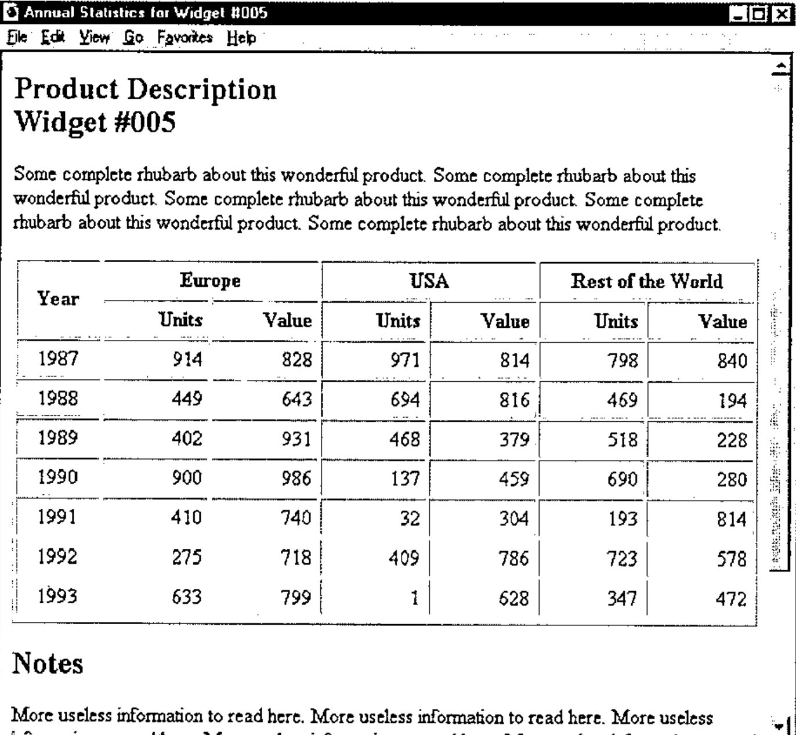

*by Adrian Smith*
{ .byline }

## Background to Part II

The code that forms much of this second article was begun on the plane on the way over to the Frankfurt GSE meeting in spring 1996. It was shown to a few more people at Orlando, and hastily tidied up, completed (and partially tested) as it became clear that several people really needed something like this. The workspace (for APL+Win) and equivalent namespace (for Dyalog 7.2/8) are available ‘as is’ on the Causeway web site (as *www.causeway.co.uk/html.zip*), and may be freely downloaded, improved and distributed. All the illustrative code is from the APL+Win version.

It assumes that you have already read (or have easy access to) the first article on this subject [1] which covers the basic structuring rules of HTML and runs through to the point where you can format a simple page of text with some subheadings and rules. If you want to revise the basics from another source, use [2] as your initial reference point, and if you want to extend what I have done to include some of the more modern tags (which will not work on old browsers) I suggest reading [3].

This article is almost entirely about tables, and all the examples should work in Netscape (from 1.22 upwards) and Explorer. As before, the message is to keep it simple, and to test your output on a wide variety of browsers (including some very old ones) before you go public. For an excellent example of a web site constructed almost entirely along these lines, point your browser (as they say) at *www.devplan.com/qkw/renvill* which currently has some 20 pages of mostly tabular data created directly from APL\*PLUS component files.

## Worked Example: Formatting a Simple Report

Let’s assume you have an APL system as the access point for a large component file of timeseries data. Rather than typing directly into an APL session, or filling in an AP124-based form, your users now submit a query to you from their web browser over the corporate network. This specifies a product, a range of years, and requests tabulation by region. You want to return a stream of text which Netscape will form as a subheading, the product description as a wrapped paragraph, and a table of sales data with two columns (units and value) for each year. Something like this in fact …



Note the product id in the window title, and repeated below the subheading. The table has various column alignments, and shows that it is possible to make tree-structured headings by spanning cells across more than one row or column. Apart from this, the presentation is entirely decided by the browser, which in this case is Netscape 1.22 – as good a generic model as you can find.

Here is the APL code which generated it:

```apl
     ∇ r←Vector;mat;sink
[1]    ⍝ HTML example for Vector 14.1
[2]     mat←(1986+⍳7),?7 6⍴1000
[3]    ⍝ Page title and product info ...
[4]     'Annual Statistics for Widget #005'htmUse''
[5]     'Subhead'htmPlace 'Product Description' 'Widget #005'
[6]     htmFlow ∊5⍴⊂'Some complete rhubarb about this wonderful product. '
[7]    ⍝ Tables are the real challenge ...
[8]     sink←htmtTitles 'Year' 'Europe' 'Units' 'Value' 'USA' 'Units' 'Value'
         'Rest of the World' 'Units' 'Value'
[9]     sink←htmtTDepth 0,9⍴ 0 1 1
[10]    sink←htmtTAlign  (⊂'Cen'),9⍴'Cen' 'right' 'right'
[11]    sink←htmtAlign 1 6/'centre' 'right'
[12]
[13]   ⍝ Use pixel widths for the columns
[14]    sink←htmtCellWidths 72,9⍴96
[15]    htmtList mat
[16]
[17]   ⍝ Now a rule off and that's all folks
[18]   'Subhead'htmPlace'Notes'
[19]   htmFlow ∊9⍴⊂'More useless information to read here. '
[20]   htmRule 2
[21]   htmPlace'⍝ Widgets International Inc' 'April 1996'
[22]
[23]   PG←htmClose
[24]   r←'''vector.htm'' htmPut PG  ⍝ to see it in Netscape'
[25]
     ∇
```

## Making Tables in HTML

Tables are quite a late runner in the HTML world, so Netscape and Microsoft have been falling over each other to add bells and whistles to the format. The result is that you have a surprisingly large amount of fine control over the output, even down to giving pixel widths for columns:

```apl
 sink←htmtTitles 'Year' 'Europe' 'Units' 'Value' 'USA' 'Units' 'Value' 'Rest
of the World' 'Units' 'Value'
 sink←htmtTDepth 0,9⍴ 0 1 1
 sink←htmtTAlign  (⊂'Cen'),9⍴'Cen' 'right' 'right'
 sink←htmtAlign  1 6/'centre' 'right'
⍝ Use pixel widths for the columns
 sink←htmtCellWidths 72,9⍴96
 htmtList mat
```

The column-title strategy is a straight lift from *NewLeaf* [4], and uses the same approach as Dyalog APL in setting up hierarchical grid titles. It may help to turn the table on its side and view the titles ‘File Manager’ style:

```text
Year
Europe
   |
   +------+Units
          +Value
USA
   |
   +------+Units       etc.
```

If you look at the *htmtInit* function, you will see that this sets a collection of table properties to sensible defaults. Each of the remaining table ‘methods’ called here makes some simple checks on its argument, and resets the property, returning the previous value:

```apl
    ∇ htmtInit
[1]   ⍝ Set all values to saved defaults for HTML table
[2]    htmt∆alignment←,0
[3]    htmt∆valignment←,1
[4]    htmt∆gridwalls←⍬
[5]    htmt∆gridlines←1
[6]    htmt∆coltitles←''
    ∇

    ∇ r←htmtTitles vtv
[1]   ⍝ Set column headings for table
[2]   ⍝ Argument may give just a vtv of title text or
[3]   ⍝ a nested vector of (multi-line title)( etc)
[4]   ⍝ typically ('Name' 'Age' ('Current' 'Salary'))
[5]   ⍝ Resets title-depth to 'flat'
[6]    r←htmt∆coltitles
[7]    →(' '∧.=,⍕vtv)↑Null
[8]    →(0∊⍴vtv)↑Encl ⋄ →(1<|≡vtv)↑Encl ⋄ vtv←⊂,vtv
[9]   Encl:htmt∆coltitles←vtv ⋄ htmt∆tdepth←(⍴vtv)⍴0 ⋄ htmt∆talign←(⍴vtv)⍴1 ⋄ →0
[10]  ⍝ Default case - set alignment to 'Centre' for all columns
[11]  Null:htmt∆coltitles←'' ⋄ htmt∆tdepth←⍬ ⋄ htmt∆talign←⍬
    ∇

    ∇ r←htmtTDepth nv
[1]   ⍝ Set title depth as tree level (from 0)
[2]   ⍝ Ensure this matches the number of title text elements!
[3]    r←htmt∆tdepth ⋄ nv←(⍴htmt∆coltitles)⍴nv
[4]    htmt∆tdepth←nv
    ∇

    ∇ r←htmtTAlign str
[1]   ⍝ Set/query title alignment in table (vector result)
[2]    r←('Left' 'Centre' 'Right')[1+htmt∆talign] ⋄ →(0∊⍴str)↑0
[3]    →(1<|≡str)↑Encl ⋄ str←⊂,str
[4]   ⍝ Ensure the alignments match the headings
[5]   Encl:str←,0 1 2 0 1 2 0[(⊂'LCRlcr')⍳¨↑¨str]
[6]    htmt∆talign←(⍴htmt∆coltitles)⍴str
    ∇

    ∇ r←htmtAlign str
[1]   ⍝ Set/query cell alignment in table (vector result)
[2]   ⍝ Decimal alignment not yet available in html
[3]    r←('Left' 'Centre' 'Right' 'Decimal')[1+⌊htmt∆alignment]
[4]    →(0∊⍴str)↑0
[5]
[6]    →(1<|≡str)↑⎕LC+1 ⋄ str←⊂,str
[7]    htmt∆alignment←,(0 1 2 3 0 1 2 3 0)[(⊂'LCRDlcrd')⍳¨↑¨str]
    ∇

    ∇ r←htmtCellWidths cells
[1]   ⍝ Define cells within table. Arg gives reqd widths in points.
[2]   ⍝ User can give ¯1 for any cell width which divides spare
[3]   ⍝ frame width equally after taking off the others.
[4]     r←htmt∆gridwalls ⋄ htmt∆gridwalls←,cells
    ∇
```

Again, some *NewLeaf* properties are left in, for example decimal alignment, in the hope that the HTML 3.0 proposals may eventually catch up with reality and get implemented. Now that we have defined all the required properties, it is time to explore the main workhorse which formats our data and adds all those table tags for us …

```text
      mat←(1986+⍳7),?7 6⍴1000
      htmtList mat
      htm_PG
<HTML><HEAD>
<Title>Annual Statistics for Widget #005</title>
</HEAD>
<BODY text="#004040" bgcolor="#FFFFFF">
<h2>Product Description<br>Widget #005</h2>

<TABLE border cellpadding=2>
<TH rowspan=2 align=center width=72>Year</TH>
<TH colspan=2 align=center>Europe</TH>
<TH colspan=2 align=center>USA</TH>
<TH colspan=2 align=center>Rest of the World</TH>
<TR>
<TH align=right width=96>Units</TH>
<TH align=right width=96>Value</TH>
<TH align=right width=96>Units</TH>
<TH align=right width=96>Value</TH>
<TH align=right width=96>Units</TH>
<TH align=right width=96>Value</TH>
<TR>
<TD align=center valign=middle>1987</TD>
<TD align=right valign=middle>19</TD>          .... and so on
```

… as you can see, this suddenly got a great deal harder. My feeling on basic HTML is that Notepad is one of the best editing tools you can find, and if you get serious then Kenn Nesbitt’s *WebEdit* is fine. Both these are simple text editors – you just type in the tags as you go along. However as soon as you hit tables, you need help, and what better tool to keep track of all that tedious tagging than APL!

Here is the code which did it …

```apl
    ∇ htmtList mat
[1]   ⍝ Dummy as Netscape wraps regardless
[2]    htmtSpread mat
    ∇

    ∇ htmtSpread mat;blk;walls;aln;dpl;cw;cc;cw;lcr;txt;htm;valn;tmb
[1]   ⍝ HTML table format of nested matrix. Simple vectors just get enclosed
[2]    →((1<|≡mat)∨2=⍴⍴mat)↑Shaped ⋄ mat←⊂,mat
[3]   Shaped:mat←(¯2↑1 1,⍴mat)⍴mat
[4]    htm_grid←htmt∆gridwalls
[5]   ⍝ Worry about frame width later (probably VGA say 450)
[6]    cw←(¯1↑⍴mat)↑htm_grid
[7]   ⍝ Repeat alignments for each column (no decimal support here)
[8]    aln←(¯1↑⍴mat)⍴htmt∆alignment ⋄ aln←2⌊⌊aln
[9]    valn←(¯1↑⍴mat)⍴htmt∆valignment
[10]   htm←'<P><TABLE'
[11]   :if 0≠↑htmt∆gridlines ⋄ htm←htm,' border cellpadding=4' ⋄ :end
[12]   :if 0∨.>htmt∆gridwalls ⋄ htm←htm,' width=100%' ⋄ :end
[13]   htm_cat htm,'>'
[14]  ⍝ Run headings for chosen columns
[15]   htm_titlegrid cw
[16]
[17]  ⍝ ============== ROWS ====================
[18]  NextRow:→(0∊⍴mat)↑Exit ⋄ blk←mat[1;]
[19]  ⍝ =========== COLUMNS =================
[20]   cc←1 ⋄ →(cc>¯1↑⍴mat)↑EndCols
[21]  NextCol:lcr←(1+cc⊃aln)⊃'' 'center' 'right'
[22]   tmb←(1+cc⊃valn)⊃'top' '' 'bottom'
[23]   :If 1<|≡cc⊃blk
[24]     txt←¯4↓↑,/(cc⊃blk),¨⊂'<BR>'
[25]    :Else
[26]     txt←,⍕cc⊃blk
[27]   :End
[28]  ⍝ Leave out attributes where defaults taken
[29]   txt←'<TD',((0<⍴lcr)/' align=',lcr),
        ((0<⍴tmb)/' valign=',tmb),'>',txt,'</TD>'
[30]   htm_cat txt
[31]   cc←cc+1 ⋄ →(cc≤¯1↑⍴mat)↑NextCol
[32]  EndCols:htm_cat '<TR>'
[33]
[34]   mat←1 0↓mat ⋄ →NextRow
[35]
[36]  ⍝ Closing paragraph tag required for Explorer, harmless in Netscape!
[37]  Exit:htm_cat '</TABLE></P>' ''
    ∇
```

Note that we can take out ‘align’ where it is ‘left’ and ‘valign’ where it is ‘middle’ - every byte counts when you are on the end of a slow modem line. Hopefully the code is simple enough to read with no further explanation, so onward to the titles:

```apl
    ∇ htm_titlegrid cw;grid;td;grid;ch;txt;cell;lab;lw;rs;cs;td;ln;ta;htm;seq;tr;fmt
[1]   ⍝ HTML Table headers if provided
[2]   ⍝ Will take a tree specification to make multi-layered headings
[3]    →(0∊⍴htmt∆coltitles)↑0
[4]
[5]   ⍝ Assume everything is at level zero if ∆tdepth not given
[6]    txt←htmt∆coltitles ⋄ td←htmt∆tdepth ⋄ ta←htmt∆talign ⋄ →(0∨.≠td)↑Deep
[7]   ⍝ Reshape titles to match cells in this grid (simple case)
[8]    txt←(⍴cw)⍴txt ⋄ td←(⍴txt)⍴0 ⋄ ta←(⍴txt)⍴ta ⋄ →Parse
[9]
[10]  ⍝ Count leaf nodes, and trim/extend to match <cw>
[11]  Deep:ln←1↓(0,td)≥td,0 ⋄ →((⍴cw)=+/ln)↑Parse
[12]   txt←txt,99⍴⊂↑⌽txt ⋄ td←td,99⍴¯1↑td ⋄ ta←ta,99⍴0 ⋄ ln←1↓(0,td)≥td,0
[13]   ln←ln∧(+\ln)≤⍴cw ⋄ txt←ln/txt ⋄ td←ln/td ⋄ ta←ln/ta
[14]
[15]  Parse:grid←htm_parsetree td
[16]  ⍝ Sort out -ve cell widths (must be % values)
[17]   :if 0∨.>cw
[18]     ((cw>0)/cw)←1 ⋄ cw←|cw
[19]     cw←(1⍕¨cw×100÷+/cw),¨'%'
[20]    :else
[21]     cw←⍕¨cw
[22]   :end
[23]
[24]  ⍝ Sort cells into Netscape-preferred order (row-col)
[25]   seq←⍋grid[;2]
[26]  ⍝ Detect row ends
[27]   tr←1↓(grid[seq;2],99)>0,grid[seq;2]
[28]
[29]  ⍝ Now fit the captions into the correct cells (alignment reqd)
[30]  :For cell :in seq
[31]    htm←'<TH'
[32]    rs←-/grid[cell;4 2] ⋄ :if rs>1 ⋄ htm←htm,' rowspan=',(⍕rs) ⋄ :end
[33]    cs←-/grid[cell;3 1] ⋄ :if cs>1 ⋄ htm←htm,' colspan=',(⍕cs) ⋄ :end
[34]    htm←htm,' align=',(1+cell⊃ta)⊃'left' 'center' 'right'
[35]   ⍝ leaf cells can set the column width up
[36]    :if cell⊃ln
[37]       htm←htm,' width=',cell⊃ln\cw
[38]    :end
[39]    :If 1<|≡cell⊃txt
[40]      fmt←¯4↓↑,/(cell⊃txt),¨⊂'<BR>'
[41]     :Else
[42]      fmt←,⍕cell⊃txt
[43]    :End
[44]    htm_cat htm,'>',fmt,'</TH>'
[45]   ⍝ If cell spans to last column we need a new title row!
[46]    :if tr[seq⍳cell]
[47]       htm_cat '<TR>'
[48]    :end
[49]  :End
    ∇
```

All I can say about the logic of this is that it seems to work! I have tried it on some very complex heading structures and Netscape always makes sense of the output.

The only little detail which still needs explaining is the conversion from the hierarchy of headings to the ‘rowspan’ and ‘colspan’ specification required by Netscape (try doing this by hand some day!). This was one of those apparently recursive problems (like the Hanoi Tower puzzle) where you are sure that there has to be a ‘straight-through’ boolean solution if only you can see it.

When I find myself faced by such a problem, I do one of two things: I take the dog for a very long walk; or I ask Duncan. Unfortunately we do not currently have a dog, and taking the wife for a long walk is nowhere near as effective, so I asked Duncan. He went very quiet for about 90 minutes and came up with this:

```apl
    ∇ bxs←htm_parsetree tree;depth;leaf;top;left;bottom;lm;slm;right;⎕IO
[1]   ⍝ Take a depth vector and return xyxy matrix to draw it as headings
[2]   ⍝ Test with: htm_parsetree 0 1 2 3 2 3 3 4 2 2 3 1 2 3 2 0 1 2 2 1 2 3
[3]   ⍝ NB This function contains no user-servicable components
[4]    tree←tree,⎕IO←0
[5]    depth←1+⌈/tree
[6]    leaf←tree≥1⌽tree
[7]    top←tree
[8]    left←¯1++\¯1⌽leaf
[9]    bottom←1⌽top
[10]   (leaf/bottom)←depth
[11]   lm←(-tree)⊖(⍴tree)/(depth,1)⍴depth↑1
[12]   slm←∨\lm
[13]   right←1+(,⍉lm)/,⍉(⍴slm)⍴(,slm)\(1⌽,slm)/,(⍴slm)⍴left
[14]   bxs←⍉0 ¯1↓⊃left top right bottom
    ∇

      htm_parsetree 0 0 1 1 0 1 1
```

```text
 0 0 1 2           0    1    2    3    4    5
 1 0 3 1        0  +----+----+----+----+----+
 1 1 2 2           |    |         |         |
 2 1 3 2        1  +    +----+----+----+----+
 3 0 5 1           |    |    |    |    |    |
 3 1 4 2        2  +----+----+----+----+----+
 4 1 5 2
```

… I added the comments. The result gives the (x,y) co-ordinates (on a zero-origin chessboard) of the corners of each heading cell. Now we can find the rowspan and colspan trivially, simply by subtracting adjacent elements (lines [32]–[33] of *htm_titlegrid*).

## Remaining Odds and Ends

Here are all the other functions which I haven’t found time to illustrate:

```apl
    ∇ alt htmBitmap pic
[1]   ⍝ Insert picture (.GIF) in line
[2]    :if 0=⎕nc 'alt' ⋄ alt←pic ⋄ :end
[3]    pic←pic,(~'.'∊ pic)/'.GIF'
[4]    htm_cat ''
    ∇

    ∇ alt htmBitmapLeft pic
[1]   ⍝ Insert picture (.GIF) at left margin
[2]   :if 0=⎕nc 'alt' ⋄ alt←pic ⋄ :end
[3]   pic←pic,(~'.'∊ pic)/'.GIF'
[4]   htm_cat ''
    ∇

    ∇ htmBump pts
[1]   ⍝ Add vertical space. Do what we can here!
[2]    htm_cat(4×⌈pts÷12)⍴'<br>'
    ∇

    ∇ sty htmFlow txt
[1]   ⍝ Simple text flow, taking account of style
[2]    htmUseDflt ⋄ htmStyle'Body'
[3]    →(0=⎕NC'sty')↑Deflt
[4]    htmStyle sty
[5]   ⍝ Ensure correct enclosure
[6]   Deflt:→(2=|≡txt)↑Encl ⋄ txt←⊂,txt
[7]   Encl:txt←(,/'<',¨htm∆tag,¨'>'),¨txt,¨,/(⊂'</'),¨(⌽htm∆tag),¨'>'
[8]    htm_cat txt
    ∇

    ∇ htmRule wt
[1]   ⍝ Rule across (for parameters see NetScape extensions)
[2]   ⍝ The default is a 2-pixel 'shaded' rule.
[3]    htm_cat '<HR noshade size=',(⍕wt),'>'
    ∇
```

That is as far as I have got to date. Numbered and bulleted lists would seem to be an obvious next step, then we should look at simple input forms. You can include input elements (such as text fields and drop lists) within tables, so it is interesting to contemplate an AP124 look-alike which might add a few years to the life-expectancy of a number of old mainframe systems, which would suddenly come out smelling strongly of Netscape.

## References

1. *HTML Basics for APLers*, Adrian Smith, Vector 13.4 page 84
2. *The HTML Sourcebook*, Ian S. Graham, John Wiley 1995
3. *Official HTML Publishing for Netscape*, Harris & Kidder, Netscape Press 1996
4. *NewLeaf User’s Manual*, Causeway Graphical Systems Ltd, 1996.
