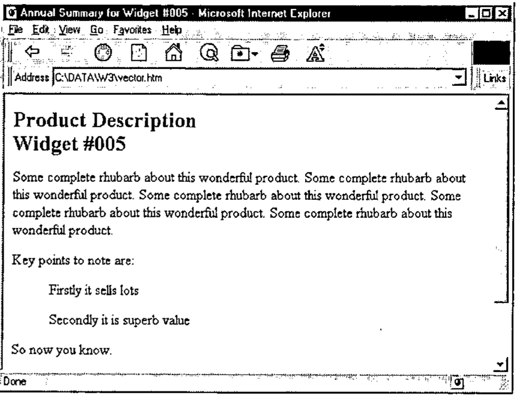
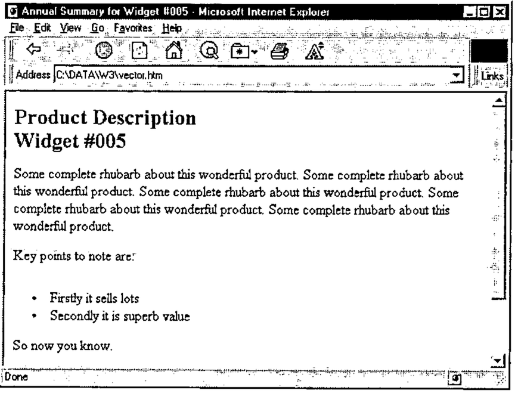
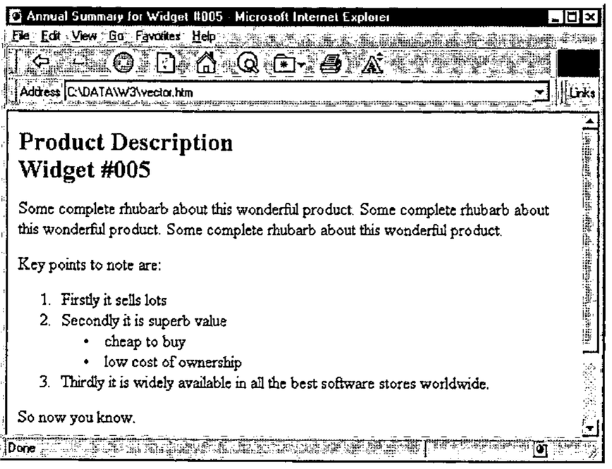
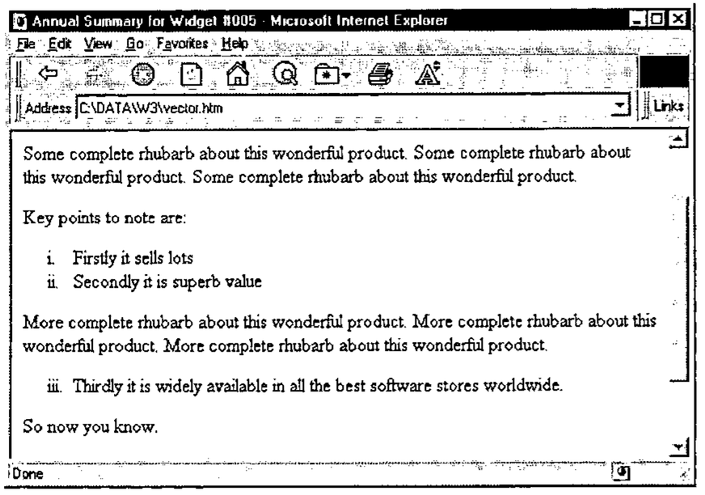

by Adrian Smith (causeway@compuserve.com)
{ .byline }

## Introduction

This is the third article in a series, which is rapidly becoming open-ended as the HTML ‘standard’ races ahead. Having covered tables in Vector 14.1, I would now like to back off to something rather simpler and walk through the various kinds of indented and bulleted list. You can check back to the basics in Vector 13.4 [3] and I should repeat that all the sample code is available on the Causeway web site (www.causeway.co.uk/html.zip) in both +Win and Dyalog formats. This code may be freely downloaded and used with no restrictions.

I have continued to work with the NewLeaf ‘object model’, although this allows a good deal more fine control over detailed appearance than can sensibly be emulated in standard HTML. Partly this is simply for my own benefit – it means I can use the same application code to target either paper or the Internet. In +Win, it is a matter of swapping in a different function file, in Dyalog I simply switch namespace. Mostly however, it is to give the design ideas a potential lifespan of more than the next few months. HTML is evolving itself rapidly out of existence, and looks likely to be replaced (in all but name) by the Microsoft Word document format, complete with style tables and all manner of fancy formatting. By using a conceptual model built around page, paragraph and text properties I stand a chance of building something that may still be useful 5 years ahead.

## Content vs Layout

As with all HTML design, you must start from the proposition that you are describing content; the browser is responsible for the layout. This is absolutely contrary to the behaviour of packages like Winword, where you control:

- the exact indent point, which is where the text will wrap to if you go on a little too long and your bullet point spills over more than one line in the way this one is doing.
- the negative offset of the bullet
- the character used for the bullet symbol

… in short you can make a complete mess just by pulling a few tab stops around on the ruler. In HTML you simply say that you want to begin an ‘unordered list’, an ‘ordered list’, and then you provide a sequence of ‘list items’ which the browser will arrange appropriately. You have almost no control (yet) over the indenting and paragraph spacing which will be used, nor do you get much control over the bullet character.

This is sometimes a little frustrating, and can be got around by extreme measures such as those used on the APL98 web site (choose ‘View, Source’ and gasp at the huge strings of non-breaking spaces – `&nbsp;` – which have been inserted to enforce the layout); in general it is almost always better to work *with* HTML than to fight it in this way! Your pages will be much smaller, will download proportionately faster, and will work reliably on all known browsers and platforms. If you use the ‘Save as HTML’ option from a standard word-processor, do have a hard look at what comes out of it before subjecting the world’s modems to several kilobytes of unnecessary junk.

## Simple Indents (Blockquote tag)

If you simply want to indent a section of text:

> This is probably a quote from somewhere else, or you might have other reasons to inset a section in this fashion.

… then the accepted approach is to surround the indented section with a pair of `<blockquote> … </blockquote>` tags. You can also cheat and use the ‘unordered list’ tags `<ul> … </ul>` but the effect is not quite the same (for example IE3 adds extra space before the list and reduces the inter-paragraph space within it) and in future you have no guarantee that all browsers will continue to show your page as you expect. Continuing the example from Vector 14.2, we could build …

```
<HTML><HEAD>
<Title>Annual Summary for Widget #005</title></HEAD>
<BODY bgcolor="#FFFFFF">

<h2>Product Description<br>Widget #005</h2>
<p>Some comple ... oduct. </p>
<p>Key points to note are:</p>
<blockquote>
  <p>Firstly it sells lots</p>
  <p>Secondly it is superb value</p>
</blockquote>
<p>So now you know.</p>
<HR noshade size=2>
<p>&#169; Widgets International Inc<br>April 1996</p>

</body></HTML>
```

Which turns out quite nicely as:



To continue with my strategy of mirroring the NewLeaf [2] functions …

```
    ∇ r←Indents;mat;sink
[1]    ⍝ HTML example for Vector 14.3
[2]    ⍝ Page title and product info ...
[3]     'Annual Summary for Widget #005'htmUse''
[4]     'Subhead'htmPlace 'Product Description' 'Widget #005'
[5]     htmFlow ∊5⍴⊂'Some complete rhubarb ... product. '
[6]
[7]    ⍝ Now some more detailed points ...
[8]     htmPlace 'Key points to note are:'
[9]     htmIndent 36
[10]    htmFlow 'Firstly it sells lots' 'Secondly it is superb value'
[11]    htmIndent 0
[12]    htmFlow 'So now you know.'
[13]    htmRule 2
[14]    htmPlace'© Widgets International Inc' 'April 1996'
[15]
[16]    PG←htmClose
[17]    r←'''vector.htm'' htmPut PG  ⍝ to see it'
[18]
    ∇
```

The actual indent values are immaterial – all that we can do is note if an indent has increased or decreased, and add or remove a level of ‘blockquoting’ as required. We can also check the bullet character, and begin to build an ‘unordered’ or ‘ordered’ list if bullets have been specified. Most browsers take note of a starting point for the numbers, so the syntax might as well include this possibility, and we can choose from a few basic types of numbering system. What we cannot do is decide whether we want *ii* or *iii.* or even *(iii)* for our Roman sequence – that is entirely up to the browser at the moment.

Clearly, the first function in need of attention is `htmFlow`, which must check the current indent level and patch in the necessary tags:

```
    ∇ r←sty htmFlow txt
[1]    ⍝ Simple text flow, taking account of style
[2]    ⍝ Nothing useful to return here
[3]     htmUseDflt
[4]     :if 2=⎕NC'sty' ⋄ htmStyle sty ⋄ :end
[5]    ⍝ Ensure correct enclosure
[6]     :if 2>|≡txt ⋄ txt←⊂,txt ⋄ :end
[7]     htm_makelist
[8]     txt←(,/'<',¨htm∆tag,¨'>'),¨txt,¨,/(⊂'</'),¨(⌽htm∆tag),¨'>'
[9]     htm_cat txt
[10]    :if 2=⎕NC'sty' ⋄ htmStyle 'Body' ⋄ :end
[11]    r←0 0⍴0
    ∇
```

This is almost unchanged from the code shown in Vector 13.4, but note that we now call `htm_makelist` before building the paragraph. This switches the style to ‘Indent’ for anything other than a plain list, which has the effect that the `htm∆tag` variable is set to `<li>` to get correct formatting of subsequent list items. It also adds appropriate tags for the other kinds of list, so before looking at the code in detail …

## Bulleted and Numbered Lists (ul and ol tags)

I think it is safe to assume that most browsers handle bulleted lists in the same way, and that numbered lists can be indexed 1,2,3 … or a,b,c … or i,ii,iii and so on. A few experiments suggest that you can reliably set the starting point of the sequence, but probably you should check this conjecture before you use it.

To turn our simple indent into a bulleted list:

```
htmBullet '•' ⍝ Simple bullet character (ASCII 0149)
htmFlow 'Firstly it sells lots' 'Secondly it is superb value'
```

… which should generate the HTML source …

```
<p>Key points to note are:</p>
<ul type=disc>
 <li>Firstly it sells lots</li>
 <li>Secondly it is superb value</li>
</ul>
<p>So now you know.</p>
```

(Note that I have hardwired the bullet to the ‘disc’ type for consistency. Also the spaces before the `<li>` tags are for human readability only, they are ignored by the browser as is all redundant white space.)

This is the point where you feel like picking up a can of spray paint and daubing “S\*\*\*f Bill Gates” all over the nearest plain concrete surface. Not only do Microsoft extend HTML in quite arbitrary ways, but they also fail to interpret the standard correctly! If you view this output in Netscape it looks fine; in IE3 it looks like:



Notice the extra white space above the first bullet! Pah!

The only way to prevent this is to strip the closing `</p>` from the end of the preceding paragraph, which adds a nasty inconsistency to the pattern of paired tags we have been using so far. On the whole I prefer to kludge this rather than to give up the overall symmetry of the *&lt;tag&gt;section&lt;/tag&gt;* pattern, so here is the code which is required:

```
    ∇ htm_strip tag
[1]    ⍝ Kludge - remove this tag if it is at the end
[2]     :if ((-1+⍴tag)↑htm_PG)≡tag,⎕TCNL
[3]        htm_PG←((-1+⍴tag)↓htm_PG),⎕TCNL
[4]     :end
    ∇

    ∇ htm_makelist;style;tag
[1]    ⍝ Process list tags, comparing with previous indent
[2]    ⍝ Effect is to step in and out of <ul> etc
[3]     :if htm_indents[1]>htm_last
[4]        :select style←↑1↑(htm_bullet∊' #@∧•')/htm_bullet
[5]         :case ' '
[6]           tag←'blockquote'
[7]         :case '•'
[8]           htm_strip '</p>' ⋄ tag←'ul' ⋄ htmStyle 'Indent'
[9]         :caselist '#@∧'
[10]          htm_strip '</p>' ⋄ htmStyle 'Indent'
[11]          tag←'1ai'['#@∧'⍳style]
[12]          tag←'ol type=',tag,' start=',⍕htm_bulletct
[13]       :end
[14]       htm_level←htm_level,⊂(¯1+tag⍳' ')↑tag
[15]       htm_cat '<',tag,'>'
[16]       htm_last←htm_indents[1] ⋄ :return
[17]    :end
[18]
[19]    :if (htm_last>0)∧htm_indents[1]=0  ⍝ Reset to normal text
[20]       htm_last←0 ⋄ htmStyle 'Body'
[21]       htm_cat (⊂'</'),¨(⌽htm_level),¨'>'
[22]       htm_level←0⍴htm_level
[23]       :return
[24]    :end
[25]
[26]    :if htm_indents[1]<htm_last
[27]       :if 0<⍴htm_level
[28]          htm_cat '</',(↑⌽htm_level),'>'
[29]       :end
[30]       htm_last←htm_indents[1] ⋄ htm_level←¯1↓htm_level
[31]       :if 0=⍴htm_level ⋄ htmStyle 'Body' ⋄ :end
[32]       :return
[33]    :end
    ∇
```

The bullets having been set/cleared by:

```
htmBullet arg;char;ct
⍝ Set bullet char for indented paras and optionally start counter
⍝ Allows strings such as '#.' to insert numeric counter
⍝ and '(@)' to count (a) this (b) that.
⍝ Note the kludge to deal with << htmBullet '@' 12 >>

 :if 2>|≡arg          ⍝ Simple
   :if 807=⎕DR arg    ⍝ Heterogeneous
     arg←(⊂,¯1↓arg),¯1↑arg
    :else
     arg←⊂arg
   :end
 :end
 (char ct)←2↑arg,1
 htm_bullet←⍕,char ⋄ htm_bulletct←ct
```

That really is all there is to it! Here is the test function again with some lines added to show the multi-level indenting in action:

```
⍝ Now some more detailed points ...
 htmPlace 'Key points to note are:'
 htmIndent 36 ⋄ htmBullet '#' ⍝ Counter required
 htmFlow 'Firstly it sells lots' 'Secondly it is superb value'
 htmIndent 48 ⋄ htmBullet '•' ⍝ Simple bullets
 htmFlow 'cheap to buy' 'low cost of ownership'
 htmIndent 36 ⍝ back down a level
 htmFlow 'Thirdly it is widely ... ftware stores worldwide.'
 htmIndent 0
 htmFlow 'So now you know.'
```

There is a particularly unpleasant kludge in the function to get around the possibility that someone may request `htmBullet '@' 12` which looks for all the world like a nested array, but is actually a two element *simple* vector. The more I encounter this sort of thing, the more I suspect that we must go back to VS APL and start all over again with a decent implementation of boxed arrays!

The equivalent Dyalog code fragment is …

```
 :If 2>|≡arg          ⍝ Simple
   :If 326=⎕DR arg    ⍝ Heterogeneous
```

… which is interesting in that here the result from `⎕DR` does not distinguish the heterogeneous from the nested case.

… and here is the final result:



## Some Other Settings

As you can see from the code, this will also accept `htmBullet '@.'` to set an alphabetic sequence, and `htmBullet '(∧)'` for roman numbering. You can preset the counter with an additional parameter, such as `htmBullet '@' 3`, for example to resume an interrupted list:

```
htmIndent 36 ⋄ htmBullet '(∧)' ⍝ Roman counter
htmFlow 'Firstly it sells lots' 'Secondly it is superb value'
htmIndent 0
htmFlow ∊3⍴⊂'More complete rhubarb about this wonderful product. '
htmIndent 36 ⋄ htmBullet '(∧)' 3 ⍝ Roman counter from 3
htmFlow 'Thirdly it is widely ... ftware stores worldwide.'
```

… although the Roman sequence looks pretty strange without the enclosing parentheses.

Anyway, it works as well as could be expected …



## Coming Soon

The next article in the set will cover simple data-entry forms, in particular it will show you how to convert from a standard Causeway/AP124 form definition to something that shows up nicely in your browser, preserving as much of the layout as is reasonable. If I get around to it, it will also have the code to parse the resulting ASCII string which arrives over email when some hopeful user fills in your form and hits `<Submit>` to mail the request to you.

## References

1. *The HTML Sourcebook*, Ian S. Graham, John Wiley 1995
2. *NewLeaf User’s Manual*, Causeway Graphical Systems Ltd, 1996
3. *HTML Basics for APL+Win*, Vector 13.4 page 84
