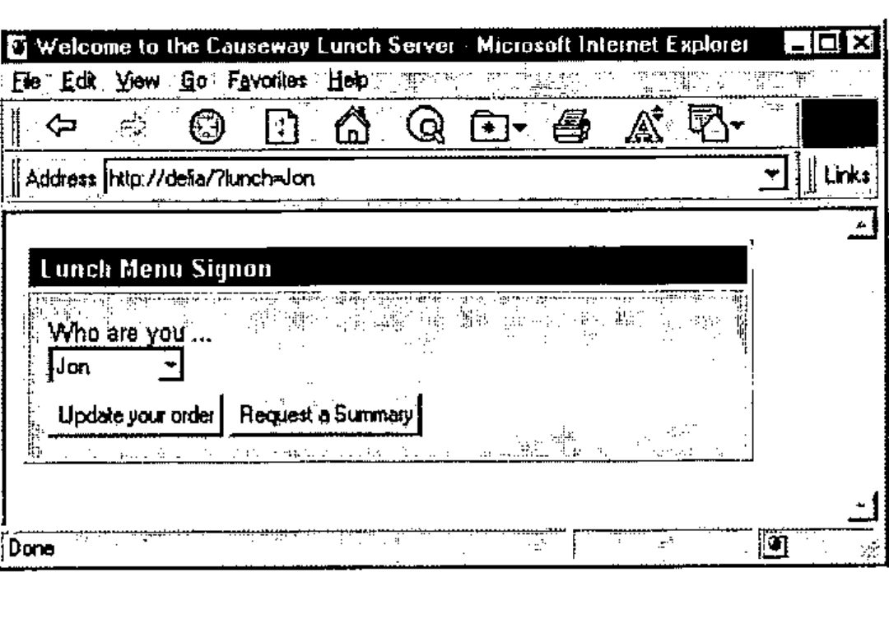
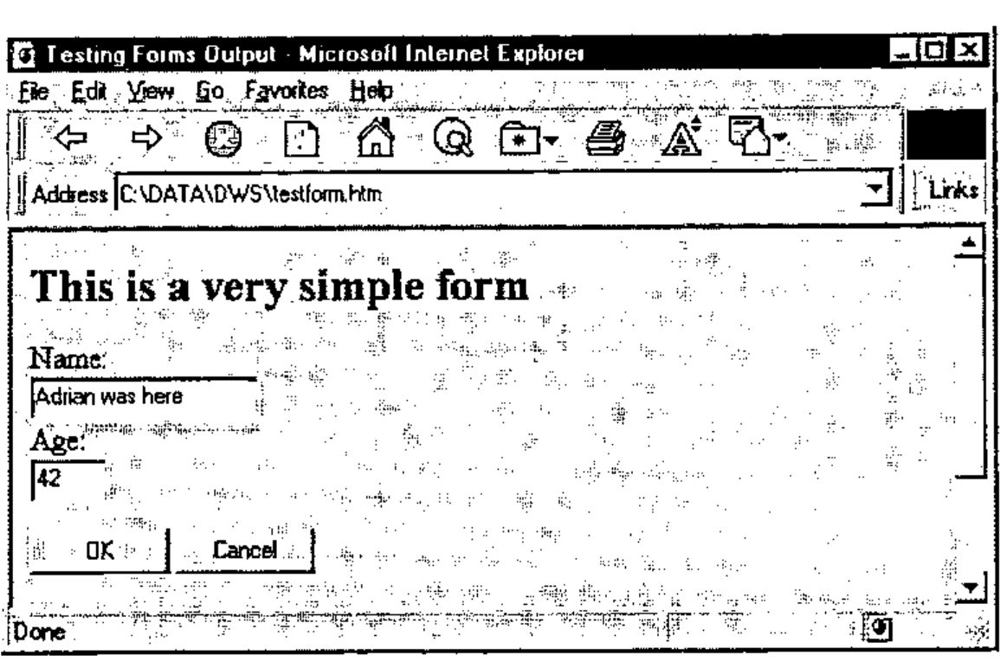
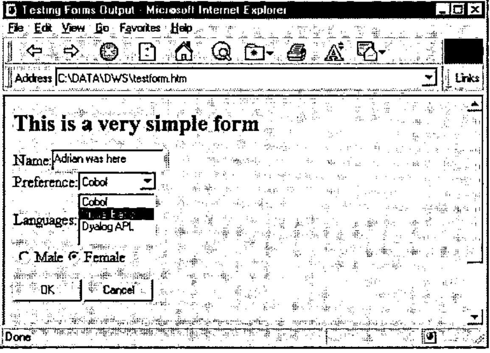
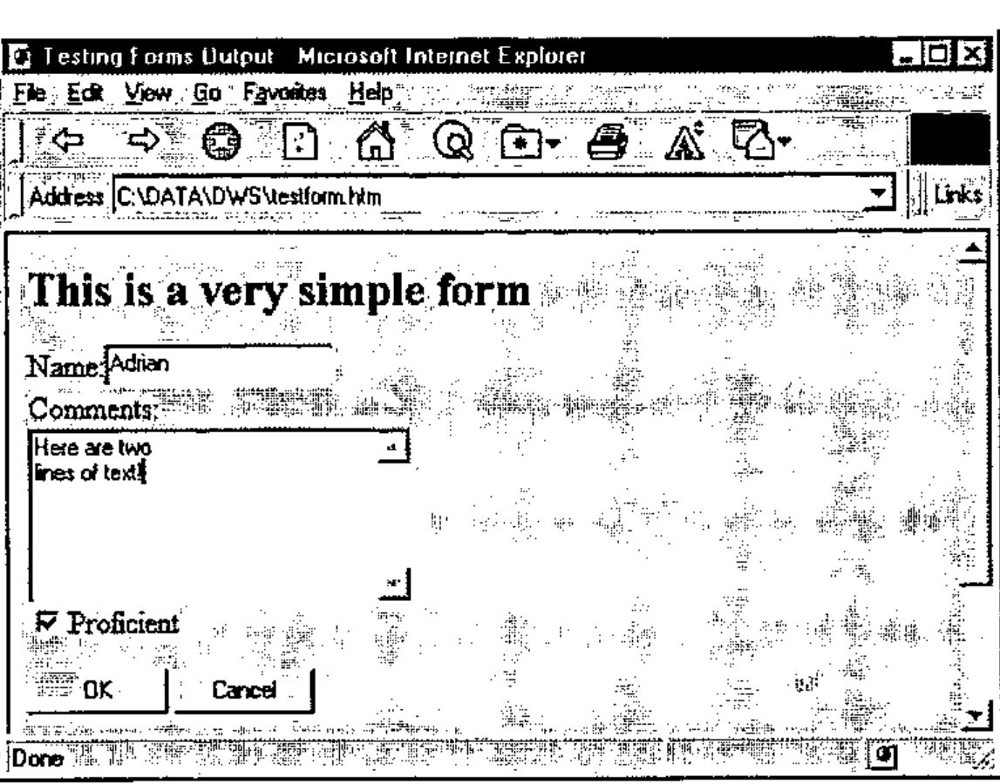
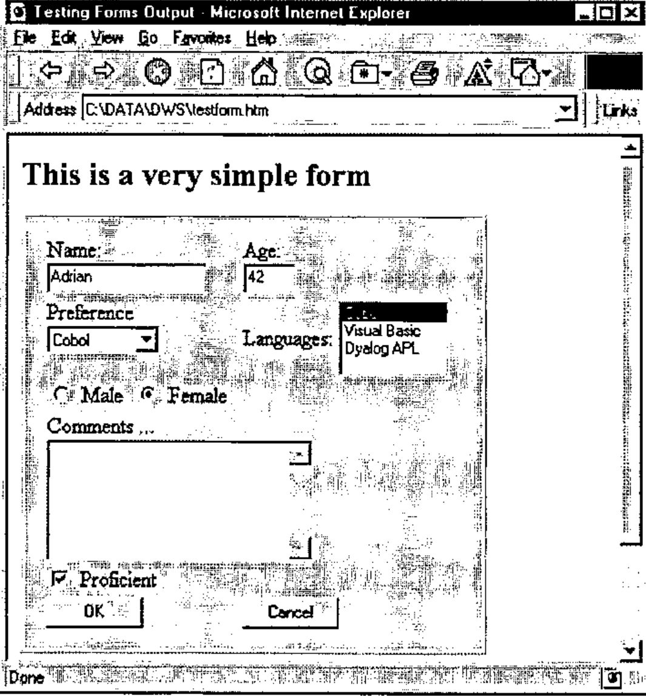

*by Adrian Smith*
{ .byline }

## Introduction

This is the fourth article in our open-ended series on HTML. It covers the HTML ‘Form’ tags, but you will quickly see that these are only the very beginning of what you need to know in order to begin constructing an interactive net-based application. Clearly, there is little point in generating an input document if you have no idea what to do with it when the user presses ‘Submit’, so I will try to cover some of the basics of constructing a useful Web-server as part of the necessary background to generating effective forms. Part (V) of the series will focus in more detail on the server side of the equation, and will show how to put some decent application code behind the simple forms developed here.

The first thing to appreciate is how incredibly primitive this all is! APLers who learned their trade on 10cps ‘2741’ terminals are way ahead of AP124 programmers, and quite out of sight of serious Windows hacks. You *can* write quite effective applications with this stuff, but turn your brain back a good 20 years before you start.

As before, all the sample code and the demo application are available on the Causeway web site (www.causeway.co.uk/html.zip). The Web-server is currently Dyalog only (adapted from WWW.DWS as supplied with Dyalog APL) but a comparable +Win workspace will be around in time for the next issue of *Vector*.

## Basic Principles of Application Design

To write a Web-server in Dyalog APL you need an elementary knowledge of TCP/IP (gleaned from reading their manual) and a function to read native files. To write a Web-server that does something useful, you need to be very aware of the utter simplicity of the HTML protocol and to employ some rather strange tricks to work around it. The fundamental point is as follows:

- each interaction between client and server knows nothing about anything that happened before. Every evening when you come home from work you meet afresh the attractive lady who lives in your home. You introduce yourselves, negotiate who will cook supper tonight, and so on. The following day you do it all over again, from the beginning. Sound familiar?

Consequently …

- any ‘session-based’ information must be carried with the HTML messages that go to and fro. If you want to remember your loved one’s name, she must write it on a scrap of paper and give it to you in the morning. She might also note that it’s your turn to do the dishes tonight. When you come home in the evening you can refer to this (assuming you carried it with you) to resume the relationship where you left it.

… which makes absolute sense if you are carrying on with several wives and have no idea which one you will go home to tonight! All you need to do is pick up the right scrap of paper before you walk out of the office.

As usual, let’s begin with a real example and then build it up in easy stages.

## The Causeway Lunch Server

One of the best things about working in Malton is Mr Skinner the Butcher, who does the best belly-pork sandwiches in the world, bar none. Normally we all wander across the road together, but occasionally someone is on the phone, or just buried on a really horrible line of VBA. When this happens you need to get his lunch order and remember it for at least 2 minutes - a tough challenge for even the best APLer.

Why not run a simple intranet application that sits on the server taking lunch orders? The default should be ‘what I had yesterday’. Come 1.00 anyone can check the summary and go and get the sandwiches! It could look a bit like this:



The string ‘lunch=Jon’ was sent to the HTTP server on network address ‘delia’ which chose the correct name from the list of known users and offered a signup screen. I suppose we might one day institute some security …

Assuming Jon presses ‘Update your order’ he should then see a screen like this …


It will be pre-filled with his usual order, ready to be modified and returned to the server. At this point, you should begin to smell a small rat … nowhere on the form is Jon’s name mentioned! When he presses ‘Update’ all that the server sees is a set of token-value pairs like:

```text
SANDWICH = Double Egg
BREAD = Brown
SPECIAL = Salt and pepper
SUBMIT = Update
```

… so there is no way it can know who submitted the order. (We will find out how those tokens were assigned in the next few pages.) You might think that you can rely on the fact that it is Jon who just signed on, but of course this whole process is completely asynchronous, and Duncan and Marc might well have requested their orders in the meantime. You have no way of knowing what order the requests will return in, or if they will return at all! The is where the first ‘dirty trick’ of HTML application development comes in - we need to add a ‘hidden field’ to the form to record the user’s name so that it is returned to us when he submits it for update. The form looks just the same, but now we get back a crucial extra token which tells us who sent it:

```text
WHO = Adrian
SANDWICH = Double Egg
BREAD = Brown
SPECIAL = Salt and pepper
SUBMIT = Update
```

This way we send the user-name out to the browser in the hidden field, and it gets returned to the server as one of the token-value pairs. Of course you can have as many of these fields as you need, and in a real system you would probably generate a meaningless (unique) value for the ‘WHO’ token afresh at each login, rather than passing this kind of data backwards and forwards for all to see.

So now you can begin to see how it all works. It’s time to go back to basics and introduce the raw HTML tags you will need to build these input forms.

## The HTML Form Controls

In HTML, a form is simply defined as all the controls enclosed between …

```text
<form action="your url here">

</form>
```

… which does allow you the freedom to have several ‘forms’ on the same HTML page. This can be very useful if you want to be selective about the fields you send down the line, but for the moment I will assume we are building a simple one-form page.

The `<form>` tag itself always includes an ‘action=’ element. This gives the target internet address and port number (80 is usual) where the completed data should be sent, for example `"http://localhost:80/"`. The special node-name "localhost" always translates as 127.0.0.1 which is hard-wired into TCP/IP as a ‘loopback’ to your own machine. Very handy when you are testing this stuff on a portable in the train! If you want to add other name-address mappings, just edit the file `\windows\hosts` and add all the entries you need. There is a sample called `\windows\hosts.sam` to get you started.

One small aside here - in IE3 you have the option of connecting to the internet through a ‘proxy server’ (often called a firewall). This will be the normal setup in any large organisation. For some reason IE3 seems unaware that the loopback is a local address, so you should find the ‘Options, Connections, Settings’ screen and make sure it looks like this:


… as nothing will work otherwise.

Between the `<form></form>` tags you add any number of data fields, which all have the generic form:

```text
<input type=ty name="NAME" value="Hello">
```

… but as you would expect there are lots of minor inconsistencies which you just have to learn to live with. However you can now see how those token-value pairs were generated - when you submit a completed form (usually by pressing a button labelled ‘Submit’) you get back a long string of name=value pairs, corresponding to all the fields with non-empty values which occur on that form.

*See any competent HTML book (such as [1] or an updated version of it) for the full list of valid input fields and attributes. As usual, stick with HTML 2 tags unless you are willing to be very browser-specific.*

Here is a very simple example of a fully-working HTML stream:

```text
<HTML><HEAD>
<Title>Testing Forms Output</title>
</HEAD>
<BODY>
<h2>
This is a very simple form
</h2>
<form action="http://localhost:80/">
Name:<br>
<input type=text size=20 name="NAME" value="Adrian"><br>
Age:<br>
<input type=text size=4 name="AGE" value=42><br><br>
<input type=submit name="EN" value=" OK ">
<input type=submit name="QT" value=" Cancel ">
</form>

</body></HTML>
```

… and here is how it looks in the browser:



So far, control over the field layout is limited to some `<br>` tags to get each element on a new line and the ‘size’ attribute which is the field width in characters. As you can see, the result is quite acceptable, and it is easy for our server to handle the results. For the moment, I will ignore the technical stuff, and assume that submitted text arrives by magic. If you want to know how to set up a listening socket, just read the documentation that came with your APL system!

When you press `<OK>` the browser will connect to the address in the action field, which just happens to be an APL socket object, and send it a text string such as:

```text
http://localhost/?NAME=Adrian+was+here&AGE=42&EN=+OK+
```

… which you can parse out into a nice 2-column matrix of token-value pairs quite straightforwardly:

```text
NAME = Adrian was here
AGE = 42
EN = OK
```

Note that giving these `<input>` tags unique, easily recognised, names is essential - I have used upper-case throughout this article just to make them stand out a little.

Things get a little trickier when the text involves ‘special’ characters, for example:

```text
http://localhost/?NAME=M%FCller+was+here%21&AGE=42&EN=+OK+
```

It is not just the hi-bit characters that get hexed - because the syntax uses ‘+’ and ‘&’ and several others it has to protect these too, so the string can get quite strange. Here is my function to reverse the mappings:

```apl
txt←BackFlip mme;pc;nn;ch
⍝ Reverse standard MIME-encoding
⍝ First switch the '+'->' ' as real '+' signs are hexed!
 ((mme='+')/mme)←' '
⍝ Preserve '?=&' from the original string as something improbable
 ((mme∊'?=&')/mme)←'§' ⍝ Section sign
 pc←('%'=mme)/⍳⍴mme
 :If 0<⍴pc
   nn←mme[pc∘.+1 2] ⍝ hex digits (upper case)
   ch←Ascii[1+16 16⊥¯1+⍉'0123456789ABCDEF'⍳nn]
   mme[pc]←ch
   txt←mme[(⍳⍴mme)~,pc∘.+1 2]
  :Else
   txt←mme
 :End

      BackFlip 'NAME=M%FCller+was+here%21&AGE=42&EN=+OK+'
NAME§Müller was here!§AGE§42§EN§ OK
```

Now we simply partition on the `'§'` and we have our tokens and values. Of course everything is still character - so `⎕VFI` comes back into the picture and you will have to decide what to do about invalid entries. Unfortunately there is no field type of ‘number’ or ‘date’ yet available, so we are back to the pre-Windows approach of checking the input in our APL code.

The next set of field types to look at are the ‘multiple choice’ elements - in this case we can use a basic list box (single or multiple selection) or a drop-down list (single selection only). We also have the possibility of groups of radio buttons. Here is our basic form again with these elements added:

```text
<form action="http://localhost:80/">
Name:<input type=text size=20 name="NAME" value="Adrian"><br>
Preference:<select name="JOB">
 <option selected>Cobol</option>
 <option>Visual Basic</option>
 <option>Dyalog APL</option>
</select><br>
Languages:<select name="LANG" multiple>
 <option>Cobol</option>
 <option selected>Visual Basic</option>
 <option>Dyalog APL</option>
</select><br>
<input type=radio name="SEX" value="male">Male
<input type=radio name="SEX" value="female" checked>Female<br><br>
<input type=submit name="EN" value=" OK ">
<input type=submit name="QT" value=" Cancel ">
</form>
```

… and here is what IE3 makes of it:



As you can see, the result is really ugly, with a hotch-potch of colliding fields and no control at all over the layout.

Of course it still works OK, and the drop-downs at least give you some up-front data checking, so you can rely on legal values here:

```text
NAME=Adrian+was+here&JOB=Cobol&LANG=Visual+Basic&SEX=female&EN=+OK+
```

Finally, there is the ‘notepad’ field for free-form text input, the ‘hidden’ field which simply serves to pass name-value pairs out to the form so that they come back with the query, and a simple check box completes the set:

```text
<form action="http://localhost:80/">
Name:<input type=text size=20 name="NAME" value="Adrian"><br>
Comments:<br>
<textarea name="COMMENTS" cols=40 rows=5 wrap=virtual></textarea><br>
<input type=hidden name="HI" value="one">
<input type=checkbox name="PROFICIENT" checked>Proficient<br><br>
<input type=submit name="EN" value=" OK ">
<input type=submit name="QT" value=" Cancel ">
</form>
```

This one looks more reasonable:



```text
NAME=Adrian&COMMENTS=Here+are+two%0D%0Alines+of+text%21&
HI=one&PROFICIENT=on&EN=+OK+
```

That pretty well wraps it up. There is a ‘password’ field, but anything you type gets shown in the browser window as soon as you submit the form! It all seems quite primitive, but there are still a few sneaky tricks left over which will help us make the layout look a lot more like a ‘real’ Windows dialogue. What we need is *tables* – read on!

## Designing a Simple Form

You may remember from the second article in the set [2] that tables are one of the few HTML structures which give you any detailed control over layout. You can set cell widths, and you can span cells across more than one row or column. You might begin to get really wild ideas about defining a table with lots of small square cells and using *rowspan* and *colspan* to get the layout exactly how you want. Forget it! I tried some experiments here and my conclusions are:

- *colspan* is absolutely fine in all browsers from Netscape 1.2 upwards
- *rowspan* is only reliable for the leftmost column of a table. It is clearly intended for ‘stub’ row titles and the implementers never considered the possibility of spanned rows deep in the body of the table. It usually fails at the fourth or fifth occurrence and the rest of the table disintegrates.

So - we can span columns but things just have to take their chance vertically. Sounds bad, but actually you can get a surprisingly good effect with just this simple enhancement. Here is that sample form again, this time embedded within a table:

```text
<table border cellpadding=12>
<td bgcolor="#C0C0C0"><table>
<form action="http://localhost:80/">
<td width=120>Name:<br>
<input type=text size=20 name="NAME" value="Adrian"></td>
<td width=48>Age:<br>
<input type=text size=4 name="AGE" value=42></td><tr>
<td valign=top>Preference<br>
<select name="JOB">
 <option selected>Cobol</option>
 <option>Visual Basic</option>
 <option>Dyalog APL</option>
</select></td>
<td valign=top>Languages:
<select name="LANG" multiple>
 <option>Cobol</option>
 <option>Visual Basic</option>
 <option>Dyalog APL</option>
</select></td><tr>
<td><input type=radio name="SEX" value="male">&#160;Male&#160;&#160;<input
type=radio name="SEX" value="female"
checked>&#160;Female&#160;&#160;</td><tr>
<td colspan=2>Comments ...<br>
<textarea name="comments" cols=40 rows=5 wrap=virtual></textarea></td><tr>
<td><input type=checkbox name="proficient" checked>&#160;Proficient</td><tr>
<td><input type=submit name="EN" value="  OK  "></td>
<td><input type=submit name="QT" value=" Cancel "></td><tr>
</form>
</td></table>
</table>
```

Which now looks like this:



Hopefully, you can see how we used table cells to get the captioned fields lined up, and to get several fields on the same line. You can also see how we used *colspan* to get the notepad to occupy a reasonable width. The tendency of table cells to increase vertically to accommodate their content did the rest. Finally, you can see how the whole form is wrapped in an outer table (with just one cell) to get a nice grey background and a suitable border. Incidentally, use of words like *SEX* may be dangerous - you will probably get your page blacklisted!

## HTTP ‘Methods’ - GET or POST?

So far, all the forms have used the default ‘GET’ method which submits all the fields and their content in a query string, which you see displayed in the browser window. This has the advantage that astute users can bookmark the entire string and bypass your initial forms completely! It also is less likely to alert the browser to the dangers of transmitting data over the internet (thus triggering annoying warnings). However you might also consider:

```text
<form action="http://localhost:80/" method="POST">
```

… which shows nothing in the browser window (password fields are more useful here) and is unrestricted on the amount of data transmitted (some browsers cut off the ‘GET’ string at 256 characters). However it is a little trickier to parse - the sample Dyalog server makes no attempt to deal with these - so if you do use my server code from the web site, check it out carefully and test it with strings over 8K in length, which is where TCP/IP typically chops messages into packets.

## Coming Soon …

The next article in the set will cover …

- Converting a *CausewayPro* Form Definition to an HTML Form
- Constructing a useful web server from the samples provided with the APL interpreters
- Parsing and processing the user’s request string, using either GET or POST
- Using images in forms to provide simple graphical ‘drill-down’ capability

If you want to read ahead, HTML.ZIP on the causeway web site has all the examples from this Vector and many of those from the next one.

## References

1. *The HTML Sourcebook*, Ian S. Graham, John Wiley 1995
2. *HTML Basics for APLers - Tables*, Vector 14.1 page 83.
