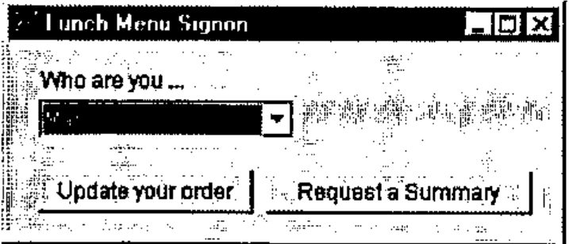
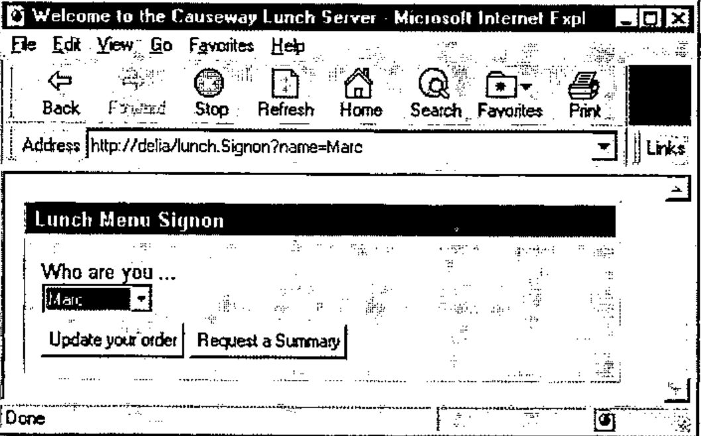
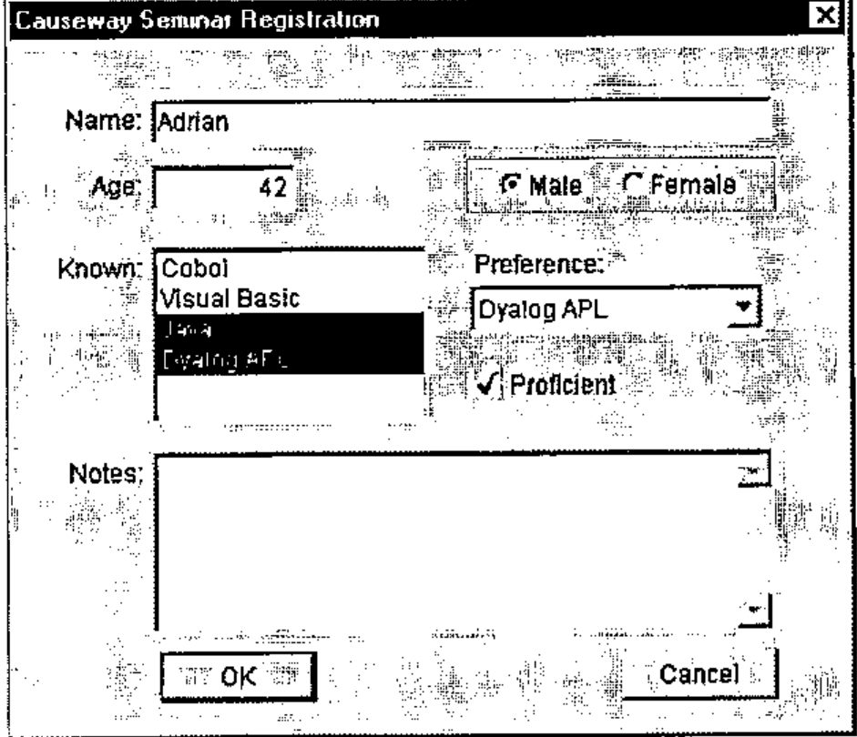
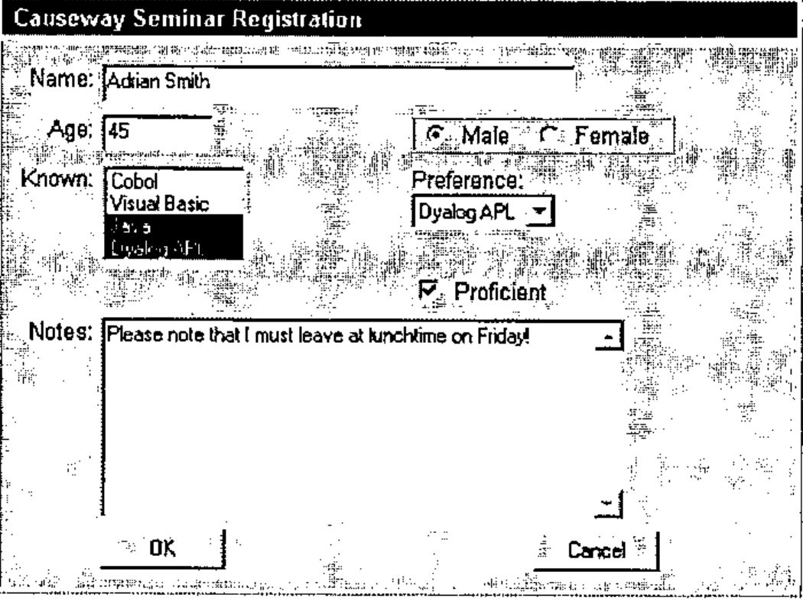

*by Adrian Smith*
{ .byline }

## Introduction

This is the fifth article in our open-ended series on HTML, and continues the themes developed in *Vector* 14.4. By the time you read this, Dyadic will have completed the development of their multi-threading interpreter, which raises a whole new set of design issues. For the moment I am going to assume that you are unlikely to accept any requests which take longer than a few tenths of a second to process, so multi-threading is not a requirement. The other subject which was promised in *Vector* 14.4 was graphical drill-down; this obviously works best with an interpreter which can generate GIF files directly, so this will be deferred until Dyalog 8.2 is available on general release in Q4 of this year.

I will start with a summary of the basic workspace organisation, then cover the functions which convert a simple Causeway-style form definition to its HTML equivalent, and finally run through the code you need in your Web server to make sense of the HTTP request which comes back to your application.

## Workspace Organisation

The basic structure is extremely simple, possibly too simple. I have a namespace called *sws* (for Simple Web Server) which fields HTTP requests. If the user types something in the header line which can be interpreted as a rooted, fully qualified function name, then this gets executed. For example if you run up the server (from now on treat the name ‘delia’ as ‘your server address’) and type:

```text
//delia/lunch.Signon?name=Adrian
```

… into the query field of your browser, the server will attempt to run:

```apl
#.lunch.Signon
```

… passing the name of the current TCP/IP socket on the left (most such functions will ignore this) and on the right a two-column matrix of token-value pairs:

```text
┌────┬──────┐
│name│Adrian│
└────┴──────┘
```

```apl
    ∇ htm←{sock}Signon data;who
[1]   ⍝ Return lunch signon form to browser
[2]   ⍝ data is a 2-column matrix of token-value pairs
[3]    'Welcome to the Causeway Lunch Server'#.html.Use''
[4]   ⍝ The data may give us a clue to the user here!
[5]    who←∆who⍳⊂(data[;1]⍳⊂'name')⊃data[;2],⊂'unknown'
[6]   ⍝ Uses CPro form definition (refers to ∆who and who)
[7]    #.html.Make lunch1
[8]    htm←#.html.Close
    ∇
```

This starts by calling *html.Use* to initialise a basic HTML response, then looks up the passed name from the argument and sets a local variable *who* to be the index into the dropdown list of names. The result from the function must always be a valid HTML stream, for example

```apl
      HelloWorld ''
<html><body>Hello, world<hr></body></html>

    ∇ htm←{sock}HelloWorld dummy
[1]   ⍝ Just to be sure it works
[2]    htm←Frame'Hello, world'
    ∇

    ∇ htm←Frame txt
[1]   ⍝ Construct minimal HTML from simple text
[2]    htm←'<html><body>',txt,'<hr></body></html>'
    ∇
```

This just allows you to test the socket by typing `//delia/HelloWorld` into the browser and getting a simple response from the server. Of course there are many other ways for the user to submit a request, the most obvious being a click on the ‘Submit’ button of a form. The server must also have a simple way of choosing the appropriate function to be run (you could have more than one button, or even a clickable image) depending on how the form was submitted. In the long term, I think I should add a ‘target function’ property to the standard button, but for the moment I just cheated in the usual way by overloading an existing property. Experimental code and all that … so please don’t rely on this not changing!

I now want to spend a few pages working through *html.Make*, but first a very brief summary of the structure of the form definition, as you don’t actually need Causeway to do any of this stuff. All you need is an APL interpreter that lets you enter matrices - hardly a heavy requirement!

## Converting a Causeway-style Form to HTML

The basic structure of a *CausewayPro* form is a 5-column rank-2 matrix:

> Col-1 is the object type
>
> Col-2 is the caption (all objects have captions)
>
> Cols 3 and 4 are the position and size in pixels. Negative positions are measured from the opposite edge of the parent, negative sizes give the total border remaining around the object in that dimension.
>
> Col-5 is itself a 2-column matrix of property-value pairs. All objects have a ‘Group’ property, other properties vary depending on the object type. Properties known as ‘Runtime’ or ‘User’ have APL expressions as their values; these are executed when the form is made to populate the object with data. For example an edit field has a ‘Text’ property, a droplist has ‘Items’ and ‘Index’ which take expressions which should evaluate to a vector of text vectors and an integer respectively.

For example, the lunch-menu signup sheet (*Vettore* page 92) looks like:

```apl
      ∆who
Jon  Adrian  Duncan  Marc  JoHo
      who←4
      #.CPro.Make lunch1
```



The one small enhancement I have made to the Causeway designer is an extra check-box in the preferences field to restrict the object list to those fields which can easily be made in HTML. Currently this allows buttons, edit fields, drop-down lists and check-box and radio-groups. I have started experimenting with the numeric matrix, but this needs a lot more work to be usable in an HTML form.

Otherwise, the form is completely standard, but notice the way I have stolen the ‘Groups’ property to name the associated function on the action buttons. It is also used to generate the HTML field name of the droplist, which is returned to the ‘Update’ function as one of the tokens in the token-value matrix.

The form definition is simply:

```text
      ⎕se.Disp lunch1
┌──┬─────────────────┬──────┬───────┬──────────────────────────┐
│FM│Lunch Menu Signon│341 84│110 307│┌────┬────┐               │
│  │                 │      │       ││    │    │               │
│  │                 │      │       │└────┴────┘               │
├──┼─────────────────┼──────┼───────┼──────────────────────────┤
│SL│Who are you ...  │32 16 │23 ¯163│┌──────┬─────────────────┐│
│  │                 │      │       ││Groups│{WHO}            ││
│  │                 │      │       │├──────┼─────────────────┤│
│  │                 │      │       ││Index │┌──────────┬───┐ ││
│  │                 │      │       ││      ││Expression│who│ ││
│  │                 │      │       ││      │└──────────┴───┘ ││
│  │                 │      │       │├──────┼─────────────────┤│
│  │                 │      │       ││Items │┌──────────┬────┐││
│  │                 │      │       ││      ││Expression│∆who│││
│  │                 │      │       ││      │└──────────┴────┘││
│  │                 │      │       │└──────┴─────────────────┘│
├──┼─────────────────┼──────┼───────┼──────────────────────────┤
│AC│Update your order│72 16 │24 120 │┌──────┬──────────────┐   │
│  │                 │      │       ││Groups│{lunch.Update}│   │
│  │                 │      │       │└──────┴──────────────┘   │
├──┼─────────────────┼──────┼───────┼──────────────────────────┤
│AC│Request a Summary│72 ¯15│24 148 │┌──────┬───────────────┐  │
│  │                 │      │       ││Groups│{lunch.Summary}│  │
│  │                 │      │       │└──────┴───────────────┘  │
└──┴─────────────────┴──────┴───────┴──────────────────────────┘
```

Amazingly enough, it can also be represented as:

```text
<table border cellpadding=2>
<td bgcolor="#000080"><font size=2 face=Arial color="#FFFFFF"><b>&#160;Lunch
Menu Signon</b></td><tr>
<td bgcolor="#C0C0C0">
<table cellpadding=4><td><table>
<form METHOD=POST ACTION="http://127.0.0.1:80/">
<th width=26><em></th><th width=26><em></th><th width=26><em></th><th
width=26><em></th><th width=26><em></th><th width=26><em></th><th
width=26><em></th><th width=26><em></th><th width=26><em></th><th
width=26><em></th><th width=26><em></th><th width=26><em></th>
<tr>
<td valign=top colspan=6><font size=2 face=Arial color="#000080">Who are you
...<br>
<select name=WHO>
 <option>Jon</option>
 <option>Adrian</option>
 <option>Duncan</option>
 <option selected>Marc</option>
 <option>JoHo</option>
</select></td>
<tr>
<td><em></td><tr>
<td colspan=3><font size=2 face=Arial><input type=submit name="lunch.Update"
value="Update your order"></td>
<td colspan=3><font size=2 face=Arial><input type=submit
name="lunch.Summary" value="Request a Summary"></td>
</form>
</td></table></td></table>
</table>
```

… which the browser happily shows as:



Which is a tolerable facsimile of the original. As I noted in the previous article, there are limits to the degree of positional control you have, but for simple data-entry forms I think you can generate remarkably good designs with some simple tricks and cunning use of nested tables. Let’s work slowly through *html.Make* explaining the approach as we go.

```apl
    ∇ Make form;defn;....
[1]   ⍝ Turn CPro 'dbx' into HTML form (approximately)
[2]   ⍝ Executes runtime expressions at build time (unlike Causeway)
[3]    UseDflt ⋄ home←⊃⎕NSI ⋄ nc←12 ⋄ defn←form[1;]
[4]    ttl←2⊃defn ⋄ fmsize←4⊃defn ⋄ host←∆hostid
[5]    method←'METHOD=POST ACTION="http://',host,':80/"'
[6]   ⍝ Some reusable stuff
[7]    pmpt←'<font size=2 face=Arial color="#000080">'
[8]   ⍝ Outer structure for table (grey shaded, titlebar colour)
[9]    tbl←⊂'<table border cellpadding=2>'
[10]   tbl,←⊂'<td bgcolor="#000080"><font size=2 face=Arial
         color="#FFFFFF"><b>&#160;',ttl,'</b></td><tr>'
[11]   tbl,←'<td bgcolor="#C0C0C0">'
         '<table cellpadding=4><td><table>'
```

This runs *UseDflt* to initialise the HTML page if it needs to, and notes which namespace it was called from, as this is where it must execute the runtime expressions to populate the form. Line [5] sets up the form to post the request to the correct server (`∆hostid` must be initialised with the address of the machine the server is running on) and line [7] is just my preference for bold blue field captions. Now we start playing games with tables!

Line [9] makes an outer table with a border and 2 pixels of padding around the text. The first cell gets a blue background (remember that the user of this form is not running on your computer, so we can only guess at their favourite titlebar colour) and the form caption as bold text. Then we start a new row with `<tr>` and make a light grey background (again guessing that the Windows default is the most likely colour). Into this cell I promptly insert a table with 4 pixels of padding, which has just one cell, containing a table! This is just to get a decent border all around the edge of the form body.

```apl
[12]   tbl,←⊂'<form ',method,'>'
[13]  ⍝ Make nc=12 cells for approximate horizontal alignment
[14]   tbl,←⊂∊nc⍴⊂'<th width=',(⍕⌈nc÷⍨2⊃fmsize),'><em></th>'
[15]   tbl,←⊂'<tr>'
```

Into this inner table goes the form header, followed up by a table header made up of 12 cells (experiment with *nc* to see the effect, 12 is the lowest value that I think gives a good result) each of which is 1/12th the width of the form. We must put something into each of these cells to define the cell width, but it must not cause any output to the display, as we do not actually want the browser to space downwards here! Hence the `<em>` tag as a placeholder. The *emphasis* is cancelled at every cell boundary, so we do not end up in 12-fold italic.

```apl
[16]   form←1 0↓form
[17]  ⍝ Ensure controls are sorted col within row ...
[18]   form[;3 4]←↑(⊂fmsize)ToReal¨↓form[;3 4]
[19]   form←(⍳1↑⍴form),form[⍋10000⊥⍉↑form[;3];]
[20]   cc←cr←1 ⋄ cw←fmsize[2]÷nc ⍝ Current column
```

Having dealt with the form, we can drop it from the definition matrix and attend to the fields and buttons. There is no particular ordering to the form (tab order tends to be top-left … bottom right, but not rigorously) so having converted from our -ve co-ordinate system to real pixel positions with:

```apl
    ∇ frm←pg ToReal arg;ps;sz
[1]   ⍝ Use pagesize to turn -ve relative coords to real ones
[2]    (ps sz)←arg
[3]    sz+←(sz≤0)×pg
[4]    ps+←(ps<0)×pg-sz
[5]    frm←0⌈ps sz
    ∇
```

… we sort the fields column-within-row, catenate an ‘id’ column to the front and initialise the current column and row to 1. The cell width will also be needed to size the edit fields. Now to take each of the form controls and generate the HTML to implement it:

```apl
[23]   :For defn :In ↓form
[24]     (uid ty cap posn size props)←defn
[25]     style←(props[;1]⍳⊂'Style')⊃props[;2],⊂0⍴⊂'' ⋄ sd←(⊂'side')∊style
[26]    ⍝ Use the first 'Group Id' as field token, otherwise make one
[27]     uid←⊃(props[;1]⍳⊂'Groups')⊃props[;2],⊂⊂'CPro-',ty,⍕uid
[28]    ⍝ Resolve posn and size to cell index and space over
[29]     posn←⌈cw÷⍨¯8+posn ⋄ cs←⌈cw÷⍨size ⋄ posn[2]-←sd
[30]
[31]     :If (2⊃posn)<cc   ⍝ Throw a new row here
[32]       tbl,←⊂'<tr>' ⋄ cc←1
[33]       tbl,←⊂'<td><em></td><tr>' ⍝ Vertical padding (one row)
[34]     :End
[35]
[36]     :If (2⊃posn)>cc   ⍝ Pad across to next control
[37]       tbl,←⊂'<td colspan=',(⍕(2⊃posn)-cc),'>&#160;</td>'
[38]     :End
[39]
[40]     (cr cc)←posn+1,sd+2⊃cs ⋄ cs←2⊃cs   ⍝ Span columns only (safer)
```

The ‘Style’ property is used by Causeway to hold generic formatting options - in this case we are interested in the ‘side’ style which switches the caption to the left (rather than above) the edit field. We dig out the first of the ‘Groups’ as the field identifier, generating a default id if this is missing. The position and size are snapped to our crude grid by line [29] and we slip one cell leftwards to accommodate a ‘side’ caption. If the horizontal position is less than the current column, we skip to the next row of the table (adding one line of vertical padding). If the horizontal position is greater than the current column we span as many ‘empty’ cells as are necessary to get to the right spot. Note the `&#160;` which is a non-breaking space - a harmless way of ensuring that the browser bothers with the spacer cells! Now we can update the current cell positions ready for the next run around the loop.

The next code section handles the captions (top by default, or at the right) …

```apl
[42]    ⍝ Handle top or side captions
[43]     :If (⊂ty)∊'TX' 'NM' 'SP' 'DT' 'HM' 'SL' 'LS' 'NP'
[44]       :If sd
[45]         tbl,←⊂'<td valign=top align=right>',pmpt,cap,
              '</td><td colspan=',(⍕cs),'>'
[46]       :Else
[47]         tbl,←⊂'<td valign=top colspan=',(⍕cs),
              '>',pmpt,cap,'<br>'
[48]       :End
[49]     :End
```

Side captions get right-aligned in the cell just to the left of the natural position for the field, and are then followed up by the field, set to span as many cells as are required for the width. Top captions just share the cell with their field, and take the default left alignment. The `<br>` forces a newline within the cell.

```apl
[51]     :Select ty
[52]       :Case 'HDN' ⍝ Hidden field - just to store transaction info!
[53]         data←home Exec(props[;1]⍳⊂'Value')⊃props[;2],⊂''
[54]         tbl,←⊂'<input type=hidden name="',uid,'" value="',(,⍕data),'">'
```

Now we must make the HTML for the field. The first thing to do is to execute the appropriate runtime properties to get the actual data values:

```apl
    ∇ r←space Exec expr
[1]   ⍝ Execute User/Runtime <expr> in namespace <space>
[2]   ⍝ Null is the default return
[3]    r←''
[4]    :If ~0∊⍴expr
[5]      expr←(expr[;1]⍳⊂'Expression')⊃expr[;2],⊂''
[6]      :Trap 0
[7]        r←space⍎expr
[8]      :End
[9]    :End
    ∇
```

This is then inserted into the HTML, in the case of the ‘Hidden’ field it is just formatted and ravelled. The ‘Label’ is very much the same:

```apl
[55]       :Case 'LB'  ⍝ Simple text label
[56]         data←home Exec(props[;1]⍳⊂'Caption')⊃props[;2],⊂cap
[57]         tbl,←⊂'<td colspan=',(⍕cs),'>',data,'</td>'
```

… only here we must execute the ‘Caption’ property.

```apl
[58]       :CaseList 'TX' 'NV'  ⍝ Captioned text entry
[59]      ⍝ Field size is in characters
[60]         data←home Exec(props[;1]⍳⊂'Text')⊃props[;2],⊂''
[61]         tbl,←⊂'<input type=text size=',(⍕⌈8÷⍨2⊃size),
              ' name="',uid,'" value="',(,⍕data),'"></td>'
```

This takes a wild guess that a character is 8 pixels wide, as the field cannot be set simply to occupy the whole table cell! Fortunately the table will expand to fit the cell if we make it too wide. Now for the numeric and notepad fields:

```apl
[62]       :Case 'NM' ⍝ Numeric input
[63]         data←home Exec(props[;1]⍳⊂'Number')⊃props[;2],⊂''
[64]         tbl,←⊂'<input type=text size=',(⍕⌈8÷⍨2⊃size),
              ' name="',uid,'" value="',(,⍕data),'"></td>'
[65]       :Case 'NP' ⍝ Notepad
[66]         data←home Exec(props[;1]⍳⊂'Text')⊃props[;2],⊂''
[67]         :If 2>|≡data ⋄ data←,⊂data ⋄ :End  ⍝ Ensure vtv
[68]         tbl,←⊂'<textarea name="',uid,'" ',
              (∊'Rows=' ' Cols=',¨⍕¨⌈14 5÷⍨size),
              ' wrap=virtual>',1⊃data
[69]         tbl,←(1↓data),⊂'</textarea></td>'  ⍝ Line-breaks!
```

Again, the size is in characters, and this is very indeterminate as some browsers use fixed-pitch here, and Netscape-4 uses a really tiny font! The next block is for the drop-selection:

```apl
[70]       :Case 'SL' ⍝ Drop selection (single select via index)
[71]         data←home Exec(props[;1]⍳⊂'Index')⊃props[;2],⊂''
[72]         ref←home Exec(props[;1]⍳⊂'Items')⊃props[;2],⊂''
[73]         tbl,←⊂'<select name=',uid,'>'
[74]         tbl,←((⊂' <option'),¨((⍳⍴ref)∊data)/¨
              ⊂' selected'),¨'>',¨ref,¨⊂'</option>'
[75]         tbl,←⊂'</select></td>'
```

This gets two properties to populate the list and mark the selected option as the one matching the current index. This continues down to:

```apl
[96]       :CaseList 'EN' 'QT' 'AC' ⍝ OK Button etc
[97]         tbl,←⊂'<td colspan=3><font size=2 face=Arial>
          <input type=submit name="',uid,'" value="',cap,'"></td>'
[98]       :Else
[99]         '*** unsupported object class - ',ty
[100]    :EndSelect
[101]  :EndFor
[102]
[103] ⍝ Tidy up the tail (close all open tags) ...
[104]  tbl,←'</form>' '</td></table></td></table>' '</table>'
```

… which closes the form and all three nested tables.

It is interesting how a change in coding style can follow an enhancement to the interpreter - in common with most APLers I always felt uneasy with functions longer than 50 or so lines. Now we have Select - Case (with appropriate indenting) I have no difficulty at all with functions of well over a hundred lines. In this example, I had originally intended to make subfunctions for each object class; in fact it is much easier to add in new `:Case` or `:CaseList` blocks into the single large function which has ready (and obvious) access to all the relevant local variables.

As a second example, here is the ‘Seminar Registration’ (*Vettore* page 101) as a normal Causeway form and as shown in the browser after conversion:

```apl
name←'Adrian'
age←42
∆lang←'Cobol' 'Visual Basic' 'Java' 'Dyalog APL'
pref←4
used←0 0 1 1
∆mf←'Male' 'Female'
sex←1
notes←''
proficient←1
```



Note that I have kept this fairly simple, although it does mix ‘side’ and top-aligned captions and is fairly ambitious with the notepad field.

Here is the HTML version:



I am not sure about the raised border around the radio group, but apart from this the alignments have worked out quite nicely. Now that I have filled in some details, let’s submit the form to the Causeway server.

## Processing an HTTP ‘Post’ Request

My ‘Receive’ function started life as the demonstration code that came with Dyalog 8.1, and then grew lots of weird appendages to deal with the more interesting HTML variations! Here are the first few lines …

```apl
    ∇ Receive msg;sock;crlf;req;cmd;qry;len;htm;pos;propval;url;fn
[1]   ⍝ Collect data and process it when a complete package is received.
[2]   ⍝ 'GET' is easy - always ends with crlf,crlf
[3]   ⍝ 'POST' uses this to split the header portion. We should check that
[4]   ⍝         the length in the 'Content-Length:nnn' has all arrived.
[5]
[6]    sock←⊃msg ⋄ req←sock Accumulate 3⊃msg ⋄ crlf←⎕AV[4 3]
[7]    Log'Request received via ',sock,' (',(⍕⍴req),' bytes)'
[8]
[9]    :If ~∨/(4⍴crlf)⍷req ⍝ Is message obviously incomplete?
[10]       :Return
[11]   :EndIf
```

Line [6] only runs more than once if the message is longer than one TCP/IP block (usually 8K) - it switches into the namespace of the socket and accumulates the message into a buffer, returning the entire buffer:

```apl
    ∇ new←this Accumulate txt
[1]   ⍝ Build buffer which is held as instance data in <this>
[2]    ⎕CS this
[3]    buffer,←txt
[4]    new←buffer
    ∇
```

*Log* just echoes its argument to the session, then we exit if there is no {cr,lf} pair anywhere in the message. Clearly there is more to come!

Assuming that we stand some chance of having collected the message (at this point we cannot know for certain) it can be partitioned and analysed:

```apl
[13]   req←2↓¨(crlf⍷req)⊂req ⋄ cmd←⊃req
[14]
[15]   :Select 5↑cmd
[16]    :Case 'GET /'
```

I am going to ignore ‘GET’ for the moment (it is the easy case) and skip to the ‘POST’ section …

```apl
[43]    :Case 'POST '  ⍝ May be incomplete, so check the data part
[44]      qry←(1+(⊃∘⍴¨req)⍳0)⊃req
[45]     ⍝ NB. IE3 uses '-Length' and Netscape uses '-length' here.
[46]      pos←⌊/(15↑¨req)⍳'Content-length:' 'Content-Length:'
          ⋄ →(pos>⍴req)↑0
[47]      len←⍎15↓pos⊃req ⋄ →(len≠⍴qry)↑0
```

If the message contains any lines which look like ‘Content-length’ and the part after the last null line is the right length, then we have a complete message, otherwise quit and wait for some more to arrive! Then go ahead and run it:

```apl
[48]     ⍝ Looks OK, as the expected element is the right length
[49]      htm←'<html><body><h3>Command Requested:</h3>',cmd,'<hr>'
[50]     ⍝ Extract the business end of the message (dehexed)
[51]      qry←'⌶',BackFlip qry
[52]      propval←{⍵⍴⍨⌽2,⌈0.5×⍴⍵}1↓¨qry⊂⍨qry='⌶'
```

We saw *BackFlip* in *Vettore* - it reverses the normal MIME encoding. The result will be delimited by I-beam characters and will always have an even number of sections. Line [52] partitions it and reshapes to a 2-column matrix of tokens and values. Now to see if there are any functions in there …

```apl
[53]      :If 0<⍴fn←''FindFn propval[;1]
[54]        :Trap ∆errors ⍝ Report errors to browser
[55]          htm←sock(⍎fn)propval
[56]         :Else
[57]          htm←Frame fn ShowError ⎕DM
[58]        :End
[59]       :Else
[60]        qry←∊(,propval),¨(⍴,propval)⍴' = ' '<br>'
[61]        htm,←qry,'<hr></body></html>'
[62]      :End
```

First it goes looking for functions in the token list:

```apl
    ∇ fn←url FindFn tokens
[1]   ⍝ See if the URL or any token is a function in this WS
[2]   ⍝ Expects rooted (but not necessarily qualified) names
[3]   ⍝ Returns fully qualified name if it finds one
[4]
[5]    :If 3=⎕NC'#.',url  ⍝ # is invalid in a url
[6]      fn←'#.',url
[7]      :Return
[8]    :End
[9]
[10]  ⍝ Check for names from images in forms (foo.x and foo.y)
[11]  ⍝ Always come in pairs, so we only need to strip one of them.
[12]   tokens∪←{⍵↓⍨2×'.x'≡¯2↑⍵}¨tokens
[13]
[14]  ⍝ Ensure all names (which must be rooted) are '#.' based
[15]   tokens←{⍵,⍨'#.'/⍨'#'≠1↑⍵}¨tokens
[16]
[17]  ⍝ Now see if there is a matching function out there ...
[18]  ⍝ First hit wins here!
[19]   fn←(3⍳⍨⊃∘⎕NC¨tokens)⊃tokens,⊂''
    ∇
```

If nothing matches, the code drops through and returns the formatted request to the browser - handy for remote debugging! Otherwise it sets a trap (`∆errors` would probably be `0` to trap all errors, or could be null if we wanted to fix errors as they happened) and executes the function it found, passing the socket and the token list. If it fails (and the trap is set) it returns a formatted error to the browser:

```apl
    ∇ htm←fn ShowError dm
[1]   ⍝ Echo APL error to browser (more diagnostics would be better)
[2]    htm←'<h3>',(⊃dm),'</h3>executing function {',fn,'}<br><br>'
[3]    htm,←'<code><font face=APL2741>',(2⊃dm),'</font></code><hr>'
    ∇
```

… in an APL font, or Courier if this is not installed on the client machine.

The rest is up to the application! In this case it will run *#.seminar.Accept*, which can process the token-value list in any way it pleases, returning some appropriate HTML to the socket:

```apl
    ∇ htm←{sock}Accept data
[1]   ⍝ Log the new attendee in the database
[2]    ⎕SE.Disp data
[3]    htm←#.Frame'Registration accepted - thanks!'
    ∇
```

OK, it lied! All it actually did was:

```text
┌──────────────┬───────────────────────┐
│CPro-TX1      │Adrian                 │
├──────────────┼───────────────────────┤
│CPro-NM2      │45                     │
├──────────────┼───────────────────────┤
│CPro-RB3      │Male                   │
├──────────────┼───────────────────────┤
│CPro-LS4      │Java                   │
├──────────────┼───────────────────────┤
│CPro-LS4      │Dyalog APL             │
├──────────────┼───────────────────────┤
│CPro-SL5      │Dyalog APL             │
├──────────────┼───────────────────────┤
│CPro-YN6      │on                     │
├──────────────┼───────────────────────┤
│CPro-NP7      │Please note that I h...│
├──────────────┼───────────────────────┤
│seminar.Accept│OK                     │
└──────────────┴───────────────────────┘
```

… but you can see that the code needed to do some basic checking and database update is very routine stuff and of no further interest.

## Coming Soon …

The next article(s) in the set will show how you can use the new GIF capabilities in Dyalog 8.2 to provide a graphical ‘drill-down’ capability from charts produced by *RainPro*. If you want to read ahead, HTML.ZIP on the Causeway web site has all the examples from this Vector and many of those from the next one.

## References

1. *The HTML Sourcebook*, Ian S. Graham, John Wiley 1995
2. *HTML Basics for APLers – Forms*, Vector 14.4 pp 91 – 102
