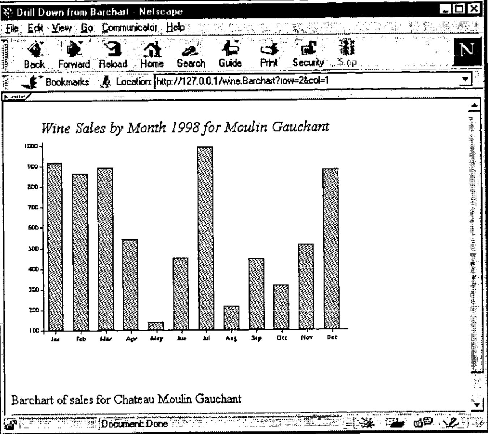
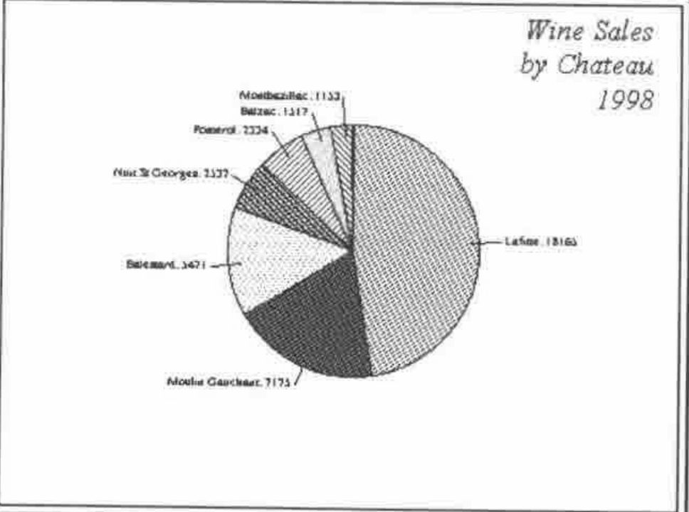
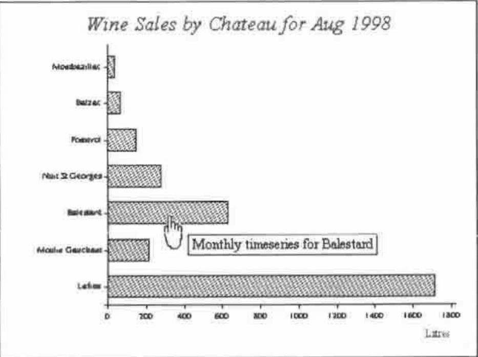

*by Adrian Smith*
{ .byline }

## Introduction

This is the sixth article in our series on HTML, and introduces the basics of image generation and graphical ‘drill-down’ from pictures shown in the browser. The examples are coded in Dyalog APL 8.2 (pre-release) which should be generally available by the end of the year. The only new facility used is the ability to generate .GIF or .PNG files directly from bitmap objects in the workspace. If you want to try the techniques before you have this, you can easily fake the process by copying the bitmap to the clipboard, pasting it into PaintshopPro, saving the image as a GIF, and reading it back into the workspace as a native file.

## Why Bother?

The internet currently has almost no active content. There are plenty of pointless animations and buttons that light up as you cross them with the mouse, but it is hard to find a web site that can actually take some input from you and produce a custom picture in response. With an APL server we could do something quite interesting, for example it would be fun to take the old Paul Berry "Starmap" workspace (circa 1979), allow the user to enter date, time, latitude and longitude, and display a night-sky picture on their browser. It would be even more fun if they could click on the major objects (like the moon) and be told some details about sky position, phase etc.

Another obvious example would be to offer graphical drill-down from a series of charts, perhaps starting with a summary Piechart, and drilling to detail by brand or by time period. This is probably an easier example to follow, and it has been running on Dyadic’s web site since July, so this is the one I will work through in detail. As in the previous articles, threading issues are ignored to keep it slightly more simple.

## Images in Web Pages

Because the internet was originally a text-based system, the mechanism for including pictures is quite strange and can be extremely inefficient in the way it uses the server. If you want your photo on your home page, you probably know that you code the HTML as something like:

```text
<p>Here is my picture</p>

<p> ... and here is my dog ...</p>
```

… and so on. What you may not realise is that each time you do this, your page generates a completely fresh HTTP connection to the server to get the image. If you embed 10 pictures, that makes 11 totally independent connections, each of which goes through the rigmarole of socket generation, receive, send and close. Of course the server is not just serving you, so your requests may get interleaved with other transactions. Also you may get bored and hit the <STOP> button long before all the pictures have been requested. Consider the implications for something which is machine-generated such as:



Both the HTML and the chart have been constructed on the fly, but we first send the HTML to the browser:

```text
<HTML><HEAD>
<Title>Drill Down from Barchart</title>
</HEAD>

<body>

<p>Barchart of sales for Chateau Moulin Gauchant
<HR>
⍝ Causeway Graphical Systems Ltd 1998
</body></HTML>
```

… it may then return with a new request to get the chart. Clearly it makes sense to have a single function generate both the enclosing text and the chart (when we include an imagemap in the text it is really unavoidable), but we cannot be sure that the chart will be the next thing requested, or even if it will be requested at all. This problem explains much of the complexity in the functions which follow - they must generate the HTML for the page and hide the chart under a (uniquely named) stone. If a request comes in for the chart under that stone, it can be served up and discarded (the *Readcache* function in the example). If it has not been requested after a decent lapse of time, we can throw it away and reuse the stone for another chart. If we are really busy, we could run out of stones (or workspace), in which case we should throw away the oldest charts, risking the possibility of broken pictures appearing in our users’ browsers.

After all that, the mechanics of making the page and mapping the image is very straightforward! I shall start with a very brief introduction to the imagemap syntax, and then work through the APL code I use to make mapped charts which can appear on the fly in generated web pages.

## How Imagemaps Work

In the early days (pre Netscape 3.0 and IE3) you had to put the map on the server and use a CGI script to get it interpreted. This still works, and has the benefit of keeping the transmitted page much smaller, but it is a devil to debug and gives almost no feedback to the end user. Consequently this introduction talks only about ‘client-side’ maps which you can develop and test in the comfort of your own laptop.

The idea is very simple …


Here is a completely pointless artwork (mapped.gif) which I want to use as a graphical menu. See the Thornton hatchment on www.demon.co.uk/apl385/gilling/stonegrv.htm for a more useful example. When the user waves his or her mouse over the ‘hot’ areas on the picture, the browser shows a ‘pointing hand’ cursor and indicates the destination page in the status line. Netscape-4 can even use the ‘Alt’ text to provide a pop-up tip. The HTML to achieve this is simply:

```text
<HTML><HEAD>
<TITLE>Page Title</TITLE></HEAD>

<BODY bgcolor="#FFFFFF">

<map name="simple">
<area shape=circle coords="12,16,12"
 href="top.htm" alt="Pretty Circle">

<area shape=rect coords="35,12,91,39"
 href="detail1.htm" alt="Rectangle">

<area shape=poly coords="12,84,34,55,62,75,79,55,94,77"
 href="detail2.htm" alt="Polygonal">
</map>

<H2>First Heading</H2>

Add body text here.
</BODY></HTML>
```

The map section(s) - one per mapped image - conventionally go at the beginning of the file, or may be written to a separate file entirely. The only shapes you can have are circles (give the centre and radius); rectangles (give top left and lower right corners) and polygons. All co-ordinates are (x,y) pairs, from the origin in the top left corner. Then you add the rest of your page, remembering to associate the map with the appropriate picture by naming it and referring to the name in the ‘usemap’ parameter. Note the name is given as "#simple" as it is a reference to a map in the same file. The general form is more like "mymap.map#one" to refer to a named map held in a separate file (N.B. this does not work in Netscape-3).

You can make your maps by hand quite easily (just read off the co-ordinates from PaintshopPro), but these days most web-authoring tools come with a competent map-editor to save you the trouble. Adobe PageMill is one of the better examples. However what we want to do is to build the graphic and the map from data in an APL workspace, so knowledge of the above mechanics is essential.

## Mapping a Piechart

I started out with the idea of writing a server application that would not just serve up canned charts, but that would be a genuine graphical browser of data that could change in real time. For example:



It would be very nice to click on a pie sector to get details of the monthly sales for a particular chateau, and so on. Clearly a pre-requisite for this is for the original chart to record the elements in the source data which correspond to each segment in the pie (or bar in a barchart, marker in a line-plot and so on). The way *RainPro* does this is to add some dummy functions to the intermediate PostScript code (*setseries* in the fragment shown below):

```text
[(chart1297043) () 3 7 1] setseries % cht,series,type,shape
0 8 2 settext
185 113 79.1 -80.5 90 4 2 0.5 wedge
[255.9 118.9 275.7 120.5] 0 1 0.6 pL # stroke
278.1 118.5 M # (Lafitte: 18165) 0 0 0 pshow

185 113 79.1 -147.9 -80.5 1 6 0.5 wedge
[155.8 48.1 147.7 30] 0 1 0.6 pL # stroke
146.1 28 M # (Moulin Gauchant: 7175) 1 0 0 pshow

....
```

In this example the (generated name) *chart1297043* has an unnamed series of type-3 (a piechart) with 7 rows and one column. When it is rendered on to the screen or any other Gui object - in this case a bitmap - each call to *wedge* adds an entry to a table in the Gui object’s namespace to record where it was placed. With a bit of low cunning (needed to represent the pie sectors as reasonable polygons - see the appendix for the code) this can be reformatted as:

```text
<MAP name="chart1297043">
<area shape="poly"
 coords="225,159,238,237,263,227,285,210,299,186,304,159,
        299,132,286,108,265,90,239,81,225,79"
 href="http://127.0.0.1/wine.Barchart?row=1&col=1">
<area shape="poly"
 coords="225,165,157,207,176,227,200,240,227,244,238,243"
 href="http://127.0.0.1/wine.Barchart?row=2&col=1">
<area shape="poly" coords="225,159,150,132,145,160,151,187,157,201"
 href="http://127.0.0.1/wine.Barchart?row=3&col=1">
<area shape="poly" coords="225,165,167,111,152,134,150,138"
 href="http://127.0.0.1/wine.Barchart?row=4&col=1">
<area shape="poly" coords="225,159,191,87,168,103,167,105"
 href="http://127.0.0.1/wine.Barchart?row=5&col=1">
<area shape="poly" coords="225,165,210,87,191,93"
 href="http://127.0.0.1/wine.Barchart?row=6&col=1">
<area shape="poly" coords="225,159,225,79,210,81"
 href="http://127.0.0.1/wine.Barchart?row=7&col=1">
</MAP>
```

Each pie sector now has a map area which will cause it to call our server, requesting the *Barchart* function, and passing the sector index in the http ‘GET’ request string. This can be returned to the calling function, along with the integer vector representing the bytes of the GIF or PNG file, and the id of the chart:

```apl
    ∇{htm}←{sock}Piechart tokens;pc;map;id;gif;cbk
[1]   ⍝ Return piechart of annual totals as a GIF (or PNG)
[2]   ⍝ Ignores all parameters!
[3]    #.ch.Set'boxed,values'
[4]    #.ch.Set('hstyle' 'right')('head' 'Wine ... 1998')
[5]    #.ch.Set'xl'∆chat
[6]    #.ch.Pie+/∆sales
[7]    pc←#.ch.Close
[8]   ⍝ Call back to the barchart for that chateau
[9]    cbk←'http://',∆home,'/wine.Barchart'
[10]   (gif map id)←cbk #.PostScrp.MakeGIF pc
[11]  ⍝ Bury the GIF and point to it in the HTML
[12]   htm←'<HTML><HEAD>' '<Title>Sample Piechart</title>' '</HEAD>'
[13]   htm,←map,⊂'<body bgcolor="#FFFFFF">'
[14]   htm,←⊂Bury(gif id)
[15]   htm,←⊂'</body></HTML>'
    ∇
```

This is where things get messy, but I can’t think of a better way of ensuring that the correct picture is retrieved when the browser calls back for it.

```apl
    ∇Init home
[1]   ⍝ Clear cache (and initialise freelist)
[2]   ⍝ Cache has space for 12 pictures
[3]   ⍝  Columns are: [;id,data,⎕AI[2]]
[4]    ∆cache←12 3⍴'' '' 1000000000
[5]    ∆freecache←⍳12
[6]    ∆home←home
    ∇

    ∇img←Bury arg;gif;map;id;inx;ai;exp
[1]   ⍝ Hide the gif in a transient cache (freelisted)
[2]   ⍝ Return the  section of the finished page keyed on the id
[3]    (gif id)←arg ⋄ ai←⎕AI[2]
[4]   ⍝ Free and clear any time-expired entries ...
[5]    exp←(60000<ai-∆cache[;3])/⍳1↑⍴∆cache
[6]    ∆cache[exp;1 2]←⊂'' ⋄ ∆cache[exp;3]←1000000000
[7]    ∆freecache∪←exp
[8]    inx←⊃∆freecache ⋄ ∆freecache↓⍨←1
[9]    ∆cache[inx;]←(id gif ai)
[10]  ⍝ Make a signpost back to the cache entry we just filled
[11]   img←''
    ∇

    ∇gif←{sock}Readcache tokens;inx;id;ai
[1]   ⍝ Extract cached image, free slot and return
[2]    inx←∆cache[;1]⍳tokens[1;2]
[3]    (id gif ai)←∆cache[inx;]
[4]    'Gif extracted from cache for ',id
[5]    ∆freecache,←inx
[6]    'Cache entry ',(⍕inx),' is now available for reuse'
    ∇
```

If you want to make a more professional version of this, I would suggest checking for errors in *Readcache* (line [3] could fail with an index error if someone had pictures turned off, went for lunch, then pressed ‘Show Picture’), and perhaps extending the cache if the freelist was still empty on line [8] of *Bury*. In practice you have to push this quite hard to use more than one cache entry at a time.

Note that *Readcache* adds the freed entry to the *back* of the free-list, and does not actually clear the entry in the table. This allows for the possibility that someone might hit ‘Show Picture’ or ‘Save Picture as …’ in the browser. As long as the site is not too busy, and their time has not expired, they will still be able to retrieve it.

If we click on the third chateau, we generate a callback to the *Barchart* function:

```apl
    ∇{htm}←{sock}Barchart data;chat;map;gif;id;img;bc;cbk
[1]   ⍝ Cache barchart of annual sales as a GIF (or PNG)
[2]   ⍝ Passed the required chateau in the argument
[3]   ⍝ Returns the HTML to reference it (with image map)
[4]    chat←⍎⊃data[1;2]
[5]    #.ch.Set'head'('Wine Sales by Month 1998 for ',chat⊃∆chat)
[6]    #.ch.Set'xlab'∆months
[7]    #.ch.Bar ∆sales[chat;]
[8]    #.ch.Hint(⍳12),1,[1.5](⊂'Brand split for '),¨∆months
[9]    bc←#.ch.Close
[10]  ⍝ Pass the function to be run from the mapped image
[11]  ⍝ This will be returned, qualified with row= etc
[12]   cbk←'http://',∆home,'/wine.Monthchart'
[13]   (gif map id)←cbk #.PostScrp.MakeGIF bc
[14]  ⍝ Bury the GIF and point to it in the HTML
[15]   htm←'<HTML><HEAD>' '<Title>Barchart</title>' '</HEAD>'
[16]   htm,←map,⊂'<body>'
[17]   htm,←⊂Bury(gif id)
[18]   htm,←⊂'<p>Barchart of sales for Chateau ',chat⊃∆chat
[19]   htm,←'<HR>' '⍝ Causeway Graphical Systems Ltd 1998'
'</body></HTML>'
    ∇
```

… this in turn maps the bars to give a monthly summary showing all the chateaux for that month, and so on:



In this case, all the hot areas are rectangles, and I have exploited Netscape-4’s ability to show the Alt text as popups.

The generated code is quite lengthy, but much simpler to build:

```text
<HTML><HEAD>
<Title>Sample HTML</title>
</HEAD>
<MAP name="chart400179">
<area shape="rect" coords="99,245,389,265" alt="Monthly timeseries
for Lafitte" href="http://127.0.0.1/wine.Barchart?row=1&col=1">
<area shape="rect" coords="99,213,136,233" alt="Monthly timeseries
for Moulin Gauchant"
href="http://127.0.0.1/wine.Barchart?row=2&col=1">

<area shape="rect" coords="99,181,206,201" alt="Monthly timeseries
for Balestard" href="http://127.0.0.1/wine.Barchart?row=3&col=1">
<area shape="rect" coords="99,149,147,169" alt="Monthly timeseries
for Nuit St Georges"
href="http://127.0.0.1/wine.Barchart?row=4&col=1">

...

</MAP>
<body bgcolor="#FFFFFF">
<h3>This shows the data split by month</h3>

</body></HTML>
```

Once you get the hang of this, you can give the impression of a marvellously complex web site, populated with hundreds of pre-cooked charts, which is actually all generated from a few simple data tables!

## References

1. *The HTML Sourcebook*, Ian S. Graham, John Wiley 1995
2. *HTML Publishing for Netscape*, Harris & Kidder, Netscape Press 1996.

## Appendix

The code in the *PostScrp* namespace relies on several internal variables which are designed to support graphical drill-down and editing from APL applications. These may change in future releases, so please read this as an example of how it might be done, not a definitive version. The relevant variables are:

```apl
loc∆hdr←0 8⍴'' 0 0 1 1 '' 1 1 ⍝ Name, series, type, shape[2] ...
loc∆det←0 8⍴0                  ⍝ hptr,where[x1 y1 x2 y2 0],series[r,c]
loc∆hint←0 3⍴'' ''(0 3⍴0 0 '')     ⍝ Chart, series, hints

    ∇ r←{callback}MakeGIF page;bb;clip;sz;hdr;bmp; ...
[1]   ⍝ Create bitmap (to match bounding box) and copy chart to it
[2]   ⍝ Return (GIF, scaled 1:1) and matching (<MAP>imagemap</MAP>) and (id)
[3]    scl←1
[4]    hdr←(¯1+('newpath'⍷page)⍳1)↑page
[5]    bb←0 0 432 324 ps∆hdr'%%PreviewBox:' ⋄ sz←bb[4 3]
[6]    'bmp'⎕WC'bitmap' ''((⌈scl×sz)⍴15)∆cmap('Coord' 'Pixel')
[7]    'bmp'⎕WS('Coord' 'User')('Yrange'(2+sz[1]))('Xrange'(¯2+sz[2]))
[8]    PS page'bmp'scl ∆cmap
[9]   ⍝ ============== New 8.2 options - 260 for PNG ==============
[10]   bytes←2 ⎕NQ'bmp' 'MakePNG'
[11]  ⍝ Now scrag it for the imagemap (globals left by PS in the object)
[12]   (hdr detail hint)←'bmp'⍎'loc∆hdr loc∆det loc∆hint'
[13]   id←⊃hdr  ⍝ Unique id for the chart
[14]   hint←⊃hint[;3] ⍝ Just one chart here
[15]   :If 2=⎕NC'callback'
[16]     map←⊂'<MAP name="',id,'">' ⋄ r2d←180÷○1
[17]     :For ct :In ⍳1↑⍴detail
[18]       (r c)←⍕¨detail[ct;7 8]
[19]      ⍝ Various series types (1=line, 2=bar, 3=pie)
[20]       type←detail[ct;1]⊃hdr[;3]
[21]       :Select type
[22]         :Case 2  ⍝ Barcharts are really easy (but swop corners here)
[23]          detail[ct;5 3]←sz[1]-detail[ct;3 5]
[24]          area←'<area shape="rect" coords="'
[25]          area,←(1↓∊',',¨⍕∘⌊¨detail[ct;2 3 4 5]),'"'
[26]         ⍝ Would be nice to show data hints here ...
[27]         ⍝ Only seem to work reliably on bars?
[28]          :If (1↑⍴hint)≥pos←(↓hint[;1 2])⍳⊂detail[ct;7 8]
[29]            area,←' alt="',(pos⊃hint[;3]),'"'
[30]           :Else
[31]            area,←' alt="(r,c)=',r,',',c,'"'
[32]          :End
[33]         :Case 1 ⍝ Linecharts get a 4-pixel hotzone
[34]          detail[ct;3]←sz[1]-detail[ct;3]
[35]          area←'<area shape="circle" coords="'
[36]          area,←(1↓∊',',¨⍕∘⌊¨detail[ct;2 3],4),'"'
[37]         :Case 3 ⍝ Piecharts
[38]          detail[;3]←sz[1]-detail[;3]
[39]          area←'<area shape="poly" coords="'
[40]          area,←1↓∊',',¨⍕∘⌊¨detail[ct;2 3]  ⍝ Centre
[41]         ⍝ 20-degree intervals should be very adequate
[42]          circ←{1⌽(⌽⍵),⍵[1]+20×⍳⌊20÷⍨|-/⍵}detail[ct;5 6]
[43]          circ←detail[ct;4]×⍉2 1∘.○circ×r2d
[44]          circ←,((⍴circ)⍴detail[ct;2 3])+((⍴circ)⍴1 ¯1)×circ
[45]          area,←(∊',',¨⍕∘⌊¨circ),'"'
[46]       :EndSelect
[47]
[48]      ⍝ Append arguments to generic callback
[49]       area,←' href="',callback,'?row=',r,'&col=',c,'">'
[50]       map,←⊂area
[51]     :End
[52]     map,←⊂'</MAP>'
[53]    :Else
[54]     map←0⍴⊂''
[55]   :End
[56]   r←(bytes map id)
    ∇
```
