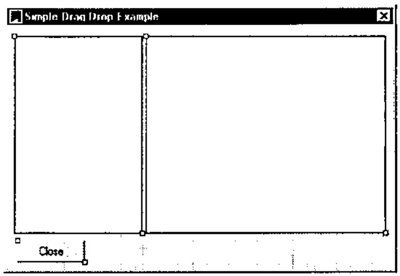
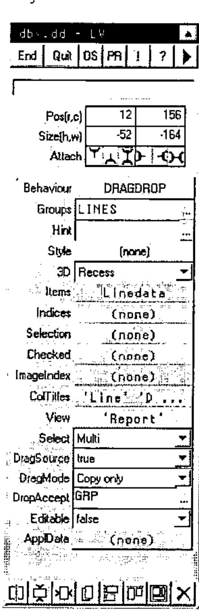
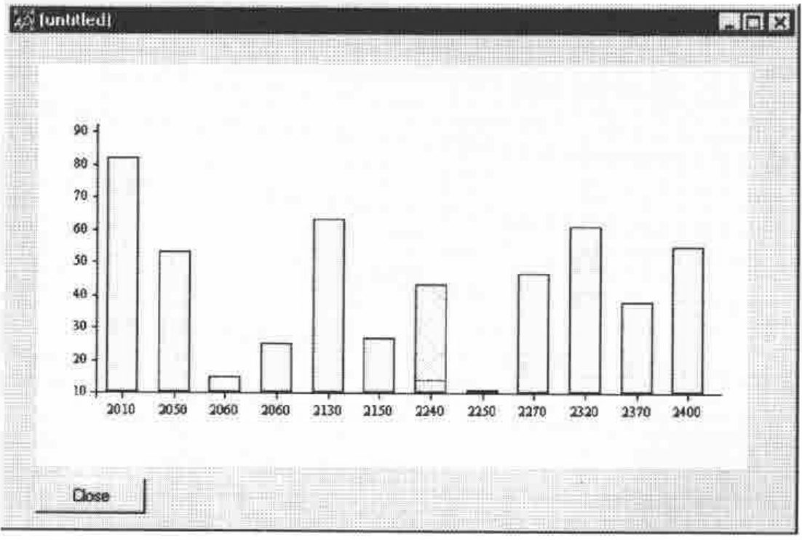

*tutorial notes by Adrian Smith*
{ .byline }

## Introduction

These notes are designed to accompany the workshop on dragging and dropping which was given as part of the Causeway seminar at VikAPL - the Dyalog APL workspace is available from *www.causeway.co.uk/freestuff/* if you want to try this at home.

The examples cover the basic mechanics of setting up a drag/drop editor with a simple illustration using the allocation of products into groups. The ‘data-processing’ part of the application is intentionally kept simple so that you can see clearly what event-handling is possible and sensible here.

The second example shows how you might set up a graphical editor to modify a production schedule, and review the effect on the inventory curve. Again, this is designed to show the event handling rather than be a ‘sensible’ application.

## Setting up the Basic Data

For the drag-drop example we have a list of groups, products, their descriptions and group codes (here I am assuming that a product is either ‘unallocated’ or is in one and only one group):

```apl
∆grp←'Group One' 'Group Two' 'Group Three'
∆lc←2012 2052 2058 2064 2133 2150 2235 2250 2268 2321 2373 2397
∆lcdesc←(⊂'Product '),¨⍕¨∆lc
∆lcg←0 1 2 3 3 2 2 2 2 2 0 0
```

You can use anything reasonable here as long as the lengths of the three line-data variables match correctly.

## Sketching the Design

What we would like to do is to allow our user to allocate lines easily to groups, move them from group to group, and de-allocate lines from any group. An obvious visual model for this would be Windows Explorer, with a tree of groups/constituents down the left and a list of products on the right.

The kind of user-actions which seem intuitive would be:

- Dragging a product from the list to the tree to allocate it to the group where it was dropped. Probably we should be able to drag a whole clump of products in one action here.
- Dragging a product code within the tree to move it to another group.
- Dragging a product off the tree into the product list to de-allocate it.

Here is a first-cut design of the application:


... and here are the two simple subfunctions needed to populate the TreeView and ListView respectively:

```apl
    ∇tree←MakeTree
[1]   ⍝ Make tree-structure from base data
[2]   ⍝ <tree> has items,level,group index,line index
[3]   ⍝ The tree-control needs cols [;1 2] only
[4]
[5]    tree←∆grp,0,(⍳⍴∆grp),[1.5]0
[6]    tree←tree,[1](∆lcg>0)⌿∆lcdesc,1,∆lcg,[1.5]⍳⍴∆lcg
[7]    tree←tree[⍋tree[;3];]
    ∇

    ∇mat←Linedata
[1]   ⍝ Line-level data as a matrix
[2]   ⍝ Ungrouped codes have group=0
[3]    mat←⍕¨∆lc,∆lcdesc,[1.5]((⊂'(ungrouped)'),∆grp)[1+∆lcg]
    ∇
```

Run these from the APL session to make sure the base-data looks reasonable, then we can fire up the Causeway designer to draw the screen and check that it at least shows our starting data correctly:

```apl
#.Dbx 'dbx.dd'
```



If you set the ‘Items’ property of the ListView to Linedata, the View to ‘Report’ (beware - you do need quotes here as this is a runtime property and will be executed) and the ColTitles to something reasonable like ‘Line’ ‘Description’ ‘Group’ you will see the right-hand half of the screen as you want it. For the TreeView, I have been a little sneaky - because I know we will want the tree information for the drag-drop handler I have localised ‘tree’ on the form and forced it to be recalculated whenever the TreeView is refreshed:

![The User Property (Structure) dialogue for the TreeView: tree structure tree[;1 2], dependencies ∆grp,∆lcg, and an event table with Pre-Refresh running tree←MakeTree](art10008900/treeprop.jpg)

The Gui control should only be passed the first 2 columns (item,depth) here.

You should now find that this ‘works’ in that you can see the data on screen, but of course you can’t drag any items yet!

### Basic Rules of Drag-Drop Processing

Drag-drop editing makes the user’s life easy at the expense of making the programmer’s life really complicated! You need to:

- make sure that the user can only pick up reasonable items from nominated ‘drag-source’ controls.
- be completely in charge of which controls can act as ‘drag-source’ and which as ‘drag-target’ and when something is dropped on a valid target you must be able to check where it came from, as the follow-up action could be very different.
- not all items in the target control may be legitimate targets for the particular item which was picked up! You should only highlight valid target items.
- the user should be able to hit &lt;Escape&gt; at any time to cancel the operation.
- sometimes it is allowed to ‘drag-copy’ (generally signalled by holding the &lt;Ctrl&gt; key while dragging). If so, you should change the cursor appropriately. If a drag-source is only valid for ‘Copy’ or ‘Move’ (but not both) you should show the correct cursor throughout the drag operation. Maybe you want to allow ‘right-button drag’ operations and put up a menu when the item is dropped.

For our example, we are assuming that the ListView is a drag-source, that it only supports ‘Copy’ (it shows all the items, not just the ungrouped ones), and that it can target the TreeView but not itself. The TreeView is also a drag-source, but only supports ‘Move’; it will accept dropped items from the ListView, or from itself - clearly the two cases are handled very differently.

We can pick up anything from the ListView, but it makes no sense to pick up a group from the TreeView, unless you want to write the code to interpret this as "please re-order the groups" in which case feel free to add this case too. For that matter you could add "please re-order me" handling to the ListView, but for now I will keep it simple as these cases are really just more of the same.

## Naming the Controls and Enabling ‘Drag-off’

The first thing we must do is to give our source and target controls sensible names - I have given the ListView the group name ‘LINES’ and the TreeView the name ‘GRP’. Then we need to set the ListView up as a drag-source, for copying only.



You can see that it is now set to act as a drag-source, and that it will accept dropped items only from the ‘GRP’ control. If you run the dialogue at this point, you will find that you can pick items up, but the cursor shows ‘No entry’ everywhere except over the ListView itself. It always shows the ‘+’ symbol in the drag-cursor to indicate that we are copying.

I have also left the Select property to the default of ‘Multi’ as we want to be able to drag a clump of selected items at one go here.

So far so good - the TreeView can be set to something very similar, but its DropAccept entry should be ‘LINES,GRP’ and its DragMode should be ‘Move only’.

Now if you run the dialogue, things will show most of the correct visual behaviours (items highlight as you drag other items over them) but of course nothing changes when you actually let go the mouse. Causeway may help you along the way here, but it can’t write your application for you!

We need to add some event-handlers, and these will need to know where the drag-drop originated from, what data was picked up, which item was targeted and perhaps whether we were moving or copying. In this example, we can also pass in the interesting columns of our `tree` variable as this will be very helpful in determining an item’s group or product, given its position in the TreeView control.

## Adding Event Handlers

Rather than describing the message format in detail here, I will just list the code of the two handler functions and let you read the comments. The entries in the event table for the TreeView and ListView should read:

```apl
DRAGDROP: tree[;3 4] DroponTree ⍵
DRAGDROP: tree[;4] DroponList ⍵
```

The handlers make the necessary change to the global data and ‘Notify’ the change to Causeway so that the Gui controls are automatically redrawn.

```apl
    ∇ tree DroponTree msg;tgt;mc;mb;sel;src;new;linx
[1]   ⍝ Handle a drop on the tree
[2]   ⍝ Message gives ....
[3]   ⍝  tgt = index of target item
[4]   ⍝  mc  = move/copy flag
[5]   ⍝  mb  = menu required (right-drag)
[6]   ⍝  sel = incoming data (depends on source control - usually selitems)
[7]   ⍝  src = group name of source control
[8]   ⍝ <tree> is the [;group numbers, line index] for each item in the tree
[9]    (tgt mc mb sel src)←msg
[10]   :Select src
[11]   :Case 'LINES'  ⍝ new line-list data arriving
[12]   ⍝ Allocate inbound lines to the group that was dropped on
[13]     new←tgt⊃tree[;1]     ⍝ make new group the same
[14]     (sel/∆lcg)←new  ⍝ Update global data
[15]     #.CPro.Notify'∆lcg'  ⍝ Let the Gui know about it
[16]   :Case 'GRP'  ⍝ move it to a new group within the tree
[17]     new←tgt⊃tree[;1]
[18]     sel←{⍵/⍳⍴⍵}sel        ⍝ This is the index in the tree
[19]     linx←sel⊃tree[;2]     ⍝ The index of the original line-item
[20]     (linx⊃∆lcg)←new
[21]     #.CPro.Notify'∆lcg'   ⍝ Let the Gui know about it
[22]   :Else
[23]     'unsupported data source - 'src
[24]   :End
    ∇

    ∇ trinx DroponList msg;tgt;mc;mb;sel;src;linx
[1]   ⍝ Handle a drop on the list
[2]   ⍝ Message gives ....
[3]   ⍝  tgt = index of target item
[4]   ⍝  mc  = move/copy flag
[5]   ⍝  mb  = menu required (right-drag)
[6]   ⍝  sel = incoming data (depends on source control - usually selitems)
[7]   ⍝  src = group name of source control
[8]   ⍝ <trinx> is the index in the line-list of each tree item
[9]    (tgt mc mb sel src)←msg
[10]   :Select src
[11]   :Case 'GRP'  ⍝ Dragged off the tree
[12]   ⍝ De-allocate dragged item - where we dropped it is unimportant!
[13]     linx←⊃(sel)/trinx
[14]     :If linx>0
[15]       (linx⊃∆lcg)←0  ⍝ Update global data
[16]       #.CPro.Notify'∆lcg'  ⍝ Let the Gui know about it
[17]     :Else  ⍝ We should avoid this message
[18]       'you can''t do that!'
[19]     :End
[20]   :Else
[21]     'unsupported data source - 'src
[22]   :End
    ∇
```

Try dragging a group-code from the tree over the list, and you should see the "you can’t do that" error - not good Windows practice to allow the user to make avoidable errors! Drag a group over the tree and let go and you will crash the handler function for the tree with an INDEX ERROR, which is also not a good idea! As a final refinement let’s control the pickup operation from the tree:

```apl
    ∇ok←lvl PickupTree sel
[1]   ⍝ We can only pick up level-1 items from the tree!
[2]   ⍝ If this returns 0 we should reject the pickup from the tree.
[3]    ok←(sel/lvl)>0
    ∇
```

This should be set as the ‘DRAGOFF’ handler for the tree, but this time it must be set as the ‘Condition’ - if it fails we will reject the event and the level-0 item will not be picked up:

![The Runtime Behaviour dialogue for the TreeView: event DRAGDROP runs tree[;3 4] DroponTree ⍵; event DRAGOFF has condition 0=tree[;2] PickupTree ⊃⍵ and action ∇Reject](art10008900/runtime.jpg)

Now you can test it to destruction, and you should find it very hard to make it do anything wrong. As a bit of light relief, you could add in some extra logic to put up a right-mouse menu when an item is ‘right-dropped’, or change the data-structure to allow a product to be allocated to more than one group, which is a good excuse to play with the different logic needed for ‘Move’ and ‘Copy’ operations.

## Dragging Data with a Barchart

The example shown here is again at the easy end of the scale - it simply allows graphical editing of a single data series using a barchart. A more complex example (developed in conjunction with Mike Baas of Adapta GmbH) is in the workspace - run *DG* to test it and `#.Dbx 'dbx.dg'` to take it apart.



```apl
    ∇PG←Volbars sz;data
[1]   ⍝ Make a simple barchart of sales volumes
[2]    ch.New 0 0,sz
[3]    ch.Name'Volumes'
[4]    ch.Set'Xlab'∆lc
[5]    ch.Series'Qty'
[6]    ch.Bar ∆lcv
[7]    PG←ch.Close
    ∇

    ∇FixVol msg
[1]   ⍝ Update global data to reflect user action
[2]   ⍝  msg[5 6] give the new (x,y) values for bar index msg[3]
[3]    ∆lcv[3⊃msg]←⌊0.5+6⊃msg
[4]    #.CPro.Notify'∆lcv'
    ∇

CDEND FixVol ⍵  ⍝ Handler for CDEND event on PS
```

The screen-snap shows the data for Product #2240 being dragged, but you will have to imagine the cursor, or try it out for yourself.
