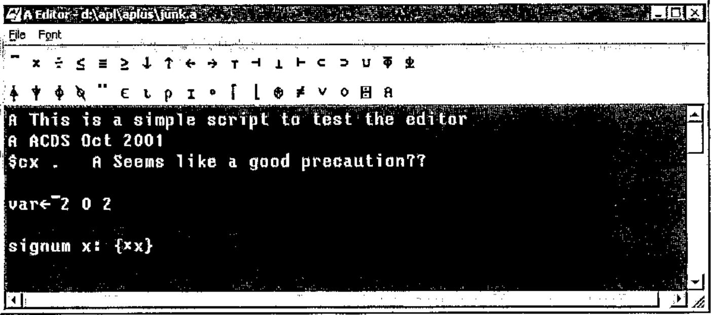

*notes by Adrian Smith*
{ .byline }

## Installation

Just download the ZIP files from www.vector.org.uk/aflat/download, unzip into the directory of your choice, and double-click **aplus.exe** to get it running. You may like to associate **aedit.exe** with the .a extension so that you can double-click on scripts. To run aplus from the command prompt (under Windows 2000) please use the supplied batch file.

## Using the Console in ASCII Mode

This has to be the first thing everyone will try, so here we go …

```text
      $mode ascii
      2+2
 4
```

Now you will want to try out subtraction …

```text
      2-2
 2 -2
      2 - 2
 0
```

OK, what went wrong the first time? In ASCII mode you must use white space around symbols and names to be safe! A {minus} sign adjacent to a number is a {highbar} in this case. How about some real APL:

```text
      rev 1 2
//[parse] .rev: var?
      reverse 1 2
//[parse] .reverse: var?

      rot 1 2
 2 1
      1 rot iota 5
 1 2 3 4 0
```

Well, I guessed wrong, probably so did you. The ASCII names are a bit arbitrary and follow the standard Unix convention of ‘weird short codes are best’ so here is a table to get you started.

**APL symbols and ASCII names**

| APL | ASCII | APL | ASCII | APL | ASCII | APL | ASCII |
|---|---|---|---|---|---|---|---|
| ← | := | ¨ | each | ∧ | & | ∨ | ? |
| × | \* | ÷ | % | ⍟ | log | ≡ | == |
| ⌈ | max | ∘. | fn. | ⌊ | min | ∊ | in |
| ≠ | ~= | ≤ | <= | ≥ | >= | \* | ^ |
| ⌽ | rot | ⍉ | flip | ⍳ | iota | ⍴ | rho |
| ↑ | take | ↓ | drop | ⍋ | upg | ⍒ | dng |
| ⊥ | pack | ⊤ | unpack | ⊂ | bag | ⊃ | pick |
| ⍎ | eval | ⍕ | form | ⊢ | rtack | ⊣ | where |
| ○ | pi | ⌹ | mdiv | ? | rand | ⌶ | beam |
| % | ref | ∪ | dot | ⍝ | // | ~⍨ | bwnot |
| ∧⍨ | bwand | ∨⍨ | bwor | <⍨ | bwlt | ≤⍨ | bwle |
| =⍨ | bweq | ≥⍨ | bwge | >⍨ | bwgt | ≠⍨ | bwne |

We can even define simple functions …

```text
      total v:{+/v}
      total iota 12
66
      mean v: {(total v) % #v}

      # 2 3 4
3
      mean iota 12
5.5
```

You use % as {divide} here, but note that A implements {tally} with monadic # in J fashion. This makes your function generalise very nicely to higher-rank tables:

```text
      mat := 2 3 rho iota 6
      mat
0 1 2
3 4 5
      mat := iota 2 3
      mat
0 1 2
3 4 5
      total mat
3 5 7
      mean mat
1.5 2.5 3.5
      # mat
2
      rho mat
2 3
```

Hopefully, that is self-explanatory. A uses the *first* dimension by default (like J) and {tally} only sees the outermost element of the shape. You might also notice that {iota} has some built-in reshape capabilities. Dyalog fans might object here … hard to know which extension is more useful in practice.

### What if it all goes wrong?

Sooner or later you will make a mistake, for example mis-typing a name. The A equivalent of `)reset` is `$reset` (probably you guessed that) and the equivalent of a bare right-arrow is $ on its own, so:

```text
      fred
a[error]  .fred: value
*     $
      2+2
 4
```

… when faced with \* in the prompt string, get into the habit of typing $ at the input prompt to get rid of it.

### Multi-line functions are possible – just

This reminds me of typewriter terminals and the {del} editor! Yes, you can create simple functions in the console, but really you should be writing them in a script and running it! Just to show that it can be done:

```text
      fluffy n: {
*      fred := 12;
*      joe := 23;
*      fred + joe + n }

      fluffy 7
 42
```

Note carefully the semi-colons which act as statement separators. Newlines are completely immaterial, as you can easily show:

```text
      coo n: {
*      fred :=
*      12;
*      fred + n }

      coo
coo n: {
fred :=
12;
fred + n }
      coo 3
 15
```

Notice that you display a function simply by typing its name. By implication, you cannot really have niladic functions in A – again just like J and possibly an irritant to APL old-timers? Now watch what happens if you slip up and let your semi-colon reflex run away with you:

```text
      foo x: {x+2;}
      foo 3
```

Oh, oh. The result of an A function is the result of the last executable statement, which in this case is empty. This function ALWAYS returns null. Be careful! Of course it could have a side-effect:

```text
      goo v: { .qq := 12; }
      goo 100
      qq
12
      hoo v: { my.qq := 25; }
      hoo 0
      my.qq
25
      qq
12
      $cx my
      qq
25
```

All unqualified names are strictly local, but if you provide a context for the assignment (the root context is just ‘.’ in A) then the assignment (or reference) becomes global. Note that simply mentioning a context in an assignment is all we need to do to have it created for us. There is a slight oddity here, in that you can create contexts as deep as you like …

```text
      $cx my.var
      qq := 12
      qq
 12
      $cx .
      my.var.qq
//[parse] my.var: var?
```

… but the parser only copes with one level of qualification, so this is probably more of a bug than a feature, and we should assume the same capability as J has with locales.

## Writing and Running Scripts

Remember that A has no concept of a saved workspace. The idea is that you write scripts (in the editor of your choice) and run them in the console. Well, it seems to work for the J community but some of us will soon be hankering after `$save`, I am sure. Anyway, here is how it is supposed to work. Start the editor and type in something like:



The tool buttons all have tips if you are not familiar with the keyboard layout. Save it with the ‘.a’ extension and switch to the A console to run:

```text
      $load junk
This should show ¯1 0 1 if we understood correctly!
 ¯1 0 1
```

Note that this runs in ‘APL’ mode even though you have set the console running in ASCII. You can set the script to ASCII mode if you prefer to see the APL {highbar} as a conventional minus sign here.

Now you just need to get into the habit of editing your script (probably called test.a or some such), selecting File,Save, clicking over into the A window and typing `$load test` to run it. Remember that you *cannot use the up-arrow* to recall prior lines here, so keep script names short to save typing! If it fails, `$reset`, fix it in the editor, save it and try again! Of course scripts can call other scripts, so if you want to have a ‘master script’ to load lots of others, that will work fine.

## Some Examples from "APL for the Mathematics Classroom"

One way to get a quick feel for the compatibility of A and APL is to translate a few useful code fragments from one to the other. Norman Thomson’s book is a good starting point, as he wrote this with I-APL in mind, so it is more or less in ‘Direct Definition’ style already. Here are a few functions from the section on *Random Numbers from Various Distributions* (pages 106-107).

### Random Numbers

Compare this with Norman’s originals …

```apl
⍝ R random numbers from the uniform distribution in the range (0,1)
 RND R: {(?T)÷T←R⍴100000}

⍝ L random numbers from uniform distribution in the interval R[1],R[2]
 L RUN R: {R[0]+(RND L)×R[1]-R[0]}

⍝ L random numbers from -ve exponential distribution, mean R
 L RNE R: {-R×⍟RND L}

⍝ L random numbers from Normal dist, mean R[0] and SD R[1]
 L RNO R: {R[0]+R[1]×((2×L RNE 1)*0.5)×2○○2×RND L}

⍝ L random booleans where probability of drawing 1 is R
 L RBO R: {R>RND L}
```

We need to switch to zero-origin indexing, and we also discover that Norman’s use of `-/R[2 1]` must be rewritten in a more mundane way. The rest of it looks (and works) just as it did before:

```text
      $load maths
      RND 5
0.24219 0.10639 0.81261 0.4204 0.89144
      4 RUN 10 20
13.1941 10.7872 13.5569 11.4972
      20 RBO .5
0 0 1 0 0 0 1 0 1 1 1 0 1 0 0 1 0 1 0 0
```

A few more functions from the following page …

```apl
⍝ L random vars from the set ⍳⍴R ...
 L RSA R : {+/@1(RND L)∘.≥0,¯1↓+\R}

⍝ Frequency distribution for a sample such as the above
 L RFD R : {+/@1(1+⍳⍴R)∘.=⌈L RSA R}
```

Note that we need to specify the axis on the sum (as A defaults to the first axis) and adjust for the index origin in the second example.

### Newton-Raphson Method

This is more challenging, as it requires unpicking the ‘old-style’ compare-and-branch style of switching to the modern approach with control structures.

```apl
L NEWRAP R: { ⍝ Root-finder by NR method
T←(R⍳';')↑R; T1←(1+R⍳';')↓R;  ⍝ Split expr;derivative
X←L[2]; I←0;

while (L[0]<|X-Z ⊣ Z←X-(⍎T)÷(⍎T1)) {
 I←I+1;
 if (0=L[1]|I)  ⍝ See some output
  ⊢'AT ITERATION',(⍕I),' X=',(3↓L)⍕X;
 X←Z };
 'SOLUTION = ',((3↓L)⍕X),' AT ITERATION',⍕I
}
```

Again the index-origin change hits us - the code to split the string is a less-obvious amendment here. Note the use of the ⊢ to get A to spit out the intermediate results to the console. Also the syntax for dyadic format is slightly different which changes the way we run the example. The positive thing about this example is that the overall structure and layout will look very familiar to anyone who has written JavaScript or PERL; with a few renamed variables it should be very acceptable to the ‘modern’ programmer!

```text
      Testnr .00001 2 2 7.4
AT ITERATION 2 X= 1.5000
SOLUTION =  1.4142 AT ITERATION 3
```

## A Quick Translation from the J

This might be another interesting script to read through. It implements the ‘mississippi’ occurrence function from Jottings, which you will find implemented in J on page 50 of this Vector.

```apl
⍝ The Mississippi challenge (from Vector 18.2 - Jottings)
⍝ The object is to take a vector and return the occurrence numbers
 s ← 'mississippi'

⍝ The boring way with an outer product
 nub v: { ((v⍳v)=⍳⍴v)/v }
 unq ← nub s
 tbl ← unq ∘.= s
⍝ Cum across and save where we had numbers
 tbl ← tbl × +\@1 tbl
 oc ← ¯1++/tbl
'The answer is ',⍕oc

⍝ Make it a function so we can time it ...
 oca s : { tbl ← (nub s)∘.=s ; tbl ← tbl × +\@1 tbl; (+/tbl)-1}

⍝ Now for the super-sneaky approach (J-forum written up in Vector)
 t ← (s⍳unq)[unq⍳s]
 r ← ⍋⍋t
 occ ← r-r[t]
'The answer is also ',⍕occ

⍝ Get a little nearer the J style using index ...
 t ← (unq⍳s)#s⍳unq
 r ← ⍋⍋t
 occ ← r-t#r
'The answer is still ',⍕occ

⍝ Finally as a function
 ocb s: { u←nub s; t←(u⍳s)#s⍳u; r←⍋⍋t; r-t#r }

' oca s   ⍝ tests the boring one'
' ocb s   ⍝ tests the sneaky version'
' '
'Try some timings with various sized arrays ...'
' time qq := ocb 500000 rho s   ⍝ Arthur wrote a mean gradeup here!'
```

## Over to you!

Maybe someone would like to have a go at something ‘substantial’ in A, for example the *VierNeun* puzzle or the ‘funny cube’ would be good subjects where there is already code in APL, J and K for comparison. Please send in any examples to Vector Production and we will include as many as we can on the website.
