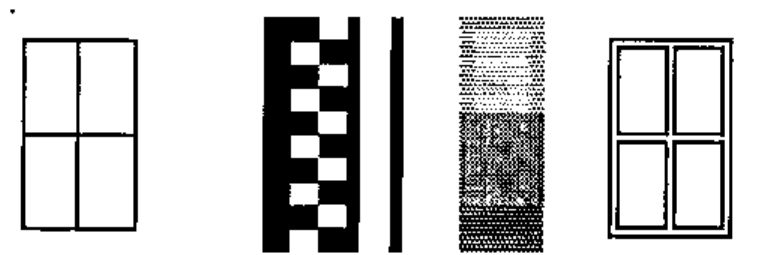
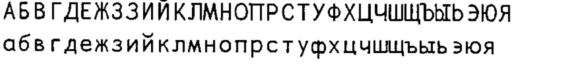
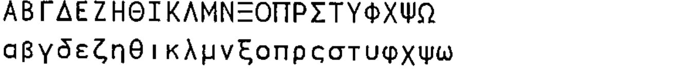

*proposed by Adrian Smith*
{ .byline }

## Background

Before you can type APL code into Notepad, you really need a decent (probably fixed pitch) font which includes the APL symbols. Accordingly, I have remapped (and augmented) my `APLSans` font and created something called `APL385 Unicode`. This is supposed to have everything in every `⎕AV` of every APL ever seen on the planet, including NARS and anything else anyone might ever write about in Vector. It will soon be available on the Vector website and will be freely re-distributable.

For reference, here is everything that the font currently has, everything that is in the Unicode APL section that it does **not** have (you will see why) with appropriate comments where there is scope for disagreement.

If I missed anything, let me know and I may add it in.

| Unicode hex | Character | Description and notes on usage |
|---|:-:|---|
| 0021 | ! | Factorial |
| 002A | \* | Power (All APLs) |
| 002B | + | Plus |
| 002D | - | Minus |
| 002F | / | Compress |
| 003C | &lt; | Lessthan |
| 003D | = | Equal |
| 003E | &gt; | Morethan |
| 003F | ? | Random |
| 005C | \\ | Expand |
| 005E | ^ | Logical AND |
| 007C | \| | Remainder |
| 007E | ~ | Without (APL2 and latest Dyalog) |
| 00A8 | ¨ | Each |
| 00AF | ¯ | Negative |
| 00D7 | × | Multiply |
| 00F7 | ÷ | Divide |

## The “Arrows” subset

| Unicode hex | Character | Description and notes on usage |
|---|:-:|---|
| 2190 | ← | Assign |
| 2191 | ↑ | Take |
| 2192 | → | Goto |
| 2193 | ↓ | Drop |

## The “Mathematical Operators” subset

| Unicode hex | Character | Description and notes on usage |
|---|:-:|---|
| 2206 | ∆ | Delta |
| 2207 | ∇ | Del (Dfns = self) |
| 220A | ∊ | Membership |
| 2218 | ∘ | Jot (outer product/compose) |
| 2228 | ∨ | Logical OR |
| 2229 | ∩ | Intersect (please implement!!) |
| 222A | ∪ | Nub/Union (ditto) |
| 2235 | ∵ | Paw = Dieresis-dot (APL2) |
| 223C | ∼ | Tilde (alternative to ASCII) |
| 2260 | ≠ | Not equal to |
| 2261 | ≡ | Match |
| 2262 | ≢ | Notmatch (Dyalog only) |
| 2264 | ≤ | Lessthan or Equal |
| 2265 | ≥ | Greater or Equal |
| 2282 | ⊂ | Enclose |
| 2283 | ⊃ | Disclose/Pick |
| 2296 | ⊖ | Rotate on first axis |
| 22A2 | ⊢ | Right tack (unused except Sharp) |
| 22A3 | ⊣ | Left tack (unused except Sharp) |
| 22A4 | ⊤ | Encode |
| 22A5 | ⊥ | Decode |
| 22C4 | ⋄ | Diamond (APL2 and latest Dyalog) |

## The “Miscellaneous Technical” subset

| Unicode hex | Character | Description and notes on usage |
|---|:-:|---|
| 2308 | ⌈ | Max |
| 230A | ⌊ | Min |
| 2336 | ⌶ | I-Beam (APLSV, now unused) |
| 2337 | ⌷ | Squad (APL2, APL+Win, Sharp) |
| 2339 | ⌹ | Domino |
| 233B | ⌻ | Quad-Jot (APL2 - never used) |
| 233D | ⌽ | Reverse |
| 233F | ⌿ | Slashbar |
| 2340 | ⍀ | Slopebar |
| 2342 | ⍂ | Sandwich (APL2, APL\*PLUS/PC 17) |
| 2347 | ⍇ | Quad-Left (APL.68000) |
| 2348 | ⍈ | Quad-Right (APL.68000) |
| 2349 | ⍉ | Transpose |
| 234B | ⍋ | GradeUp |
| 234E | ⍎ | Execute |
| 2350 | ⍐ | Quad-Up (APL.68000) |
| 2352 | ⍒ | GradeDown |
| 2355 | ⍕ | Format |
| 2357 | ⍗ | Quad-Down (APL.68000) |
| 2359 | ⍙ | DeltaUnderbar |
| 235D | ⍝ | Lamp |
| 235E | ⍞ | QuoteQuad |
| 235F | ⍟ | Log |
| 2361 | ⍡ | Snout (PLUS/PC 170 unused) |
| 2362 | ⍢ | Frog (PLUS/PC 171, NARS Dual) |
| 2363 | ⍣ | Sourpuss (NARS Power) |
| 2364 | ⍤ | Hoot = Rank (Sharp APL only) |
| 2365 | ⍥ | Holler (APL\*PLUS/PC 228 unused) |
| 2368 | ⍨ | Frown = Commute (NARS, Dyalog) |
| 236A | ⍪ | CommaBar (catenate first) |
| 236B | ⍫ | DelTilde (Lock function) |
| 236C | ⍬ | Zilde (constant (⍳0)) |
| 2371 | ⍱ | APL Nor (watch for 22BD also) |
| 2372 | ⍲ | APL Nand (watch for 22BC also) |
| 2373 | ⍳ | Iota (NOT the Greek char) |
| 2374 | ⍴ | Rho (ditto) |
| 2375 | ⍵ | Omega (Dfns and NARS DDef) |
| 2377 | ⍷ | Find |
| 2378 | ⍸ | Iota-underbar (APL2 only) |
| 237A | ⍺ | Alpha (DFns and NARS DDef) |
| 2395 | ⎕ | Quad (in recent Unicode spec) |

## The “Geometric Shapes” subset

| Unicode hex | Character | Description and notes on usage |
|---|:-:|---|
| 25AF | ▯ | Quad (in Arial Unicode MS) |
| 25CA | ◊ | Diamond (Dyalog 10 - now moved) |
| 25CB | ○ | Circle (Pi times ...) |

## Oddballs in the “Miscellaneous Technical” section

None of these are in "APL385 Unicode" as I have never seen them used.

| Unicode hex | Character | Description and notes on usage |
|---|:-:|---|
| 2338 | ⌸ | Quad-equal |
| 233A | ⌺ | Quad-diamond |
| 233C | ⌼ | Quad-circle |
| 233E | ⌾ | Circle-jot |
| 2341 | ⍁ | Quad-slash |
| 2343 | ⍃ | Quad-lessthan |
| 2344 | ⍄ | Quad-greaterthan |
| 2345 | ⍅ | Left vane |
| 2346 | ⍆ | Right vane |
| 234A | ⍊ | Decode-underbar |
| 234C | ⍌ | Quad-OR |
| 234D | ⍍ | Quad-Delta |
| 234F | ⍏ | Upwards vane |
| 2351 | ⍑ | Encode-overbar |
| 2353 | ⍓ | Quad-AND |
| 2354 | ⍔ | Quad-Del |
| 2356 | ⍖ | Downwards vane |
| 2358 | ⍘ | Quote-underbar |
| 235A | ⍚ | Diamond-underbar |
| 235B | ⍛ | Jot-underbar |
| 235C | ⍜ | Circle-underbar |
| 2360 | ⍠ | Quad-colon |
| 2366 | ⍦ | DownShoe-style |
| 2367 | ⍧ | LeftShoe-style |
| 2369 | ⍩ | GreaterThan-dieresis |
| 236D | ⍭ | Stile-Tilde |
| 236E | ⍮ | Semicolon-underbar |
| 236F | ⍯ | Quad-notEqual |
| 2370 | ⍰ | Quad-Question |
| 2376 | ⍶ | Alpha-underbar |
| 2379 | ⍹ | Omega-underbar |

## Box-drawing characters (shown at 16/16)

Only the single/double boxes and blocks are included.

These must be set with no leading to join up vertically. The shaded blocks are best avoided these days, but APL2 has them.

## Other Odds and Ends

These are in the APL2 product, so just for completeness, here they are.

| | Unicode hex | Character | |
|---|---|:-:|---|
| Del | 007F | ⌂ | House (for APL2 use only) |
| Peseta | 20A7 | ₧ | Peseta (also in APL2) |

## Cyrillic (basic alphabet only)

Comments welcome on the quality of the glyphs. All I have to go on is a splendid Чайковский record that Sasha gave me in Toronto.

## Greek (in the style of Frutiger Linotype)

I believe that with the released version of PocketAPL, Dyadic and APL2 are now fully in-line with the mappings. Also IBM will include a ‘clip as Unicode’ option in the next update, which should allow reliable copy-paste between two of the major vendors. Maybe APL2000 and MicroAPL would like to follow this lead!
